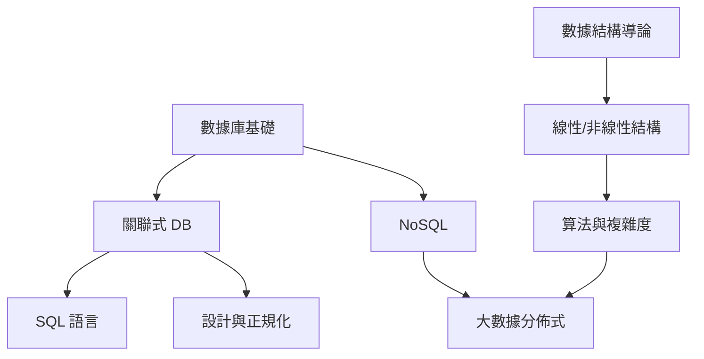

# 數據庫與數據結構知識地圖

| 層級 | 技能 | 對應 |
|:--:|------|:----:|
| L1 | SQL CRUD、ER 圖、ACID | 01–03 |
| L2 | 正規化、索引、交易 | 04 |
| L3 | MongoDB/Redis/Neo4j | 05 |
| L4 | Big-O、排序、樹/圖遍歷 | 06–08 |
| L5 | Hadoop/Spark/Kafka | 09 |
