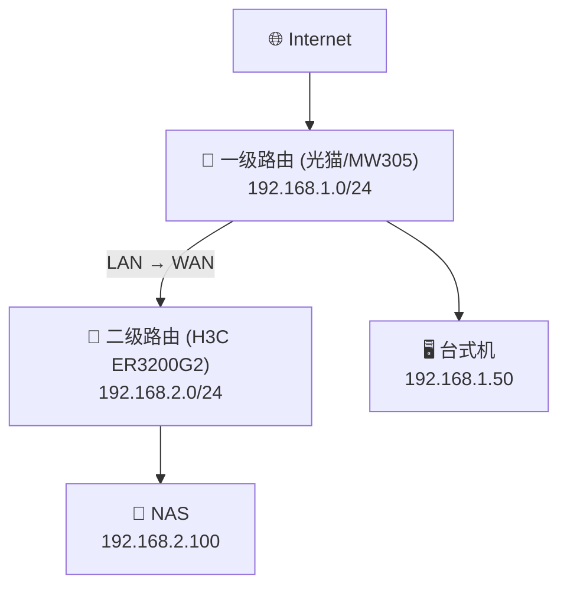

# 如何远程管理二级路由器

> 光猫 (一级) 接路由器 (二级) 是家庭最常见的拓扑。问题是：连在一级路由的电脑，怎么访问二级路由下的 NAS？

---

## 你的网络长这样



| 谁访问谁 | 能吗？ | 为什么 |
|------|:---:|------|
| 台式机 → NAS | ❌ | NAT 单向，一级下不去二级 |
| NAS → 台式机 | ✅ | 上行转换允许 |
| 手机 (外网) → NAS | ❌ | 双重 NAT，端口都没开 |

---

## 渐进式解决

### 第 1 步：内网互访 → 静态路由

**思路**：告诉一级路由「192.168.2.x 往 B 路由器走」。

一级路由加一条：

| 目标网段 | 掩码 | 下一跳 |
|------|------|------|
| `192.168.2.0` | `255.255.255.0` | `192.168.1.x` (B 的 WAN 口) |


> ⚠️ 很多家用路由不支持静态路由（电信荣耀 PRO 就不行），这一步直接跳过的人居多。

---

### 第 2 步：端口转发 → 按需开放

**思路**：不解决互访，只把 NAS 的特定端口"映射"到一级。

```
访问 一级IP:8080  =  自动转到 NAS 的 80 端口
访问 一级IP:2222  =  自动转到 NAS 的 22 端口
```

二级路由器里配三条：

| 外部端口 | 内部 IP | 内部端口 | 做什么用 |
|:---:|------|:---:|------|
| 8080 | 192.168.2.100 | 80 | Web 管理 |
| 2222 | 192.168.2.100 | 22 | SSH |
| 8443 | 192.168.2.100 | 443 | HTTPS |

配完后 `http://192.168.1.1:8080` 就能打开 NAS 了。

#### 或者一步到位：DMZ

把 NAS 全部端口暴露给一级——填个 IP 就完事。

| | 端口转发 | DMZ |
|:---:|:---:|:---:|
| 配置量 | 每个端口一条 | 一个 IP |
| 安全性 | ✅ 只开需要的 | ⚠️ 全开 |
| 什么时候用 | 日常 | 调试/临时 |

---

### 第 3 步：外网访问 → DDNS

内网通了，人在外面怎么访问？

**前提**：你得有个公网 IP（电信/联通打电话要，移动基本没戏）。

**DDNS 流程**：

```
1. 注册花生壳 → 拿到 xxx.qicp.vip
2. 路由器里填好 DDNS → IP 变了自动更新
3. 手机访问 http://xxx.qicp.vip:8080 → 穿透到家
```


#### 没有公网 IP？

| 方案 | 特点 |
|------|------|
| **Tailscale** | 最简单，装客户端就行 |
| **ZeroTier** | 类似，免费够用 |
| **frp** | 需要一台有公网 IP 的 VPS |
| **Cloudflare Tunnel** | 免费，但走 CF 中转 |

---

## 实操记录

### 我家设备

| 角色 | 型号 | 网段 |
|:---:|------|------|
| 一级 | 水星 MW305 / 光猫 | 192.168.1.x |
| 二级 | H3C ER3200G2 | 192.168.2.x |

### H3C 静态路由备忘

- 目的地：`192.168.0.0 / 255.255.255.0`
- 下一跳：B 的 WAN 出口地址

### DMZ 备忘

1. 登录路由器 → **高级设置** → **DMZ 主机**
2. 填入目标 IP
3. **先内网验证**，再开外网
4. 必要时关目标设备防火墙

---

## 排查速查

| 症状 | 检查链 |
|------|------|
| 端口转发不生效 | 内网能访问吗？→ IP 填对了吗？→ 端口冲突？→ 关防火墙试试 |
| DMZ 还是不行 | 运营商封了 80/443？→ 换 8080/8443 |
| 外网突然连不上 | IP 变了？→ 检查 DDNS 在线状态 → 手动更新 |
| 路由器重启后失效 | WAN 口 IP 变了 → 设静态 WAN IP 或 MAC 绑定 |

---

## 参考

- [两台路由器 LAN-WAN 级联互访 - TP-LINK](https://service.tp-link.com.cn/detail_article_2858.html)
- [光猫下访问二级路由 - 百度经验](https://jingyan.baidu.com/article/ab69b2708488012ca7189f1a.html)
- [电信光猫 DDNS 花生壳 - 百度经验](https://jingyan.baidu.com/article/e3c78d64a5b1c43c4d85f569.html)
