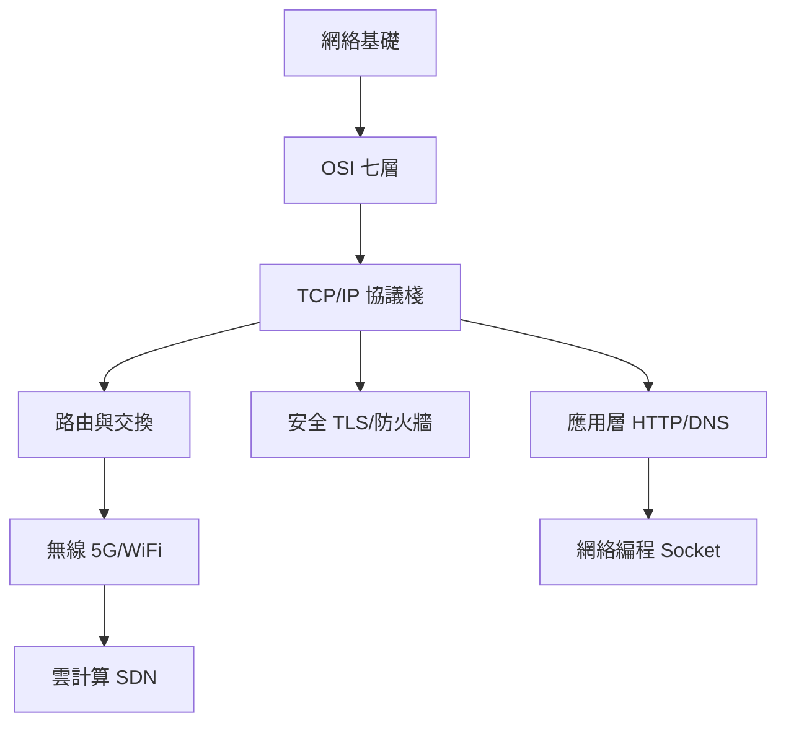

# 計算機網絡知識地圖

| 層級 | 技能 | 對應 |
|:--:|------|:----:|
| L1 | IP/子網/拓撲 | 01–02 |
| L2 | TCP握手/流量控制 | 03 |
| L3 | HTTP/DNS/TLS | 04–05 |
| L4 | VLAN/BGP/ACL | 06 |
| L5 | WiFi/5G/Socket | 07–08 |
| L6 | SDN/NFV/Cloud | 09 |
