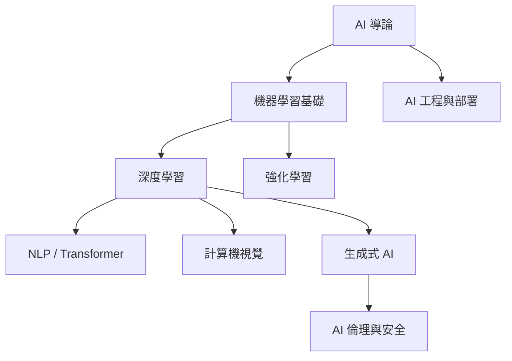

# 人工智能知識地圖

```mermaid
graph TD
    A[AI 導論] --> B[機器學習基礎]
    B --> C[深度學習]
    C --> D[NLP / Transformer]
    C --> E[計算機視覺]
    B --> F[強化學習]
    C --> G[生成式 AI]
    G --> H[AI 倫理與安全]
    A --> I[AI 工程與部署]
```
| 層級 | 技能 | 對應 |
|:--:|------|:--:|
| L1 | ML 基礎/監督學習 | 01–02 |
| L2 | CNN/RNN/Transformer | 03–05 |
| L3 | RL/GAN/Diffusion | 06–07 |
| L4 | MLOps/對齊 | 08–09 |
