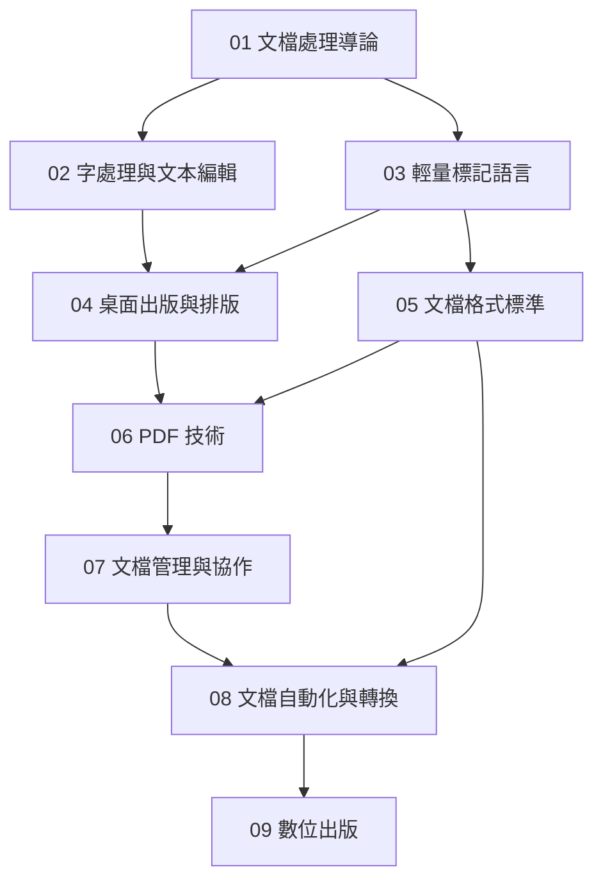

# 文檔處理知識地圖

```mermaid
graph TD
    A[01 文檔處理導論] --> B[02 字處理與文本編輯]
    A --> C[03 輕量標記語言]
    B --> D[04 桌面出版與排版]
    C --> D
    C --> E[05 文檔格式標準]
    D --> F[06 PDF 技術]
    E --> F
    F --> G[07 文檔管理與協作]
    E --> H[08 文檔自動化與轉換]
    G --> H
    H --> I[09 數位出版]
```

| 層級 | 技能 | 對應章節 |
|:--:|------|:--:|
| L1 | 字處理/文本編輯/導論 | 01–02 |
| L2 | 標記語言/格式標準 | 03, 05 |
| L3 | 排版/PDF/協作 | 04, 06–07 |
| L4 | 自動化/數位出版 | 08–09 |
