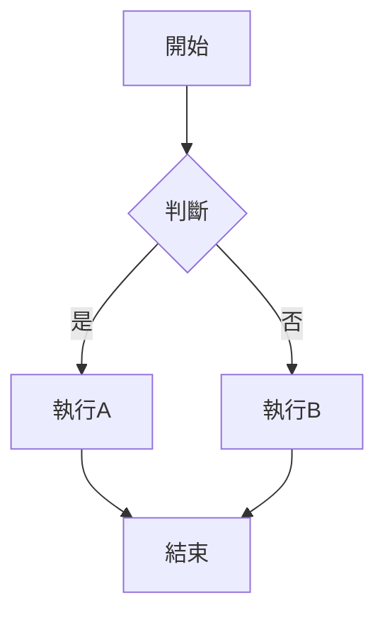

# 03 — 編輯器與 Markdown

## 三種編輯模式

| 模式 | 說明 | 適用場景 |
|------|------|----------|
| **即時預覽 Live Preview** | 預設模式，所見即所得，Markdown 語法自動渲染 | 日常寫作（推薦） |
| **編輯模式 Editor** | 原始 Markdown 源碼視圖，語法高亮 | 批量編輯、精細控制 |
| **預覽模式 Preview** | 唯讀渲染視圖，不可編輯 | 閱讀、展示 |

> `Ctrl+E` 一鍵切換編輯/預覽。設定 → 編輯器 → 預設編輯模式可更改預設行為。

## Callouts

> 從 Obsidian 1.0+ 開始支援的增強區塊提示。

| 類型 | 語法 | 預設圖示 |
|------|------|:------:|
| **note** | `> [!note]` | ✏️ |
| **info** | `> [!info]` | ℹ️ |
| **warning** | `> [!warning]` | ⚠️ |
| **danger** | `> [!danger]` | 🔥 |
| **tip** | `> [!tip]` | 🔥 |
| **success** | `> [!success]` | ✅ |
| **question** | `> [!question]` | ❓ |
| **example** | `> [!example]` | 📝 |
| **quote** | `> [!quote]` | 💬 |
| **abstract** | `> [!abstract]` | 📋 |
| **todo** | `> [!todo]` | ☑️ |

```markdown
> [!note] 標題
> 這是自定義標題的 Callout。
> 支援 **Markdown** 和 `代碼`。

> [!warning]+ 可折疊 Callout
> 點擊展開/收起。

> [!tip] 折疊狀態
> 使用 `+` 預設展開，`-` 預設折疊。
```

## 進階 Markdown 語法

### 代碼塊 Code Blocks

````markdown
```python
def hello():
    print("Hello, Obsidian")
```
````

| 語言 | 別名 | 支援 |
|------|------|:---:|
| Python | `python` `py` | ✅ |
| JavaScript | `javascript` `js` | ✅ |
| TypeScript | `typescript` `ts` | ✅ |
| Bash | `bash` `sh` `shell` | ✅ |
| SQL | `sql` | ✅ |
| YAML | `yaml` `yml` | ✅ |
| JSON | `json` | ✅ |
| Mermaid | `mermaid` | ✅ |

### 表格 Tables

```markdown
| 欄位1 | 欄位2 | 欄位3 |
|:------|:-----:|------:|
| 靠左  | 置中  | 靠右  |
| `代碼` | **粗體** | *斜體* |
```

> 💡 使用 **Advanced Tables** 插件獲得 Excel 式表格編輯體驗。

### 註腳 Footnotes

```markdown
這是一個有註腳的句子[^1]。

[^1]: 這是註腳內容，會自動渲染到頁尾。
```

### Mermaid 圖表

````markdown

````

| 圖表類型 | 用途 | 語法關鍵字 |
|----------|------|-----------|
| **流程圖** | 邏輯流程 | `graph TD / LR` |
| **時序圖** | 時間順序 | `sequenceDiagram` |
| **甘特圖** | 專案進度 | `gantt` |
| **類圖** | UML 類圖 | `classDiagram` |
| **狀態圖** | 狀態機 | `stateDiagram` |
| **圓餅圖** | 數據比例 | `pie` |
| **心智圖** | 頭腦風暴 | `mindmap`（需插件） |

## 嵌入 Embed `![[note]]`

| 嵌入方式 | 語法 | 效果 |
|----------|------|------|
| 整篇筆記 | `![[筆記名]]` | 渲染整篇筆記於當前位置 |
| 段落 | `![[筆記名#標題]]` | 僅渲染該段落 |
| 區塊 | `![[筆記名#^block-id]]` | 僅渲染該區塊 |
| 圖片 | `![[image.png]]` | 嵌入圖片 |
| 音訊 | `![[audio.mp3]]` | 嵌入播放器 |
| PDF | `![[doc.pdf]]` | 嵌入 PDF 預覽 |

## 多分頁與分欄 Multi-tab

| 操作 | 快捷鍵 |
|------|--------|
| 新分頁 | `Ctrl+點擊鏈接` 或 `Ctrl+T` |
| 關閉分頁 | `Ctrl+W` |
| 切換分頁 | `Ctrl+Tab` / `Ctrl+Shift+Tab` |
| 分割視窗 (垂直) | `Ctrl+\` |
| 分割視窗 (水平) | 右鍵分頁 → 分割 |
| 移動到新窗 | 拖曳分頁到新視窗 |
| 釘選分頁 | 右鍵分頁 → 釘選 |

## 核心編輯快捷鍵

| 快捷鍵 | 功能 |
|--------|------|
| `Ctrl+B` | 粗體 |
| `Ctrl+I` | 斜體 |
| `Ctrl+K` | 插入鏈接 |
| `Ctrl+Shift+K` | 插入 Wikilink |
| `` Ctrl+` `` | 行內代碼 |
| `Ctrl+Shift+C` | 代碼塊 |
| `Ctrl+Shift+[` | 折疊當前段落 |
| `Ctrl+Shift+]` | 展開當前段落 |
| `Ctrl+Z` / `Ctrl+Shift+Z` | 復原 / 重做 |
| `Ctrl+F` | 筆記內搜尋 |
| `Ctrl+H` | 筆記內取代 |

## 相關筆記

- [[004.915-Obsidian|Obsidian MOC]]
- [[3 Resources/000 Knowledge/004 Computer Science & technology/004.9-面向应用的计算机技术/004.91-文档处理与生产/004.915-Obsidian/02-核心概念]] — Wikilinks、Dataview、Search
- [[05-主题与样式]] — 自定義編輯器外觀
