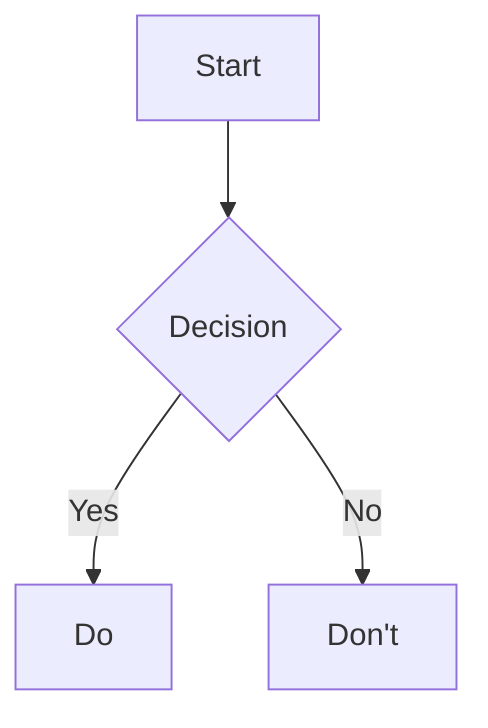
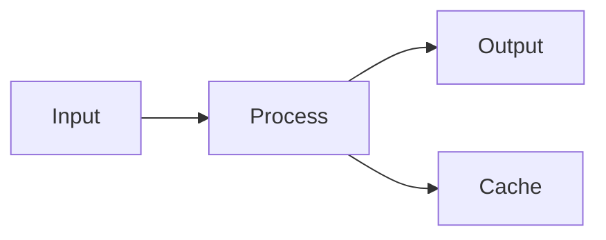

# skill-obsidian-markdown 使用手册

> Claude Code Skill — 指导 Agent 创建和编辑符合 Obsidian Flavored Markdown 规范的 `.md` 文件。

---

## Skill 基本信息

| 属性 | 值 |
|------|------|
| **名称** | `obsidian-markdown` |
| **路径** | `.claude/skills/obsidian-skills/obsidian-markdown/SKILL.md` |
| **触发条件** | 处理 `.md` 文件 · 提及 wikilinks · callouts · frontmatter · tags · embeds |
| **覆盖规范** | CommonMark + GFM + LaTeX + Obsidian 专属扩展 |

---

## Skill 覆盖的全部语法

### 基础格式化

| 语法 | 写法 | 输出 |
|------|------|:---:|
| 粗体 | `**text**` | **粗体** |
| 斜体 | `*text*` | *斜体* |
| 粗斜体 | `***text***` | ***粗斜体*** |
| 删除线 | `~~text~~` | ~~删除线~~ |
| 高亮 | `==text==` | ==高亮== |
| 行内代码 | `` `code` `` | `code` |
| 转义 | `\*` `\_` `\#` `` \` `` `\|` `\~` | 取消格式 |

### Wikilinks

```markdown
[[Note Name]]                    # 基础链接
[[Note Name|Display Text]]       # 别名
[[Note Name#Heading]]            # 标题锚点
[[Note Name#^block-id]]          # 块引用
[[#Heading]]                     # 当前笔记内
[[##search heading]]             # 搜索标题
[[^^search block]]               # 搜索块
```

定义块 ID：
```markdown
一段可被引用的文字。 ^my-block-id

> 引用块
> 多行

^quote-id
```

### Markdown 链接

```markdown
[text](Note%20Name.md)                              # 空格 → %20
[text](https://example.com)                          # 外部 URL
[text](obsidian://open?vault=Vault&file=Note.md)      # Obsidian URI
```

### Embeds

```markdown
![[note]]                        # 嵌入笔记
![[note#heading]]                # 嵌入章节
![[note^block-id]]               # 嵌入块
![[image.png]]                   # 嵌入图片
![[image.png|300]]               # 宽度 300px
![[image.png|640x480]]           # 宽 x 高
![[audio.mp3]]                   # 音频
![[document.pdf]]                # PDF
![[document.pdf#page=3]]         # PDF 第3页
![[document.pdf#height=400]]     # PDF 高度
    # 外部图片
```

### Callouts

| 类型 | 别名 | 图标 |
|------|------|:---:|
| `note` | — | 📝 |
| `abstract` | `summary` `tldr` | 📋 |
| `info` | — | ℹ️ |
| `todo` | — | ✅ |
| `tip` | `hint` `important` | 🔥 |
| `success` | `check` `done` | ✔️ |
| `question` | `help` `faq` | ❓ |
| `warning` | `caution` `attention` | ⚠️ |
| `failure` | `fail` `missing` | ❌ |
| `danger` | `error` | ⚡ |
| `bug` | — | 🐛 |
| `example` | — | 📄 |
| `quote` | `cite` | 💬 |

```markdown
> [!note]
> 默认标题。

> [!warning] 自定义标题
> 警告内容。

> [!faq]- 默认折叠
> 点击展开。

> [!faq]+ 默认展开
> 可折叠。
```

### 列表

```markdown
- 无序
  1. 有序嵌套
- [ ] 任务未完成
- [x] 任务已完成
```

### 代码

````markdown
`行内代码`
`` 内嵌 ` 反引号 ``

```js
console.log("语法高亮")
```

# 嵌套代码块用更多反引号
`````markdown
````js
code
````
`````
````

### 表格

```markdown
| 左 | 中 | 右 |
|:---|:--:|---:|
| a | b | c |

# 管道符转义
| [[Link\|Alias]] |
```

### LaTeX

```markdown
$e^{i\pi} + 1 = 0$                        # 行内
$$
\begin{vmatrix}a & b \\ c & d\end{vmatrix}  # 块级
$$
```

### Mermaid

````markdown

````

### 脚注

```markdown
文字[^1]。行内^[直接写]。

[^1]: 脚注内容。
```

### 注释

```markdown
可见 %%隐藏%% 可见

%%
多行隐藏
%%
```

### Frontmatter (Properties)

```yaml
---
title: My Note
date: 2024-01-15
tags: [project, active]
aliases: [Alias1, Alias2]
cssclasses: [custom]
status: in-progress
rating: 4.5
completed: false
due: 2024-02-01T14:30:00
---
```

| 类型 | 示例 |
|------|------|
| Text | `title: My Title` |
| Number | `rating: 4.5` |
| Checkbox | `completed: true` |
| Date | `date: 2024-01-15` |
| DateTime | `due: 2024-01-15T14:30:00` |
| List | `tags: [one, two]` |
| Link | `related: "[[Note]]"` |

### Tags

```markdown
#tag
#nested/tag
#中文标签

# frontmatter 写法
---
tags:
  - tag1
  - nested/tag2
---
```

允许：字母（任意语言）· 数字（不可首字符）· `_` · `-` · `/`

### HTML

```markdown
<div class="custom">内容</div>
<span style="color:red;">红色</span>
<details><summary>展开</summary>隐藏内容</details>
<kbd>Ctrl</kbd> + <kbd>C</kbd>
```

---

## Skill 完整示例

以下示例展示了 Skill 覆盖的所有语法元素：

```markdown
---
title: Project Alpha
date: 2024-01-15
tags: [project, active]
status: in-progress
priority: high
---

# Project Alpha

## Overview

This project aims to [[improve workflow]] with modern tools.

> [!important] Key Deadline
> The first milestone is due on ==January 30th==.

## Tasks

- [x] Initial planning
- [x] Resource allocation
- [ ] Development phase
  - [ ] Backend implementation
  - [ ] Frontend design
- [ ] Testing
- [ ] Deployment

## Technical Notes

The algorithm uses $O(n \log n)$ complexity.

```python
def process(items):
    return sorted(items, key=lambda x: x.priority)
```

## Architecture



## Related

- ![[Meeting Notes#Decisions]]
- [[Budget Allocation|Budget]]

## References

See the official documentation[^1].

[^1]: https://example.com/docs

%%
Internal notes for Friday review.
%%
```

---

## 与其他资源的关系

| 资源 | 受众 | 用途 |
|------|:---:|------|
| **本手册** | 人类用户 | 理解 Skill 的覆盖范围和用法 |
| `SKILL.md` | Claude Code Agent | Agent 的语法指令（English） |
| [[Obsidian-Markdown 使用手册]] | 人类用户 | Obsidian Markdown 完整语法参考（15章） |
| [[Obsidian 分类码]] | 人类用户 | DDC · UDC · CLC · LCC 四体系分类 |

---

## 参考

- [Obsidian Flavored Markdown](https://help.obsidian.md/obsidian-flavored-markdown)
- [Basic formatting syntax](https://help.obsidian.md/syntax)
- [Advanced formatting syntax](https://help.obsidian.md/advanced-syntax)

---

*最后更新: 2026-06-01*
