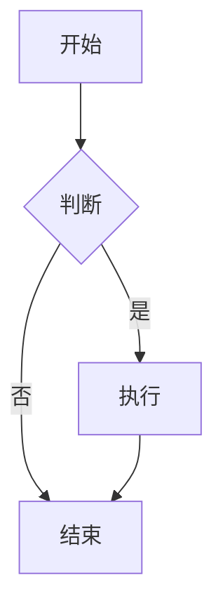
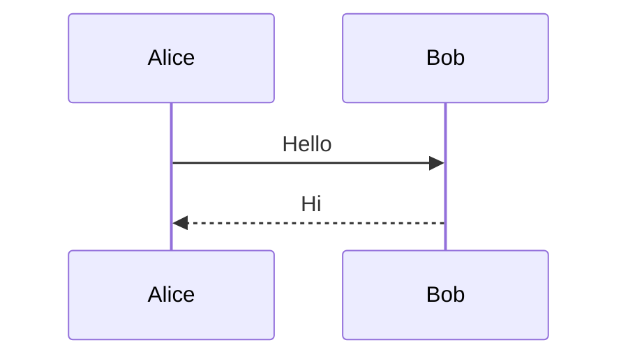
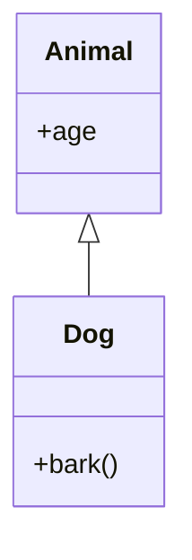
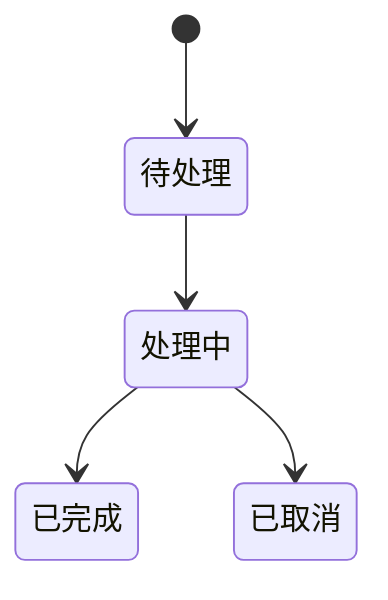
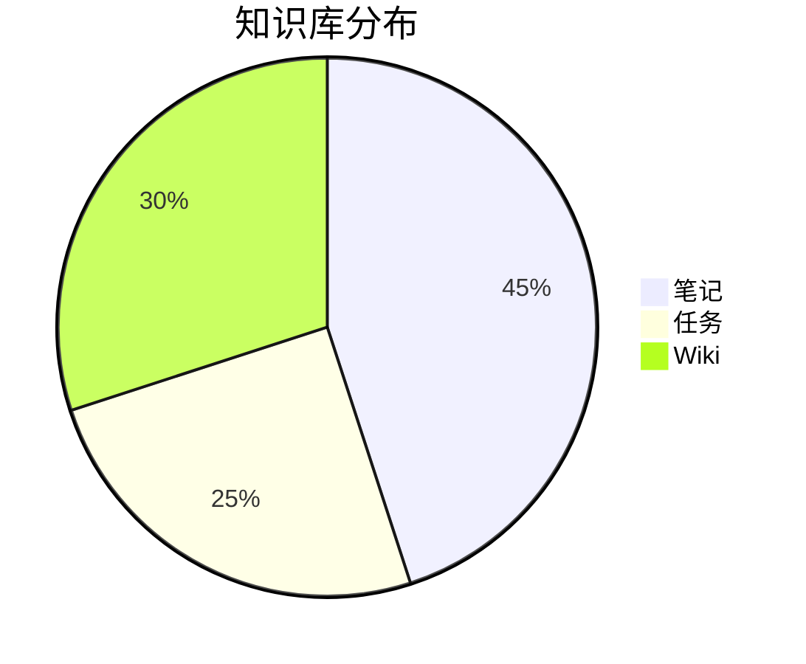

# Obsidian Markdown 使用手册

> Obsidian 原生 Markdown 语法的完整参考——从基础到高级，覆盖所有常用语法和 Obsidian 特有扩展。

---

## 目录

1. [基础排版](#一基础排版)
2. [内部链接 Wikilinks](#二内部链接-wikilinks)
3. [Frontmatter 元数据](#三frontmatter-元数据)
4. [标签 Tags](#四标签-tags)
5. [嵌入 Embeds](#五嵌入-embeds)
6. [Callouts 提示块](#六callouts-提示块)
7. [代码块](#七代码块)
8. [表格](#八表格)
9. [脚注](#九脚注)
10. [Mermaid 图表](#十mermaid-图表)
11. [LaTeX 数学公式](#十一latex-数学公式)
12. [注释与隐藏](#十二注释与隐藏)
13. [块引用 Block Refs](#十三块引用-block-refs)
14. [属性 Properties](#十四属性-properties)
15. [常用快捷键](#十五常用快捷键)

---

## 一、基础排版

### 标题

```markdown
# 一级标题
## 二级标题
### 三级标题
#### 四级标题
##### 五级标题
###### 六级标题
```

### 文本样式

```markdown
**粗体**       →  **粗体**
*斜体*         →  *斜体*
***粗斜体***   →  ***粗斜体***
~~删除线~~     →  ~~删除线~~
==高亮==       →  ==高亮==
`行内代码`     →  `行内代码`
```

### 列表

```markdown
- 无序列表项 1
- 无序列表项 2
  - 嵌套子项
    - 更深一层

1. 有序列表项 1
2. 有序列表项 2
   1. 嵌套子项

- [ ] 待办事项
- [x] 已完成事项
```

### 引用

```markdown
> 单行引用

> 多行引用
> 第二行
>
> > 嵌套引用
```

### 分隔线

```markdown
---
***
___
```

---

## 二、内部链接 Wikilinks

### 基础链接

```markdown
[[笔记名称]]              → 链接到同名笔记
[[笔记名称|显示文本]]      → 链接到笔记，显示别名
[[文件夹/笔记名称]]        → 链接到子文件夹中的笔记
```

### 标题链接

```markdown
[[笔记名称#标题]]          → 链接到笔记中的特定标题
[[笔记名称#标题|别名]]     → 标题链接 + 显示别名
[[#标题]]                  → 链接到当前笔记的标题
```

### 块链接

```markdown
[[笔记名称^block-id]]      → 链接到笔记中的特定块
[[笔记名称^]]              → 自动补全块 ID（输入 ^ 后选择）
```

### 链接到段落

```markdown
[[笔记名称#^block-id]]     → 标题中的块引用
```

---

## 三、Frontmatter 元数据

### YAML Frontmatter

```yaml
---
title: 笔记标题
aliases:
  - 别名1
  - 别名2
tags:
  - 标签1
  - 标签2
created: 2026-06-01
updated: 2026-06-01
type: note
status: active
---
```

### 常用属性

| 属性 | 类型 | 说明 |
|------|:---:|------|
| `aliases` | 列表 | 笔记别名（搜索可见） |
| `tags` | 列表 | 标签 |
| `created` | 日期 | 创建日期 |
| `updated` | 日期 | 更新日期 |
| `cssclasses` | 列表 | 自定义 CSS 类 |
| `publish` | 布尔 | 是否发布 |

---

## 四、标签 Tags

### 标签语法

```markdown
#tag                     → 普通标签
#tag/subtag              → 嵌套标签
#tag-with-dashes         → 带连字符的标签
#标签中文                 → 中文标签
```

```yaml
# 在 frontmatter 中（推荐）
tags:
  - tag1
  - tag2/subtag

# 或
tags: [tag1, tag2]
```

### 标签规范

- 不允许空格 → 用 `-` 或 `/` 分隔
- 嵌套用 `/` → `#area/health`
- 中文支持 ✅
- 数字允许但**不能纯数字**

---

## 五、嵌入 Embeds

### 嵌入笔记

```markdown
![[笔记名称]]              → 嵌入整个笔记
![[笔记名称#标题]]         → 嵌入特定章节
![[笔记名称^block-id]]     → 嵌入特定块
```

### 嵌入媒体

```markdown
![[image.png]]             → 嵌入图片
![[image.png|300]]         → 嵌入图片（指定宽度）
![[audio.mp3]]             → 嵌入音频
![[video.mp4]]             → 嵌入视频
![[document.pdf]]          → 嵌入 PDF
![[document.pdf#page=3]]   → 嵌入 PDF 指定页
```

### 外部图片

```markdown

```

---

## 六、Callouts 提示块

### 语法

```markdown
> [!note]
> 这是一个备注。

> [!warning] 自定义标题
> 警告内容。
```

### 可折叠 Callout

```markdown
> [!faq]- 点击展开
> 折叠的内容。
```

### 全部类型

| 类型 | 用途 | 颜色 |
|------|------|:---:|
| `note` | 备注 | 🔵 |
| `info` | 信息 | 🔵 |
| `todo` | 待办 | 🔵 |
| `tip` / `hint` / `important` | 提示 | 🟢 |
| `success` / `check` / `done` | 成功 | 🟢 |
| `question` / `help` / `faq` | 问题 | 🟡 |
| `warning` / `caution` / `attention` | 警告 | 🟠 |
| `failure` / `fail` / `missing` | 失败 | 🔴 |
| `danger` / `error` | 危险 | 🔴 |
| `bug` | 缺陷 | 🔴 |
| `example` | 示例 | 🟣 |
| `quote` / `cite` | 引用 | ⚪ |
| `abstract` / `summary` / `tldr` | 摘要 | ⚪ |

### 自定义 Callout

在 CSS snippet 中定义：

```css
.callout[data-callout="custom-name"] {
  --callout-color: 200, 100, 200;
}
```

---

## 七、代码块

### 围栏代码块

````markdown
```python
def hello():
    print("Hello, Obsidian!")
```
````

### 行内代码

```markdown
使用 `print()` 函数输出。
```

### 支持的语言高亮

```
python javascript typescript html css json yaml
bash shell sql markdown latex r cpp c java go
rust swift kotlin dart
```

---

## 八、表格

### 基础表格

```markdown
| 列1 | 列2 | 列3 |
|-----|:---:|----:|
| 左对齐 | 居中 | 右对齐 |
| a | b | c |
```

### 对齐方式

```markdown
| 默认对齐 | 左对齐 | 居中 | 右对齐 |
|---------|:------|:----:|------:|
| 文字 | 文字 | 文字 | 文字 |
```

---

## 九、脚注

```markdown
这是一个带脚注的句子[^1]。

[^1]: 这是脚注内容。支持 **Markdown** 和 [[wikilinks]]。
```

### 行内脚注

```markdown
行内脚注^[这是脚注内容]示例。
```

---

## 十、Mermaid 图表

### 流程图 Flowchart

````markdown

````

### 时序图 Sequence

````markdown

````

### 类图 Class

````markdown

````

### 状态图 State

````markdown

````

### 饼图 Pie

````markdown

````

---

## 十一、LaTeX 数学公式

### 行内公式

```markdown
$E = mc^2$
```

### 块级公式

```markdown
$$
\int_{0}^{\infty} e^{-x^2} dx = \frac{\sqrt{\pi}}{2}
$$
```

### 常用符号

| 语法 | 渲染 |
|------|:---:|
| `\alpha` `\beta` `\gamma` | α β γ |
| `\sum` `\prod` `\int` | Σ Π ∫ |
| `\infty` `\partial` `\nabla` | ∞ ∂ ∇ |
| `\times` `\cdot` `\pm` | × · ± |
| `\leq` `\geq` `\neq` | ≤ ≥ ≠ |
| `\sqrt{x}` `\frac{a}{b}` | √x  a/b |
| `\mathbb{R}` `\mathcal{O}` | ℝ 𝒪 |

---

## 十二、注释与隐藏

### 注释

```markdown
%% 这是注释，不会在阅读模式下显示 %%

%%
多行注释
第二行
%%
```

### 注释块

```markdown
<!-- HTML 注释也有效 -->
```

---

## 十三、块引用 Block Refs

### 创建块 ID

```markdown
这里是一段文字。 ^my-block-id

或：

^my-block-id

第二段文字。
```

### 引用块

```markdown
在别处引用：![[笔记名^my-block-id]]
```

### 自动生成块 ID

在链接中输入 `^` 后 Obsidian 会列出可选块。

---

## 十四、属性 Properties

### 读写属性视图

```yaml
---
property_name: value
number_prop: 42
list_prop:
  - item1
  - item2
checkbox_prop: true
date_prop: 2026-06-01
---
```

### 在正文中内联引用

```markdown
当前状态: `= this.status`

所有未完成任务:
`$= dv.taskList(dv.pages().file.tasks.where(t => !t.completed))`
```

---

## 十五、常用快捷键

| 快捷键 | 功能 |
|--------|------|
| `Ctrl+N` | 新建笔记 |
| `Ctrl+O` | 快速打开 |
| `Ctrl+P` | 命令面板 |
| `Ctrl+E` | 切换编辑/阅读模式 |
| `Ctrl+K` | 插入链接 |
| `Ctrl+,` | 打开设置 |
| `Ctrl+[` | 插入 `[[` |
| `Ctrl+]` | 关闭 `]]` |
| `Ctrl+B` | 粗体 |
| `Ctrl+I` | 斜体 |
| `Ctrl+Shift+F` | 全局搜索 |
| `Ctrl+G` | 图谱视图 |
| `Ctrl+Enter` | 切换待办 |
| `Alt+Enter` | 快速切换 |

---

## 参考

- [[Obsidian (MOC)]] — Obsidian 知识库总入口
- [[Obsidian 分类码]] — DDC · UDC · CLC · LCC 四体系分类
- [[02-核心概念]] — Wikilinks · Graph View · Tags · Aliases 详解
- [[03-编辑器与Markdown]] — 编辑模式 · Callouts · Embeds · 热键

---

*最后更新: 2026-06-01*
