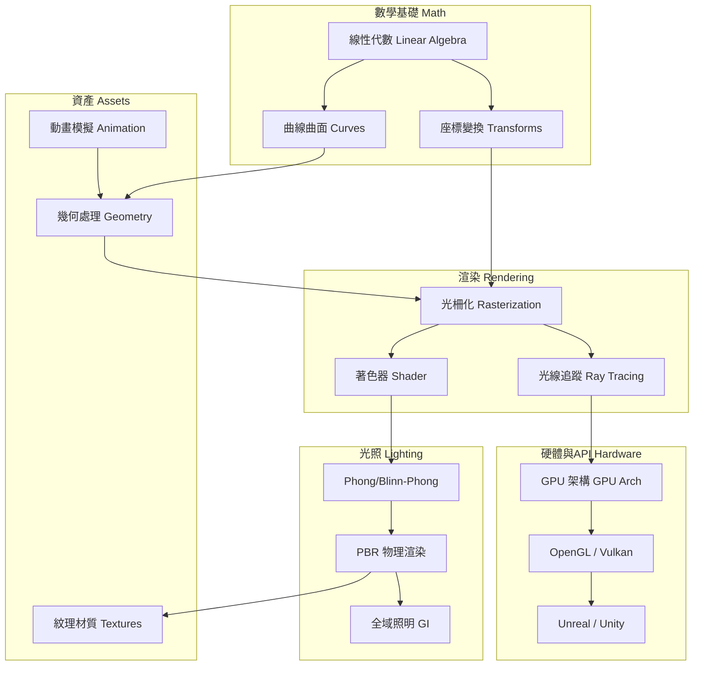

---
aliases:
  - CG Knowledge Map
  - 圖形學知識圖譜
tags: [DDC/004.92, cg, MOC]
created: 2026-05-30
---

# 圖形學知識地圖 — CG Knowledge Map

> 電腦圖形學核心概念之間的關係全景。

## 概念關係圖 Concept Graph

## 技能分級 Skill Levels

| 等級 | 所需知識 | 可勝任任務 |
|:---:|---|----------|
| ⭐ 初階 | 線性代數、變換矩陣、基本管線 | 理解渲染流程，使用 Unity/Unreal 材質編輯器 |
| ⭐⭐ 中階 | Shader 程式設計、光照模型、紋理技術 | 編寫 GLSL/HLSL，實現自訂材質與後處理 |
| ⭐⭐⭐ 進階 | PBR、光線追蹤、GPU 架構、物理模擬 | 開發渲染引擎、優化 GPU 管線、發表 SIGGRAPH |

## 關鍵技術矩陣 Key Tech Matrix

| 技術 | 即時 Real-time | 離線 Offline | 代表工具/API |
|------|:---:|:---:|------|
| Rasterization | ✅ | — | OpenGL, Vulkan, DirectX |
| Ray Tracing | ✅ (RTX) | ✅ | OptiX, Cycles, Arnold |
| PBR | ✅ | ✅ | Substance, UE5, Unity HDRP |
| Path Tracing | — | ✅ | Mitsuba, PBRT |
| Neural Rendering | ✅ (DLSS) | ✅ | NeRF, 3DGS |
