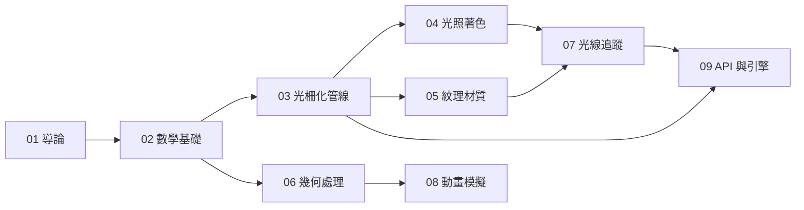

---
aliases:
  - Computer Graphics
  - CG
  - 計算機圖形學
tags: [DDC/004.92, cg, MOC]
created: 2026-05-30
updated: 2026-05-30
type: MOC
domain: 004.92
---

# 004.92 電腦圖形學 — Computer Graphics

> 研究如何利用電腦生成、處理與顯示圖形影像的學科，涵蓋從數學基礎到即時渲染的完整技術棧。

---

## 章節目錄 Chapter Index

| 章節 | 標題 | 核心主題 |
|:---:|------|----------|
| 01 | [[01-計算機圖形學導論\|計算機圖形學導論]] | 定義、歷史（Sketchpad→Pixar→RTX）、應用領域 |
| 02 | [[02-數學基礎\|數學基礎]] | 線性代數、座標變換、曲線曲面（Bézier/B-spline/NURBS） |
| 03 | [[03-光柵化與渲染管線\|光柵化與渲染管線]] | GPU 管線階段、深度測試、混合、剔除 |
| 04 | [[04-光照與著色\|光照與著色]] | Phong/Blinn-Phong、PBR、全域照明、陰影映射 |
| 05 | [[05-紋理與材質\|紋理與材質]] | UV 映射、濾波、Mipmap、PBR 材質管線 |
| 06 | [[06-幾何處理\|幾何處理]] | 網格表示、細分曲面、LOD、簡化 |
| 07 | [[07-光線追蹤\|光線追蹤]] | Whitted 光線追蹤、Monte Carlo 路徑追蹤、BVH、降噪 |
| 08 | [[08-動畫與模擬\|動畫與模擬]] | 骨骼動畫、Blend Shape、物理模擬、粒子系統 |
| 09 | [[09-圖形 API 與引擎\|圖形 API 與引擎]] | OpenGL/Vulkan/DirectX/Metal、Unity/Unreal/Godot |

---

## 核心問題 Core Questions

1. **如何將 3D 場景轉換為 2D 像素？** → 渲染管線 (Rendering Pipeline)
2. **光線如何與材質交互？** → BRDF、PBR、全域照明
3. **如何高效處理大規模幾何資料？** → LOD、BVH、Mesh Simplification
4. **即時渲染 vs 離線渲染的取捨？** → Rasterization vs Ray Tracing

---

## 學習路徑 Learning Path

| 階段 | 技能等級 | 重點 |
|------|:--------:|------|
| 初階 Beginner | ⭐ | 導論 + 數學基礎 → 理解基本變換與管線 |
| 中階 Intermediate | ⭐⭐ | 光照 + 紋理 + 幾何 → 實作簡單渲染器 |
| 進階 Advanced | ⭐⭐⭐ | 光線追蹤 + 動畫 + API → 貢獻引擎開發 |

---

## 跨庫連接 Cross-Library Links

- [[004.9-面向应用的计算机技术|004.9 面向應用的電腦技術]] — 上層 MOC
- [[../../004.4-人工智能/004.4-人工智能|004.4 人工智慧]] — 神經渲染 (NeRF, 3D Gaussian Splatting)
- [[../../004.3-计算机工程/004.3-计算机工程.md|004.3 電腦工程]] — GPU 硬體架構
- [[3 Resources/000 Knowledge/004 Computer Science & technology/004.9-面向应用的计算机技术/004.92-计算机图形学/wiki/index|Wiki 索引]] — 概念與實體索引
