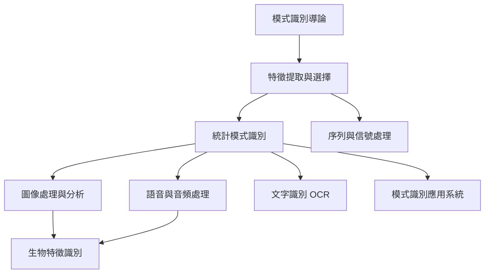

# 模式識別知識地圖

```mermaid
graph TD
    A[模式識別導論] --> B[特徵提取與選擇]
    B --> C[統計模式識別]
    C --> D[圖像處理與分析]
    C --> E[語音與音頻處理]
    C --> F[文字識別 OCR]
    D --> G[生物特徵識別]
    E --> G
    B --> H[序列與信號處理]
    C --> I[模式識別應用系統]
```
| 層級 | 技能 | 對應 |
|:--:|------|:--:|
| L1 | 特徵工程/降維 | 01–02 |
| L2 | 統計分類器/圖像語音 | 03–05 |
| L3 | OCR/生物特徵/信號處理 | 06–08 |
| L4 | 系統集成/應用部署 | 09 |
