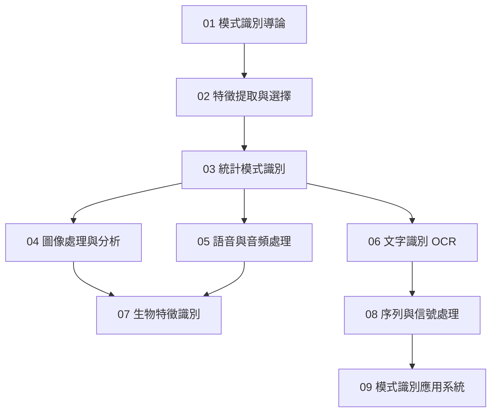

# 模式識別知識地圖



## 技能層級

| 層級 | 技能 | 章節 |
|:--:|------|:--:|
| L1 | 系統架構、特徵工程、降維 | 01–02 |
| L2 | 統計分類器、圖像處理、語音處理 | 03–05 |
| L3 | OCR、生物特徵、序列信號 | 06–08 |
| L4 | 系統集成、工業應用部署 | 09 |

## 學習路徑

```
導論 (01) → 特徵提取 (02) → 統計分類 (03)
  ├── 圖像 (04) → 生物特徵 (07)
  ├── 語音 (05) → 生物特徵 (07)
  ├── OCR (06) → 序列信號 (08)
  └── 序列信號 (08) → 應用系統 (09)
```

## 相關

- [[../004.93-模式信息处理|004.93 入口]] — 完整分類碼 + 章節總覽
- [[../README|README]] — 快速導航
