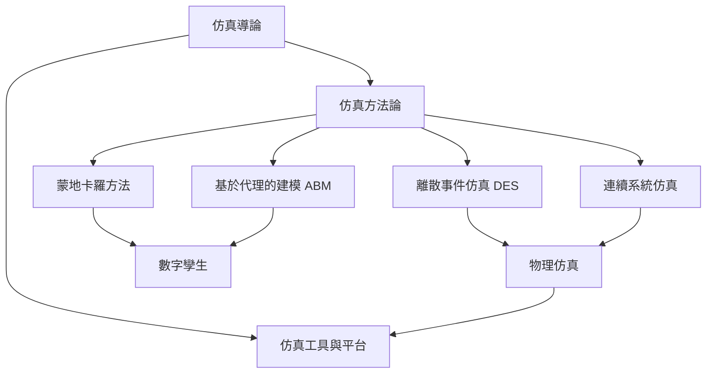

# 仿真知識地圖 Simulation Knowledge Map

| 層級 | 技能 | 對應章節 |
|:--:|------|:--:|
| L1 | 仿真分類、生命週期、方法論基礎 | 01–02 |
| L2 | DES、連續系統、蒙地卡羅 | 03–05 |
| L3 | ABM、物理仿真、V&V | 06–07 |
| L4 | 數字孿生、多平台整合、工業部署 | 08–09 |
