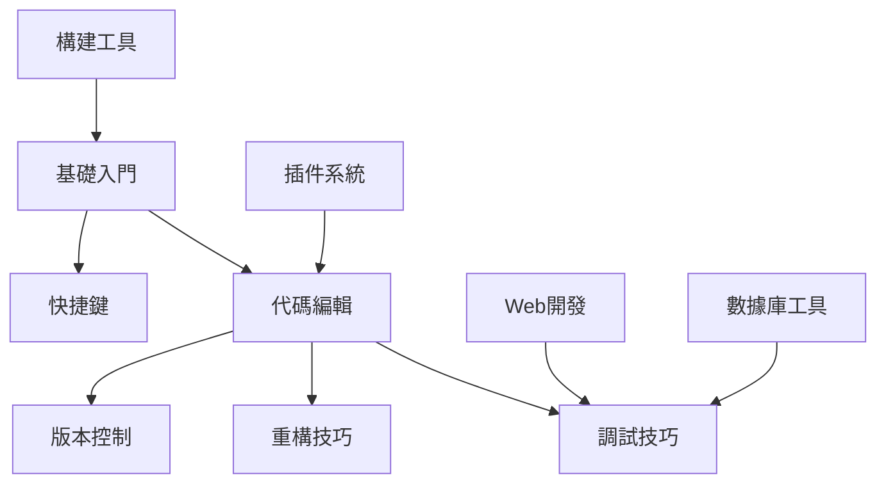

# IntelliJ IDEA 知識庫

> [!info] 知識庫概述
> 本知識庫涵蓋 IntelliJ IDEA 集成開發環境的完整學習體系，從基礎操作到高級技巧，系統化組織學習資源。

---

## 🎯 知識體系架構

```
┌─────────────────────────────────────────────────────────────┐
│                                                       │
│  ┌──────────────┐    ┌──────────────┐    ┌──────────────┐    │
│  │  基礎操作層   │───→│  核心功能層   │───→│  高級技巧層   │    │
│  │ ───────────  │    │ ───────────  │    │ ───────────  │    │
│  │ • 界面配置   │    │ • 代碼編輯   │    │ • 重構技巧   │    │
│  │ • 項目管理   │    │ • 調試功能   │    │ • 插件開發   │    │
│  │ • 快捷鍵     │    │ • 版本控制   │    │ • 自定義配置 │    │
│  └──────────────┘    └──────────────┘    └──────────────┘    │
│         ↓                  ↓                  ↓              │
│  ┌─────────────────────────────────────────────────────┐     │
│  │              專業開發與工具層                        │     │
│  │ ───────────────────────────────────────────────   │     │
│  │ • Web開發 • 數據庫工具 • 構建工具 • 框架集成       │     │
│  └─────────────────────────────────────────────────────┘     │
│                                                       │
└─────────────────────────────────────────────────────────────┘
```

---

## 📚 模塊導航

### 入門階段

```
📖 基礎入門
├── [[01-基礎入門/界面介紹|界面介紹]]
├── [[01-基礎入門/項目管理|項目管理]]
├── [[01-基礎入門/基本配置|基本配置]]
├── [[01-基礎入門/主題與外觀|主題與外觀]]
└── [[01-基礎入門/字體設置|字體設置]]

⌨️ 快捷鍵
├── [[11-快捷鍵大全/編輯快捷鍵|編輯快捷鍵]]
├── [[11-快捷鍵大全/導航快捷鍵|導航快捷鍵]]
├── [[11-快捷鍵大全/調試快捷鍵|調試快捷鍵]]
└── [[11-快捷鍵大全/重構快捷鍵|重構快捷鍵]]
```

### 核心階段

```
✏️ 代碼編輯
├── [[02-代碼編輯/代碼補全|代碼補全]]
├── [[02-代碼編輯/代碼生成|代碼生成]]
├── [[02-代碼編輯/多光標編輯|多光標編輯]]
├── [[02-代碼編輯/代碼格式化|代碼格式化]]
└── [[02-代碼編輯/查找替換|查找替換]]

🐛 調試技巧
├── [[03-調試技巧/斷點類型|斷點類型]]
├── [[03-調試技巧/變量監控|變量監控]]
├── [[03-調試技巧/條件斷點|條件斷點]]
├── [[03-調試技巧/表達式求值|表達式求值]]
└── [[03-調試技巧/遠程調試|遠程調試]]

🔀 版本控制
├── [[04-版本控制/Git集成|Git集成]]
├── [[04-版本控制/分支管理|分支管理]]
├── [[04-版本控制/衝突解決|衝突解決]]
├── [[04-版本控制/代碼審查|代碼審查]]
└── [[04-版本控制/GitHub集成|GitHub集成]]
```

### 高級階段

```
🔧 重構技巧
├── [[05-重構技巧/重命名|重命名]]
├── [[05-重構技巧/提取方法|提取方法]]
├── [[05-重構技巧/提取變量|提取變量]]
├── [[05-重構技巧/移動類|移動類]]
└── [[05-重構技巧/內聯變量|內聯變量]]

🔌 插件系統
├── [[06-插件系統/插件安裝|插件安裝]]
├── [[06-插件系統/必備插件|必備插件]]
├── [[06-插件系統/主題插件|主題插件]]
└── [[06-插件系統/工具插件|工具插件]]

⚙️ 高級功能
├── [[10-高級功能/Live Templates|Live Templates]]
├── [[10-高級功能/宏錄製|宏錄製]]
├── [[10-高級功能/代碼檢查|代碼檢查]]
└── [[10-高級功能/性能優化|性能優化]]
```

### 專業開發

```
🌐 Web開發
├── [[07-Web開發/Spring配置|Spring配置]]
├── [[07-Web開發/Tomcat配置|Tomcat配置]]
├── [[07-Web開發/REST客戶端|REST客戶端]]
└── [[07-Web開發/前端支持|前端支持]]

🗄️ 數據庫工具
├── [[08-數據庫工具/數據庫連接|數據庫連接]]
├── [[08-數據庫工具/SQL控制台|SQL控制台]]
├── [[08-數據庫工具/數據導入導出|數據導入導出]]
└── [[08-數據庫工具/ER圖生成|ER圖生成]]

📦 構建工具
├── [[09-構建工具/Maven配置|Maven配置]]
├── [[09-構建工具/Gradle配置|Gradle配置]]
└── [[09-構建工具/依賴管理|依賴管理]]
```

---

## 🔗 模塊關聯圖



---

## 📋 學習檢查清單

### 入門階段
- [ ] 熟悉 IntelliJ IDEA 界面佈局
- [ ] 掌握項目創建和導入
- [ ] 熟練使用基本快捷鍵
- [ ] 完成基本配置（字體、主題）

### 進階階段
- [ ] 掌握代碼補全和生成技巧
- [ ] 熟練使用調試功能
- [ ] 掌握 Git 集成操作
- [ ] 學會常用重構方法

### 高級階段
- [ ] 自定義 Live Templates
- [ ] 熟練使用插件系統
- [ ] 掌握遠程調試
- [ ] 優化 IDE 性能

---

## 🎯 快速導航

- 📖 [[0 Inbox/_processed/01-Tech/WSL/00-MOCs/MOC-學習路徑|推薦學習路徑]]
- ⌨️ [[../11-快捷鍵大全|快捷鍵速查]]
- 🔌 [[../06-插件系統|插件推薦]]
- 📚 [[../99-資源收集|學習資源]]
- 🔙 [[IntelliJ IDEA|返回模塊索引]]

---

## 📊 Dataview 查詢

### 最近更新
```dataview
Table without id file.link as "文件", file.mtime as "更新時間"
WHERE contains(file.path, this.file.folder) AND file.name != this.file.name
SORT file.mtime DESC
LIMIT 10
```

---

> [!tip] 使用說明
> - 使用 `Ctrl/Cmd + Shift + A` 搜索所有操作
> - 使用 `Ctrl/Cmd + N` 快速查找類
> - 遇到問題查看 [[../99-資源收集|學習資源]]

---

**文檔資訊**
- 創建時間：2026-05-21
- UDC 分類：004.4:005.5
- 語言：繁體中文為主，術語使用英文
