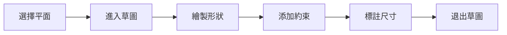

# 草圖基礎

> [!summary] 功能概述
> 草圖是 SolidWorks 三維建模的基礎，所有特徵都從草圖開始。掌握草圖繪製是學習 SolidWorks 的第一步。

---

## 草圖概念

### 什麼是草圖？
草圖是在平面上繪製的二維幾何圖形，用於創建三維特徵的基礎輪廓。

### 草圖狀態

| 狀態 | 顏色 | 說明 |
|------|------|------|
| 欠定義 | 藍色 | 尺寸或約束不足 |
| 完全定義 | 黑色 | 尺寸和約束完整 |
| 過定義 | 紅色 | 尺寸或約束衝突 |
| 無解 | 粉紅色 | 無法滿足約束 |

---

## 進入草圖模式

### 操作步驟

1. 選擇繪圖平面
   - 前視基準面 (Front Plane)
   - 上視基準面 (Top Plane)
   - 右視基準面 (Right Plane)
   - 已有實體平面

2. 點擊「草圖」按鈕
   - 或使用快捷鍵 S → 草圖

3. 進入草圖繪製模式
   - 草圖工具欄激活

---

## 草圖實體

### 基本形狀

| 工具 | 說明 |
|------|------|
| 直線 | 繪製直線段 |
| 中心線 | 繪製構造線 |
| 矩形 | 繪製矩形（多種方式） |
| 圓 | 繪製圓 |
| 圓弧 | 繪製圓弧 |
| 橢圓 | 繪製橢圓 |
| 樣條曲線 | 繪製自由曲線 |
| 多邊形 | 繪製正多邊形 |

---

## 草圖工具

### 編輯工具

| 工具 | 功能 |
|------|------|
| 剪裁實體 | 裁剪多餘線段 |
| 延伸實體 | 延伸線段到邊界 |
| 分割實體 | 在點處分割曲線 |
| 鏡向實體 | 對稱鏡像複製 |
| 陣列 | 線性/圓周陣列 |

### 約束工具

| 約束 | 功能 |
|------|------|
| 水平 | 直線水平 |
| 垂直 | 直線垂直 |
| 重合 | 點重合 |
| 平行 | 直線平行 |
| 垂直 | 直線垂直 |
| 相等 | 長度/半徑相等 |
| 對稱 | 關於中心線對稱 |

---

## 草圖工作流程

---

## 注意事項

> [!warning] 重要提示
> - 草圖應盡量完全定義（黑色狀態）
> - 使用構造線作為參考
> - 避免過度約束導致的衝突

> [!tip] 最佳實踐
> - 先繪製大致形狀，再添加約束和尺寸
> - 使用對稱約束簡化草圖
> - 善用自動約束功能

---

## 🔗 相關鏈接

- 📖 [[草圖實體]]
- 📖 [[草圖約束]]
- 📖 [[草圖工具]]
