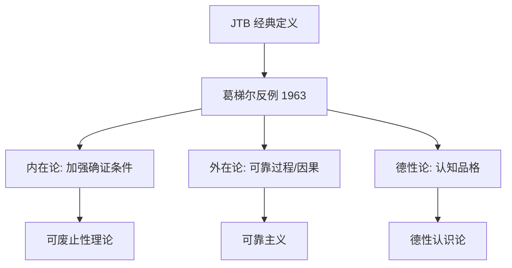

# What is Knowledge?

> 两千四百年来，哲学家一直在追问同一个问题：什么叫「知道」？柏拉图的答案是「被确证的真信念」(JTB)，直到 1963 年葛梯尔用三页纸推翻了它。

## 柏拉图与《泰阿泰德》

柏拉图的对话录《泰阿泰德》(Theaetetus) 是西方认识论的开端。苏格拉底问：「知识是什么？」泰阿泰德给出三个答案，均被推翻：

| 答案 | 苏格拉底的反驳 |
|------|---------------|
| 知识 = 感知 | 感知因人而异，且动物也有感知 |
| 知识 = 真信念 | 陪审团可能凭运气形成正确信念，但那不是知识 |
| 知识 = 被确证的真信念 | 柏拉图暗示这可能也不够——但他没给出反例 |

> 第三个答案「被确证的真信念」(Justified True Belief, JTB) 统治了西方哲学两千年。

## JTB：知识的经典三条件

```
S 知道 P，当且仅当：
  1. P 是真的        (Truth)
  2. S 相信 P        (Belief)
  3. S 有理由相信 P   (Justification)
```

| 条件 | 含义 | 反面 |
|------|------|------|
| **真 (Truth)** | P 必须事实上为真 | 你「知道」地球是平的——不，你只是相信一个假命题 |
| **信念 (Belief)** | 你必须持有该信念 | 你不知道你从不相信的东西 |
| **确证 (Justification)** | 你必须有充分理由 | 猜对了不算知道 |

> 这三个条件各自必要，合起来似乎充分——直到葛梯尔。

## 葛梯尔问题 (Gettier Problem, 1963)

Edmund Gettier 用一篇三页的论文（《Is Justified True Belief Knowledge?》）推翻了两千年的共识：

**经典葛梯尔案例**：

| 步骤 | 描述 |
|------|------|
| 1 | Smith 有充分理由相信「Jones 会得到这份工作」(老板说了) |
| 2 | Smith 还相信「Jones 口袋里有 10 个硬币」(他数过) |
| 3 | Smith 于是推论：「将得到工作的人口袋里有 10 个硬币」 |
| 4 | 最终：Smith 自己得到了工作——且他口袋里恰好也有 10 个硬币（他不知道） |

> Smith 有一个**被确证的真信念**——但这不是知识。这是**运气**。

葛梯尔案例的结构：**确证 + 真 + 运气 ≠ 知识**。

## 后葛梯尔时代的解决方案

| 进路 | 代表 | 核心思想 | 问题 |
|------|------|---------|------|
| **无假前提** | Clark (1963) | 确证不能依赖假前提 | 太严苛 |
| **因果理论** | Goldman (1967) | 信念必须由事实因果引起 | 「因果」本身模糊 |
| **可靠性** | Goldman (1979) | 信念形成过程必须可靠 | 可靠但真值不确定 |
| **可废止性** | Lehrer & Paxson (1969) | 不存在「击败者」推翻确证 | 击败者无穷无尽 |
| **德性认识论** | Sosa, Zagzebski | 知识 = 认知德性导致的真信念 | 德性本身需要定义 |
| **语境主义** | DeRose, Lewis | 「知道」的标准随语境变化 | 知识成了相对概念 |

## 知识的当代图景



| 流派 | 核心主张 | 一句话 |
|------|---------|--------|
| **内在论** | 确证必须在认知者「内部」可获得 | 「你必须知道你为什么知道」 |
| **外在论** | 确证可以是外部事实（如可靠过程） | 「你可能不知道为什么，但过程是对的」 |
| **德性认识论** | 知识来自认知德性（细心、开放、严谨） | 「好人才能真知」 |
| **语境主义** | 「知道」的标准随对话语境浮动 | 「日常聊天 vs 法庭答辩——知道的标准不同」 |

## 为什么这个问题重要？

| 领域 | 影响 |
|------|------|
| **科学** | 科学知识是「确证的真信念」吗？——如果是，科学在证据不足时该算什么？ |
| **法律** | 「排除合理怀疑」是一种认识论标准 |
| **AI** | 大语言模型「知道」东西吗？——它们有信念吗？有确证吗？ |
| **教育** | 教学生「知识」还是教他们「如何确证」？ |

## 相关笔记

- [[../02-Sources-of-Knowledge/02-Sources-of-Knowledge\|02-Sources-of-Knowledge]] — 确证从哪来？
- [[../03-Types-of-Knowledge/03-Types-of-Knowledge\|03-Types-of-Knowledge]] — 「知道」的不同形态
- [[../04-Theories-of-Truth/04-Theories-of-Truth\|04-Theories-of-Truth]] — JTB 的「T」：什么是真？
- [[../08-History-of-Epistemology/08-History-of-Epistemology\|08-History-of-Epistemology]] — JTB 的历史演变
