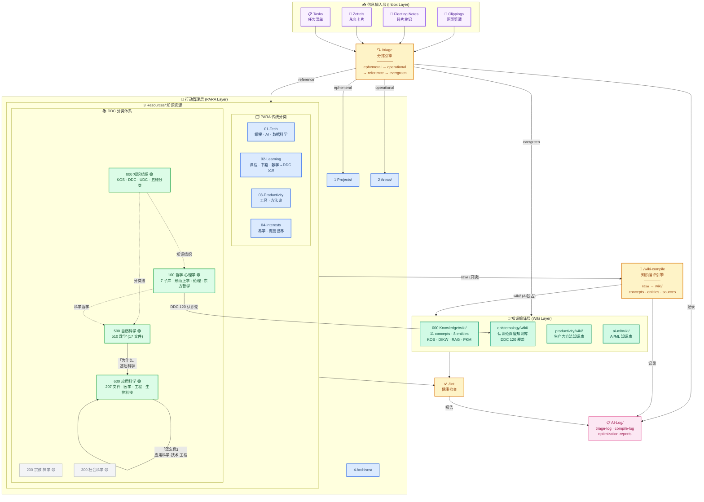

# Knowledge Architecture / 知识架构全景图



---

## 图例

| 颜色 | 含义 |
|------|------|
| 🟣 紫色边框 | Inbox 输入层 — 待分拣的原始信息 |
| 🟡 橙色 | Skills 操作引擎 — /triage /wiki-compile /lint |
| 🔵 蓝色 | PARA 行动管理层 — Projects / Areas / Resources / Archives |
| 🟢 绿色 | Wiki 知识编译层 — AI 生产的知识页面 |
| 🟢 深绿实心 | DDC 已建设子库 |
| 🟡 黄色 | DDC 待建设子库 |
| ⬜ 灰色 | DDC 空壳（仅 stub） |

---

## 三层架构

```
┌─────────────────────────────────────────────────────────────┐
│                    信息输入层 (Inbox)                        │
│   Clippings · Fleeting Notes · Zettels · Tasks              │
│   0 Inbox/  ← 唯一的信息入口                                │
└────────────────────────┬────────────────────────────────────┘
                         │ /triage (分拣引擎)
                         ↓
┌─────────────────────────────────────────────────────────────┐
│                    行动管理层 (PARA)                         │
│                                                             │
│  1 Projects/  →  2 Areas/  →  3 Resources/  →  4 Archives/ │
│    (有截止日)      (持续责任)     (知识资源)       (归档)     │
│                                                             │
│   3 Resources/ 内部采用 DDC 分类：                           │
│   ┌──────────┬──────────┬──────────┬──────────┬──────────┐  │
│   │ 000 知识  │ 100 哲心 │ 500 自然 │ 600 应用 │ 更多...  │  │
│   │   🟢     │   🟢     │   🟢     │   🟢     │          │  │
│   └──────────┴──────────┴──────────┴──────────┴──────────┘  │
│                                                             │
│   raw/ 目录 ← 人类独占写入，AI 只读                          │
└────────────────────────┬────────────────────────────────────┘
                         │ /wiki-compile (知识编译引擎)
                         ↓
┌─────────────────────────────────────────────────────────────┐
│                    知识编译层 (Wiki)                         │
│                                                             │
│  wiki/  目录 ← AI 独占写入，人类只读                         │
│                                                             │
│  ┌──────────────┬──────────────┬──────────────────────┐     │
│  │  concepts/   │  entities/   │  sources/            │     │
│  │  概念页面     │  实体页面     │  来源溯源            │     │
│  │  KOS · DIKW  │  DDC · UDC   │  关联原始资料         │     │
│  │  RAG · PKM   │  Wikidata    │                      │     │
│  └──────────────┴──────────────┴──────────────────────┘     │
│                                                             │
│  outputs/  ← 基于 Wiki 生成的制品（博客、报告...）           │
└─────────────────────────────────────────────────────────────┘
```

---

## DDC 建设进度

```
DDC Class 0 — Knowledge (000)
  000 Knowledge/  🟢🟢🟢🟢🟢🟢🟢🟢  ████████████████████ 82 文件

DDC Class 1 — Philosophy & Psychology (100)
  100 Phil. Psy/  🟢🟢🟢🟢🟢🟢🟢🟡  ████████████████░░░░ 7/8 子库

DDC Class 2 — Religion (200)
  200 Religion/   🟡🟡🟡🟡🟡🟡🟡🟡  ░░░░░░░░░░░░░░░░░░░░ stub

DDC Class 3 — Social Sciences (300)
  300 Social/     🟡🟡🟡🟡🟡🟡🟡🟡  ░░░░░░░░░░░░░░░░░░░░ stub

DDC Class 5 — Natural Sciences (500)
  500 Natural/    🟢🟡🟡🟡🟡🟡🟡🟡  ██░░░░░░░░░░░░░░░░░░ 1/9 子库

DDC Class 6 — Applied Sciences (600)
  06 Applied/     🟢🟢🟢🟢🟢🟢🟢🟢  ████████████████████ 207 文件
```

---

## 核心数据流

```
用户捕获 ──→ Inbox ──→ /triage ──→ 分类路由 ──→ PARA 目录
                                                  │
                                     raw/ (原始资料，人类维护)
                                                  │
                                     /wiki-compile (AI 编译)
                                                  │
                                     wiki/ (结构化知识，AI 维护)
                                                  │
                                     /lint (健康检查)
                                                  │
                                     AI-Log/ (操作日志)
```

---

*分类: 知识架构 · DDC · PARA · LLM-Wiki*
