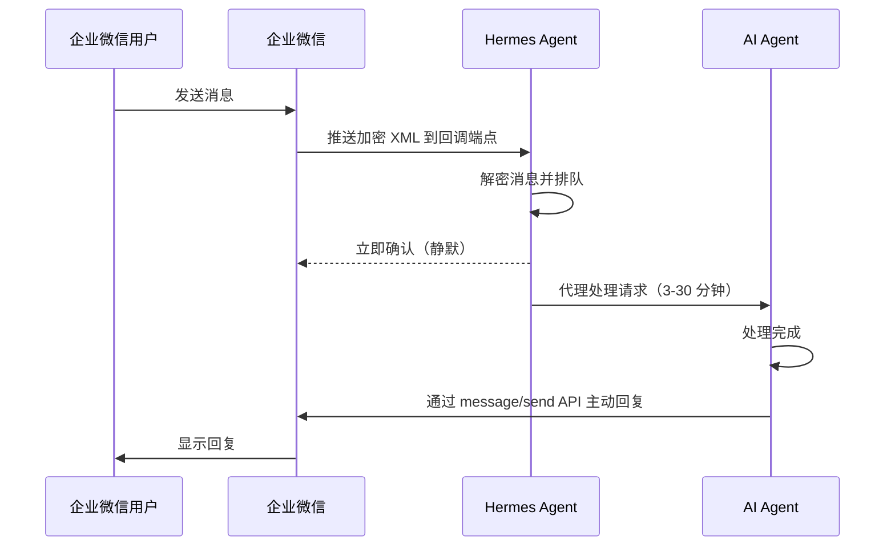

# Hermes Agent - 企业微信回调（自建应用）配置

> [!info] 说明
> 使用回调/Webhook 模式，将 Hermes 作为自建企业应用连接到企业微信（WeCom）。

## 企业微信机器人 vs 企业微信回调

Hermes 支持两种企业微信集成模式：

| 模式 | 连接方式 | 适用场景 | 特点 |
|------|----------|----------|------|
| **企业微信机器人** | WebSocket | 群聊 | 设置简单 |
| **企业微信回调（本页）** | HTTP 回调 XML | 企业侧边栏应用 | 加密通信，支持多主体路由 |

## 工作原理



## 前提条件

- 具有管理员权限的**企业微信企业账号**
- `aiohttp` 和 `httpx` Python 包（包含在默认安装中）
- 一个**公网可访问**的服务器用于回调 URL（或使用 ngrok 等隧道工具）

## 设置步骤

### 1. 在企业微信中创建自建应用

1. 前往 [企业微信管理后台](https://work.weixin.qq.com/wework_admin/) → **应用管理** → **创建应用**
2. 记录你的**企业 ID**（显示在管理后台顶部）
3. 在应用设置中，创建**应用 Secret**
4. 从应用概览页面记录 **AgentId**
5. 在**接收消息**下，配置回调 URL：

| 字段 | 值 |
|------|-----|
| URL | `http://YOUR_PUBLIC_IP:8645/wecom/callback` |
| Token | 生成一个随机 Token |
| EncodingAESKey | 生成一个 43 位密钥 |

### 2. 配置环境变量

添加到 `.env` 文件中：

```env
# 必填
WECOM_CALLBACK_CORP_ID=your-corp-id
WECOM_CALLBACK_CORP_SECRET=your-corp-secret
WECOM_CALLBACK_AGENT_ID=1000002
WECOM_CALLBACK_TOKEN=your-callback-token
WECOM_CALLBACK_ENCODING_AES_KEY=your-43-char-aes-key

# 可选
WECOM_CALLBACK_HOST=0.0.0.0
WECOM_CALLBACK_PORT=8645
WECOM_CALLBACK_ALLOWED_USERS=user1,user2
```

### 3. 启动网关

```bash
hermes gateway start
```

回调适配器会在配置的端口上启动一个 HTTP 服务器。企业微信将通过 GET 请求验证回调 URL，然后开始通过 POST 发送消息。

## 配置参考

在 `config.yaml` 的 `platforms.wecom_callback.extra` 下设置这些项，或使用环境变量：

| 设置项 | 默认值 | 描述 |
|--------|--------|------|
| `corp_id` | — | 企业微信企业 Corp ID（必填） |
| `corp_secret` | — | 自建应用的 Corp Secret（必填） |
| `agent_id` | — | 自建应用的 Agent ID（必填） |
| `token` | — | 回调验证 Token（必填） |
| `encoding_aes_key` | — | 用于回调加密的 43 位 AES 密钥（必填） |
| `host` | `0.0.0.0` | HTTP 回调服务器的绑定地址 |
| `port` | `8645` | HTTP 回调服务器的端口 |
| `path` | `/wecom/callback` | 回调端点的 URL 路径 |

## 多应用路由

对于运行多个自建应用的企业（例如跨不同部门或子公司），在 `config.yaml` 中配置 `apps` 列表：

```yaml
platforms:
  wecom_callback:
    enabled: true
    extra:
      host: "0.0.0.0"
      port: 8645
      apps:
        - name: "dept-a"
          corp_id: "ww_corp_a"
          corp_secret: "secret-a"
          agent_id: "1000002"
          token: "token-a"
          encoding_aes_key: "key-a-43-chars..."
        - name: "dept-b"
          corp_id: "ww_corp_b"
          corp_secret: "secret-b"
          agent_id: "1000003"
          token: "token-b"
          encoding_aes_key: "key-b-43-chars..."
```

用户通过 `corp_id:user_id` 进行范围限定，以防止跨主体冲突。当用户发送消息时，适配器会记录其所属的应用（主体），并通过正确应用的访问令牌路由回复。

## 访问控制

限制可以与应用交互的用户：

```yaml
# Allowlist specific users
WECOM_CALLBACK_ALLOWED_USERS=user1,user2
```

## 相关资源

- [Hermes Agent 文档](https://hermesagent.org.cn/docs/)
- [企业微信机器人模式](https://hermesagent.org.cn/docs/user-guide/messaging/wecom)
- [Hermes Agent GitHub](https://github.com/NousResearch/hermes-agent)

---
> 📚 相关: [[../../AI-ML/README|AI-ML 知识库]] | [[../00-MOCs/MOC-總覽|LLM-Tech 知识库]]
