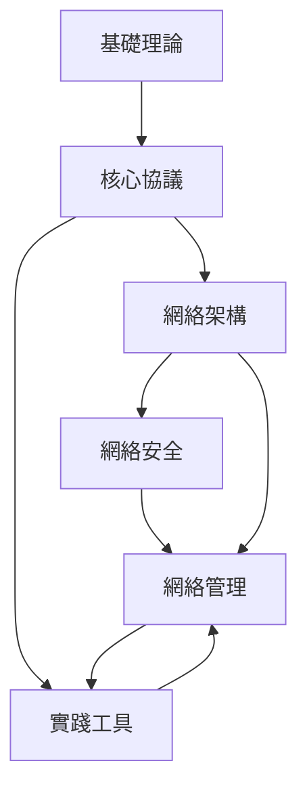

# 網絡技術知識庫

> [!info] 知識庫概述
> 本知識庫涵蓋網絡技術的完整知識體系，從基礎理論到進階實戰，系統化地組織網絡相關知識。

---

## 🎯 知識體系架構

```
┌─────────────────────────────────────────────────────────────┐
│                                                       │
│  ┌──────────────┐    ┌──────────────┐    ┌──────────────┐    │
│  │  基礎理論層   │───→│  協議技術層   │───→│  架構設計層   │    │
│  │ ───────────  │    │ ───────────  │    │ ───────────  │    │
│  │ • OSI模型    │    │ • HTTP/HTTPS │    │ • LAN/WAN   │    │
│  │ • TCP/IP    │    │ • TCP/UDP    │    │ • 無線網路   │    │
│  │ • 網路拓撲   │    │ • IP/ARP     │    │ • 雲端計算網路 │    │
│  └──────────────┘    └──────────────┘    └──────────────┘    │
│         ↓                  ↓                  ↓              │
│  ┌─────────────────────────────────────────────────────┐     │
│  │              應用程式與實踐層                        │     │
│  │ ───────────────────────────────────────────────   │     │
│  └─────────────────────────────────────────────────────┘     │
│                                                       │
└─────────────────────────────────────────────────────────────┘
```

---

## 📚 模块詳解

### 01-基礎知識模块

```
📖 基礎知識
├── [[OSI七層模型]]
│   ├── 應用程式層
│   ├── 表示層
│   ├── 會話層
│   ├── 傳輸層
│   ├── 網路層
│   ├── 數據鏈路層
│   └── 物理層
│
├── [[TCP IP協議棧]]
│   ├── 應用程式層
│   ├── 傳輸層 (TCP/UDP)
│   ├── 網路層 (IP)
│   └── 網路接口層
│
├── [[網路拓撲結構]]
│   ├── 總線型
│   ├── 星型
│   ├── 環型
│   ├── 網狀型
│   └── 混合型
│
└── [[IP地址與子網劃分]]
    ├── IPv4地址
    ├── IPv6地址
    ├── 子網掩碼
    ├── CIDR
    └── 路由與轉發
```

---

### 02-核心協議模块

```
🔌 核心協議
├── [[應用程式層協議]]
│   ├── HTTP/HTTPS - Web協議
│   ├── FTP - 檔案傳輸
│   ├── SMTP/POP3/IMAP - 電子郵件
│   ├── DNS - 網域名稱解析
│   ├── DHCP - 動態IP分配
│   ├── SSH - 安全遠程登入
│   └── Telnet - 不安全遠程登入
│
├── [[傳輸層協議]]
│   ├── TCP - 可靠傳輸
│   │   ├── 三次握手
│   │   ├── 流量控制
│   │   ├── 擁塞控制
│   │   └── 可靠性保證
│   └── UDP - 不可靠但快速
│       ├── UDP特點
│       ├── UDP頭部格式
│       └── UDP適用場景
│
├── [[網路層協議]]
│   ├── IP - 網際協議 (IPv4/IPv6)
│   ├── ICMP - 網路控制訊息
│   ├── ARP - 地址解析
│   ├── RARP - 反向地址解析
│   └── 路由協議 (RIP, OSPF, BGP)
│
└── [[數據鏈路層協議]]
    ├── Ethernet - 以太網
    ├── MAC地址
    ├── VLAN - 虛擬局域網
    ├── STP - 生成樹協議
    └── 交換機技術
```

---

### 03-網絡架構模块

```
🌐 網絡架構
├── [[局域網(LAN)]]
│   ├── 以太網標準
│   ├── VLAN設計
│   ├── STP生成樹協議
│   └── 冗餘設計 (VRRP)
│
├── [[廣域網(WAN)]]
│   ├── 專線網路
│   ├── MPLS技術
│   ├── VPN技術基礎
│   └── 負載均衡
│
├── [[無線網絡(Wi-Fi)]]
│   ├── 802.11標準 (a/b/g/n/ac/ax/be)
│   ├── 安全協議 (WEP/WPA/WPA2/WPA3)
│   ├── 無線控制器 (AC/AP)
│   └── 漫遊設計
│
├── [[雲端計算網絡]]
│   ├── 虛擬私有雲端 (VPC)
│   ├── 容器網絡 (Docker/K8s)
│   ├── 軟體定義網絡 (SDN) 基礎
│   └── 服務網格 (Service Mesh)
│
└── [[SDN軟體定義網絡]]
    ├── 控制平面
    ├── 數據平面
    ├── OpenFlow協議
    └── NFV網絡功能虛擬化
```

---

### 04-網絡安全模块

```
🔒 網絡安全
├── [[網絡安全基礎]]
│   ├── 安全框架 (CIA三元組)
│   ├── 威脅模型
│   └── 安全策略
│
├── [[加密與認證]]
│   ├── 對稱加密 (AES)
│   ├── 非對稱加密 (RSA/ECC)
│   ├── 哈希算法 (SHA/MD5)
│   ├── 數字簽名
│   ├── PKI/證書體系
│   └── TLS/SSL
│
├── [[防火牆技術]]
│   ├── 包過濾防火牆
│   ├── 狀態檢測防火牆
│   ├── 應用程式層防火牆
│   ├── Web應用程式防火牆 (WAF)
│   └── 防火牆規則設計
│
├── [[VPN虛擬專用網絡]]
│   ├── IPSec VPN
│   ├── SSL VPN
│   ├── WireGuard
│   └── Zero Trust架構
│
└── [[常見網絡攻擊與防禦]]
    ├── DDoS攻擊
    ├── 中間人攻擊
    ├── ARP欺騙
    ├── DNS劫持
    ├── 端口掃描
    └── 社會工程學
```

---

### 05-網絡管理模块

```
📊 網絡管理
├── [[網絡監控]]
│   ├── SNMP協議
│   ├── 監控工具 (Nagios, Zabbix, Prometheus)
│   └── 效能指標
│
├── [[故障排查]]
│   ├── 分層排查法
│   ├── 常見故障案例
│   ├── 排查工具使用
│   └── 應急響應
│
├── [[網絡效能優化]]
│   ├── QoS服務品質
│   ├── 負載均衡
│   ├── CDN加速
│   └── 優化策略
│
└── [[自動化運維]]
    ├── Ansible
    ├── Python網絡編程
    └── CI/CD整合
```

---

### 06-實踐工具模块

```
🛠️ 實踐工具
├── [[網絡診斷工具]]
│   ├── ping - 連通性測試
│   ├── traceroute - 路由追蹤
│   ├── netstat - 端口狀態
│   ├── nslookup - DNS查詢
│   ├── dig - DNS詳細查詢
│   ├── nmap - 端口掃描
│   └── route - 路由表
│
└── [[封包分析工具]]
    ├── Wireshark - 圖形界面抓包
    ├── tcpdump - 命令行抓包
    └── tshark - Wireshark CLI
```

---

### 07-模板模块

```
📝 模板
├── [[協議學習模板]]
│   └── 用於記錄網絡協議的學習筆記
│
└── [[問題排查模板]]
    └── 用於記錄網絡問題的排查過程
```

---

### 08-筆記模块

```
📓 筆記
├── [[README]]
│   └── 筆記目錄說明
│
├── [[學習心得]]
│   └── 學習進度追蹤和重點知識總結
│
├── [[實踐案例]]
│   └── 實踐專案記錄
│
└── [[問題記錄]]
    └── 未解決的問題和疑問
```

---

## 🔗 模块關聯圖



---

## 📋 學習檢查清單

### 入門階段
- [ ] 理解 OSI 七層模型和 TCP/IP 四層模型
- [ ] 掌握 IP 地址和子網劃分
- [ ] 了解常用的應用程式層協議 (HTTP, DNS, DHCP)
- [ ] 會使用 ping, traceroute, netstat 等基礎工具

### 進階階段
- [ ] 深入理解 TCP 的可靠傳輸機制
- [ ] 掌握路由協議原理 (OSPF, BGP)
- [ ] 了解 VLAN 和 STP 協議
- [ ] 理解無線網絡標準和安全協議

### 高級階段
- [ ] 理解 VPN 和防火牆技術
- [ ] 熟悉 SDN 和雲端計算網絡
- [ ] 具備網絡故障排查和優化能力
- [ ] 掌握網絡監控和自動化運維

---

## 🎯 快速導航

- 🔙 [[README|返回知識庫首頁]]
- 📝 [[08-筆記|學習筆記]]
- 📖 [[MOC-學習路徑|學習路徑]]
- 🛠️ [[06-實踐工具|實踐工具]]

---

> [!tip] 使用說明
> - 使用 `Ctrl/Cmd + K` 快捷連結搜尋
> - 建議按 [[MOC-學習路徑]] 順序閱讀
> - 每個模塊都有對應的實踐建議
> - 使用 [[協議學習模板]] 記錄學習筆記
> - 使用 [[問題排查模板]] 記錄故障排查過程

---

**文檔資訊**
- 創建時間：2026-01-21
- 最後更新：2026-02-15
- 文檔類型：MOC (Map of Content)
