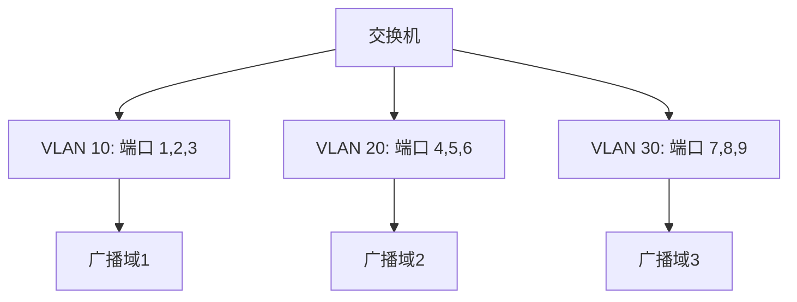
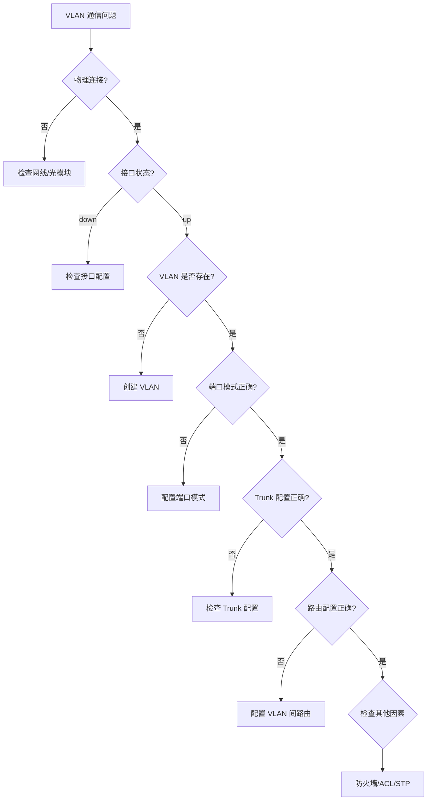

# VLAN 虚拟局域网

## 📋 基本概念

### 定义
**VLAN（Virtual Local Area Network）** 是一种将物理网络设备逻辑上划分为多个独立广播域的技术。它允许在同一个物理交换机上创建多个虚拟网络。

### 核心特点
- ✅ **逻辑隔离**：不依赖物理位置划分网络
- ✅ **广播域隔离**：不同 VLAN 间广播不互通
- ✅ **安全性提升**：限制访问范围，降低攻击面
- ✅ **灵活管理**：动态调整网络结构无需重新布线
- ✅ **降低成本**：减少物理交换机和布线需求

## 🏗️ VLAN 类型

### 1. 基于 Port 的 VLAN（Port-based VLAN）
**最常见的 VLAN 实现**



**特点**：
- 每个 VLAN 对应一组交换机端口
- 设备移动需要重新配置端口
- 管理简单，配置直观

### 2. 基于 MAC 地址的 VLAN（MAC-based VLAN）
- 根据 MAC 地址划分 VLAN
- 设备移动无需重新配置
- 需要维护 MAC 地址表

### 3. 基于协议的 VLAN（Protocol-based VLAN）
- 根据 3 层协议（IP、IPX 等）划分
- 适合多协议环境

### 4. 基于子网的 VLAN（Subnet-based VLAN）
- 根据 IP 子网划分
- 与网络层紧密集成

## 🔧 VLAN 配置

### VLAN ID 范围
| 范围 | 用途 | 说明 |
|------|------|------|
| 0 | 保留 | 不可使用 |
| 1 | 默认 | 所有端口默认在 VLAN 1 |
| 2-1001 | 正常 VLAN | 可分配使用 |
| 1002-1005 | Cisco 预留 | Token Ring、FDDI |
| 1006-4094 | 扩展 VLAN | IEEE 802.1Q 支持 |

### 端口类型

#### Access 端口（接入端口）
- 连接终端设备（PC、打印机等）
- 只属于一个 VLAN
- 发送不带标签的数据帧

```
[PC] --[Access Port]-- [Switch: VLAN 10]
```

#### Trunk 端口（干道端口）
- 连接交换机之间或交换机与路由器
- 承载多个 VLAN 的流量
- 使用 802.1Q 标签标识 VLAN

```
[Switch1] --[Trunk Port]-- [Switch2]
(VLAN 10,20,30)     (VLAN 10,20,30)
```

## 🏷️ 802.1Q 标签

### 数据帧结构

```
原始帧：
| 目的MAC | 源MAC | 类型 | 数据 | FCS |

带802.1Q标签帧：
| 目的MAC | 源MAC | 0x8100 | Tag | 类型 | 数据 | FCS |
                          ↓
            | 3位优先级 | 1位CFI | 12位VLAN ID |
```

### 字段说明
- **TPID (Tag Protocol Identifier)**: 0x8100，表示 802.1Q 标签
- **Priority (3 bits)**: 802.1p 优先级，0-7 级
- **CFI (Canonical Format Indicator)**: 标准格式指示位
- **VLAN ID (12 bits)**: 标识 VLAN，范围 0-4095

## 🌐 VLAN 间路由

### 方式 1: 物理接口（每个 VLAN 一个接口）
```
[VLAN 10] --[Switch]-- [Router: Gi0/0]
[VLAN 20] --[Switch]-- [Router: Gi0/1]
[VLAN 30] --[Switch]-- [Router: Gi0/2]
```

**优点**：配置简单
**缺点**：资源浪费，不灵活

### 方式 2: 单臂路由（Router-on-a-Stick）
```
[VLAN 10,20,30] --[Switch: Trunk]-- [Router: Subinterfaces]
                           ↓
                    Router(config)# interface gi0/0.10
                    Router(config-subif)# encapsulation dot1q 10
```

**优点**：节省路由器接口
**缺点**：可能成为瓶颈

### 方式 3: 三层交换机（Layer 3 Switch）
```
[Switch] --[VLAN 10]-- [Layer 3 模块]
         --[VLAN 20]-- [路由功能]
         --[VLAN 30]-- [SVI 接口]
```

**优点**：性能高，线速转发
**缺点**：成本较高

## 📝 配置示例

### Cisco 配置

```bash
# 创建 VLAN
Switch(config)# vlan 10
Switch(config-vlan)# name SALES
Switch(config-vlan)# exit

Switch(config)# vlan 20
Switch(config-vlan)# name MARKETING
Switch(config-vlan)# exit

# 配置 Access 端口
Switch(config)# interface fastEthernet 0/1
Switch(config-if)# switchport mode access
Switch(config-if)# switchport access vlan 10
Switch(config-if)# exit

# 配置 Trunk 端口
Switch(config)# interface gi0/1
Switch(config-if)# switchport trunk encapsulation dot1q
Switch(config-if)# switchport mode trunk
Switch(config-if)# switchport trunk allowed vlan 10,20,30
Switch(config-if)# exit

# 配置 SVI（VLAN 接口）
Switch(config)# interface vlan 10
Switch(config-if)# ip address 192.168.10.1 255.255.255.0
Switch(config-if)# no shutdown
Switch(config-if)# exit
```

## ⚠️ 常见问题

### 1. VLAN 1 的安全性
> [!warning] 安全风险
> 默认所有端口在 VLAN 1，建议：
> - 关闭不使用的 VLAN 1 接口
> - 将管理 VLAN 与用户 VLAN 分离
> - 删除所有 VLAN 1 上的配置

### 2. 本地 VLAN（Native VLAN）
- Trunk 端口上的未标记帧属于 Native VLAN
- 默认为 VLAN 1
- 两端 Native VLAN 必须一致，否则会产生 VLAN 跳转攻击风险

### 3. VLAN 跳转攻击（VLAN Hopping）
- 利用 Native VLAN 不匹配进行攻击
- **防护措施**：
  - 两端 Trunk 的 Native VLAN 一致
  - 关闭所有未使用的 VLAN
  - 使用 `switchport trunk allowed vlan` 限制允许的 VLAN

### 4. 广播风暴
- 某个 VLAN 的广播不影响其他 VLAN
- 但同一 VLAN 内仍需注意 STP（生成树协议）

## 🔍 故障排查

### 常用命令

```bash
# 查看 VLAN 信息
show vlan brief
show vlan id 10

# 查看接口状态
show interface status
show interface switchport

# 查看 Trunk 信息
show interfaces trunk

# 查看 MAC 地址表
show mac address-table
show mac address-table vlan 10

# 调试 VLAN
debug spanning-tree vlan 10
debug interface vlan 10
```

### 排查流程



## 📊 VLAN 最佳实践

### 设计原则
1. **功能划分**：按部门或功能划分 VLAN
2. **最小权限**：VLAN 间访问最小化
3. **命名规范**：使用有意义的 VLAN 名称
4. **文档管理**：维护 VLAN 分配文档

### 安全建议
- 将管理 VLAN（SSH/SNMP）与用户 VLAN 隔离
- 使用私有 VLAN（PVLAN）进一步隔离
- 实施 VLAN ACL（VACL）控制流量
- 定期审计 VLAN 配置

### 性能优化
- 合理规划 VLAN 数量（不宜过多）
- 使用三层交换机进行 VLAN 间路由
- 合理配置 STP 优先级

## 🔄 扩展技术

### Private VLAN（私有 VLAN）
- 在同一个 VLAN 内进一步隔离
- **Isolated Port**：只能与 Community 或 Promiscuous 端口通信
- **Community Port**：同一 Community 内可互相通信
- **Promiscuous Port**：可与所有端口通信

### VLAN Trunking Protocol（VTP）
- Cisco 私有协议，同步 VLAN 信息
- Server/Client/Transparent 模式
- 可简化大型网络管理

### Dynamic VLAN Assignment
- 基于 802.1X 认证动态分配 VLAN
- 与 RADIUS 服务器集成
- 提高灵活性

## 📚 相关概念

- [[OSI七層模型]] - 数据链路层
- [[TCP IP协议棧]] - 网络层协议
- [[局域網(LAN)]] - 局域网基础
- [[交换机技术]] - 二层交换原理
- [[路由技术]] - 三层路由原理

## 📖 参考资料

- IEEE 802.1Q 标准
- Cisco VLAN 配置指南
- 网络工程实践指南

---

> [!summary] 关键要点
> - VLAN 在物理网络上创建逻辑隔离的广播域
> - Access 端口连接终端，Trunk 端口连接交换机
> - 802.1Q 标签用于标识 VLAN，支持 4096 个 VLAN
> - VLAN 间路由需要三层设备（路由器或三层交换机）
> - 安全性考虑：分离管理 VLAN，防止 VLAN 跳转攻击

---

# 更新日志
- **2026-02-14**: 创建 VLAN 笔记
