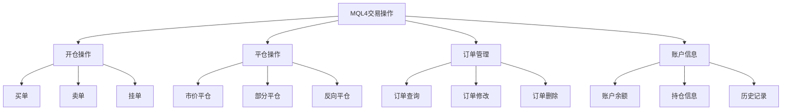

# MQL4交易操作基础

> 🎯 **学习目标**：掌握MQL4的交易操作，包括开仓、平仓、订单管理，能够编写基本的交易EA。

## 📚 交易操作概述

### 交易操作类型


## 💰 订单类型

### 订单类型详解

#### 市价单
```mql4
// 市价买入单 (OP_BUY)
OrderSend(
   Symbol(),      // 交易品种
   OP_BUY,       // 订单类型：买入
   0.1,          // 手数
   Ask,          // 价格：卖价
   3,            // 滑点
   0,            // 止损
   0,            // 止盈
   "Buy Order",  // 注释
   123456,       // 魔术数字
   0,            // 到期时间
   clrNONE       // 箭头颜色
);

// 市价卖出单 (OP_SELL)
OrderSend(
   Symbol(),
   OP_SELL,      // 订单类型：卖出
   0.1,
   Bid,          // 价格：买价
   3,
   0,
   0,
   "Sell Order",
   123456,
   0,
   clrNONE
);
```

#### 挂单类型
```mql4
// 买单止损 (OP_BUYSTOP)
// 在当前价格上方挂单
double buyStopPrice = Ask + 100 * Point;
OrderSend(
   Symbol(),
   OP_BUYSTOP,   // 买单止损
   0.1,
   buyStopPrice,
   3,
   0,
   0,
   "Buy Stop",
   123456,
   0,
   clrNONE
);

// 买单限价 (OP_BUYLIMIT)
// 在当前价格下方挂单
double buyLimitPrice = Ask - 100 * Point;
OrderSend(
   Symbol(),
   OP_BUYLIMIT,  // 买单限价
   0.1,
   buyLimitPrice,
   3,
   0,
   0,
   "Buy Limit",
   123456,
   0,
   clrNONE
);

// 卖单止损 (OP_SELLSTOP)
double sellStopPrice = Bid - 100 * Point;
OrderSend(
   Symbol(),
   OP_SELLSTOP,  // 卖单止损
   0.1,
   sellStopPrice,
   3,
   0,
   0,
   "Sell Stop",
   123456,
   0,
   clrNONE
);

// 卖单限价 (OP_SELLLIMIT)
double sellLimitPrice = Bid + 100 * Point;
OrderSend(
   Symbol(),
   OP_SELLLIMIT, // 卖单限价
   0.1,
   sellLimitPrice,
   3,
   0,
   0,
   "Sell Limit",
   123456,
   0,
   clrNONE
);
```

## 🔍 订单查询

### 遍历订单

#### 查询当前持仓
```mql4
// 遍历所有持仓订单
for(int i = 0; i < OrdersTotal(); i++)
  {
   if(OrderSelect(i, SELECT_BY_POS, MODE_TRADES))
     {
      int ticket = OrderTicket();
      string symbol = OrderSymbol();
      int type = OrderType();
      double lots = OrderLots();
      double openPrice = OrderOpenPrice();
      double profit = OrderProfit();
      
      string typeStr = (type == OP_BUY) ? "买入" : "卖出";
      
      Print("订单 ", ticket, ": ", typeStr, " ", symbol, 
            " 手数: ", lots, " 开仓价: ", openPrice, 
            " 利润: ", profit);
     }
  }

// 查询特定货币对的订单
string targetSymbol = "EURUSD";
for(int i = 0; i < OrdersTotal(); i++)
  {
   if(OrderSelect(i, SELECT_BY_POS, MODE_TRADES))
     {
      if(OrderSymbol() == targetSymbol)
        {
         Print("找到 ", targetSymbol, " 的订单: ", OrderTicket());
        }
     }
  }
```

#### 按订单号查询
```mql4
// 通过订单号查询订单
int ticketNumber = 12345;

if(OrderSelect(ticketNumber, SELECT_BY_TICKET))
  {
   Print("订单查询成功:");
   Print("订单号: ", OrderTicket());
   Print("品种: ", OrderSymbol());
   Print("类型: ", OrderType());
   Print("手数: ", OrderLots());
   Print("开仓价: ", OrderOpenPrice());
   Print("止损: ", OrderStopLoss());
   Print("止盈: ", OrderTakeProfit());
  }
else
  {
   Print("订单查询失败: ", ticketNumber);
  }
```

### 订单信息获取

#### 获取订单详细信息
```mql4
// 获取订单信息的函数
void PrintOrderInfo(int ticket)
  {
   if(!OrderSelect(ticket, SELECT_BY_TICKET))
     {
      Print("无法选择订单: ", ticket);
      return;
     }
   
   // 基本信息
   Print("=== 订单信息 ===");
   Print("订单号: ", OrderTicket());
   Print("交易品种: ", OrderSymbol());
   Print("订单类型: ", OrderType());
   Print("手数: ", OrderLots());
   
   // 价格信息
   Print("开仓价: ", OrderOpenPrice());
   Print("当前价: ", OrderClosePrice());
   Print("止损价: ", OrderStopLoss());
   Print("止盈价: ", OrderTakeProfit());
   
   // 盈亏信息
   Print("浮动盈亏: ", OrderProfit());
   Print="货币: ", OrderSwap());
   Print="佣金: ", OrderCommission());
   
   // 时间信息
   Print("开仓时间: ", TimeToString(OrderOpenTime()));
   Print("过期时间: ", TimeToString(OrderExpiration()));
   
   // 其他信息
   Print("注释: ", OrderComment());
   Print("魔术数字: ", OrderMagicNumber());
  }
```

## 🚀 开仓操作

### 基本开仓函数

#### 安全开仓函数
```mql4
// 安全的市价开仓函数
bool OpenPosition(int type, double lots, double sl = 0, double tp = 0, 
                 string comment = "", int magic = 0)
  {
   // 检查参数有效性
   if(lots <= 0)
     {
      Print("错误: 手数必须大于0");
      return false;
     }
   
   // 获取价格
   double price;
   color arrowColor;
   
   if(type == OP_BUY)
     {
      price = Ask;
      arrowColor = clrBlue;
     }
   else if(type == OP_SELL)
     {
      price = Bid;
      arrowColor = clrRed;
     }
   else
     {
      Print("错误: 不支持的订单类型");
      return false;
     }
   
   // 发送订单
   int ticket = OrderSend(
      Symbol(),      // 交易品种
      type,          // 订单类型
      lots,          // 手数
      price,         // 价格
      3,             // 滑点
      sl,            // 止损
      tp,            // 止盈
      comment,       // 注释
      magic,         // 魔术数字
      0,             // 过期时间
      arrowColor     // 箭头颜色
   );
   
   // 检查订单结果
   if(ticket > 0)
     {
      Print("订单成功: ", ticket);
      return true;
     }
   else
     {
      int error = GetLastError();
      Print("订单失败: ", error, " - ", ErrorDescription(error));
      return false;
     }
  }

// 使用示例
void OnTick()
  {
   // 开仓买入
   bool success = OpenPosition(OP_BUY, 0.1, Ask - 50*Point, Ask + 100*Point, "Buy Order", 123456);
   
   if(success)
     {
      Print("买入订单成功");
     }
  }
```

#### 开仓条件检查
```mql4
// 检查是否可以开仓
bool CanOpenPosition(string symbol, int maxPositions = 1)
  {
   // 检查市场是否开放
   if(!MarketInfo(symbol, MODE_TRADEALLOWED))
     {
      Print("市场未开放");
      return false;
     }
   
   // 检查账户资金
   double balance = AccountBalance();
   if(balance <= 0)
     {
      Print("账户余额不足");
      return false;
     }
   
   // 检查持仓数量
   int positionCount = 0;
   for(int i = 0; i < OrdersTotal(); i++)
     {
      if(OrderSelect(i, SELECT_BY_POS, MODE_TRADES))
        {
         if(OrderSymbol() == symbol)
           {
            positionCount++;
           }
        }
     }
   
   if(positionCount >= maxPositions)
     {
      Print("已达到最大持仓数: ", maxPositions);
      return false;
     }
   
   return true;
  }

// 条件开仓
void ConditionalOpen()
  {
   // 检查开仓条件
   if(CanOpenPosition(Symbol()))
     {
      // 检查交易信号
      if(IsBuySignal())
        {
         OpenPosition(OP_BUY, 0.1);
        }
     }
  }
```

## 🔄 平仓操作

### 基本平仓函数

#### 市价平仓
```mql4
// 平仓函数
bool ClosePosition(int ticket, double lots = 0)
  {
   // 选择订单
   if(!OrderSelect(ticket, SELECT_BY_TICKET))
     {
      Print("无法选择订单: ", ticket);
      return false;
     }
   
   // 检查订单类型
   int orderType = OrderType();
   if(orderType == OP_BUY || orderType == OP_SELL)
     {
      // 获取平仓数量
      if(lots == 0 || lots > OrderLots())
         lots = OrderLots();
      
      // 获取价格
      double price;
      color arrowColor;
      
      if(orderType == OP_BUY)
        {
         price = Bid;
         arrowColor = clrRed;
        }
      else
        {
         price = Ask;
         arrowColor = clrBlue;
        }
      
      // 执行平仓
      bool result = OrderClose(ticket, lots, price, 3, arrowColor);
      
      if(result)
        {
         Print("平仓成功: ", ticket);
         return true;
        }
      else
        {
         int error = GetLastError();
         Print("平仓失败: ", error, " - ", ErrorDescription(error));
         return false;
        }
     }
   else
     {
      Print("无法平仓挂单");
      return false;
     }
  }

// 使用示例
void CloseProfitablePositions()
  {
   // 遍历所有持仓
   for(int i = OrdersTotal() - 1; i >= 0; i--)
     {
      if(OrderSelect(i, SELECT_BY_POS, MODE_TRADES))
        {
         // 关闭盈利持仓
         if(OrderProfit() > 0)
           {
            int ticket = OrderTicket();
            ClosePosition(ticket);
           }
        }
     }
  }
```

#### 平仓所有持仓
```mql4
// 平仓所有指定货币对的持仓
bool CloseAllPositions(string symbol = "")
  {
   int closedCount = 0;
   int errorCount = 0;
   
   // 从后向前遍历，避免索引问题
   for(int i = OrdersTotal() - 1; i >= 0; i--)
     {
      if(OrderSelect(i, SELECT_BY_POS, MODE_TRADES))
        {
         // 检查货币对
         if(symbol != "" && OrderSymbol() != symbol)
            continue;
         
         int ticket = OrderTicket();
         if(ClosePosition(ticket))
           {
            closedCount++;
           }
         else
           {
            errorCount++;
           }
        }
     }
   
   Print("平仓完成 - 成功: ", closedCount, " 失败: ", errorCount);
   return (errorCount == 0);
  }

// 紧急平仓函数（用于风险控制）
void EmergencyCloseAll()
  {
   Print("紧急平仓所有持仓！");
   CloseAllPositions();
   
   // 同时删除所有挂单
   for(int i = OrdersTotal() - 1; i >= 0; i--)
     {
      if(OrderSelect(i, SELECT_BY_POS, MODE_TRADES))
        {
         int type = OrderType();
         if(type == OP_BUYSTOP || type == OP_BUYLIMIT || 
            type == OP_SELLSTOP || type == OP_SELLLIMIT)
           {
            OrderDelete(OrderTicket());
           }
        }
     }
  }
```

## 📋 订单修改

### 修改止损止盈

#### 修改订单参数
```mql4
// 修改止损止盈
bool ModifyPosition(int ticket, double sl = 0, double tp = 0)
  {
   // 选择订单
   if(!OrderSelect(ticket, SELECT_BY_TICKET))
     {
      Print("无法选择订单: ", ticket);
      return false;
     }
   
   // 获取当前参数
   double currentSL = OrderStopLoss();
   double currentTP = OrderTakeProfit();
   
   // 使用新值或保持原值
   if(sl == 0) sl = currentSL;
   if(tp == 0) tp = currentTP;
   
   // 执行修改
   bool result = OrderModify(
      ticket,           // 订单号
      OrderOpenPrice(), // 开仓价
      sl,              // 新止损
      tp,              // 新止盈
      OrderExpiration(),// 过期时间
      clrNONE          // 箭头颜色
   );
   
   if(result)
     {
      Print("订单修改成功: ", ticket);
      return true;
     }
   else
     {
      int error = GetLastError();
      Print("订单修改失败: ", error, " - ", ErrorDescription(error));
      return false;
     }
  }

// 使用示例：移动止损
void TrailingStop(int ticket, int trailingPoints = 50)
  {
   if(!OrderSelect(ticket, SELECT_BY_TICKET))
      return;
   
   // 只处理买入订单
   if(OrderType() != OP_BUY)
      return;
   
   double openPrice = OrderOpenPrice();
   double currentSL = OrderStopLoss();
   double currentTP = OrderTakeProfit();
   
   // 计算新的止损价
   double newSL = Bid - trailingPoints * Point;
   
   // 只有当价格有利时才调整止损
   if(newSL > currentSL || currentSL == 0)
     {
      // 确保新的止损不会造成亏损
      if(newSL > openPrice)
        {
         ModifyPosition(ticket, newSL, currentTP);
        }
     }
  }
```

## 💳 账户信息

### 账户查询函数

#### 基本账户信息
```mql4
// 获取账户信息
void PrintAccountInfo()
  {
   Print("=== 账户信息 ===");
   Print("账户号: ", AccountNumber());
   Print("货币: ", AccountCurrency());
   Print("公司: ", AccountCompany());
   Print("服务器: ", AccountServer());
   
   Print("=== 资金信息 ===");
   Print("余额: ", AccountBalance());
   Print("净值: ", AccountEquity());
   Print("保证金: ", AccountMargin());
   Print("可用保证金: ", AccountFreeMargin());
   Print("利润: ", AccountProfit());
   
   Print("=== 交易信息 ===");
   Print("持仓数量: ", OrdersTotal());
   Print("历史订单数: ", OrdersHistoryTotal());
  }

// 使用示例
void OnTick()
  {
   // 每小时输出一次账户信息
   static datetime lastUpdateTime = 0;
   datetime currentTime = TimeCurrent();
   
   if(currentTime - lastUpdateTime >= 3600)  // 3600秒 = 1小时
     {
      PrintAccountInfo();
      lastUpdateTime = currentTime;
     }
  }
```

#### 计算持仓统计
```mql4
// 计算持仓统计信息
void CalculatePositionStats()
  {
   double totalProfit = 0;
   double totalLoss = 0;
   int buyCount = 0;
   int sellCount = 0;
   double totalLots = 0;
   
   for(int i = 0; i < OrdersTotal(); i++)
     {
      if(OrderSelect(i, SELECT_BY_POS, MODE_TRADES))
        {
         double profit = OrderProfit();
         totalProfit += profit;
         
         if(profit > 0)
            totalLoss += profit;
         else
            totalLoss += profit;  // 负数
         
         if(OrderType() == OP_BUY)
            buyCount++;
         else
            sellCount++;
         
         totalLots += OrderLots();
        }
     }
   
   Print("=== 持仓统计 ===");
   Print("总利润: ", totalProfit);
   Print("总手数: ", totalLots);
   Print("买单数: ", buyCount);
   Print("卖单数: ", sellCount);
   Print("盈亏比: ", (totalLoss != 0) ? totalProfit / totalLoss : 0);
  }
```

## 🎯 实战练习

### 练习1：简单交易EA

#### 任务要求
```mql4
// 创建简单的交易EA
// 功能：
// 1. 检测移动平均线交叉
// 2. 金叉时开多仓
// 3. 死叉时开空仓
// 4. 信号反转时平仓
```

#### 参考代码
```mql4
//+------------------------------------------------------------------+
//|                                          SimpleTradingEA.mq4    |
//+------------------------------------------------------------------+
#property copyright "2026, Practice"
#property version   "1.00"
#property strict

input int FastMAPeriod = 10;     // 快速MA周期
input int SlowMAPeriod = 20;     // 慢速MA周期
input double LotSize = 0.1;      // 交易手数
input int StopLoss = 50;         // 止损点数
input int TakeProfit = 100;      // 止盈点数
input int MagicNumber = 123456;  // 魔术数字

int currentSignal = 0;  // 当前信号：1=买入，-1=卖出，0=无

void OnTick()
  {
   // 计算移动平均线
   double fastMA = iMA(Symbol(), PERIOD_CURRENT, FastMAPeriod, 0, MODE_SMA, PRICE_CLOSE, 0);
   double slowMA = iMA(Symbol(), PERIOD_CURRENT, SlowMAPeriod, 0, MODE_SMA, PRICE_CLOSE, 0);
   double fastMA1 = iMA(Symbol(), PERIOD_CURRENT, FastMAPeriod, 0, MODE_SMA, PRICE_CLOSE, 1);
   double slowMA1 = iMA(Symbol(), PERIOD_CURRENT, SlowMAPeriod, 0, MODE_SMA, PRICE_CLOSE, 1);
   
   // 检测信号
   int newSignal = 0;
   
   if(fastMA > slowMA && fastMA1 <= slowMA1)
     {
      newSignal = 1;  // 金叉：买入信号
     }
   else if(fastMA < slowMA && fastMA1 >= slowMA1)
     {
      newSignal = -1;  // 死叉：卖出信号
     }
   
   // 信号变化时执行交易
   if(newSignal != 0 && newSignal != currentSignal)
     {
      // 关闭现有持仓
      CloseAllPositions();
      
      // 开新仓
      if(newSignal == 1)
        {
         double sl = Ask - StopLoss * Point;
         double tp = Ask + TakeProfit * Point;
         OpenPosition(OP_BUY, LotSize, sl, tp, "MA Cross Buy", MagicNumber);
        }
      else if(newSignal == -1)
        {
         double sl = Bid + StopLoss * Point;
         double tp = Bid - TakeProfit * Point;
         OpenPosition(OP_SELL, LotSize, sl, tp, "MA Cross Sell", MagicNumber);
        }
      
      currentSignal = newSignal;
     }
  }
```

### 练习2：风险管理EA

#### 任务要求
```mql4
// 创建风险管理EA
// 功能：
// 1. 根据账户余额计算手数
// 2. 设置止损和止盈
// 3. 监控持仓风险
// 4. 超过风险限制时平仓
```

#### 参考代码
```mql4
//+------------------------------------------------------------------+
//|                                       RiskManagementEA.mq4    |
//+------------------------------------------------------------------+
#property copyright "2026, Practice"
#property version   "1.00"
#property strict

input double RiskPercent = 1.0;     // 风险百分比
input double MaxDrawdown = 5.0;    // 最大回撤百分比
input int StopLossPoints = 50;       // 止损点数
input int TakeProfitPoints = 100;    // 止盈点数
input int MagicNumber = 123456;      // 魔术数字

double initialBalance = 0;

int OnInit()
  {
   initialBalance = AccountBalance();
   Print("初始余额: ", initialBalance);
   return(INIT_SUCCEEDED);
  }

void OnTick()
  {
   // 检查账户风险
   double currentBalance = AccountBalance();
   double drawdownPercent = ((initialBalance - currentBalance) / initialBalance) * 100;
   
   if(drawdownPercent >= MaxDrawdown)
     {
      Print("超过最大回撤限制: ", drawdownPercent, "%");
      Print("紧急平仓所有持仓！");
      CloseAllPositions();
      return;
     }
   
   // 检查单个持仓的风险
   CheckPositionRisk();
  }

// 检查持仓风险
void CheckPositionRisk()
  {
   for(int i = 0; i < OrdersTotal(); i++)
     {
      if(OrderSelect(i, SELECT_BY_POS, MODE_TRADES))
        {
         double profit = OrderProfit();
         double balance = AccountBalance();
         double riskPercent = (profit / balance) * 100;
         
         // 如果单个持仓损失超过5%
         if(riskPercent < -5.0)
           {
            Print("持仓风险过高: ", OrderTicket(), " 利润: ", profit);
            Print("关闭此持仓");
            ClosePosition(OrderTicket());
           }
        }
     }
  }

// 根据风险计算手数
double CalculateRiskBasedLotSize()
  {
   double balance = AccountBalance();
   double riskAmount = balance * (RiskPercent / 100);
   double tickValue = MarketInfo(Symbol(), MODE_TICKVALUE);
   
   double lotSize = riskAmount / (StopLossPoints * tickValue);
   
   // 规范化手数
   double minLot = MarketInfo(Symbol(), MODE_MINLOT);
   double maxLot = MarketInfo(Symbol(), MODE_MAXLOT);
   double lotStep = MarketInfo(Symbol(), MODE_LOTSTEP);
   
   lotSize = MathFloor(lotSize / lotStep) * lotStep;
   
   if(lotSize < minLot) lotSize = minLot;
   if(lotSize > maxLot) lotSize = maxLot;
   
   return lotSize;
  }
```

## 💡 最佳实践

### 交易操作建议

#### 风险控制
- ✅ **设置止损**：每笔交易都必须有止损
- ✅ **控制仓位**：合理管理资金和手数
- ✅ **检查账户**：开仓前检查账户状态
- ❌ **避免过夜风险**：谨慎持有隔夜单

#### 错误处理
- ✅ **检查返回值**：所有交易操作都要检查结果
- ✅ **处理错误**：正确处理各种错误情况
- ✅ **记录日志**：记录重要的交易事件
- ❌ **忽略异常**：不要忽略交易错误

### 代码质量

#### 函数设计
- ✅ **模块化设计**：将交易操作封装为函数
- ✅ **参数验证**：严格验证函数参数
- ✅ **错误反馈**：提供清晰的错误信息
- ❌ **硬编码**：避免在代码中硬编码值

## 🔗 相关资源

- [[MQL4函数与控制流]] - 函数和控制流
- [[Expert Advisor基础]] - EA开发
- [[风险管理模块]] - 风险管理
- [[调试与错误处理]] - 错误处理

### 官方文档

- **OrderSend函数**：https://www.mql5.com/en/docs/mql4/trading/ordersend
- **交易函数**：https://www.mql5.com/en/docs/mql4/trading

---
*创建时间: 2026-02-01*  
*分类: 3 Resources*
