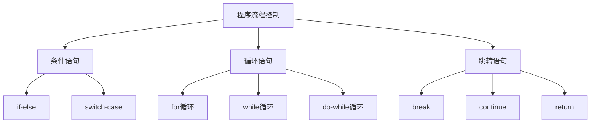

# MQL4函数与控制流

> 🎯 **学习目标**：掌握MQL4的函数定义和使用、控制流程语句，能够编写结构化的MQL4程序。

## 📚 控制流概述

### 流程控制类型


## 🔤 条件语句

### if-else语句

#### 基本if语句
```mql4
// 基本if语句
double currentPrice = Ask;
double targetPrice = 1.1000;

if(currentPrice >= targetPrice)
  {
   Print("价格达到目标");
  }

// if-else语句
if(currentPrice >= targetPrice)
  {
   Print("价格达到或超过目标");
  }
else
  {
   Print("价格未达到目标");
  }

// if-else if-else语句
if(currentPrice > targetPrice)
  {
   Print("价格高于目标");
  }
else if(currentPrice == targetPrice)
  {
   Print("价格等于目标");
  }
else
  {
   Print("价格低于目标");
  }
```

#### 复杂条件判断
```mql4
// 逻辑运算符组合条件
double fastMA = iMA(Symbol(), PERIOD_CURRENT, 10, 0, MODE_SMA, PRICE_CLOSE, 0);
double slowMA = iMA(Symbol(), PERIOD_CURRENT, 20, 0, MODE_SMA, PRICE_CLOSE, 0);
bool isMarketOpen = MarketInfo(Symbol(), MODE_TRADEALLOWED);

// 金叉信号
bool goldenCross = (fastMA > slowMA) && (fastMA[1] <= slowMA[1]);

// 多条件买入
if(goldenCross && isMarketOpen)
  {
   Print("出现金叉，市场开放，准备买入");
  }

// 复杂的价格条件
bool bullishTrend = (Close[1] > Open[1]) && (Close[2] > Open[2]);
bool highVolume = (Volume[0] > Volume[1]);

if(bullishTrend && highVolume)
  {
   Print("看涨趋势伴随高成交量");
  }
```

### switch-case语句

#### 基本switch语句
```mql4
// switch-case语句
int signal = 1;  // 1=买入信号, 2=卖出信号, 3=持有

switch(signal)
  {
   case 1:
      Print("买入信号");
      // 执行买入操作
      break;
   
   case 2:
      Print("卖出信号");
      // 执行卖出操作
      break;
   
   case 3:
      Print("持有信号");
      // 不执行任何操作
      break;
   
   default:
      Print("未知信号");
      break;
  }
```

#### 实际应用示例
```mql4
// 根据交易结果处理
int tradeResult = OrderSend(...);

switch(tradeResult)
  {
   case -1:
      // 交易失败
      int error = GetLastError();
      Print("交易失败，错误代码: ", error);
      break;
   
   case 0:
      // 等待交易完成
      break;
   
   case 1:
      // 交易成功
      Print("交易执行成功");
      break;
  }
```

## 🔄 循环语句

### for循环

#### 基本for循环
```mql4
// 基本for循环语法
for(initialization; condition; increment)
  {
   // 循环体
  }

// 示例1：数字循环
for(int i = 0; i < 10; i++)
  {
   Print("循环次数: ", i);
  }

// 示例2：计算价格总和
double prices[5] = {1.1, 1.2, 1.3, 1.4, 1.5};
double sum = 0.0;

for(int i = 0; i < 5; i++)
  {
   sum += prices[i];
  }
Print("价格总和: ", sum);
```

#### 实际应用：遍历订单
```mql4
// 遍历所有订单
for(int i = OrdersTotal() - 1; i >= 0; i--)
  {
   if(OrderSelect(i, SELECT_BY_POS, MODE_TRADES))
     {
      string symbol = OrderSymbol();
      int ticket = OrderTicket();
      double profit = OrderProfit();
      
      Print("订单: ", ticket, " 品种: ", symbol, " 利润: ", profit);
     }
  }

// 遍历历史订单
for(int i = OrdersHistoryTotal() - 1; i >= 0; i--)
  {
   if(OrderSelect(i, SELECT_BY_POS, MODE_HISTORY))
     {
      // 处理历史订单
     }
  }
```

#### 多重for循环
```mql4
// 计算移动平均
int maPeriod = 20;
double sum = 0.0;

for(int i = 0; i < maPeriod; i++)
  {
   for(int j = 0; j < i; j++)
     {
      sum += Close[i - j];
     }
  }

// 二维数组处理
double matrix[3][4] = {
   {1.1, 1.2, 1.3, 1.4},
   {2.1, 2.2, 2.3, 2.4},
   {3.1, 3.2, 3.3, 3.4}
};

for(int row = 0; row < 3; row++)
  {
   for(int col = 0; col < 4; col++)
     {
      Print("matrix[", row, "][", col, "] = ", matrix[row][col]);
     }
  }
```

### while循环

#### 基本while循环
```mql4
// while循环
int counter = 0;

while(counter < 5)
  {
   Print("计数器: ", counter);
   counter++;
  }

// 示例：查找特定价格
double targetPrice = 1.1000;
int barIndex = 0;

while(barIndex < Bars)
  {
   if(Close[barIndex] >= targetPrice)
     {
      Print("在K线 ", barIndex, " 找到目标价格");
      break;
     }
   barIndex++;
  }
```

#### do-while循环
```mql4
// do-while循环（至少执行一次）
int attempt = 0;
bool success = false;

do
  {
   attempt++;
   Print("尝试第 ", attempt, " 次执行");
   
   // 尝试执行某个操作
   success = TryOperation();
   
  }while(!success && attempt < 3);

if(success)
  {
   Print("操作成功");
  }
else
  {
   Print("操作失败，已尝试3次");
  }
```

### 循环控制语句

#### break语句
```mql4
// break：跳出循环
for(int i = 0; i < 10; i++)
  {
   if(i == 5)
     {
      break;  // 跳出循环
     }
   Print(i);  // 只输出 0, 1, 2, 3, 4
  }

// 示例：查找第一个满足条件的订单
for(int i = 0; i < OrdersTotal(); i++)
  {
   if(OrderSelect(i, SELECT_BY_POS, MODE_TRADES))
     {
      if(OrderProfit() > 100)
        {
         Print("找到盈利订单: ", OrderTicket());
         break;  // 找到后立即停止搜索
        }
     }
  }
```

#### continue语句
```mql4
// continue：跳过当前迭代
for(int i = 0; i < 10; i++)
  {
   if(i % 2 == 0)
     {
      continue;  // 跳过偶数
     }
   Print(i);  // 只输出奇数: 1, 3, 5, 7, 9
  }

// 示例：过滤特定订单
for(int i = 0; i < OrdersTotal(); i++)
  {
   if(OrderSelect(i, SELECT_BY_POS, MODE_TRADES))
     {
      // 跳过其他货币对的订单
      if(OrderSymbol() != Symbol())
        {
         continue;
        }
      
      // 处理当前货币对的订单
      Print("处理订单: ", OrderTicket());
     }
  }
```

## 🔤 函数定义

### 函数基础

#### 函数定义和调用
```mql4
// 函数定义
// 返回类型 函数名(参数列表)
// {
//     函数体
//     return 返回值;
// }

// 示例1：无返回值的函数
void PrintMessage(string message)
  {
   Print("消息: ", message);
  }

// 调用函数
PrintMessage("Hello, MQL4!");

// 示例2：有返回值的函数
double CalculateProfit(double entryPrice, double exitPrice, double lots)
  {
   double profit = (exitPrice - entryPrice) * lots * 100000;
   return profit;
  }

// 调用函数
double profit = CalculateProfit(1.1000, 1.1100, 0.1);
Print("利润: ", profit);
```

### 函数参数

#### 传递参数
```mql4
// 值传递：传递参数的副本
void AddValue(int x)
  {
   x = x + 10;  // 修改的是副本
  }

int num = 5;
AddValue(num);
Print(num);  // 输出: 5 (原始值不变)

// 引用传递：直接修改原变量
void AddRef(int &x)
  {
   x = x + 10;  // 修改原变量
  }

AddRef(num);
Print(num);  // 输出: 15 (原变量被修改)

// 常量引用：防止修改
void PrintValue(const int &x)
  {
   Print("值: ", x);
   // x = x + 10;  // 错误：不能修改常量引用
  }
```

#### 默认参数
```mql4
// 带默认参数的函数
double CalculateRisk(double accountBalance, double riskPercent = 1.0)
  {
   double riskAmount = accountBalance * (riskPercent / 100);
   return riskAmount;
  }

// 使用默认参数
double risk1 = CalculateRisk(10000);  // 使用默认1%
Print("风险金额: ", risk1);  // 100

// 指定参数
double risk2 = CalculateRisk(10000, 2.0);  // 使用2%
Print("风险金额: ", risk2);  // 200
```

### 返回值

#### 多种返回类型
```mql4
// 返回整数
int GetOrderCount()
  {
   return OrdersTotal();
  }

// 返回布尔值
bool HasOpenPosition()
  {
   return (OrdersTotal() > 0);
  }

// 返回字符串
string GetSignalDescription(int signal)
  {
   switch(signal)
     {
      case 1: return "买入信号";
      case 2: return "卖出信号";
      case 3: return "持有信号";
      default: return "未知信号";
     }
  }

// 返回数组（通过参数）
void GetPriceArray(double &array[], int size)
  {
   for(int i = 0; i < size; i++)
     {
      array[i] = Close[i];
     }
  }

// 使用
double prices[5];
GetPriceArray(prices, 5);
```

### 特殊函数

#### 事件处理函数
```mql4
// OnInit：程序初始化时调用
int OnInit()
  {
   Print("EA已启动");
   return(INIT_SUCCEEDED);
  }

// OnDeinit：程序卸载时调用
void OnDeinit(const int reason)
  {
   Print("EA已停止，原因: ", reason);
  }

// OnTick：每次价格变动时调用
void OnTick()
  {
   // 主要交易逻辑
  }

// OnTimer：定时器事件
int OnInit()
  {
   EventSetTimer(60);  // 设置60秒定时器
   return(INIT_SUCCEEDED);
  }

void OnTimer()
  {
   Print("定时器触发");
  }

void OnDeinit(const int reason)
  {
   EventKillTimer();  // 清除定时器
  }

// OnTrade：交易事件
void OnTrade()
  {
   Print("交易事件发生");
  }

// OnChartEvent：图表事件
void OnChartEvent(const int id, const long &lparam, 
                 const double &dparam, const string &sparam)
  {
   if(id == CHARTEVENT_CLICK)
     {
      Print("图表被点击");
     }
  }
```

## 🎯 函数实战应用

### 交易辅助函数

#### 检查开仓条件
```mql4
// 检查是否可以开仓
bool CanOpenPosition(string symbol, int maxPositions = 1)
  {
   // 检查市场是否开放
   if(!MarketInfo(symbol, MODE_TRADEALLOWED))
     {
      Print("市场未开放");
      return false;
     }
   
   // 检查持仓数量
   int positionCount = 0;
   for(int i = 0; i < OrdersTotal(); i++)
     {
      if(OrderSelect(i, SELECT_BY_POS, MODE_TRADES))
        {
         if(OrderSymbol() == symbol)
           {
            positionCount++;
           }
        }
     }
   
   if(positionCount >= maxPositions)
     {
      Print("已达到最大持仓数: ", maxPositions);
      return false;
     }
   
   return true;
  }

// 使用示例
if(CanOpenPosition(Symbol()))
  {
   Print("可以开仓");
  }
```

#### 计算交易手数
```mql4
// 根据风险百分比计算手数
double CalculateLotSize(double riskPercent, double stopLossPoints)
  {
   double accountBalance = AccountBalance();
   double riskAmount = accountBalance * (riskPercent / 100);
   double tickValue = MarketInfo(Symbol(), MODE_TICKVALUE);
   
   // 计算手数
   double lotSize = riskAmount / (stopLossPoints * tickValue);
   
   // 规范化手数
   double minLot = MarketInfo(Symbol(), MODE_MINLOT);
   double maxLot = MarketInfo(Symbol(), MODE_MAXLOT);
   double lotStep = MarketInfo(Symbol(), MODE_LOTSTEP);
   
   lotSize = MathFloor(lotSize / lotStep) * lotStep;
   
   if(lotSize < minLot) lotSize = minLot;
   if(lotSize > maxLot) lotSize = maxLot;
   
   return lotSize;
  }

// 使用示例
double lotSize = CalculateLotSize(1.0, 50);  // 1%风险，50点止损
Print("计算手数: ", lotSize);
```

### 指标计算函数

#### 移动平均线
```mql4
// 计算简单移动平均
double CalculateSMA(int period, int shift = 0)
  {
   if(period > Bars)
      return 0;
   
   double sum = 0.0;
   for(int i = shift; i < shift + period; i++)
     {
      sum += Close[i];
     }
   
   return sum / period;
  }

// 计算指数移动平均
double CalculateEMA(int period, int shift = 0)
  {
   double multiplier = 2.0 / (period + 1.0);
   double ema = CalculateSMA(period, period + shift);
   
   for(int i = period + shift - 1; i >= shift; i--)
     {
      ema = (Close[i] * multiplier) + (ema * (1 - multiplier));
     }
   
   return ema;
  }

// 使用示例
double sma20 = CalculateSMA(20);
double ema20 = CalculateEMA(20);
Print("SMA20: ", sma20, " EMA20: ", ema20);
```

#### 相对强弱指数(RSI)
```mql4
// 计算RSI
double CalculateRSI(int period, int shift = 0)
  {
   if(shift + period >= Bars)
      return 50;
   
   double gains = 0;
   double losses = 0;
   
   // 计算初始平均收益和损失
   for(int i = shift + 1; i <= shift + period; i++)
     {
      double change = Close[i] - Close[i - 1];
      if(change > 0)
         gains += change;
      else
         losses -= change;
     }
   
   double avgGain = gains / period;
   double avgLoss = losses / period;
   
   // 计算RSI
   if(avgLoss == 0)
      return 100;
   
   double rs = avgGain / avgLoss;
   double rsi = 100 - (100 / (1 + rs));
   
   return rsi;
  }

// 使用示例
double rsi = CalculateRSI(14);
Print("RSI: ", rsi);
```

## 🎯 实战练习

### 练习1：信号检测系统

#### 任务要求
```mql4
// 创建信号检测函数
// 功能：
// 1. 检测移动平均线交叉
// 2. 检测RSI超买超卖
// 3. 返回综合交易信号
```

#### 参考代码
```mql4
//+------------------------------------------------------------------+
//|                                          SignalDetector.mq4    |
//+------------------------------------------------------------------+
#property copyright "2026, Practice"
#property version   "1.00"
#property strict

// 检测MA交叉
int DetectMACross(int fastPeriod, int slowPeriod)
  {
   double fastMA = iMA(Symbol(), PERIOD_CURRENT, fastPeriod, 0, MODE_SMA, PRICE_CLOSE, 0);
   double slowMA = iMA(Symbol(), PERIOD_CURRENT, slowPeriod, 0, MODE_SMA, PRICE_CLOSE, 0);
   double fastMA1 = iMA(Symbol(), PERIOD_CURRENT, fastPeriod, 0, MODE_SMA, PRICE_CLOSE, 1);
   double slowMA1 = iMA(Symbol(), PERIOD_CURRENT, slowPeriod, 0, MODE_SMA, PRICE_CLOSE, 1);
   
   // 金叉：快速MA从下方穿过慢速MA
   if(fastMA > slowMA && fastMA1 <= slowMA1)
     {
      return 1;  // 买入信号
     }
   
   // 死叉：快速MA从上方穿过慢速MA
   if(fastMA < slowMA && fastMA1 >= slowMA1)
     {
      return 2;  // 卖出信号
     }
   
   return 0;  // 无信号
  }

// 检测RSI信号
int DetectRSISignal(int period, int overbought, int oversold)
  {
   double rsi = iRSI(Symbol(), PERIOD_CURRENT, period, PRICE_CLOSE, 0);
   double rsi1 = iRSI(Symbol(), PERIOD_CURRENT, period, PRICE_CLOSE, 1);
   
   // 超卖回调
   if(rsi1 < oversold && rsi >= oversold)
     {
      return 1;  // 买入信号
     }
   
   // 超买回调
   if(rsi1 > overbought && rsi <= overbought)
     {
      return 2;  // 卖出信号
     }
   
   return 0;  // 无信号
  }

void OnTick()
  {
   int maSignal = DetectMACross(10, 20);
   int rsiSignal = DetectRSISignal(14, 70, 30);
   
   if(maSignal == 1 || rsiSignal == 1)
     {
      Print("综合买入信号");
     }
   else if(maSignal == 2 || rsiSignal == 2)
     {
      Print("综合卖出信号");
     }
  }
```

### 练习2：订单管理函数

#### 任务要求
```mql4
// 创建订单管理函数
// 功能：
// 1. 查找特定货币对的订单
// 2. 计算总利润
// 3. 关闭所有盈利订单
```

#### 参考代码
```mql4
//+------------------------------------------------------------------+
//|                                       OrderManager.mq4         |
//+------------------------------------------------------------------+
#property copyright "2026, Practice"
#property version   "1.00"
#property strict

// 查找特定货币对的订单数量
int CountOrdersBySymbol(string symbol)
  {
   int count = 0;
   
   for(int i = 0; i < OrdersTotal(); i++)
     {
      if(OrderSelect(i, SELECT_BY_POS, MODE_TRADES))
        {
         if(OrderSymbol() == symbol)
           {
            count++;
           }
        }
     }
   
   return count;
  }

// 计算特定货币对的利润
double CalculateProfitBySymbol(string symbol)
  {
   double totalProfit = 0;
   
   for(int i = 0; i < OrdersTotal(); i++)
     {
      if(OrderSelect(i, SELECT_BY_POS, MODE_TRADES))
        {
         if(OrderSymbol() == symbol)
           {
            totalProfit += OrderProfit();
           }
        }
     }
   
   return totalProfit;
  }

// 关闭特定货币的所有盈利订单
void CloseProfitableOrders(string symbol, double minProfit = 0)
  {
   for(int i = OrdersTotal() - 1; i >= 0; i--)
     {
      if(OrderSelect(i, SELECT_BY_POS, MODE_TRADES))
        {
         if(OrderSymbol() == symbol && OrderProfit() >= minProfit)
           {
            if(OrderType() == OP_BUY)
              {
               OrderClose(OrderTicket(), OrderLots(), Bid, 3, clrNONE);
              }
            else if(OrderType() == OP_SELL)
              {
               OrderClose(OrderTicket(), OrderLots(), Ask, 3, clrNONE);
              }
           }
        }
     }
  }

void OnTick()
  {
   string symbol = Symbol();
   int orderCount = CountOrdersBySymbol(symbol);
   double profit = CalculateProfitBySymbol(symbol);
   
   Print("订单数: ", orderCount, " 总利润: ", profit);
   
   // 如果利润超过50点，关闭盈利订单
   if(profit > 50)
     {
      Print("利润超过50点，关闭盈利订单");
      CloseProfitableOrders(symbol);
     }
  }
```

## 💡 最佳实践

### 函数设计原则

#### 单一职责
- ✅ **每个函数只做一件事**：保持函数简单明了
- ✅ **函数名要有意义**：描述函数的功能
- ✅ **参数数量合理**：避免参数过多
- ❌ **避免过长函数**：单个函数不超过50行

#### 函数复用
- ✅ **提取通用函数**：将重复代码提取为函数
- ✅ **参数化设计**：使函数具有灵活性
- ✅ **文档注释**：为函数添加清晰注释
- ❌ **避免硬编码**：使用参数而非固定值

### 控制流建议

#### 条件语句
- ✅ **优先使用if-else**：比switch更灵活
- ✅ **逻辑清晰**：避免嵌套过深
- ✅ **边界检查**：确保条件完整
- ❌ **避免冗余条件**：简化逻辑表达式

#### 循环语句
- ✅ **控制循环次数**：避免无限循环
- ✅ **合理使用break**：及时跳出循环
- ✅ **循环内变量**：尽量在循环外声明
- ❌ **避免复杂循环**：保持循环简单

## 🔗 相关资源

- [[MQL4基础语法与数据类型]] - 数据类型基础
- [[MQL4交易操作基础]] - 交易操作
- [[Expert Advisor基础]] - EA开发
- [[调试与错误处理]] - 调试技巧

### 官方文档

- **MQL4函数**：https://www.mql5.com/en/docs/mql4/basis/variables/function
- **MQL4操作符**：https://www.mql5.com/en/docs/mql4/basis/operators

---
*创建时间: 2026-02-01*  
*分类: 3 Resources*
