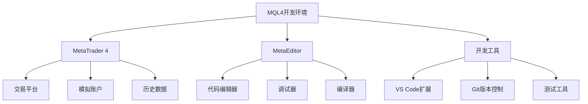

# MQL4环境搭建与工具配置

> 🎯 **学习目标**：完成MQL4开发环境的搭建，掌握MetaEditor的基本使用，能够创建和运行第一个MQL4程序。

## 📚 环境搭建概述

### MQL4开发环境结构


## 🔧 MetaTrader 4安装

### MT4下载与安装

#### 官方下载步骤
```bash
# 1. 访问MetaQuotes官网
https://www.metatrader4.com/en/download

# 2. 选择适合的版本
# - Windows版本（推荐）
# - Android/iOS版本（移动端）

# 3. 下载并安装
# 运行安装程序，按照提示完成安装

# 4. 创建模拟账户
# 打开MT4 -> 文件 -> 开设模拟账户
```

### MT4界面介绍

#### 主要界面组件
```
┌─────────────────────────────────────────────────────┐
│  MT4 主界面                                        │
├─────────────────────────────────────────────────────┤
│  菜单栏: 文件 视图 插入 图表 帮助                   │
├─────────────────────────────────────────────────────┤
│  工具栏: 新建图表 周期 放大 缩小 指标 EA            │
├─────────────────────────────────────────────────────┤
│  市场报价窗口    │     图表显示区域                 │
│  ┌─────────────┐ │     ┌─────────────────┐         │
│  │ EURUSD      │ │     │                 │         │
│  │ GBPUSD      │ │     │   价格走势图     │         │
│  │ USDJPY      │ │     │                 │         │
│  └─────────────┘ │     └─────────────────┘         │
├─────────────────────────────────────────────────────┤
│  终端窗口                                          │
│  ┌──────────────────────────────────────────────┐  │
│  │ 交易 | 账户历史 | 邮件 | 日志 | 代理         │  │
│  └──────────────────────────────────────────────┘  │
└─────────────────────────────────────────────────────┘
```

#### 快捷键操作
```mql4
// 常用快捷键
F4           // 打开MetaEditor
F9           // 打开新订单窗口
Ctrl+N       // 新建图表
Ctrl+O       // 打开图表
Ctrl+S       // 保存图表
Ctrl+F       // 查找
Ctrl+H       // 替换
F5           // 刷新图表
Delete       // 删除对象
```

## 💻 MetaEditor配置

### MetaEditor启动

#### 打开MetaEditor
```mql4
// 方法1：从MT4启动
// 在MT4中按F4键
// 或点击工具栏的MetaEditor图标

// 方法2：直接启动
// 找到MetaEditor.exe文件直接打开
// 默认位置: C:\Program Files\MetaTrader 4\MetaEditor.exe
```

### MetaEditor界面

#### 主要界面布局
```
┌─────────────────────────────────────────────────────┐
│  MetaEditor 主界面                                  │
├─────────────────────────────────────────────────────┤
│  菜单栏: 文件 编辑 视图 调试 工具 窗口 帮助        │
├─────────────────────────────────────────────────────┤
│  工具栏: 新建 打开 保存 编译 运行 调试              │
├─────────────────────────────────────────────────────┤
│  导航器窗口    │     代码编辑区域                   │
│  ┌─────────────┐ │     ┌─────────────────┐         │
│  │ Expert Advisors│     │                 │         │
│  │ Indicators     │     │   MQL4代码      │         │
│  │ Scripts       │     │                 │         │
│  │ Include       │     │                 │         │
│  └─────────────┘ │     └─────────────────┘         │
├─────────────────────────────────────────────────────┤
│  工具箱窗口                                          │
│  ┌──────────────────────────────────────────────┐  │
│  │ 常用函数、代码片段                            │  │
│  └──────────────────────────────────────────────┘  │
└─────────────────────────────────────────────────────┘
```

### MetaEditor配置

#### 编辑器设置
```mql4
// 打开设置
// 工具 -> 选项 -> 编辑器

// 推荐配置：
// - 字体: Consolas 或 JetBrains Mono
// - 字号: 12-14
// - 显示行号: 启用
// - 自动缩进: 启用
// - 语法高亮: 启用
// - 括号匹配: 启用
```

#### 编译器设置
```mql4
// 工具 -> 选项 -> 编译器
// 推荐配置：
// - 优化级别: 标准
// - 警告级别: 高
// - 检查代码完整性: 启用
// - 生成调试信息: 调试时启用
```

## 🎯 创建第一个MQL4程序

### 创建Expert Advisor (EA)

#### 新建EA步骤
```mql4
// 1. 在MetaEditor中创建新文件
// 文件 -> 新建 -> Expert Advisor (template)

// 2. 填写EA信息
名称: MyFirstEA
作者: Your Name
链接: https://www.example.com
参数: (可选)

// 3. 选择事件处理函数
OnTick()        // 必选：价格变动时执行
OnTimer()       // 可选：定时器事件
OnTrade()       // 可选：交易事件
OnChartEvent()  // 可选：图表事件

// 4. 完成创建
// MetaEditor会生成基础代码框架
```

#### 基础EA代码模板
```mql4
//+------------------------------------------------------------------+
//|                                              MyFirstEA.mq4       |
//|                        Copyright 2026, Your Name                 |
//|                                             https://www.mql5.com |
//+------------------------------------------------------------------+
#property copyright "2026, Your Name"
#property link      "https://www.mql5.com"
#property version   "1.00"
#property strict

// 输入参数
input double LotSize = 0.1;        // 交易手数
input int    StopLoss = 50;        // 止损点数
input int    TakeProfit = 100;     // 止盈点数

//+------------------------------------------------------------------+
//| Expert initialization function                                     |
//+------------------------------------------------------------------+
int OnInit()
  {
   // EA启动时执行一次
   Print("EA 已启动: ", _Symbol);
   
   // 返回初始化状态
   return(INIT_SUCCEEDED);
  }

//+------------------------------------------------------------------+
//| Expert deinitialization function                                   |
//+------------------------------------------------------------------+
void OnDeinit(const int reason)
  {
   // EA停止时执行
   Print("EA 已停止，原因: ", reason);
   
   // 清理资源
   ObjectsDeleteAll(0, "MyFirstEA_");
  }

//+------------------------------------------------------------------+
//| Expert tick function                                               |
//+------------------------------------------------------------------+
void OnTick()
  {
   // 每次价格变动时执行
   // 这是EA的主要逻辑部分
   
   // 获取当前价格
   double bid = MarketInfo(_Symbol, MODE_BID);
   double ask = MarketInfo(_Symbol, MODE_ASK);
   
   // 输出调试信息
   if(TimeCurrent() - Time[0] > PeriodSeconds() - 10)
     {
      Print("当前价格: Bid=", bid, " Ask=", ask);
     }
  }

//+------------------------------------------------------------------+
//| Chart event function                                              |
//+------------------------------------------------------------------+
void OnChartEvent(const int id,
                  const long &lparam,
                  const double &dparam,
                  const string &sparam)
  {
   // 处理图表事件
   if(id == CHARTEVENT_KEYDOWN)
     {
      Print("按键事件: ", lparam);
     }
  }
```

### 创建自定义指标

#### 新建指标步骤
```mql4
// 1. 文件 -> 新建 -> Custom Indicator
// 2. 填写指标信息
名称: MyCustomIndicator
类型: 主图或副图
// 3. 设置指标参数和绘图属性
// 4. 完成创建
```

#### 基础指标代码模板
```mql4
//+------------------------------------------------------------------+
//|                                   MyCustomIndicator.mq4           |
//|                        Copyright 2026, Your Name                 |
//|                                             https://www.mql5.com |
//+------------------------------------------------------------------+
#property copyright "2026, Your Name"
#property link      "https://www.mql5.com"
#property version   "1.00"
#property strict
#property indicator_chart_window  // 在主图显示
// #property indicator_separate_window  // 在副图显示

#property indicator_buffers 1      // 指标缓冲区数量
#property indicator_plots   1      // 绘制线数量

// 指标参数
input int MAPeriod = 20;           // 移动平均周期

// 指标缓冲区
double MA_Buffer[];

//+------------------------------------------------------------------+
//| Custom indicator initialization function                           |
//+------------------------------------------------------------------+
int OnInit()
  {
   // 设置指标缓冲区
   SetIndexBuffer(0, MA_Buffer);
   SetIndexStyle(0, DRAW_LINE, STYLE_SOLID, 2, clrBlue);
   
   // 设置指标标签
   IndicatorShortName("My MA(" + IntegerToString(MAPeriod) + ")");
   SetIndexLabel(0, "MA(" + IntegerToString(MAPeriod) + ")");
   
   return(INIT_SUCCEEDED);
  }

//+------------------------------------------------------------------+
//| Custom indicator deinitialization function                         |
//+------------------------------------------------------------------+
void OnDeinit(const int reason)
  {
   // 清理
   Comment("");
  }

//+------------------------------------------------------------------+
//| Custom indicator iteration function                                |
//+------------------------------------------------------------------+
int OnCalculate(const int rates_total,
                const int prev_calculated,
                const datetime &time[],
                const double &open[],
                const double &high[],
                const double &low[],
                const double &close[],
                const long &tick_volume[],
                const long &volume[],
                const int &spread[])
  {
   // 检查是否有足够的数据
   if(rates_total < MAPeriod)
      return(0);
   
   // 计算移动平均
   int start = prev_calculated;
   if(start == 0)
      start = MAPeriod;
   
   for(int i = start; i < rates_total; i++)
     {
      double sum = 0.0;
      for(int j = 0; j < MAPeriod; j++)
        {
         sum += close[i - j];
        }
      MA_Buffer[i] = sum / MAPeriod;
     }
   
   return(rates_total);
  }
```

## 🧪 编译和调试

### 编译程序

#### 编译步骤
```mql4
// 1. 编译当前文件
// 按F7键 或 点击编译按钮

// 2. 查看编译结果
// 在工具箱窗口中查看编译信息
// 0错误 0警告 = 编译成功

// 3. 处理编译错误
// 双击错误信息跳转到错误位置
// 修改后重新编译

// 4. 常见编译错误
// - syntax error: 语法错误
// - undeclared identifier: 未声明的变量
// - function declaration missing: 函数声明缺失
```

### 调试程序

#### 调试步骤
```mql4
// 1. 设置断点
// 在代码行号左侧点击设置断点
// 或按F9键

// 2. 启动调试
// 按F5键启动调试

// 3. 调试控制
// F5: 继续运行
// F10: 单步跳过
// F11: 单步进入
// Shift+F11: 单步跳出

// 4. 查看变量
// 调试时将鼠标悬停在变量上查看值
// 或在变量窗口中查看

// 5. 监视表达式
// 在监视窗口中添加表达式监视
```

## 🎨 代码编辑技巧

### 代码格式化

#### 自动格式化
```mql4
// 手动格式化
// 选择代码 -> Ctrl+A -> 编辑 -> 格式化

// 或使用快捷键
// Ctrl+Shift+F (自定义)

// 推荐缩进
// 使用2或4个空格缩进
// 保持一致的缩进风格
```

### 代码补全

#### 智能提示
```mql4
// 输入代码时会自动显示提示
// 例如输入"Market"会显示相关函数列表

// 按Tab键接受建议
// 按ESC键关闭提示

// 函数参数提示
// 输入"OrderSend("会显示参数提示
```

### 代码片段

#### 创建代码片段
```mql4
// 工具 -> 代码片段管理器
// 可以创建常用的代码片段

// 示例：订单发送代码片段
OrderSend(
    Symbol(),           // 交易品种
    OP_BUY,            // 订单类型
    LotSize,           // 手数
    Ask,               // 价格
    3,                 // 滑点
    Ask - StopLoss * Point,  // 止损
    Ask + TakeProfit * Point, // 止盈
    "My First EA",     // 注释
    0,                 // 魔术数字
    0,                 // 到期时间
    clrNONE            // 箭头颜色
);
```

## 📊 测试环境

### 策略测试器

#### 启动测试器
```mql4
// 在MT4中按Ctrl+T打开策略测试器

// 配置测试参数
// - 选择EA
// - 选择交易品种
// - 选择时间周期
// - 选择测试模式
// - 设置测试时间范围
// - 设置初始资金

// 开始测试
// 点击开始按钮
```

#### 测试模式
```mql4
// 1. 每次跳点模式
// 最快的测试速度，但不够精确

// 2. 控制点模式
// 较快的速度，较好的精度

// 3. 实时报价模式
// 最精确的测试，但速度最慢

// 推荐使用控制点模式进行初步测试
// 实时报价模式进行最终验证
```

## 🚀 实战练习

### 练习1：创建简单EA

#### 任务要求
```mql4
// 创建一个简单的EA
// 功能：在图表上显示当前价格和时间
// 使用Comment()函数显示信息
```

#### 参考代码
```mql4
//+------------------------------------------------------------------+
//|                                            SimplePriceEA.mq4    |
//+------------------------------------------------------------------+
#property copyright "2026, Practice"
#property version   "1.00"
#property strict

void OnTick()
  {
   // 获取当前价格
   double bid = MarketInfo(_Symbol, MODE_BID);
   double ask = MarketInfo(_Symbol, MODE_ASK);
   
   // 获取当前时间
   datetime currentTime = TimeCurrent();
   string timeStr = TimeToString(currentTime, TIME_DATE|TIME_SECONDS);
   
   // 显示信息
   Comment("价格显示系统\n",
           "交易品种: ", _Symbol, "\n",
           "当前时间: ", timeStr, "\n",
           "买价(Bid): ", bid, "\n",
           "卖价(Ask): ", ask, "\n",
           "点差: ", DoubleToString((ask - bid) / _Point, 0));
  }
```

### 练习2：创建简单指标

#### 任务要求
```mql4
// 创建一个简单移动平均指标
// 功能：显示指定周期的简单移动平均线
```

#### 参考代码
```mql4
//+------------------------------------------------------------------+
//|                                    SimpleMA.mq4                  |
//+------------------------------------------------------------------+
#property copyright "2026, Practice"
#property version   "1.00"
#property strict
#property indicator_chart_window
#property indicator_buffers 1
#property indicator_plots   1

input int Period = 14;

double MABuffer[];

int OnInit()
  {
   SetIndexBuffer(0, MABuffer);
   SetIndexStyle(0, DRAW_LINE, STYLE_SOLID, 2, clrRed);
   IndicatorShortName("SMA(" + IntegerToString(Period) + ")");
   return(INIT_SUCCEEDED);
  }

int OnCalculate(const int rates_total,
                const int prev_calculated,
                const datetime &time[],
                const double &open[],
                const double &high[],
                const double &low[],
                const double &close[],
                const long &tick_volume[],
                const long &volume[],
                const int &spread[])
  {
   if(rates_total < Period)
      return(0);
   
   int start = prev_calculated;
   if(start == 0)
      start = Period;
   
   for(int i = start; i < rates_total; i++)
     {
      double sum = 0.0;
      for(int j = 0; j < Period; j++)
        {
         sum += close[i - j];
        }
      MABuffer[i] = sum / Period;
     }
   
   return(rates_total);
  }
```

## 💡 最佳实践

### 开发建议

#### 代码组织
- ✅ **模块化编程**：将功能分解为多个函数
- ✅ **注释清晰**：添加有意义的代码注释
- ✅ **变量命名**：使用有意义的变量名
- ❌ **避免全局变量**：减少全局变量的使用

#### 调试技巧
- ✅ **使用Print()**：输出调试信息
- ✅ **逐步调试**：使用断点逐步调试
- ✅ **错误处理**：添加适当的错误检查
- ❌ **避免死循环**：确保循环有退出条件

### 测试建议

#### 测试流程
1. **语法检查**：确保代码编译无误
2. **单元测试**：测试各个功能模块
3. **策略测试**：在策略测试器中测试
4. **模拟交易**：在模拟账户中运行
5. **风险控制**：设置合理的止损和仓位

## 🔗 相关资源

- [[MQL4基础语法与数据类型]] - MQL4语法基础
- [[MQL4函数与控制流]] - 函数和控制流
- [[调试与错误处理]] - 调试技巧
- [[Expert Advisor基础]] - EA开发

### 官方文档

- **MQL4文档**：https://www.mql5.com/en/docs/mql4
- **MetaTrader 4**：https://www.metatrader4.com/
- **MQL5社区**：https://www.mql5.com/en

---
*创建时间: 2026-02-01*  
*分类: 3 Resources*
