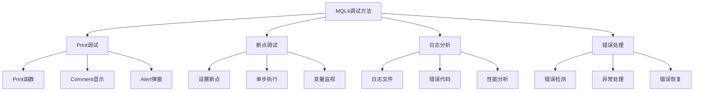

# 调试与错误处理

> 🎯 **学习目标**：掌握MQL4的调试方法和错误处理技巧，能够快速定位和解决程序问题。

## 📚 调试概述

### 调试方法分类


## 🔍 Print调试法

### Print函数使用

#### 基本Print用法
```mql4
// 基本Print输出
void OnTick()
  {
   // 输出简单信息
   Print("OnTick执行");
   
   // 输出变量值
   double price = Bid;
   Print("当前价格: ", price);
   
   // 输出多个变量
   int ticket = 12345;
   double profit = 100.50;
   Print("订单: ", ticket, " 利润: ", profit);
   
   // 格式化输出
   string message = StringFormat("价格: %.5f, 手数: %.2f", Ask, 0.1);
   Print(message);
  }
```

#### 调试信息输出
```mql4
// 函数入口和出口调试
void MyFunction(double parameter)
  {
   Print("=== 进入函数 MyFunction ===");
   Print("参数: ", parameter);
   
   // 函数逻辑
   double result = parameter * 2;
   Print("计算结果: ", result);
   
   Print("=== 退出函数 MyFunction ===");
   return;
  }

// 条件调试
void ConditionalDebug()
  {
   bool debugMode = true;  // 调试开关
   
   if(debugMode)
     {
      Print("调试信息: 当前状态");
     }
   
   // 主要逻辑
  }

// 性能调试
void PerformanceTest()
  {
   uint startTime = GetTickCount();
   
   // 执行需要测试的代码
   for(int i = 0; i < 1000; i++)
     {
      double ma = iMA(Symbol(), PERIOD_CURRENT, 20, 0, MODE_SMA, PRICE_CLOSE, 0);
     }
   
   uint endTime = GetTickCount();
   uint elapsedTime = endTime - startTime;
   
   Print("执行时间: ", elapsedTime, " 毫秒");
  }
```

### Comment显示

#### 图表信息显示
```mql4
// 在图表上显示调试信息
void DisplayDebugInfo()
  {
   string debugInfo = "";
   
   // 基本信息
   debugInfo += "=== 调试信息 ===\n";
   debugInfo += "交易品种: " + Symbol() + "\n";
   debugInfo += "当前价格: " + DoubleToString(Bid, 5) + "\n";
   debugInfo += "当前时间: " + TimeToString(TimeCurrent()) + "\n";
   
   // 账户信息
   debugInfo += "账户余额: " + DoubleToString(AccountBalance(), 2) + "\n";
   debugInfo += "持仓数量: " + IntegerToString(OrdersTotal()) + "\n";
   
   // 指标值
   double rsi = iRSI(Symbol(), PERIOD_CURRENT, 14, PRICE_CLOSE, 0);
   debugInfo += "RSI值: " + DoubleToString(rsi, 2) + "\n";
   
   // 显示信息
   Comment(debugInfo);
  }

void OnTick()
  {
   DisplayDebugInfo();
  }

void OnDeinit(const int reason)
  {
   Comment("");  // 清除图表信息
  }
```

## 🛑 断点调试

### 设置和使用断点

#### 断点调试步骤
```mql4
// MetaEditor调试方法
// 1. 在代码行号左侧点击设置断点
// 2. 按F5启动调试
// 3. 使用F10单步执行
// 4. 按F11进入函数
// 5. 使用变量窗口查看变量值

int OnInit()
  {
   int x = 10;  // 在这里设置断点
   
   x = x + 5;   // 单步执行到这里
   Print("x的值: ", x);
   
   return(INIT_SUCCEEDED);
  }

void ComplexCalculation()
  {
   double result = 0;
   
   for(int i = 0; i < 100; i++)  // 在循环中设置断点
     {
      result += i;
      
      if(result > 1000)  // 条件断点
         break;
     }
   
   Print("最终结果: ", result);
  }
```

#### 变量监视
```mql4
// 使用监视窗口查看变量
void MonitorVariables()
  {
   int counter = 0;
   double prices[10];
   
   for(int i = 0; i < 10; i++)
     {
      prices[i] = Close[i];
      counter++;  // 监视这个变量
     }
   
   // 在监视窗口中添加以下表达式：
   // counter - 查看计数器值
   // prices[5] - 查看第6个价格
   // counter * 2 - 查看表达式结果
  }
```

## 📊 日志分析

### 日志记录

#### 详细的日志记录
```mql4
// 日志记录函数
void LogMessage(string message, int level = 0)
  {
   // level: 0=信息, 1=警告, 2=错误
   string levelStr = "";
   color levelColor = clrBlack;
   
   switch(level)
     {
      case 0:
         levelStr = "[INFO]";
         levelColor = clrBlue;
         break;
      case 1:
         levelStr = "[WARNING]";
         levelColor = clrOrange;
         break;
      case 2:
         levelStr = "[ERROR]";
         levelColor = clrRed;
         break;
     }
   
   string logMessage = TimeToString(TimeCurrent()) + " " + levelStr + " " + message;
   Print(logMessage);
  }

// 使用日志函数
void LogExample()
  {
   LogMessage("程序启动", 0);
   
   double price = Ask;
   if(price > 0)
     {
      LogMessage("当前价格: " + DoubleToString(price, 5), 0);
     }
   else
     {
      LogMessage("价格获取失败", 2);
     }
   
   int orders = OrdersTotal();
   if(orders > 10)
     {
      LogMessage("持仓数量过多: " + IntegerToString(orders), 1);
     }
  }
```

### 错误日志

#### 交易错误记录
```mql4
// 记录交易错误
void LogTradeError(int error, string operation)
  {
   string errorMsg = ErrorDescription(error);
   string logMessage = StringFormat(
      "交易错误 - 操作: %s, 错误代码: %d, 错误描述: %s",
      operation, error, errorMsg
   );
   
   Print(logMessage);
   
   // 可以将错误记录到文件
   WriteLogToFile(logMessage);
  }

// 写入日志文件
void WriteLogToFile(string message)
  {
   string filename = "TradingLog.txt";
   int handle = FileOpen(filename, FILE_WRITE|FILE_READ|FILE_TXT);
   
   if(handle != INVALID_HANDLE)
     {
      FileSeek(handle, 0, SEEK_END);
      FileWrite(handle, message);
      FileClose(handle);
     }
   else
     {
      Print("无法打开日志文件");
     }
  }

// 使用示例
int ticket = OrderSend(Symbol(), OP_BUY, 0.1, Ask, 3, 0, 0, "Test", 0, 0, clrNONE);

if(ticket < 0)
  {
   int error = GetLastError();
   LogTradeError(error, "开仓");
  }
```

## ⚠️ 错误处理

### 常见错误类型

#### 运行时错误
```mql4
// 除零错误
void DivisionError()
  {
   int a = 10;
   int b = 0;
   
   // int result = a / b;  // 这会导致除零错误
   
   // 正确处理
   if(b != 0)
     {
      int result = a / b;
     }
   else
     {
      Print("错误: 除数不能为零");
     }
  }

// 数组越界错误
void ArrayOutOfBounds()
  {
   double prices[5];
   
   // prices[10] = 1.0;  // 数组越界错误
   
   // 正确处理
   if(10 < ArraySize(prices))
     {
      prices[10] = 1.0;
     }
   else
     {
      Print("错误: 数组索引超出范围");
     }
  }

// 空指针错误
void NullPointer()
  {
   // 确保在使用前检查对象是否有效
   int handle = FileOpen("test.txt", FILE_READ);
   
   if(handle != INVALID_HANDLE)
     {
      // 安全使用文件句柄
      string content = FileReadString(handle);
      FileClose(handle);
     }
   else
     {
      Print("错误: 文件句柄无效");
     }
  }
```

### 交易错误处理

#### 交易函数错误处理
```mql4
// 安全的开仓函数
bool SafeOpenBuyOrder(double lots, double sl, double tp)
  {
   // 参数检查
   if(lots <= 0)
     {
      Print("错误: 手数必须大于0");
      return false;
     }
   
   // 检查市场状态
   if(!MarketInfo(Symbol(), MODE_TRADEALLOWED))
     {
      Print("错误: 市场未开放");
      return false;
     }
   
   // 检查账户资金
   double freeMargin = AccountFreeMargin();
   double requiredMargin = MarketInfo(Symbol(), MODE_MARGINREQUIRED) * lots;
   
   if(freeMargin < requiredMargin)
     {
      Print("错误: 保证金不足");
      return false;
     }
   
   // 执行交易
   ResetLastError();
   int ticket = OrderSend(
      Symbol(), OP_BUY, lots, Ask, 3, sl, tp, 
      "Safe Order", 0, 0, clrBlue
   );
   
   // 错误处理
   if(ticket < 0)
     {
      int error = GetLastError();
      Print("订单失败: ", error, " - ", ErrorDescription(error));
      
      // 特定错误处理
      switch(error)
        {
         case 6:  // 没有连接
            Print("错误: 与服务器没有连接");
            break;
         case 134:  // 保证金不足
            Print("错误: 账户资金不足");
            break;
         case 128:  // 交易超时
            Print("错误: 交易超时");
            break;
        }
      
      return false;
     }
   
   Print("订单成功: ", ticket);
   return true;
  }

// 使用示例
void OnTick()
  {
   double sl = Ask - 50 * Point;
   double tp = Ask + 100 * Point;
   
   bool success = SafeOpenBuyOrder(0.1, sl, tp);
   
   if(success)
     {
      Print("订单执行成功");
     }
  }
```

## 🔧 错误代码和描述

### 错误代码处理

#### 常用错误代码
```mql4
// 错误代码转换为描述字符串
string ErrorDescription(int error)
  {
   switch(error)
     {
      case 0:   return "没有错误";
      case 1:   return "没有错误，但结果未知";
      case 2:   return "通用错误";
      case 3:   return "错误的参数";
      case 4:   return "交易服务器忙碌";
      case 5:   return "旧版本的客户端终端";
      case 6:   return "没有连接";
      case 7:   return "权限不足";
      case 8:   return "请求过于频繁";
      case 9:   return "不允许的操作";
      case 64:  return "账户被禁止";
      case 65:  return "错误的账号";
      case 128: return "交易超时";
      case 129: return "错误的价格";
      case 130: return "错误的停止";
      case 131: return "错误的成交量";
      case 132: return "市场已关闭";
      case 133: return "交易被禁止";
      case 134: return "保证金不足";
      case 135: return "价格改变了";
      case 136: return "没有价格";
      case 137: return "经纪商忙";
      case 138: return "新报价";
      case 139: return "订单被锁定";
      case 140: return "只允许买入";
      case 141: return "太多请求";
      case 145: return "修改被禁止";
      case 146: return "交易子系统忙碌";
      case 147: return "使用到期时间";
      case 148: return "订单太多";
      case 149: return "对冲被禁止";
      case 150: return "禁止对冲";
      case 4000: return "没有错误";
      case 4001: return "错误的函数指针";
      case 4002: return "数组索引超出范围";
      case 4003: return "没有内存";
      case 4004: return "空指针";
      case 4005: return "格式化字符串错误";
      case 4006: return "数组作为参数不正确";
      case 4007: return "内存溢出";
      case 4008: return "栈溢出";
      case 4009: return "数组不是正确的大小";
      case 4010: return "除以零";
      case 4011: return "未知的命令";
      case 4012: return "错误的交易";
      case 4013: return "未知对象属性";
      case 4014: return "未知对象类型";
      case 4015: return "不支持的对象";
      case 4016: return "不支持的对象属性";
      case 4017: return "字符串连接错误";
      case 4018: return "内部错误";
      case 4019: return "字符串参数错误";
      case 4020: return "空字符串";
      case 4021: return "字符串太长";
      case 4022: return "未知的错误";
      case 4050: return "不正确的函数参数";
      case 4051: return "错误的函数指针";
      case 4052: return "数组索引超出范围";
      case 4053: return "没有内存";
      case 4054: return "空指针";
      case 4055: return "格式化字符串错误";
      case 4056: return "数组作为参数不正确";
      case 4057: return "内存溢出";
      case 4058: return "栈溢出";
      case 4059: return "数组不是正确的大小";
      case 4060: return "除以零";
      case 4061: return "未知的命令";
      case 4062: return "错误的交易";
      case 4063: return "未知对象属性";
      case 4064: return "未知对象类型";
      case 4065: return "不支持的对象";
      case 4066: return "不支持的对象属性";
      case 4067: return "字符串连接错误";
      case 4068: return "内部错误";
      case 4069: return "字符串参数错误";
      case 4070: return "空字符串";
      case 4071: return "字符串太长";
      case 4072: return "未知的错误";
      default:  return "未知错误代码: " + IntegerToString(error);
     }
  }

// 使用错误描述函数
int ticket = OrderSend(Symbol(), OP_BUY, 0.1, Ask, 3, 0, 0, "Test", 0, 0, clrNONE);

if(ticket < 0)
  {
   int error = GetLastError();
   Print("错误代码: ", error);
   Print("错误描述: ", ErrorDescription(error));
  }
```

## 🛡️ 防御性编程

### 参数验证

#### 输入参数检查
```mql4
// 验证输入参数
bool ValidateParameters(double lotSize, int stopLoss, int takeProfit)
  {
   // 验证手数
   double minLot = MarketInfo(Symbol(), MODE_MINLOT);
   double maxLot = MarketInfo(Symbol(), MODE_MAXLOT);
   
   if(lotSize < minLot)
     {
      Print("错误: 手数小于最小值 ", minLot);
      return false;
     }
   
   if(lotSize > maxLot)
     {
      Print("错误: 手数大于最大值 ", maxLot);
      return false;
     }
   
   // 验证止损
   int stopLevel = (int)MarketInfo(Symbol(), MODE_STOPLEVEL);
   if(stopLoss < stopLevel)
     {
      Print("错误: 止损小于最小值 ", stopLevel);
      return false;
     }
   
   // 验证止盈
   if(takeProfit < stopLevel)
     {
      Print("错误: 止盈小于最小值 ", stopLevel);
      return false;
     }
   
   return true;
  }

// 使用验证函数
void SafeTrading()
  {
   double lotSize = 0.1;
   int stopLoss = 50;
   int takeProfit = 100;
   
   if(ValidateParameters(lotSize, stopLoss, takeProfit))
     {
      // 参数有效，可以执行交易
      int ticket = OrderSend(Symbol(), OP_BUY, lotSize, Ask, 3, 
                           Ask - stopLoss*Point, Ask + takeProfit*Point, 
                           "Validated Order", 0, 0, clrBlue);
      
      if(ticket > 0)
         Print("订单成功: ", ticket);
     }
  }
```

### 状态检查

#### 交易环境检查
```mql4
// 检查交易环境
bool CheckTradingEnvironment()
  {
   // 检查连接状态
   if(!TerminalInfoInteger(TERMINAL_CONNECTED))
     {
      Print("错误: 终端未连接到服务器");
      return false;
     }
   
   // 检查交易是否允许
   if(!TerminalInfoInteger(TERMINAL_TRADE_ALLOWED))
     {
      Print("错误: 终端交易被禁止");
      return false;
     }
   
   // 检查EA交易是否允许
   if(!AccountInfoInteger(ACCOUNT_TRADE_EXPERT))
     {
      Print("错误: EA交易未被账户允许");
      return false;
     }
   
   // 检查市场状态
   if(!MarketInfo(Symbol(), MODE_TRADEALLOWED))
     {
      Print("错误: 市场交易被禁止");
      return false;
     }
   
   return true;
  }

// 检查账户状态
bool CheckAccountStatus()
  {
   // 检查账户类型
   bool isDemo = IsDemo();
   
   if(isDemo)
     {
      Print("警告: 使用模拟账户");
     }
   else
     {
      Print("警告: 使用真实账户，请谨慎操作");
     }
   
   // 检查账户资金
   double balance = AccountBalance();
   if(balance < 100)
     {
      Print("警告: 账户余额过低: ", balance);
      return false;
     }
   
   // 检查可用保证金
   double freeMargin = AccountFreeMargin();
   if(freeMargin < 100)
     {
      Print("警告: 可用保证金过低: ", freeMargin);
      return false;
     }
   
   return true;
  }

// 综合检查
bool PreTradeCheck()
  {
   if(!CheckTradingEnvironment())
     {
      Print("交易环境检查失败");
      return false;
     }
   
   if(!CheckAccountStatus())
     {
      Print("账户状态检查失败");
      return false;
     }
   
   return true;
  }

// 使用检查函数
void OnTick()
  {
   if(PreTradeCheck())
     {
      // 检查通过，可以执行交易
      Print("所有检查通过，可以交易");
     }
  }
```

## 🎯 实战练习

### 练习1：调试复杂函数

#### 任务要求
```mql4
// 调试一个复杂的计算函数
// 功能：
// 1. 添加详细的Print语句
// 2. 使用断点调试
// 3. 记录错误信息
```

#### 参考代码
```mql4
//+------------------------------------------------------------------+
//|                                    DebugPractice.mq4        |
//+------------------------------------------------------------------+
#property copyright "2026, Practice"
#property version   "1.00"
#property strict

// 复杂的计算函数
double ComplexCalculation(int period)
  {
   Print("=== 进入 ComplexCalculation ===");
   Print("参数: ", period);
   
   if(period <= 0)
     {
      Print("错误: 周期必须大于0");
      return 0;
     }
   
   if(period > Bars)
     {
      Print("错误: 周期大于K线数量");
      return 0;
     }
   
   double sum = 0.0;
   double count = 0;
   
   for(int i = 0; i < period; i++)
     {
      if(i < Bars)
        {
         double price = Close[i];
         sum += price;
         count++;
         
         if(i % 10 == 0)  // 每隔10次输出一次
           {
            Print("处理进度: ", i, "/", period, " 当前价格: ", price);
           }
        }
     }
   
   double average = 0;
   if(count > 0)
     {
      average = sum / count;
      Print("总和: ", sum, " 数量: ", count, " 平均值: ", average);
     }
   else
     {
      Print("警告: 没有有效的数据");
     }
   
   Print("=== 退出 ComplexCalculation ===");
   return average;
  }

int OnInit()
  {
   // 设置断点在这里开始调试
   Print("开始调试复杂计算函数");
   
   double result = ComplexCalculation(20);
   Print("最终结果: ", result);
   
   return(INIT_SUCCEEDED);
  }
```

## 💡 最佳实践

### 调试技巧

#### 逐步调试
- ✅ **设置断点**：在关键位置设置断点
- ✅ **单步执行**：逐步跟踪代码执行
- ✅ **监视变量**：实时查看变量值
- ❌ **盲目猜测**：避免没有根据的猜测

### 错误处理原则

#### 错误预防
- ✅ **参数验证**：严格验证所有输入参数
- ✅ **环境检查**：检查交易环境和账户状态
- ✅ **错误记录**：详细记录所有错误信息
- ❌ **忽略警告**：重视所有警告信息

## 🔗 相关资源

- [[MQL4函数与控制流]] - 函数和控制流
- [[MQL4交易操作基础]] - 交易操作
- [[Expert Advisor基础]] - EA开发
- [[代码规范与优化]] - 代码质量

### 官方文档

- **错误代码**：https://www.mql5.com/en/docs/mql4/constants/errorswarnings/enum_error_codes
- **调试工具**：https://www.mql5.com/en/articles/133

---
*创建时间: 2026-02-01*  
*分类: 3 Resources*
