# Expert Advisor基础

> 🎯 **学习目标**：掌握EA的框架结构、生命周期和开发流程，能够开发基础的自动化交易系统。

## 📚 EA概述

### EA基本概念

```mermaid
graph TB
    A[Expert Advisor] --> B[自动化交易]
    A --> C[信号检测]
    A --> D[订单执行]
    A --> E[风险管理]
    
    B --> B1[无需人工干预]
    B --> B2[24小时运行]
    B --> B3[快速反应]
    
    C --> C1[技术分析]
    C --> C2[指标计算]
    C --> C3[信号生成]
    
    D --> D1[开仓]
    D --> D2[平仓]
    D --> D3[订单管理]
    
    E --> E1[止损设置]
    E --> E2[仓位控制]
    E --> E3[风险监控]
```


## 🏗️ EA结构

### EA基本框架

#### 标准EA模板
```mql4
//+------------------------------------------------------------------+
//|                                            MyFirstEA.mq4       |
//|                        Copyright 2026, Your Name                |
//|                                             https://www.mql5.com |
//+------------------------------------------------------------------+
#property copyright "2026, Your Name"
#property link      "https://www.mql5.com"
#property version   "1.00"
#property strict

// 输入参数
input double LotSize = 0.1;        // 交易手数
input int    StopLoss = 50;        // 止损点数
input int    TakeProfit = 100;     // 止盈点数
input int    MagicNumber = 123456; // 魔术数字

// 全局变量
int totalTrades = 0;              // 总交易次数
double totalProfit = 0.0;          // 总利润

//+------------------------------------------------------------------+
//| Expert initialization function                                     |
//+------------------------------------------------------------------+
int OnInit()
  {
   // EA启动时执行一次
   Print("=== EA启动 ===");
   Print("EA名称: ", WindowExpertName());
   Print("交易品种: ", _Symbol);
   Print("时间周期: ", _Period);
   Print("账户号: ", AccountNumber());
   
   // 初始化检查
   if(!CheckAccountConditions())
     {
      Print("账户条件检查失败，EA停止运行");
      return(INIT_FAILED);
     }
   
   return(INIT_SUCCEEDED);
  }

//+------------------------------------------------------------------+
//| Expert deinitialization function                                   |
//+------------------------------------------------------------------+
void OnDeinit(const int reason)
  {
   // EA停止时执行
   Print("=== EA停止 ===");
   Print("停止原因: ", GetDeinitReasonString(reason));
   
   // 输出统计信息
   PrintEAStatistics();
   
   // 清理资源
   ObjectsDeleteAll(0, "MyFirstEA_");
  }

//+------------------------------------------------------------------+
//| Expert tick function                                               |
//+------------------------------------------------------------------+
void OnTick()
  {
   // 每次价格变动时执行
   // 这是EA的主要逻辑部分
   
   // 检查新K线
   static datetime lastBarTime = 0;
   if(Time[0] == lastBarTime)
      return;  // 等待新K线
   lastBarTime = Time[0];
   
   // 检查交易条件
   int signal = CheckTradingSignal();
   
   if(signal != 0)
     {
      ExecuteTrade(signal);
     }
  }

//+------------------------------------------------------------------+
//| Chart event function                                              |
//+------------------------------------------------------------------+
void OnChartEvent(const int id,
                  const long &lparam,
                  const double &dparam,
                  const string &sparam)
  {
   // 处理图表事件
   if(id == CHARTEVENT_KEYDOWN)
     {
      Print("按键事件: ", lparam);
     }
   else if(id == CHARTEVENT_CLICK)
     {
      Print("图表点击事件");
     }
  }
```

### EA生命周期

#### 生命周期详解
```mql4
// EA生命周期阶段
// 1. 加载阶段
int OnInit()
  {
   Print("=== 阶段1: EA加载 ===");
   
   // 初始化变量
   // 设置参数
   // 验证账户
   // 创建对象
   
   return(INIT_SUCCEEDED);
  }

// 2. 运行阶段
void OnTick()
  {
   // 每个tick都可能执行
   // 检测信号
   // 执行交易
   // 管理订单
   // 更新状态
  }

// 3. 卸载阶段
void OnDeinit(const int reason)
  {
   Print("=== 阶段3: EA卸载 ===");
   
   // 关闭持仓
   // 保存数据
   // 删除对象
   // 输出统计
  }

// 获取卸载原因字符串
string GetDeinitReasonString(int reason)
  {
   switch(reason)
     {
      case REASON_PROGRAM:     return "程序被卸载";
      case REASON_REMOVE:     return "从图表中删除";
      case REASON_RECOMPILE:  return "重新编译";
      case REASON_CHARTCHANGE: return "时间周期改变";
      case REASON_CHARTCLOSE: return "图表关闭";
      case REASON_PARAMETERS: return "输入参数改变";
      case REASON_ACCOUNT:    return "账户改变";
      default:                return "未知原因";
     }
  }
```

## 🎯 信号检测

### 技术分析信号

#### 移动平均线交叉
```mql4
// 检测MA交叉信号
int DetectMACrossSignal(int fastPeriod, int slowPeriod)
  {
   double fastMA = iMA(_Symbol, PERIOD_CURRENT, fastPeriod, 0, MODE_SMA, PRICE_CLOSE, 0);
   double slowMA = iMA(_Symbol, PERIOD_CURRENT, slowPeriod, 0, MODE_SMA, PRICE_CLOSE, 0);
   double fastMA1 = iMA(_Symbol, PERIOD_CURRENT, fastPeriod, 0, MODE_SMA, PRICE_CLOSE, 1);
   double slowMA1 = iMA(_Symbol, PERIOD_CURRENT, slowPeriod, 0, MODE_SMA, PRICE_CLOSE, 1);
   
   // 金叉：快速MA从下方穿过慢速MA
   if(fastMA > slowMA && fastMA1 <= slowMA1)
     {
      Print("检测到金叉信号");
      return 1;  // 买入信号
     }
   
   // 死叉：快速MA从上方穿过慢速MA
   if(fastMA < slowMA && fastMA1 >= slowMA1)
     {
      Print("检测到死叉信号");
      return -1; // 卖出信号
     }
   
   return 0;  // 无信号
  }

// 使用MA交叉信号
int signal = DetectMACrossSignal(10, 20);

if(signal == 1)
  {
   Print("买入信号");
   // 执行买入操作
  }
else if(signal == -1)
  {
   Print("卖出信号");
   // 执行卖出操作
  }
```

#### RSI超买超卖
```mql4
// 检测RSI信号
int DetectRSISignal(int period, int overbought, int oversold)
  {
   double rsi = iRSI(_Symbol, PERIOD_CURRENT, period, PRICE_CLOSE, 0);
   double rsi1 = iRSI(_Symbol, PERIOD_CURRENT, period, PRICE_CLOSE, 1);
   
   // 超卖区回调：买入信号
   if(rsi1 < oversold && rsi >= oversold)
     {
      Print("RSI超卖回调: ", rsi);
      return 1;  // 买入信号
     }
   
   // 超买区回调：卖出信号
   if(rsi1 > overbought && rsi <= overbought)
     {
      Print("RSI超买回调: ", rsi);
      return -1; // 卖出信号
     }
   
   return 0;  // 无信号
  }

// 使用RSI信号
int rsiSignal = DetectRSISignal(14, 70, 30);
```

#### 价格突破
```mql4
// 检测价格突破信号
int DetectBreakoutSignal(int period)
  {
   double highest = iHigh(_Symbol, PERIOD_CURRENT, period);
   double lowest = iLow(_Symbol, PERIOD_CURRENT, period);
   double close = Close[0];
   
   // 向上突破
   if(close > highest)
     {
      Print("向上突破: ", close);
      return 1;  // 买入信号
     }
   
   // 向下突破
   if(close < lowest)
     {
      Print("向下突破: ", close);
      return -1; // 卖出信号
     }
   
   return 0;  // 无信号
  }

// 使用突破信号
int breakoutSignal = DetectBreakoutSignal(20);
```

### 综合信号系统

#### 多信号确认
```mql4
// 检查交易信号
int CheckTradingSignal()
  {
   // 获取各个指标信号
   int maSignal = DetectMACrossSignal(10, 20);
   int rsiSignal = DetectRSISignal(14, 70, 30);
   int breakoutSignal = DetectBreakoutSignal(20);
   
   // 买入条件：至少两个指标确认买入
   int buySignals = 0;
   if(maSignal == 1) buySignals++;
   if(rsiSignal == 1) buySignals++;
   if(breakoutSignal == 1) buySignals++;
   
   if(buySignals >= 2)
     {
      Print("综合买入信号: ", buySignals, " 个指标确认");
      return 1;
     }
   
   // 卖出条件：至少两个指标确认卖出
   int sellSignals = 0;
   if(maSignal == -1) sellSignals++;
   if(rsiSignal == -1) sellSignals++;
   if(breakoutSignal == -1) sellSignals++;
   
   if(sellSignals >= 2)
     {
      Print("综合卖出信号: ", sellSignals, " 个指标确认");
      return -1;
     }
   
   return 0;  // 无明确信号
  }
```

## 🚀 交易执行

### 订单管理

#### 开仓函数
```mql4
// 执行交易
bool ExecuteTrade(int signal)
  {
   // 检查是否已经有持仓
   if(HasOpenPosition(_Symbol))
     {
      Print("已有持仓，等待平仓信号");
      return false;
     }
   
   // 检查市场状态
   if(!MarketInfo(_Symbol, MODE_TRADEALLOWED))
     {
      Print("市场未开放");
      return false;
     }
   
   double sl, tp;
   bool result;
   
   if(signal == 1)  // 买入
     {
      // 计算止损止盈
      sl = Ask - StopLoss * _Point;
      tp = Ask + TakeProfit * _Point;
      
      // 执行买入
      result = OpenBuyOrder(LotSize, sl, tp);
     }
   else if(signal == -1)  // 卖出
     {
      // 计算止损止盈
      sl = Bid + StopLoss * _Point;
      tp = Bid - TakeProfit * _Point;
      
      // 执行卖出
      result = OpenSellOrder(LotSize, sl, tp);
     }
   
   return result;
  }

// 开多仓
bool OpenBuyOrder(double lots, double sl = 0, double tp = 0)
  {
   string comment = "EA Buy Order";
   
   int ticket = OrderSend(
      _Symbol,
      OP_BUY,
      lots,
      Ask,
      3,
      sl,
      tp,
      comment,
      MagicNumber,
      0,
      clrBlue
   );
   
   if(ticket > 0)
     {
      totalTrades++;
      Print("买入订单成功: ", ticket);
      return true;
     }
   else
     {
      Print("买入订单失败: ", GetLastError());
      return false;
     }
  }

// 开空仓
bool OpenSellOrder(double lots, double sl = 0, double tp = 0)
  {
   string comment = "EA Sell Order";
   
   int ticket = OrderSend(
      _Symbol,
      OP_SELL,
      lots,
      Bid,
      3,
      sl,
      tp,
      comment,
      MagicNumber,
      0,
      clrRed
   );
   
   if(ticket > 0)
     {
      totalTrades++;
      Print("卖出订单成功: ", ticket);
      return true;
     }
   else
     {
      Print("卖出订单失败: ", GetLastError());
      return false;
     }
  }
```

### 持仓管理

#### 平仓函数
```mql4
// 检查是否有持仓
bool HasOpenPosition(string symbol)
  {
   for(int i = 0; i < OrdersTotal(); i++)
     {
      if(OrderSelect(i, SELECT_BY_POS, MODE_TRADES))
        {
         if(OrderSymbol() == symbol && 
            (OrderType() == OP_BUY || OrderType() == OP_SELL))
           {
            return true;
           }
        }
     }
   return false;
  }

// 关闭当前持仓
bool CloseCurrentPosition()
  {
   for(int i = 0; i < OrdersTotal(); i++)
     {
      if(OrderSelect(i, SELECT_BY_POS, MODE_TRADES))
        {
         if(OrderSymbol() == _Symbol)
           {
            int ticket = OrderTicket();
            int type = OrderType();
            
            if(type == OP_BUY)
              {
               return OrderClose(ticket, OrderLots(), Bid, 3, clrRed);
              }
            else if(type == OP_SELL)
              {
               return OrderClose(ticket, OrderLots(), Ask, 3, clrBlue);
              }
           }
        }
     }
   return false;
  }
```

## 📊 状态管理

### 交易统计

#### 统计信息
```mql4
// 打印EA统计信息
void PrintEAStatistics()
  {
   Print("=== EA统计信息 ===");
   Print("总交易次数: ", totalTrades);
   Print("总利润: ", totalProfit);
   Print("当前持仓: ", OrdersTotal());
   
   // 计算历史统计
   int totalOrders = OrdersHistoryTotal();
   int profitableOrders = 0;
   int lossOrders = 0;
   double totalProfitAmount = 0;
   double totalLossAmount = 0;
   
   for(int i = 0; i < totalOrders; i++)
     {
      if(OrderSelect(i, SELECT_BY_POS, MODE_HISTORY))
        {
         double profit = OrderProfit();
         if(profit > 0)
           {
            profitableOrders++;
            totalProfitAmount += profit;
           }
         else if(profit < 0)
           {
            lossOrders++;
            totalLossAmount += profit;
           }
        }
     }
   
   Print("历史订单总数: ", totalOrders);
   Print("盈利订单: ", profitableOrders);
   Print("亏损订单: ", lossOrders);
   
   if(lossOrders > 0)
     {
      double profitRatio = (double)profitableOrders / lossOrders;
      Print("盈亏比: ", DoubleToString(profitRatio, 2));
     }
  }

// 更新统计信息
void UpdateStatistics()
  {
   double currentProfit = 0;
   
   for(int i = 0; i < OrdersTotal(); i++)
     {
      if(OrderSelect(i, SELECT_BY_POS, MODE_TRADES))
        {
         if(OrderSymbol() == _Symbol)
           {
            currentProfit += OrderProfit();
           }
        }
     }
   
   totalProfit = currentProfit;
   
   // 在图表上显示信息
   DisplayStatistics();
  }

// 在图表上显示统计信息
void DisplayStatistics()
  {
   string info = "";
   info += "=== EA统计 ===\n";
   info += "交易品种: " + _Symbol + "\n";
   info += "总交易: " + IntegerToString(totalTrades) + "\n";
   info += "当前利润: " + DoubleToString(totalProfit, 2) + "\n";
   info += "持仓数量: " + IntegerToString(OrdersTotal()) + "\n";
   
   Comment(info);
  }
```

## 🛡️ 风险控制

### 账户检查

#### 账户条件验证
```mql4
// 检查账户条件
bool CheckAccountConditions()
  {
   // 检查账户类型
   if(IsDemo())
     {
      Print("检测到模拟账户");
     }
   else
     {
      Print("检测到真实账户，请谨慎操作");
     }
   
   // 检查账户资金
   double balance = AccountBalance();
   if(balance < 100)
     {
      Print("账户余额过低: ", balance);
      return false;
     }
   
   // 检查账户状态
   if(!AccountInfoInteger(ACCOUNT_TRADE_EXPERT))
     {
      Print("EA交易未启用");
      return false;
     }
   
   return true;
  }

// 检查交易时间
bool CheckTradingTime()
  {
   // 定义允许的交易时间
   int startHour = 8;
   int endHour = 20;
   
   MqlDateTime tm;
   TimeToStruct(TimeCurrent(), tm);
   
   // 只在工作时间交易
   if(tm.hour >= startHour && tm.hour < endHour)
     {
      return true;
     }
   
   return false;
  }

// 检查市场状态
bool CheckMarketStatus()
  {
   // 检查交易是否允许
   if(!MarketInfo(_Symbol, MODE_TRADEALLOWED))
     {
      Print("市场不允许交易");
      return false;
     }
   
   // 检查点差
   double spread = MarketInfo(_Symbol, MODE_SPREAD);
   if(spread > 30)  // 点差过大
     {
      Print("点差过大: ", spread);
      return false;
     }
   
   return true;
  }
```

## 🎯 完整EA示例

### MA交叉EA

#### 完整代码
```mql4
//+------------------------------------------------------------------+
//|                                       MACrossoverEA.mq4       |
//|                        Copyright 2026, Your Name                |
//|                                             https://www.mql5.com |
//+------------------------------------------------------------------+
#property copyright "2026, Your Name"
#property link      "https://www.mql5.com"
#property version   "1.00"
#property strict

input int FastMAPeriod = 10;      // 快速MA周期
input int SlowMAPeriod = 20;      // 慢速MA周期
input double LotSize = 0.1;       // 交易手数
input int StopLoss = 50;           // 止损点数
input int TakeProfit = 100;        // 止盈点数
input int MagicNumber = 123456;    // 魔术数字

int currentSignal = 0;
datetime lastBarTime = 0;

int OnInit()
  {
   Print("MA交叉EA启动");
   Print("快速MA: ", FastMAPeriod, " 慢速MA: ", SlowMAPeriod);
   return(INIT_SUCCEEDED);
  }

void OnDeinit(const int reason)
  {
   Print("MA交叉EA停止: ", reason);
   Comment("");
  }

void OnTick()
  {
   // 检查新K线
   if(Time[0] == lastBarTime)
      return;
   lastBarTime = Time[0];
   
   // 获取MA交叉信号
   int signal = DetectMACross();
   
   // 信号变化时执行交易
   if(signal != 0 && signal != currentSignal)
     {
      // 关闭现有持仓
      CloseAllPositions();
      
      // 开新仓
      if(signal == 1)
        {
         OpenBuyPosition();
        }
      else if(signal == -1)
        {
         OpenSellPosition();
        }
      
      currentSignal = signal;
     }
   
   // 显示信息
   DisplayStatus();
  }

int DetectMACross()
  {
   double fastMA = iMA(_Symbol, PERIOD_CURRENT, FastMAPeriod, 0, MODE_SMA, PRICE_CLOSE, 0);
   double slowMA = iMA(_Symbol, PERIOD_CURRENT, SlowMAPeriod, 0, MODE_SMA, PRICE_CLOSE, 0);
   double fastMA1 = iMA(_Symbol, PERIOD_CURRENT, FastMAPeriod, 0, MODE_SMA, PRICE_CLOSE, 1);
   double slowMA1 = iMA(_Symbol, PERIOD_CURRENT, SlowMAPeriod, 0, MODE_SMA, PRICE_CLOSE, 1);
   
   if(fastMA > slowMA && fastMA1 <= slowMA1)
      return 1;
   
   if(fastMA < slowMA && fastMA1 >= slowMA1)
      return -1;
   
   return 0;
  }

void OpenBuyPosition()
  {
   double sl = Ask - StopLoss * _Point;
   double tp = Ask + TakeProfit * _Point;
   
   int ticket = OrderSend(_Symbol, OP_BUY, LotSize, Ask, 3, sl, tp, 
                         "MA Buy", MagicNumber, 0, clrBlue);
   
   if(ticket > 0)
      Print("买入订单: ", ticket);
   else
      Print("买入失败: ", GetLastError());
  }

void OpenSellPosition()
  {
   double sl = Bid + StopLoss * _Point;
   double tp = Bid - TakeProfit * _Point;
   
   int ticket = OrderSend(_Symbol, OP_SELL, LotSize, Bid, 3, sl, tp, 
                         "MA Sell", MagicNumber, 0, clrRed);
   
   if(ticket > 0)
      Print("卖出订单: ", ticket);
   else
      Print("卖出失败: ", GetLastError());
  }

void CloseAllPositions()
  {
   for(int i = OrdersTotal() - 1; i >= 0; i--)
     {
      if(OrderSelect(i, SELECT_BY_POS, MODE_TRADES))
        {
         if(OrderSymbol() == _Symbol)
           {
            int ticket = OrderTicket();
            int type = OrderType();
            
            if(type == OP_BUY)
               OrderClose(ticket, OrderLots(), Bid, 3, clrRed);
            else if(type == OP_SELL)
               OrderClose(ticket, OrderLots(), Ask, 3, clrBlue);
           }
        }
     }
  }

void DisplayStatus()
  {
   string status = "=== MA交叉EA ===\n";
   status += "当前信号: " + IntegerToString(currentSignal) + "\n";
   status += "持仓数量: " + IntegerToString(OrdersTotal()) + "\n";
   
   double profit = 0;
   for(int i = 0; i < OrdersTotal(); i++)
     {
      if(OrderSelect(i, SELECT_BY_POS, MODE_TRADES))
        {
         if(OrderSymbol() == _Symbol)
            profit += OrderProfit();
        }
     }
   status += "当前利润: " + DoubleToString(profit, 2) + "\n";
   
   Comment(status);
  }
```

## 💡 最佳实践

### EA开发建议

#### 设计原则
- ✅ **简单优先**：从简单策略开始
- ✅ **充分测试**：在模拟账户中充分测试
- ✅ **风险控制**：始终设置止损
- ❌ **过度优化**：避免过度拟合历史数据

#### 代码质量
- ✅ **模块化设计**：将功能分解为函数
- ✅ **注释清晰**：添加详细的代码注释
- ✅ **错误处理**：完善的错误处理机制
- ❌ **忽略警告**：重视编译器警告

## 🔗 相关资源

- [[MQL4函数与控制流]] - 函数和控制流
- [[MQL4交易操作基础]] - 交易操作
- [[风险管理模块]] - 风险管理
- [[调试与错误处理]] - 调试技巧

### 官方文档

- **EA开发指南**：https://www.mql5.com/en/articles/mql4
- **MQL4交易函数**：https://www.mql5.com/en/docs/mql4/trading

---
*创建时间: 2026-02-01*  
*分类: 3 Resources*
