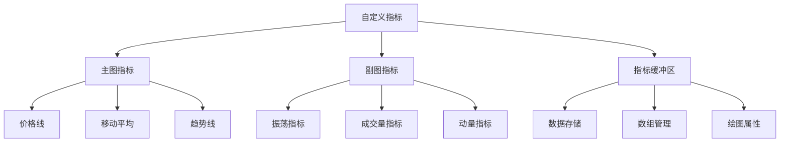

# 自定义指标开发

> 🎯 **学习目标**：掌握自定义指标的开发方法，能够创建各种技术分析指标并在图表上显示。

## 📚 指标概述

### 指标基本概念


## 🏗️ 指标结构

### 指标基本框架

#### 指标模板
```mql4
//+------------------------------------------------------------------+
//|                                    MyFirstIndicator.mq4        |
//|                        Copyright 2026, Your Name                |
//|                                             https://www.mql5.com |
//+------------------------------------------------------------------+
#property copyright "2026, Your Name"
#property link      "https://www.mql5.com"
#property version   "1.00"
#property strict

// 指标属性
#property indicator_chart_window  // 在主图显示
// #property indicator_separate_window  // 在副图显示

#property indicator_buffers 1      // 指标缓冲区数量
#property indicator_plots   1      // 绘制线数量

// 指标参数
input int MAPeriod = 20;           // 移动平均周期

// 指标缓冲区
double MABuffer[];

//+------------------------------------------------------------------+
//| Custom indicator initialization function                           |
//+------------------------------------------------------------------+
int OnInit()
  {
   // 设置指标缓冲区
   SetIndexBuffer(0, MABuffer);
   
   // 设置绘制样式
   SetIndexStyle(0, DRAW_LINE, STYLE_SOLID, 2, clrBlue);
   
   // 设置指标标签
   IndicatorShortName("MA(" + IntegerToString(MAPeriod) + ")");
   SetIndexLabel(0, "MA(" + IntegerToString(MAPeriod) + ")");
   
   return(INIT_SUCCEEDED);
  }

//+------------------------------------------------------------------+
//| Custom indicator deinitialization function                         |
//+------------------------------------------------------------------+
void OnDeinit(const int reason)
  {
   // 清理图表对象
   ObjectsDeleteAll(0, "MyFirstIndicator_");
   
   // 清除图表文本
   Comment("");
  }

//+------------------------------------------------------------------+
//| Custom indicator iteration function                                |
//+------------------------------------------------------------------+
int OnCalculate(const int rates_total,
                const int prev_calculated,
                const datetime &time[],
                const double &open[],
                const double &high[],
                const double &low[],
                const double &close[],
                const long &tick_volume[],
                const long &volume[],
                const int &spread[])
  {
   // 检查数据是否足够
   if(rates_total < MAPeriod)
      return(0);
   
   // 计算开始位置
   int start = prev_calculated;
   if(start == 0)
      start = MAPeriod - 1;
   
   // 计算指标值
   for(int i = start; i < rates_total; i++)
     {
      double sum = 0.0;
      for(int j = 0; j < MAPeriod; j++)
        {
         sum += close[i - j];
        }
      MABuffer[i] = sum / MAPeriod;
     }
   
   return(rates_total);
  }
```

## 📊 指标缓冲区

### 缓冲区管理

#### 多缓冲区指标
```mql4
//+------------------------------------------------------------------+
//|                                    MultiLineIndicator.mq4     |
//+------------------------------------------------------------------+
#property copyright "2026, Your Name"
#property version   "1.00"
#property strict
#property indicator_chart_window
#property indicator_buffers 3
#property indicator_plots   3

input int FastPeriod = 10;
input int SlowPeriod = 20;

// 指标缓冲区
double FastMABuffer[];
double SlowMABuffer[];
double CrossBuffer[];

int OnInit()
  {
   // 设置缓冲区
   SetIndexBuffer(0, FastMABuffer);
   SetIndexBuffer(1, SlowMABuffer);
   SetIndexBuffer(2, CrossBuffer);
   
   // 设置绘制样式
   SetIndexStyle(0, DRAW_LINE, STYLE_SOLID, 2, clrBlue);
   SetIndexStyle(1, DRAW_LINE, STYLE_SOLID, 2, clrRed);
   SetIndexStyle(2, DRAW_ARROW, STYLE_SOLID, 2, clrGreen);
   
   // 设置箭头样式
   SetIndexArrow(2, 233);
   
   // 设置标签
   SetIndexLabel(0, "Fast MA(" + IntegerToString(FastPeriod) + ")");
   SetIndexLabel(1, "Slow MA(" + IntegerToString(SlowPeriod) + ")");
   SetIndexLabel(2, "Cross Signal");
   
   IndicatorShortName("MA Cross");
   
   return(INIT_SUCCEEDED);
  }

int OnCalculate(const int rates_total,
                const int prev_calculated,
                const datetime &time[],
                const double &open[],
                const double &high[],
                const double &low[],
                const double &close[],
                const long &tick_volume[],
                const long &volume[],
                const int &spread[])
  {
   if(rates_total < SlowPeriod)
      return(0);
   
   int start = prev_calculated;
   if(start == 0)
      start = SlowPeriod - 1;
   
   // 计算快速MA
   for(int i = start; i < rates_total; i++)
     {
      double sum = 0.0;
      for(int j = 0; j < FastPeriod; j++)
        {
         sum += close[i - j];
        }
      FastMABuffer[i] = sum / FastPeriod;
     }
   
   // 计算慢速MA
   for(int i = start; i < rates_total; i++)
     {
      double sum = 0.0;
      for(int j = 0; j < SlowPeriod; j++)
        {
         sum += close[i - j];
        }
      SlowMABuffer[i] = sum / SlowPeriod;
     }
   
   // 绘制交叉信号
   for(int i = start + 1; i < rates_total; i++)
     {
      // 金叉
      if(FastMABuffer[i] > SlowMABuffer[i] && 
         FastMABuffer[i-1] <= SlowMABuffer[i-1])
        {
         CrossBuffer[i] = Low[i] - 10 * Point;
        }
      // 死叉
      else if(FastMABuffer[i] < SlowMABuffer[i] && 
              FastMABuffer[i-1] >= SlowMABuffer[i-1])
        {
         CrossBuffer[i] = High[i] + 10 * Point;
        }
      else
        {
         CrossBuffer[i] = EMPTY_VALUE;
        }
     }
   
   return(rates_total);
  }
```

## 📈 绘图样式

### 各种绘制方式

#### 线条样式
```mql4
// 设置不同的线条样式
void SetupLineStyles()
  {
   // 实线
   SetIndexStyle(0, DRAW_LINE, STYLE_SOLID, 2, clrBlue);
   
   // 虚线
   SetIndexStyle(1, DRAW_LINE, STYLE_DASH, 2, clrRed);
   
   // 点线
   SetIndexStyle(2, DRAW_LINE, STYLE_DOT, 2, clrGreen);
   
   // 点划线
   SetIndexStyle(3, DRAW_LINE, STYLE_DASHDOT, 2, clrYellow);
  }
```

#### 箭头样式
```mql4
// 使用箭头绘制信号
void SetupArrowIndicator()
  {
   // 设置绘制方式为箭头
   SetIndexStyle(0, DRAW_ARROW, STYLE_SOLID, 3, clrBlue);
   
   // 设置箭头类型（0-255）
   SetIndexArrow(0, 233);  // 233=向上箭头
   
   // 设置标签
   SetIndexLabel(0, "Signal");
  }
```

#### 柱状图样式
```mql4
// 绘制柱状图（如MACD柱）
void SetupHistogramIndicator()
  {
   // 设置为柱状图
   SetIndexStyle(0, DRAW_HISTOGRAM, STYLE_SOLID, 2, clrBlue);
   SetIndexStyle(1, DRAW_HISTOGRAM, STYLE_SOLID, 2, clrRed);
   
   // 设置空值
   SetIndexEmptyValue(0, 0);
   SetIndexEmptyValue(1, 0);
  }
```

#### 区域填充
```mql4
// 绘制填充区域
void SetupFillIndicator()
  {
   // 设置两个线用于填充
   SetIndexStyle(0, DRAW_LINE, STYLE_SOLID, 1, clrBlue);
   SetIndexStyle(1, DRAW_LINE, STYLE_SOLID, 1, clrRed);
   
   // 设置填充
   SetIndexFill(0, true);
   
   // 设置填充颜色
   SetIndexStyle(0, DRAW_FILLING, STYLE_SOLID, 1, clrBlue);
   SetIndexStyle(1, DRAW_FILLING, STYLE_SOLID, 1, clrRed);
  }
```

## 🎯 常用指标实现

### 移动平均线指标

#### 多种MA实现
```mql4
//+------------------------------------------------------------------+
//|                                       MultiMAIndicator.mq4     |
//+------------------------------------------------------------------+
#property copyright "2026, Your Name"
#property version   "1.00"
#property strict
#property indicator_chart_window
#property indicator_buffers 3
#property indicator_plots   3

input int MAPeriod = 14;
input int MAType = 0;        // 0=SMA, 1=EMA, 2=SMMA, 3=LWMA

double SMABuffer[];
double EMABuffer[];
double LWMABuffer[];

int OnInit()
  {
   SetIndexBuffer(0, SMABuffer);
   SetIndexBuffer(1, EMABuffer);
   SetIndexBuffer(2, LWMABuffer);
   
   SetIndexStyle(0, DRAW_LINE, STYLE_SOLID, 2, clrBlue);
   SetIndexStyle(1, DRAW_LINE, STYLE_SOLID, 2, clrRed);
   SetIndexStyle(2, DRAW_LINE, STYLE_SOLID, 2, clrGreen);
   
   SetIndexLabel(0, "SMA(" + IntegerToString(MAPeriod) + ")");
   SetIndexLabel(1, "EMA(" + IntegerToString(MAPeriod) + ")");
   SetIndexLabel(2, "LWMA(" + IntegerToString(MAPeriod) + ")");
   
   IndicatorShortName("Multiple MAs");
   
   return(INIT_SUCCEEDED);
  }

int OnCalculate(const int rates_total,
                const int prev_calculated,
                const datetime &time[],
                const double &open[],
                const double &high[],
                const double &low[],
                const double &close[],
                const long &tick_volume[],
                const long &volume[],
                const int &spread[])
  {
   if(rates_total < MAPeriod)
      return(0);
   
   int start = prev_calculated;
   if(start == 0)
      start = MAPeriod - 1;
   
   // SMA - 简单移动平均
   for(int i = start; i < rates_total; i++)
     {
      double sum = 0.0;
      for(int j = 0; j < MAPeriod; j++)
        {
         sum += close[i - j];
        }
      SMABuffer[i] = sum / MAPeriod;
     }
   
   // EMA - 指数移动平均
   double multiplier = 2.0 / (MAPeriod + 1.0);
   EMABuffer[start] = SMABuffer[start];  // 初始值
   
   for(int i = start + 1; i < rates_total; i++)
     {
      EMABuffer[i] = (close[i] * multiplier) + (EMABuffer[i-1] * (1 - multiplier));
     }
   
   // LWMA - 线性加权移动平均
   for(int i = start; i < rates_total; i++)
     {
      double sum = 0.0;
      double weightSum = 0.0;
      
      for(int j = 0; j < MAPeriod; j++)
        {
         double weight = (MAPeriod - j);
         sum += close[i - j] * weight;
         weightSum += weight;
        }
      
      LWMABuffer[i] = sum / weightSum;
     }
   
   return(rates_total);
  }
```

### RSI指标

#### 相对强弱指数
```mql4
//+------------------------------------------------------------------+
//|                                           CustomRSI.mq4        |
//+------------------------------------------------------------------+
#property copyright "2026, Your Name"
#property version   "1.00"
#property strict
#property indicator_separate_window
#property indicator_buffers 3
#property indicator_plots   3

input int RSIPeriod = 14;
input int Overbought = 70;
input int Oversold = 30;

double RSIBuffer[];
double OverboughtBuffer[];
double OversoldBuffer[];

int OnInit()
  {
   SetIndexBuffer(0, RSIBuffer);
   SetIndexBuffer(1, OverboughtBuffer);
   SetIndexBuffer(2, OversoldBuffer);
   
   SetIndexStyle(0, DRAW_LINE, STYLE_SOLID, 2, clrBlue);
   SetIndexStyle(1, DRAW_LINE, STYLE_DOT, 1, clrRed);
   SetIndexStyle(2, DRAW_LINE, STYLE_DOT, 1, clrGreen);
   
   SetIndexLabel(0, "RSI(" + IntegerToString(RSIPeriod) + ")");
   SetIndexLabel(1, "Overbought (" + IntegerToString(Overbought) + ")");
   SetIndexLabel(2, "Oversold (" + IntegerToString(Oversold) + ")");
   
   // 设置固定级别
   SetLevelStyle(STYLE_SOLID, 1, clrSilver);
   SetLevelValue(0, Overbought);
   SetLevelValue(1, Oversold);
   
   IndicatorShortName("RSI(" + IntegerToString(RSIPeriod) + ")");
   IndicatorDigits(2);
   
   return(INIT_SUCCEEDED);
  }

int OnCalculate(const int rates_total,
                const int prev_calculated,
                const datetime &time[],
                const double &open[],
                const double &high[],
                const double &low[],
                const double &close[],
                const long &tick_volume[],
                const long &volume[],
                const int &spread[])
  {
   if(rates_total <= RSIPeriod)
      return(0);
   
   int start = prev_calculated;
   if(start == 0)
      start = RSIPeriod;
   
   // 计算RSI
   for(int i = start; i < rates_total; i++)
     {
      double gains = 0;
      double losses = 0;
      
      // 计算初始平均收益和损失
      for(int j = i - RSIPeriod + 1; j <= i; j++)
        {
         double change = close[j] - close[j-1];
         if(change > 0)
            gains += change;
         else
            losses -= change;
        }
      
      double avgGain = gains / RSIPeriod;
      double avgLoss = losses / RSIPeriod;
      
      // 计算RSI
      if(avgLoss == 0)
         RSIBuffer[i] = 100;
      else
        {
         double rs = avgGain / avgLoss;
         RSIBuffer[i] = 100 - (100 / (1 + rs));
        }
      
      // 设置超买超卖级别
      OverboughtBuffer[i] = Overbought;
      OversoldBuffer[i] = Oversold;
     }
   
   return(rates_total);
  }
```

### 布林带指标

#### 布林带实现
```mql4
//+------------------------------------------------------------------+
//|                                       CustomBollinger.mq4     |
//+------------------------------------------------------------------+
#property copyright "2026, Your Name"
#property version   "1.00"
#property strict
#property indicator_chart_window
#property indicator_buffers 3
#property indicator_plots   3

input int BBPeriod = 20;
input double BBDeviations = 2.0;

double MABuffer[];
double UpperBand[];
double LowerBand[];

int OnInit()
  {
   SetIndexBuffer(0, MABuffer);
   SetIndexBuffer(1, UpperBand);
   SetIndexBuffer(2, LowerBand);
   
   SetIndexStyle(0, DRAW_LINE, STYLE_SOLID, 2, clrBlue);
   SetIndexStyle(1, DRAW_LINE, STYLE_SOLID, 1, clrRed);
   SetIndexStyle(2, DRAW_LINE, STYLE_SOLID, 1, clrRed);
   
   SetIndexLabel(0, "MA(" + IntegerToString(BBPeriod) + ")");
   SetIndexLabel(1, "Upper Band");
   SetIndexLabel(2, "Lower Band");
   
   IndicatorShortName("Bollinger Bands");
   
   return(INIT_SUCCEEDED);
  }

int OnCalculate(const int rates_total,
                const int prev_calculated,
                const datetime &time[],
                const double &open[],
                const double &high[],
                const double &low[],
                const double &close[],
                const long &tick_volume[],
                const long &volume[],
                const int &spread[])
  {
   if(rates_total < BBPeriod)
      return(0);
   
   int start = prev_calculated;
   if(start == 0)
      start = BBPeriod - 1;
   
   // 计算移动平均和标准差
   for(int i = start; i < rates_total; i++)
     {
      // 计算移动平均
      double sum = 0.0;
      for(int j = 0; j < BBPeriod; j++)
        {
         sum += close[i - j];
        }
      MABuffer[i] = sum / BBPeriod;
      
      // 计算标准差
      double variance = 0.0;
      for(int j = 0; j < BBPeriod; j++)
        {
         double diff = close[i - j] - MABuffer[i];
         variance += diff * diff;
        }
      double stdDev = MathSqrt(variance / BBPeriod);
      
      // 计算上下轨
      UpperBand[i] = MABuffer[i] + BBDeviations * stdDev;
      LowerBand[i] = MABuffer[i] - BBDeviations * stdDev;
     }
   
   return(rates_total);
  }
```

## 🎨 图表对象

### 创建自定义对象

#### 绘制文本和标签
```mql4
// 在图表上绘制文本
void DrawText(string name, string text, int x, int y, color clr = clrBlack)
  {
   if(ObjectFind(0, name) < 0)
     {
      ObjectCreate(0, name, OBJ_LABEL, 0, 0, 0);
     }
   
   ObjectSetString(0, name, OBJPROP_TEXT, text);
   ObjectSetInteger(0, name, OBJPROP_XDISTANCE, x);
   ObjectSetInteger(0, name, OBJPROP_YDISTANCE, y);
   ObjectSetInteger(0, name, OBJPROP_COLOR, clr);
   ObjectSetInteger(0, name, OBJPROP_FONTSIZE, 10);
   ObjectSetString(0, name, OBJPROP_FONT, "Arial");
  }

// 使用示例
void DisplayIndicatorInfo()
  {
   DrawText("IndicatorTitle", "自定义指标", 10, 20, clrBlue);
   DrawText("CurrentTime", "时间: " + TimeToString(TimeCurrent()), 10, 40, clrBlack);
  }

void OnDeinit(const int reason)
  {
   ObjectsDeleteAll(0, "IndicatorTitle");
   ObjectsDeleteAll(0, "CurrentTime");
  }
```

#### 绘制价格线
```mql4
// 绘制水平价格线
void DrawHorizontalLine(string name, double price, color clr = clrBlue, int width = 1)
  {
   if(ObjectFind(0, name) < 0)
     {
      ObjectCreate(0, name, OBJ_HLINE, 0, 0, price);
     }
   else
     {
      ObjectSetDouble(0, name, OBJPROP_PRICE, price);
     }
   
   ObjectSetInteger(0, name, OBJPROP_COLOR, clr);
   ObjectSetInteger(0, name, OBJPROP_WIDTH, width);
   ObjectSetInteger(0, name, OBJPROP_STYLE, STYLE_SOLID);
  }

// 绘制垂直时间线
void DrawVerticalLine(string name, datetime time, color clr = clrBlue)
  {
   if(ObjectFind(0, name) < 0)
     {
      ObjectCreate(0, name, OBJ_VLINE, 0, time, 0);
     }
   else
     {
      ObjectSetInteger(0, name, OBJPROP_TIME, time);
     }
   
   ObjectSetInteger(0, name, OBJPROP_COLOR, clr);
   ObjectSetInteger(0, name, OBJPROP_WIDTH, 1);
   ObjectSetInteger(0, name, OBJPROP_STYLE, STYLE_DASH);
  }

// 使用示例
void DrawSupportResistance()
  {
   // 绘制支撑位和阻力位
   double resistance = iHigh(_Symbol, PERIOD_CURRENT, 20);
   double support = iLow(_Symbol, PERIOD_CURRENT, 20);
   
   DrawHorizontalLine("Resistance", resistance, clrRed, 2);
   DrawHorizontalLine("Support", support, clrGreen, 2);
   
   // 绘制当前时间线
   DrawVerticalLine("CurrentTime", TimeCurrent(), clrBlue);
  }
```

## 🎯 实战练习

### 练习1：自定义信号指标

#### 任务要求
```mql4
// 创建一个信号指标
// 功能：
// 1. 检测RSI超买超卖
// 2. 在超买时显示卖出信号
// 3. 在超卖时显示买入信号
```

#### 参考代码
```mql4
//+------------------------------------------------------------------+
//|                                    SignalIndicator.mq4       |
//+------------------------------------------------------------------+
#property copyright "2026, Practice"
#property version   "1.00"
#property strict
#property indicator_chart_window
#property indicator_buffers 1
#property indicator_plots   1

input int RSIPeriod = 14;
input int OverboughtLevel = 70;
input int OversoldLevel = 30;

double SignalBuffer[];

int OnInit()
  {
   SetIndexBuffer(0, SignalBuffer);
   SetIndexStyle(0, DRAW_ARROW, STYLE_SOLID, 3, clrBlue);
   SetIndexArrow(0, 233);  // 向上箭头
   SetIndexLabel(0, "RSI Signal");
   
   IndicatorShortName("RSI Signal Indicator");
   
   return(INIT_SUCCEEDED);
  }

int OnCalculate(const int rates_total,
                const int prev_calculated,
                const datetime &time[],
                const double &open[],
                const double &high[],
                const double &low[],
                const double &close[],
                const long &tick_volume[],
                const long &volume[],
                const int &spread[])
  {
   if(rates_total <= RSIPeriod + 1)
      return(0);
   
   int start = prev_calculated;
   if(start == 0)
      start = RSIPeriod + 1;
   
   for(int i = start; i < rates_total; i++)
     {
      // 计算RSI
      double rsi = iRSI(_Symbol, PERIOD_CURRENT, RSIPeriod, PRICE_CLOSE, i);
      double rsi1 = iRSI(_Symbol, PERIOD_CURRENT, RSIPeriod, PRICE_CLOSE, i+1);
      
      SignalBuffer[i] = EMPTY_VALUE;
      
      // 超卖回调：买入信号
      if(rsi1 < OversoldLevel && rsi >= OversoldLevel)
        {
         SignalBuffer[i] = Low[i] - 10 * Point;
        }
      // 超买回调：卖出信号
      else if(rsi1 > OverboughtLevel && rsi <= OverboughtLevel)
        {
         SignalBuffer[i] = High[i] + 10 * Point;
        }
     }
   
   return(rates_total);
  }
```

## 💡 最佳实践

### 指标开发建议

#### 性能优化
- ✅ **避免重复计算**：缓存计算结果
- ✅ **限制计算范围**：只计算必要的K线
- ✅ **使用适当的数据类型**：double用于价格，int用于索引
- ❌ **过度计算**：避免不必要的循环

#### 视觉设计
- ✅ **颜色选择**：使用对比度高的颜色
- ✅ **线条粗细**：重要线条使用粗线
- ✅ **标签清晰**：提供清晰的标签说明
- ❌ **过度拥挤**：避免图表过于复杂

## 🔗 相关资源

- [[MQL4函数与控制流]] - 函数和控制流
- [[Expert Advisor基础]] - EA开发
- [[技术分析基础]] - 指标原理
- [[图表对象操作]] - 对象管理

### 官方文档

- **自定义指标**：https://www.mql5.com/en/docs/mql4/basis/indicator
- **指标缓冲区**：https://www.mql5.com/en/docs/mql4/basis/indicators

---
*创建时间: 2026-02-01*  
*分类: 3 Resources*
