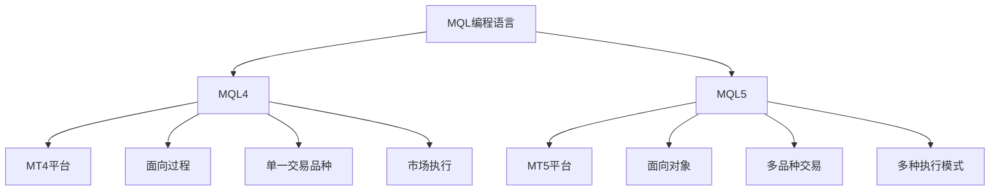

# 📈 MQL4 & MQL5知识库导航

> 欢迎来到MQL4和MQL5完整教程库！这里涵盖了从零基础到专业级交易系统开发的全方位MQL编程知识体系。

## 🎯 学习目标

- **初学者**：从零开始掌握MQL4/MQL5编程基础
- **交易者**：学习编写自动化交易策略和指标
- **开发者**：掌握MQL在量化交易中的深度应用

## 📚 MQL4 vs MQL5

### 版本对比


### 主要差异
| 特性 | MQL4 | MQL5 |
|-----|------|------|
| 平台 | MetaTrader 4 | MetaTrader 5 |
| 编程范式 | 面向过程 | 面向对象 |
| 交易管理 | OrderSend() | CTrade类 |
| 指标缓冲区 | 指标缓冲区数组 | 指标缓冲区数组 |
| 事件处理 | start() | OnTick() |
| 市场深度 | 不支持 | 支持 |
| 多线程 | 不支持 | 部分支持 |

## 📚 知识库结构

### 🔰 01 基础入门
[[MQL4环境搭建与工具配置]] - 开发环境准备和MetaEditor使用
[[MQL4基础语法与数据类型]] - 语言核心语法和数据结构
[[MQL4函数与控制流]] - 条件判断、循环和函数定义
[[MQL4交易操作基础]] - 订单管理和交易操作
[[MQL5面向对象编程]] - 类、对象、继承与多态
[[调试与错误处理]] - 代码调试和错误处理机制

### 🔨 02 核心功能
#### 指标开发
[[自定义指标开发]] - 创建技术分析指标
[[指标缓冲区管理]] - 指标数据存储和显示
[[多时间框架分析]] - 跨周期指标开发
[[指标信号系统]] - 交易信号生成和警报

#### EA开发
[[Expert Advisor基础]] - EA框架和生命周期
[[交易策略实现]] - 常见交易策略编程
[[风险管理模块]] - 止损、止盈和仓位管理
[[性能优化技巧]] - EA性能提升方法

### 🌿 03 技术分析
#### 技术指标
[[移动平均线策略]] - MA交易系统开发
[[MACD指标应用]] - 趋势跟踪策略
[[RSI策略开发]] - 超买超卖策略
[[布林带策略]] - 波动率交易策略
[[多重指标组合]] - 多指标协同策略

#### 图表分析
[[价格行为分析]] - K线形态识别
[[支撑阻力识别]] - 关键价位识别
[[趋势线分析]] - 趋势线绘制和交易
[[斐波那契应用]] - 黄金分割位交易

### 🚀 04 高级应用
[[多品种交易系统]] - 跨品种交易策略
[[套利交易实现]] - 套利机会识别和执行
[[机器学习集成]] - AI模型在MQL中的应用
[[外部API集成]] - 与外部系统数据交互
[[高频交易基础]] - 高频交易策略开发

### 💡 05 最佳实践
[[代码规范与优化]] - 代码质量和性能
[[测试与回测]] - 策略测试和验证
[[风险管理实践]] - 交易风险控制
[[实盘部署指南]] - EA上线和监控
[[常见问题排查]] - 问题诊断和解决

### 🛠️ 06 资源与工具
[[MetaTrader文档]] - 官方文档和API参考
[[常用函数库]] - 第三方库和工具
[[交易社区资源]] - 学习资源和案例
[[MQL代码库]] - 免费代码和模板
[[交易平台选择]] - MT4 vs MT5选择指南

## 🗺️ 学习路径图

### 🟢 初学者路径 (1-2个月)


### 🟡 进阶路径 (3-6个月)


### 🔴 专家路径 (6-12个月)


## 💻 快速开始

### 🎯 10分钟快速入门
```mql4
// 你的第一个MQL4程序
//+------------------------------------------------------------------+
//|                                            MyFirstEA.mq4        |
//|                        Copyright 2026, Your Name                |
//|                                             https://www.mql5.com |
//+------------------------------------------------------------------+
#property copyright "2026, Your Name"
#property link      "https://www.mql5.com"
#property version   "1.00"
#property strict

//+------------------------------------------------------------------+
//| Expert initialization function                                     |
//+------------------------------------------------------------------+
int OnInit()
  {
   Print("Hello, MQL4!");
   return(INIT_SUCCEEDED);
  }

//+------------------------------------------------------------------+
//| Expert deinitialization function                                   |
//+------------------------------------------------------------------+
void OnDeinit(const int reason)
  {
   Print("Goodbye, MQL4!");
  }

//+------------------------------------------------------------------+
//| Expert tick function                                               |
//+------------------------------------------------------------------+
void OnTick()
  {
   // 获取当前价格
   double bid = MarketInfo(Symbol(), MODE_BID);
   double ask = MarketInfo(Symbol(), MODE_ASK);
   
   // 输出价格信息
   Print("Bid: ", bid, " Ask: ", ask);
  }
```

### 🛠️ 开发环境配置

| 应用场景 | 推荐工具 | 适用人群 |
|---------|----------|----------|
| MQL4开发 | MetaEditor 4 | MT4用户 |
| MQL5开发 | MetaEditor 5 | MT5用户 |
| 专业开发 | VS Code + MQL扩展 | 专业开发者 |
| 快速原型 | MQL在线编辑器 | 学习者 |

## 📊 学习进度追踪

### 🏆 成就系统
- 🥉 新手村：完成MQL基础语法学习
- 🥈 策略师：开发第一个可运行的EA
- 🥇 交易员：完成实盘部署并盈利
- 👑 大师：开发多品种交易系统

### 📈 技能评估
- **语法掌握**：95%以上准确率
- **策略开发**：独立完成中等复杂度EA
- **风险管理**：正确实施止损和仓位管理
- **实盘验证**：在模拟账户中稳定盈利

## 🤝 社区资源

### 📚 优质学习资源
- **官方文档**：[MQL5.com](https://www.mql5.com/en/docs)
- **中文教程**：[MQL5中文社区](https://www.mql5.com/zh)
- **代码库**：[MQL5代码库](https://www.mql5.com/en/code)
- **论坛**：[MQL5论坛](https://www.mql5.com/en/forum)

### 💬 交流社区
- **MQL5论坛**：技术问题解答
- **量化交易群**：策略讨论和分享
- **GitHub**：开源项目和代码学习

## 🎯 MQL4 vs MQL5 选择指南

### 选择MQL4的情况
- ✅ 使用MT4平台
- ✅ 简单EA开发
- ✅ 兼容性要求高
- ✅ 面向过程编程习惯

### 选择MQL5的情况
- ✅ 使用MT5平台
- ✅ 复杂交易系统
- ✅ 多品种交易
- ✅ 面向对象编程习惯

## 🚀 开始你的MQL之旅

### 🎓 推荐学习流程
1. **选择平台** - 根据需求选择MT4或MT5
2. **环境搭建** - 安装MetaEditor和相关工具
3. **基础学习** - 掌握语言基础和交易操作
4. **实战练习** - 从简单指标和EA开始
5. **策略开发** - 实现个人交易策略
6. **实盘验证** - 模拟账户测试和优化

### 👀 快速导航
- 💚 **零基础** → [[MQL4环境搭建与工具配置]]
- 🔵 **有基础** → [[Expert Advisor基础]]  
- 🟢 **想应用** → [[交易策略实现]]
- 🟡 **需优化** → [[性能优化技巧]]

---
> 💡 **学习提示**：MQL编程需要理解金融市场的基本知识。建议在学习编程之前，先了解外汇交易的基本概念、技术分析和风险管理。记住：自动交易系统不能保证盈利，严格的资金管理是成功的关键。

**🌟 开始你的MQL编程之旅吧！**

---
*创建时间: 2026-02-01*  
*分类: 3 Resources*
