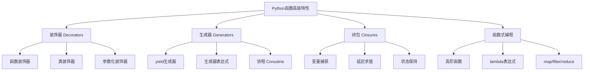

# 函数高级特性

> 🎯 **学习目标**：掌握Python函数的高级特性，包括装饰器、生成器、闭包和函数式编程，提升代码的灵活性和可维护性。

## 📚 高级特性概述

### Python函数高级特性树


## 🎨 装饰器（Decorators）

### 装饰器基础概念

#### 什么是装饰器
```python
# 装饰器本质：接受函数作为参数，返回新函数
def simple_decorator(func):
    """简单装饰器"""
    def wrapper():
        print("装饰器：函数调用前")
        result = func()
        print("装饰器：函数调用后")
        return result
    return wrapper

@simple_decorator
def say_hello():
    print("Hello, World!")

# 等价于：say_hello = simple_decorator(say_hello)
say_hello()

# 输出：
# 装饰器：函数调用前
# Hello, World!
# 装饰器：函数调用后
```

#### 装饰器保持函数元信息
```python
from functools import wraps

def my_decorator(func):
    @wraps(func)  # 保留原函数的元信息
    def wrapper(*args, **kwargs):
        """包装函数的文档"""
        print(f"调用函数: {func.__name__}")
        return func(*args, **kwargs)
    return wrapper

@my_decorator
def add(a, b):
    """计算两个数的和"""
    return a + b

print(add.__name__)    # 输出: add（而不是wrapper）
print(add.__doc__)     # 输出: 计算两个数的和
```

### 常用装饰器模式

#### 计时装饰器
```python
import time
from functools import wraps

def timer_decorator(func):
    """计算函数执行时间的装饰器"""
    @wraps(func)
    def wrapper(*args, **kwargs):
        start_time = time.time()
        result = func(*args, **kwargs)
        end_time = time.time()
        execution_time = end_time - start_time
        print(f"函数 {func.__name__} 执行时间: {execution_time:.4f}秒")
        return result
    return wrapper

@timer_decorator
def slow_function():
    """模拟耗时操作"""
    time.sleep(1)
    return "完成"

slow_function()
# 输出：函数 slow_function 执行时间: 1.0002秒
```

#### 日志装饰器
```python
def log_decorator(func):
    """记录函数调用日志的装饰器"""
    @wraps(func)
    def wrapper(*args, **kwargs):
        print(f"调用函数: {func.__name__}")
        print(f"参数: args={args}, kwargs={kwargs}")
        try:
            result = func(*args, **kwargs)
            print(f"返回值: {result}")
            return result
        except Exception as e:
            print(f"异常: {e}")
            raise
    return wrapper

@log_decorator
def divide(a, b):
    """除法运算"""
    return a / b

divide(10, 2)
divide(10, 0)  # 会记录异常信息
```

#### 缓存装饰器
```python
from functools import lru_cache

@lru_cache(maxsize=128)
def fibonacci(n):
    """计算斐波那契数列（带缓存）"""
    if n <= 1:
        return n
    return fibonacci(n - 1) + fibonacci(n - 2)

# 第一次调用会计算
print(fibonacci(10))  # 55
# 第二次调用直接从缓存获取（非常快）
print(fibonacci(10))  # 55

# 查看缓存信息
print(fibonacci.cache_info())
# CacheInfo(hits=1, misses=11, maxsize=128, currsize=11)

# 清除缓存
fibonacci.cache_clear()
```

#### 权限验证装饰器
```python
def require_permission(permission):
    """参数化装饰器：检查用户权限"""
    def decorator(func):
        @wraps(func)
        def wrapper(*args, **kwargs):
            # 模拟权限检查
            user_permissions = kwargs.get('permissions', [])
            if permission in user_permissions:
                return func(*args, **kwargs)
            else:
                raise PermissionError(f"缺少权限: {permission}")
        return wrapper
    return decorator

@require_permission('admin')
def delete_user(user_id, permissions=[]):
    """删除用户"""
    print(f"删除用户 {user_id}")
    return True

# 正确调用
delete_user(123, permissions=['admin'])

# 错误调用（会抛出异常）
# delete_user(123, permissions=['user'])
```

### 高级装饰器技术

#### 类装饰器
```python
class CountCalls:
    """类装饰器：统计函数调用次数"""
    def __init__(self, func):
        self.func = func
        self.count = 0
    
    def __call__(self, *args, **kwargs):
        self.count += 1
        print(f"函数 {self.func.__name__} 调用次数: {self.count}")
        return self.func(*args, **kwargs)

@CountCalls
def greet(name):
    """打招呼"""
    return f"Hello, {name}!"

greet("Alice")  # 调用次数: 1
greet("Bob")    # 调用次数: 2
```

#### 多层装饰器
```python
def decorator1(func):
    @wraps(func)
    def wrapper(*args, **kwargs):
        print("装饰器1：前")
        result = func(*args, **kwargs)
        print("装饰器1：后")
        return result
    return wrapper

def decorator2(func):
    @wraps(func)
    def wrapper(*args, **kwargs):
        print("装饰器2：前")
        result = func(*args, **kwargs)
        print("装饰器2：后")
        return result
    return wrapper

@decorator1
@decorator2
def hello():
    print("Hello, World!")

hello()

# 执行顺序：
# 装饰器1：前
# 装饰器2：前
# Hello, World!
# 装饰器2：后
# 装饰器1：后
```

#### 带参数的装饰器
```python
def repeat(times):
    """重复执行函数多次"""
    def decorator(func):
        @wraps(func)
        def wrapper(*args, **kwargs):
            results = []
            for _ in range(times):
                result = func(*args, **kwargs)
                results.append(result)
            return results
        return wrapper
    return decorator

@repeat(times=3)
def roll_dice():
    """掷骰子"""
    import random
    return random.randint(1, 6)

print(roll_dice())  # 例如: [4, 2, 6]
```

## 🔁 生成器（Generators）

### 生成器基础

#### yield关键字基础
```python
def simple_generator():
    """简单生成器"""
    yield 1
    yield 2
    yield 3

# 创建生成器对象
gen = simple_generator()

# 手动获取值
print(next(gen))  # 1
print(next(gen))  # 2
print(next(gen))  # 3

# 遍历生成器
gen = simple_generator()
for value in gen:
    print(value)

# 转换为列表
values = list(simple_generator())
print(values)  # [1, 2, 3]
```

#### 生成器与列表对比
```python
# 列表：一次性生成所有数据，占用内存
def create_list(n):
    """创建列表"""
    result = []
    for i in range(n):
        result.append(i ** 2)
    return result

large_list = create_list(1000000)  # 占用大量内存

# 生成器：惰性求值，节省内存
def create_generator(n):
    """创建生成器"""
    for i in range(n):
        yield i ** 2

large_gen = create_generator(1000000)  # 几乎不占用内存
print(next(large_gen))  # 0
print(next(large_gen))  # 1
```

### 生成器应用场景

#### 无限序列生成
```python
def fibonacci_generator():
    """斐波那契数列生成器"""
    a, b = 0, 1
    while True:
        yield a
        a, b = b, a + b

# 只生成前10个斐波那契数
fib_gen = fibonacci_generator()
for _ in range(10):
    print(next(fib_gen), end=" ")  # 0 1 1 2 3 5 8 13 21 34
```

#### 数据流处理
```python
def process_data(data_stream):
    """处理数据流的生成器"""
    for item in data_stream:
        # 数据清洗
        if item is None:
            continue
        
        # 数据转换
        processed = item * 2
        
        # 数据过滤
        if processed > 100:
            yield processed

# 模拟数据流
data = [10, 20, None, 30, 40, 50, None, 60]

# 使用生成器处理
for processed_data in process_data(data):
    print(processed_data)
```

#### 文件读取生成器
```python
def read_large_file(file_path, chunk_size=1024):
    """逐块读取大文件"""
    with open(file_path, 'r', encoding='utf-8') as file:
        while True:
            chunk = file.read(chunk_size)
            if not chunk:
                break
            yield chunk

# 逐行读取文件
def read_lines(file_path):
    """逐行读取文件"""
    with open(file_path, 'r', encoding='utf-8') as file:
        for line in file:
            yield line.strip()

# 使用示例
for line in read_lines('data.txt'):
    print(line)
```

### 生成器表达式

#### 基本生成器表达式
```python
# 列表推导式：创建列表
squares = [x**2 for x in range(10)]
print(squares)  # [0, 1, 4, 9, 16, 25, 36, 49, 64, 81]

# 生成器表达式：创建生成器
squares_gen = (x**2 for x in range(10))
print(list(squares_gen))  # [0, 1, 4, 9, 16, 25, 36, 49, 64, 81]

# 内存使用对比
import sys

# 列表占用内存
list_obj = [x**2 for x in range(1000000)]
print(f"列表内存: {sys.getsizeof(list_obj)} bytes")

# 生成器占用内存
gen_obj = (x**2 for x in range(1000000))
print(f"生成器内存: {sys.getsizeof(gen_obj)} bytes")  # 小得多
```

#### 复杂生成器表达式
```python
# 带条件的生成器表达式
even_numbers = (x for x in range(20) if x % 2 == 0)
print(list(even_numbers))  # [0, 2, 4, 6, 8, 10, 12, 14, 16, 18]

# 嵌套生成器表达式
matrix_gen = ((i*j for j in range(3)) for i in range(3))
for row in matrix_gen:
    print(list(row))
# [0, 0, 0]
# [0, 1, 2]
# [0, 2, 4]

# 生成器链式处理
numbers = range(1, 21)

# 链式处理：筛选 -> 映射 -> 过滤
result = (
    x**2                    # 平方
    for x in numbers
    if x % 2 == 1           # 只处理奇数
)
result = (
    x*2                     # 再乘以2
    for x in result
    if x < 200              # 过滤大数
)

print(list(result))  # [2, 18, 50, 98, 162]
```

### 协程（Coroutines）

#### 协程基础
```python
def simple_coroutine():
    """简单协程"""
    print("协程开始")
    value = yield
    print(f"接收到: {value}")
    print("协程结束")

# 创建协程
coro = simple_coroutine()

# 激活协程
next(coro)  # 协程开始

# 发送值到协程
coro.send("Hello")  # 接收到: Hello，协程结束
```

#### 生产者-消费者模式
```python
def consumer():
    """消费者协程"""
    print("消费者等待数据...")
    try:
        while True:
            item = yield
            print(f"消费者处理: {item}")
    except GeneratorExit:
        print("消费者关闭")

def producer(consumer_coroutine):
    """生产者"""
    for i in range(5):
        print(f"生产者发送: {i}")
        consumer_coroutine.send(i)
    
    # 关闭消费者
    consumer_coroutine.close()

# 创建并激活消费者
consumer_coro = consumer()
next(consumer_coro)

# 启动生产者
producer(consumer_coro)
```

## 🔄 闭包（Closures）

### 闭包基础

#### 闭包定义
```python
def make_multiplier(factor):
    """创建乘法器的工厂函数"""
    def multiply(number):
        return number * factor
    return multiply

# 创建不同的乘法器
double = make_multiplier(2)
triple = make_multiplier(3)

print(double(5))   # 10
print(triple(5))   # 15

# 查看闭包变量
print(double.__closure__[0].cell_contents)  # 2
```

#### 闭包保持状态
```python
def counter():
    """计数器闭包"""
    count = 0
    
    def increment():
        nonlocal count  # 声明使用外部作用域的变量
        count += 1
        return count
    
    return increment

# 创建独立的计数器
counter1 = counter()
counter2 = counter()

print(counter1())  # 1
print(counter1())  # 2
print(counter2())  # 1
print(counter1())  # 3
```

### 闭包应用场景

#### 数据封装
```python
def make_account(balance):
    """银行账户闭包"""
    def deposit(amount):
        nonlocal balance
        balance += amount
        return balance
    
    def withdraw(amount):
        nonlocal balance
        if amount <= balance:
            balance -= amount
            return balance
        else:
            raise ValueError("余额不足")
    
    def get_balance():
        return balance
    
    return {
        'deposit': deposit,
        'withdraw': withdraw,
        'get_balance': get_balance
    }

# 创建账户
account = make_account(1000)
print(account['get_balance']())  # 1000

account['deposit'](500)
print(account['get_balance']())  # 1500

account['withdraw'](200)
print(account['get_balance']())  # 1300
```

#### 延迟计算
```python
def lazy_evaluation(expensive_func):
    """延迟计算闭包"""
    cached_value = None
    computed = False
    
    def wrapper():
        nonlocal cached_value, computed
        if not computed:
            cached_value = expensive_func()
            computed = True
        return cached_value
    
    return wrapper

# 模拟耗时计算
def expensive_computation():
    print("执行耗时计算...")
    import time
    time.sleep(1)
    return "计算结果"

# 创建延迟计算函数
lazy_func = lazy_evaluation(expensive_computation)

# 第一次调用会执行计算
print(lazy_func())  # 执行耗时计算...，计算结果

# 第二次调用直接返回缓存结果
print(lazy_func())  # 计算结果（不会打印）
```

## ⚡ 函数式编程

### 高阶函数

#### map函数
```python
# map：对序列中每个元素应用函数
numbers = [1, 2, 3, 4, 5]

# 使用map平方每个数
squared = list(map(lambda x: x**2, numbers))
print(squared)  # [1, 4, 9, 16, 25]

# 使用多个序列
names = ["Alice", "Bob", "Charlie"]
ages = [25, 30, 35]
person_info = list(map(lambda n, a: f"{n}: {a}", names, ages))
print(person_info)  # ['Alice: 25', 'Bob: 30', 'Charlie: 35']
```

#### filter函数
```python
# filter：过滤序列中的元素
numbers = [1, 2, 3, 4, 5, 6, 7, 8, 9, 10]

# 筛选偶数
even_numbers = list(filter(lambda x: x % 2 == 0, numbers))
print(even_numbers)  # [2, 4, 6, 8, 10]

# 筛选大于5的数
greater_than_5 = list(filter(lambda x: x > 5, numbers))
print(greater_than_5)  # [6, 7, 8, 9, 10]
```

#### reduce函数
```python
from functools import reduce

# reduce：对序列进行累计操作
numbers = [1, 2, 3, 4, 5]

# 计算乘积
product = reduce(lambda x, y: x * y, numbers)
print(product)  # 120

# 计算最大值
maximum = reduce(lambda x, y: x if x > y else y, numbers)
print(maximum)  # 5

# 字符串连接
words = ["Hello", "World", "Python"]
sentence = reduce(lambda x, y: f"{x} {y}", words)
print(sentence)  # Hello World Python
```

### lambda表达式

#### lambda基础
```python
# lambda：匿名函数
add = lambda x, y: x + y
print(add(3, 5))  # 8

# 多参数lambda
power = lambda base, exponent=2: base ** exponent
print(power(3))     # 9
print(power(3, 3))  # 27

# 复杂lambda
complex_func = lambda x: x**2 if x > 0 else x**3
print(complex_func(5))   # 25
print(complex_func(-5))  # -125
```

#### lambda与高阶函数结合
```python
# 排序
students = [
    {"name": "Alice", "age": 25},
    {"name": "Bob", "age": 30},
    {"name": "Charlie", "age": 20}
]

# 按年龄排序
sorted_by_age = sorted(students, key=lambda x: x['age'])
print(sorted_by_age)

# 按名字长度排序
sorted_by_name_length = sorted(students, key=lambda x: len(x['name']))
print(sorted_by_name_length)
```

### 函数式编程实战

#### 数据处理管道
```python
def process_data_pipeline(data):
    """数据处理管道"""
    # 1. 过滤空值
    filtered = filter(lambda x: x is not None, data)
    
    # 2. 转换为大写
    uppercased = map(str.upper, filtered)
    
    # 3. 过滤短字符串
    filtered_length = filter(lambda x: len(x) > 5, uppercased)
    
    # 4. 转换为列表
    return list(filtered_length)

data = ["hello", "world", None, "python", "hi", "programming"]
result = process_data_pipeline(data)
print(result)  # ['HELLO', 'WORLD', 'PYTHON', 'PROGRAMMING']
```

#### 函数组合
```python
def compose(*functions):
    """函数组合：将多个函数组合成一个"""
    def composed(x):
        for func in reversed(functions):
            x = func(x)
        return x
    return composed

# 定义简单函数
add_one = lambda x: x + 1
multiply_by_two = lambda x: x * 2
subtract_five = lambda x: x - 5

# 组合函数
complex_operation = compose(subtract_five, multiply_by_two, add_one)
result = complex_operation(10)
# 执行顺序: add_one(10) -> 11 -> multiply_by_two(11) -> 22 -> subtract_five(22) -> 17
print(result)  # 17
```

## 🎯 实战练习

### 练习1：性能分析装饰器
```python
import time
from functools import wraps

def performance_analysis(func):
    """性能分析装饰器"""
    @wraps(func)
    def wrapper(*args, **kwargs):
        call_count = wrapper.call_count
        wrapper.call_count += 1
        
        start_time = time.time()
        result = func(*args, **kwargs)
        end_time = time.time()
        
        execution_time = end_time - start_time
        
        print(f"函数: {func.__name__}")
        print(f"调用次数: {call_count}")
        print(f"执行时间: {execution_time:.6f}秒")
        
        return result
    
    wrapper.call_count = 1
    return wrapper

@performance_analysis
def factorial(n):
    """计算阶乘"""
    if n <= 1:
        return 1
    return n * factorial(n - 1)

# 测试
print(factorial(5))   # 120
print(factorial(10))  # 3628800
```

### 练习2：数据流生成器
```python
def temperature_data_generator(start_temp, days=30):
    """生成温度数据"""
    temp = start_temp
    for day in range(days):
        # 模拟温度波动
        import random
        change = random.uniform(-3, 3)
        temp += change
        temp = max(-20, min(40, temp))  # 限制在-20到40度之间
        yield {
            'day': day + 1,
            'temperature': round(temp, 1)
        }

def analyze_temperature(temperature_gen):
    """分析温度数据"""
    temps = [data['temperature'] for data in temperature_gen]
    
    analysis = {
        'average': round(sum(temps) / len(temps), 1),
        'max': max(temps),
        'min': min(temps),
        'days': len(temps)
    }
    
    return analysis

# 使用示例
temp_gen = temperature_data_generator(20, days=30)
analysis = analyze_temperature(temp_gen)
print(analysis)
```

### 练习3：缓存装饰器实现
```python
from functools import wraps

def memoize(max_size=128):
    """自定义缓存装饰器"""
    def decorator(func):
        cache = {}
        
        @wraps(func)
        def wrapper(*args, **kwargs):
            # 创建缓存键
            cache_key = (args, frozenset(kwargs.items()))
            
            # 检查缓存
            if cache_key in cache:
                return cache[cache_key]
            
            # 执行函数并缓存结果
            result = func(*args, **kwargs)
            
            # 检查缓存大小
            if len(cache) >= max_size:
                # 简单的LRU策略：移除第一个元素
                cache.pop(next(iter(cache)))
            
            cache[cache_key] = result
            return result
        
        wrapper.cache = cache
        return wrapper
    return decorator

@memoize(max_size=10)
def expensive_function(n):
    """模拟耗时函数"""
    import time
    time.sleep(0.1)  # 模拟耗时操作
    return n ** 2

# 测试缓存
print(expensive_function(5))  # 第一次：慢
print(expensive_function(5))  # 第二次：快（从缓存获取）
print(expensive_function.cache)  # 查看缓存内容
```

## 💡 最佳实践

### 装饰器使用建议
- ✅ **保留函数元信息**：使用 `@wraps(func)` 保持原函数信息
- ✅ **文档字符串**：为装饰器添加清晰的文档说明
- ✅ **参数验证**：在装饰器中验证参数的有效性
- ❌ **避免过度嵌套**：不要使用太多层装饰器

### 生成器使用建议
- ✅ **处理大数据**：使用生成器处理大文件或大数据集
- ✅ **内存效率**：在内存敏感的应用中使用生成器
- ❌ **避免过早求值**：不要过早将生成器转换为列表

### 闭包使用建议
- ✅ **数据封装**：使用闭包封装相关数据和操作
- ✅ **状态保持**：在需要保持状态的场景中使用闭包
- ❌ **注意内存泄漏**：避免在闭包中持有大量数据

## 🔗 相关资源

- [[控制流与函数]] - 函数基础知识
- [[面向对象编程]] - 类和对象
- [[模块与包管理]] - 代码组织
- [[异步编程]] - 协程进阶

---
*创建时间: 2026-02-01*  
*分类: 3 Resources*
