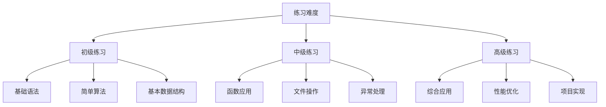

# 基础编程练习集

> 🎯 **学习目标**：通过实际编程练习巩固Python基础知识，提升问题解决能力和代码实现能力。

## 📚 练习分类

### 练习难度分级


## 🔰 初级练习

### 练习1：数字猜谜游戏

#### 题目描述
编写一个数字猜谜游戏，程序随机生成1-100之间的数字，用户输入猜测，程序提示"大了"或"小了"，直到猜中为止。

#### 参考答案
```python
import random

def guess_number_game():
    """数字猜谜游戏"""
    # 生成随机数
    secret_number = random.randint(1, 100)
    attempts = 0
    
    print("欢迎来到数字猜谜游戏！")
    print("我已经想好了一个1到100之间的数字，请你猜一猜。")
    
    while True:
        try:
            # 获取用户输入
            guess = int(input("请输入你的猜测（1-100）："))
            attempts += 1
            
            # 验证输入范围
            if guess < 1 or guess > 100:
                print("请输入1到100之间的数字！")
                continue
            
            # 比较猜测与目标
            if guess < secret_number:
                print("太小了！再试一次。")
            elif guess > secret_number:
                print("太大了！再试一次。")
            else:
                print(f"恭喜你！猜对了！数字是{secret_number}")
                print(f"你总共猜了{attempts}次。")
                break
                
        except ValueError:
            print("请输入有效的数字！")

# 运行游戏
guess_number_game()
```

#### 难度升级
```python
def guess_number_game_hard():
    """难度升级版：限制猜测次数"""
    secret_number = random.randint(1, 100)
    max_attempts = 7
    attempts = 0
    
    print(f"数字猜谜游戏（难度版）")
    print(f"你有{max_attempts}次机会猜中1到100之间的数字！")
    
    while attempts < max_attempts:
        try:
            guess = int(input(f"第{attempts + 1}次猜测："))
            attempts += 1
            
            if guess == secret_number:
                print(f"恭喜你！第{attempts}次就猜对了！")
                return True
            elif attempts < max_attempts:
                remaining = max_attempts - attempts
                hint = "太小了" if guess < secret_number else "太大了"
                print(f"{hint}！还有{remaining}次机会。")
        
        except ValueError:
            print("请输入有效的数字！")
    
    print(f"很遗憾，你没有猜中。正确答案是{secret_number}")
    return False

guess_number_game_hard()
```

### 练习2：温度转换器

#### 题目描述
编写温度转换程序，实现摄氏度和华氏度之间的双向转换。

#### 参考答案
```python
def celsius_to_fahrenheit(celsius):
    """摄氏度转华氏度"""
    return (celsius * 9/5) + 32

def fahrenheit_to_celsius(fahrenheit):
    """华氏度转摄氏度"""
    return (fahrenheit - 32) * 5/9

def temperature_converter():
    """温度转换器主程序"""
    print("温度转换器")
    print("1. 摄氏度转华氏度")
    print("2. 华氏度转摄氏度")
    
    choice = input("请选择转换方向（1/2）：")
    
    if choice == '1':
        try:
            celsius = float(input("请输入摄氏温度："))
            fahrenheit = celsius_to_fahrenheit(celsius)
            print(f"{celsius}°C = {fahrenheit:.1f}°F")
        except ValueError:
            print("请输入有效的数字！")
    
    elif choice == '2':
        try:
            fahrenheit = float(input("请输入华氏温度："))
            celsius = fahrenheit_to_celsius(fahrenheit)
            print(f"{fahrenheit}°F = {celsius:.1f}°C")
        except ValueError:
            print("请输入有效的数字！")
    
    else:
        print("无效的选择！")

# 运行转换器
temperature_converter()
```

#### 扩展版本
```python
def convert_temperature(value, from_unit='C'):
    """通用温度转换"""
    from_unit = from_unit.upper()
    
    if from_unit == 'C':
        # 摄氏度
        return {
            'C': value,
            'F': value * 9/5 + 32,
            'K': value + 273.15
        }
    elif from_unit == 'F':
        # 华氏度
        return {
            'C': (value - 32) * 5/9,
            'F': value,
            'K': (value - 32) * 5/9 + 273.15
        }
    elif from_unit == 'K':
        # 开尔文
        return {
            'C': value - 273.15,
            'F': (value - 273.15) * 9/5 + 32,
            'K': value
        }
    else:
        raise ValueError("不支持的温度单位")

# 使用示例
temp = convert_temperature(25, 'C')
print(f"25°C = {temp['F']:.1f}°F = {temp['K']:.1f}K")
```

### 练习3：学生成绩管理

#### 题目描述
编写学生成绩管理系统，实现成绩录入、计算平均分、最高分、最低分等功能。

#### 参考答案
```python
def grade_management_system():
    """学生成绩管理系统"""
    students = []
    
    while True:
        print("\n学生成绩管理系统")
        print("1. 添加学生成绩")
        print("2. 显示所有学生成绩")
        print("3. 计算班级统计信息")
        print("4. 退出")
        
        choice = input("请选择操作（1-4）：")
        
        if choice == '1':
            # 添加学生成绩
            name = input("请输入学生姓名：")
            try:
                score = float(input(f"请输入{name}的成绩："))
                if score < 0 or score > 100:
                    print("成绩必须在0到100之间！")
                    continue
                students.append({'name': name, 'score': score})
                print(f"成功添加学生：{name}")
            except ValueError:
                print("请输入有效的成绩！")
        
        elif choice == '2':
            # 显示所有学生成绩
            if not students:
                print("还没有学生记录！")
            else:
                print("\n学生成绩列表：")
                for i, student in enumerate(students, 1):
                    print(f"{i}. {student['name']}: {student['score']}分")
        
        elif choice == '3':
            # 计算统计信息
            if not students:
                print("还没有学生记录！")
            else:
                scores = [s['score'] for s in students]
                average = sum(scores) / len(scores)
                highest = max(scores)
                lowest = min(scores)
                
                print(f"\n班级统计信息：")
                print(f"学生人数：{len(students)}")
                print(f"平均分：{average:.1f}")
                print(f"最高分：{highest}")
                print(f"最低分：{lowest}")
        
        elif choice == '4':
            print("谢谢使用！")
            break
        
        else:
            print("无效的选择！")

# 运行系统
grade_management_system()
```

### 练习4：密码生成器

#### 题目描述
编写密码生成器，根据用户要求生成随机密码。

#### 参考答案
```python
import random
import string

def generate_password(length=12, use_uppercase=True, use_digits=True, use_special=True):
    """生成随机密码"""
    # 基础字符集
    chars = string.ascii_lowercase
    
    # 添加可选字符
    if use_uppercase:
        chars += string.ascii_uppercase
    if use_digits:
        chars += string.digits
    if use_special:
        chars += '!@#$%^&*'
    
    # 生成密码
    password = ''.join(random.choice(chars) for _ in range(length))
    
    return password

def password_generator():
    """密码生成器主程序"""
    print("密码生成器")
    
    try:
        length = int(input("请输入密码长度（默认12）：") or "12")
        use_uppercase = input("包含大写字母（Y/n）：").lower() != 'n'
        use_digits = input("包含数字（Y/n）：").lower() != 'n'
        use_special = input("包含特殊字符（Y/n）：").lower() != 'n'
        
        password = generate_password(length, use_uppercase, use_digits, use_special)
        print(f"\n生成的密码：{password}")
        
    except ValueError:
        print("请输入有效的数字！")

# 运行生成器
password_generator()
```

## 🟡 中级练习

### 练习5：文本分析器

#### 题目描述
编写文本分析器，统计文本中的单词数、字符数、句子数、段落数等。

#### 参考答案
```python
import re

def analyze_text(text):
    """分析文本"""
    # 统计字符数
    char_count = len(text)
    char_count_no_spaces = len(text.replace(' ', '').replace('\n', ''))
    
    # 统计单词数
    words = re.findall(r'\b\w+\b', text)
    word_count = len(words)
    
    # 统计句子数
    sentences = re.split(r'[.!?]+', text)
    sentence_count = len([s for s in sentences if s.strip()])
    
    # 统计段落数
    paragraphs = text.split('\n\n')
    paragraph_count = len([p for p in paragraphs if p.strip()])
    
    # 统计词频
    word_frequency = {}
    for word in words:
        word_lower = word.lower()
        word_frequency[word_lower] = word_frequency.get(word_lower, 0) + 1
    
    # 获取最常用的词
    most_common = sorted(word_frequency.items(), key=lambda x: x[1], reverse=True)[:5]
    
    return {
        'characters': char_count,
        'characters_no_spaces': char_count_no_spaces,
        'words': word_count,
        'sentences': sentence_count,
        'paragraphs': paragraph_count,
        'most_common_words': most_common
    }

def text_analyzer():
    """文本分析器主程序"""
    print("文本分析器")
    print("请输入文本（输入空行结束）：")
    
    lines = []
    while True:
        line = input()
        if not line:
            break
        lines.append(line)
    
    text = '\n'.join(lines)
    
    # 分析文本
    result = analyze_text(text)
    
    # 显示结果
    print("\n分析结果：")
    print(f"字符数：{result['characters']}")
    print(f"字符数（不含空格）：{result['characters_no_spaces']}")
    print(f"单词数：{result['words']}")
    print(f"句子数：{result['sentences']}")
    print(f"段落数：{result['paragraphs']}")
    
    print("\n最常用的词：")
    for word, count in result['most_common_words']:
        print(f"  {word}: {count}次")

# 运行分析器
text_analyzer()
```

### 练习6：待办事项列表

#### 题目描述
编写待办事项管理程序，支持添加、完成、删除、显示任务等功能。

#### 参考答案
```python
import json
from datetime import datetime

class TodoList:
    """待办事项列表类"""
    
    def __init__(self, filename='todos.json'):
        self.filename = filename
        self.todos = self.load_todos()
    
    def load_todos(self):
        """从文件加载待办事项"""
        try:
            with open(self.filename, 'r', encoding='utf-8') as f:
                return json.load(f)
        except FileNotFoundError:
            return []
    
    def save_todos(self):
        """保存待办事项到文件"""
        with open(self.filename, 'w', encoding='utf-8') as f:
            json.dump(self.todos, f, ensure_ascii=False, indent=2)
    
    def add_todo(self, task):
        """添加待办事项"""
        todo = {
            'id': len(self.todos) + 1,
            'task': task,
            'completed': False,
            'created': datetime.now().strftime('%Y-%m-%d %H:%M:%S')
        }
        self.todos.append(todo)
        self.save_todos()
        print(f"已添加任务：{task}")
    
    def complete_todo(self, todo_id):
        """标记任务为完成"""
        for todo in self.todos:
            if todo['id'] == todo_id:
                todo['completed'] = True
                todo['completed_at'] = datetime.now().strftime('%Y-%m-%d %H:%M:%S')
                self.save_todos()
                print(f"任务已完成：{todo['task']}")
                return True
        print("未找到指定任务！")
        return False
    
    def delete_todo(self, todo_id):
        """删除任务"""
        for i, todo in enumerate(self.todos):
            if todo['id'] == todo_id:
                deleted_task = self.todos.pop(i)
                self.save_todos()
                print(f"已删除任务：{deleted_task['task']}")
                return True
        print("未找到指定任务！")
        return False
    
    def list_todos(self, show_all=False):
        """显示待办事项"""
        if not self.todos:
            print("没有待办事项！")
            return
        
        print("\n待办事项列表：")
        print("-" * 50)
        
        for todo in self.todos:
            if not show_all and todo['completed']:
                continue
            
            status = "✓" if todo['completed'] else "○"
            print(f"{todo['id']}. [{status}] {todo['task']}")
            print(f"   创建时间: {todo['created']}")
            if todo['completed']:
                print(f"   完成时间: {todo.get('completed_at', 'N/A')}")
            print("-" * 50)

def todo_app():
    """待办事项应用主程序"""
    todo_list = TodoList()
    
    while True:
        print("\n待办事项管理")
        print("1. 添加任务")
        print("2. 完成任务")
        print("3. 删除任务")
        print("4. 显示任务")
        print("5. 显示所有任务")
        print("6. 退出")
        
        choice = input("请选择操作（1-6）：")
        
        if choice == '1':
            task = input("请输入任务描述：")
            if task.strip():
                todo_list.add_todo(task)
            else:
                print("任务不能为空！")
        
        elif choice == '2':
            todo_list.list_todos()
            try:
                todo_id = int(input("请输入任务ID："))
                todo_list.complete_todo(todo_id)
            except ValueError:
                print("请输入有效的ID！")
        
        elif choice == '3':
            todo_list.list_todos()
            try:
                todo_id = int(input("请输入任务ID："))
                todo_list.delete_todo(todo_id)
            except ValueError:
                print("请输入有效的ID！")
        
        elif choice == '4':
            todo_list.list_todos(show_all=False)
        
        elif choice == '5':
            todo_list.list_todos(show_all=True)
        
        elif choice == '6':
            print("谢谢使用！")
            break
        
        else:
            print("无效的选择！")

# 运行应用
todo_app()
```

### 练习7：简易计算器

#### 题目描述
编写一个支持四则运算的简易计算器，支持连续运算和历史记录。

#### 参考答案
```python
import re

class Calculator:
    """简易计算器"""
    
    def __init__(self):
        self.history = []
        self.current_result = 0
    
    def calculate(self, expression):
        """计算表达式"""
        try:
            # 安全性检查：只允许数字和运算符
            if not re.match(r'^[\d+\-*/().\s]+$', expression):
                raise ValueError("包含非法字符")
            
            # 计算结果
            result = eval(expression)
            
            # 保存到历史记录
            self.history.append({
                'expression': expression,
                'result': result,
                'time': __import__('datetime').datetime.now().strftime('%H:%M:%S')
            })
            
            self.current_result = result
            return result
        
        except ZeroDivisionError:
            return "错误：除数不能为零"
        except SyntaxError:
            return "错误：表达式语法错误"
        except Exception as e:
            return f"错误：{e}"
    
    def show_history(self):
        """显示历史记录"""
        if not self.history:
            print("还没有计算历史！")
            return
        
        print("\n计算历史：")
        for i, record in enumerate(self.history, 1):
            print(f"{i}. {record['expression']} = {record['result']}")
            print(f"   时间: {record['time']}")
    
    def clear_history(self):
        """清除历史记录"""
        self.history = []
        self.current_result = 0
        print("历史记录已清除！")

def calculator_app():
    """计算器应用"""
    calc = Calculator()
    
    print("简易计算器")
    print("支持运算：+, -, *, /, ()")
    print("输入 'history' 查看历史，'clear' 清除历史，'quit' 退出")
    
    while True:
        expression = input("\n请输入表达式：")
        
        if expression.lower() == 'quit':
            print("谢谢使用！")
            break
        
        elif expression.lower() == 'history':
            calc.show_history()
        
        elif expression.lower() == 'clear':
            calc.clear_history()
        
        elif expression.strip():
            result = calc.calculate(expression)
            print(f"结果: {result}")
            
            # 允许使用上一次的结果
            if isinstance(result, (int, float)):
                print(f"(可以使用 'ans' 引用上次的结果: {result})")
        
        else:
            print("请输入有效的表达式！")

# 运行计算器
calculator_app()
```

## 🔴 高级练习

### 练习8：文件处理工具

#### 题目描述
编写文件处理工具，实现文件搜索、内容替换、批量重命名等功能。

#### 参考答案
```python
import os
import glob
from pathlib import Path

class FileProcessor:
    """文件处理工具类"""
    
    def __init__(self, base_dir='.'):
        self.base_dir = Path(base_dir)
    
    def search_files(self, pattern, file_type=None):
        """搜索文件"""
        search_pattern = self.base_dir / '**' / pattern
        
        if file_type:
            search_pattern = str(self.base_dir / '**' / f'*.{file_type}')
        
        files = glob.glob(search_pattern, recursive=True)
        return files
    
    def search_content(self, search_text, file_pattern='*.txt'):
        """在文件中搜索内容"""
        found_files = []
        
        for file_path in self.search_files(file_pattern):
            try:
                with open(file_path, 'r', encoding='utf-8') as f:
                    for line_num, line in enumerate(f, 1):
                        if search_text.lower() in line.lower():
                            found_files.append({
                                'file': file_path,
                                'line': line_num,
                                'content': line.strip()
                            })
                            break
            except Exception as e:
                print(f"读取文件 {file_path} 时出错: {e}")
        
        return found_files
    
    def replace_content(self, search_text, replace_text, file_pattern='*.txt'):
        """在文件中替换内容"""
        modified_files = []
        
        for file_path in self.search_files(file_pattern):
            try:
                with open(file_path, 'r', encoding='utf-8') as f:
                    content = f.read()
                
                if search_text in content:
                    new_content = content.replace(search_text, replace_text)
                    
                    with open(file_path, 'w', encoding='utf-8') as f:
                        f.write(new_content)
                    
                    modified_files.append(file_path)
                    print(f"已修改: {file_path}")
            
            except Exception as e:
                print(f"处理文件 {file_path} 时出错: {e}")
        
        return modified_files
    
    def batch_rename(self, old_pattern, new_pattern, file_type=None):
        """批量重命名文件"""
        renamed_files = []
        
        for file_path in self.search_files('*', file_type):
            try:
                file_name = Path(file_path).name
                new_name = file_name.replace(old_pattern, new_pattern)
                
                if new_name != file_name:
                    new_path = Path(file_path).parent / new_name
                    Path(file_path).rename(new_path)
                    renamed_files.append((file_path, str(new_path)))
                    print(f"重命名: {file_name} -> {new_name}")
            
            except Exception as e:
                print(f"重命名文件 {file_path} 时出错: {e}")
        
        return renamed_files

def file_processor_app():
    """文件处理工具应用"""
    print("文件处理工具")
    
    while True:
        print("\n请选择功能：")
        print("1. 搜索文件")
        print("2. 搜索文件内容")
        print("3. 替换文件内容")
        print("4. 批量重命名")
        print("5. 退出")
        
        choice = input("请选择操作（1-5）：")
        
        if choice == '1':
            pattern = input("请输入文件名模式（如 *.txt）：")
            file_type = input("文件类型扩展名（如 txt，留空表示所有）：") or None
            files = FileProcessor().search_files(pattern, file_type)
            print(f"\n找到 {len(files)} 个文件：")
            for file in files:
                print(f"  - {file}")
        
        elif choice == '2':
            search_text = input("请输入搜索内容：")
            file_pattern = input("文件模式（如 *.txt，默认 *.txt）：") or "*.txt"
            results = FileProcessor().search_content(search_text, file_pattern)
            print(f"\n在 {len(results)} 个文件中找到匹配：")
            for result in results:
                print(f"  - {result['file']}: 行{result['line']}")
        
        elif choice == '3':
            search_text = input("请输入要替换的文本：")
            replace_text = input("请输入替换文本：")
            file_pattern = input("文件模式（如 *.txt，默认 *.txt）：") or "*.txt"
            modified = FileProcessor().replace_content(search_text, replace_text, file_pattern)
            print(f"\n已修改 {len(modified)} 个文件")
        
        elif choice == '4':
            old_pattern = input("请输入要替换的模式：")
            new_pattern = input("请输入新的模式：")
            file_type = input("文件类型扩展名（留空表示所有）：") or None
            renamed = FileProcessor().batch_rename(old_pattern, new_pattern, file_type)
            print(f"\n已重命名 {len(renamed)} 个文件")
        
        elif choice == '5':
            print("谢谢使用！")
            break
        
        else:
            print("无效的选择！")

# 运行文件处理工具
file_processor_app()
```

### 练习9：数据可视化

#### 题目描述
使用matplotlib库创建数据可视化程序，绘制各种图表。

#### 参考答案
```python
import matplotlib.pyplot as plt
import numpy as np
from collections import Counter

def plot_line_chart(data, title="折线图"):
    """绘制折线图"""
    plt.figure(figsize=(10, 6))
    plt.plot(data['x'], data['y'], marker='o')
    plt.title(title)
    plt.xlabel('X轴')
    plt.ylabel('Y轴')
    plt.grid(True)
    plt.show()

def plot_bar_chart(data, title="柱状图"):
    """绘制柱状图"""
    plt.figure(figsize=(10, 6))
    categories = data['categories']
    values = data['values']
    
    plt.bar(categories, values)
    plt.title(title)
    plt.xlabel('类别')
    plt.ylabel('值')
    plt.xticks(rotation=45)
    plt.tight_layout()
    plt.show()

def plot_pie_chart(data, title="饼图"):
    """绘制饼图"""
    plt.figure(figsize=(8, 8))
    labels = data['labels']
    sizes = data['sizes']
    
    plt.pie(sizes, labels=labels, autopct='%1.1f%%', startangle=90)
    plt.title(title)
    plt.axis('equal')
    plt.show()

def plot_histogram(data, title="直方图", bins=10):
    """绘制直方图"""
    plt.figure(figsize=(10, 6))
    plt.hist(data['values'], bins=bins, edgecolor='black')
    plt.title(title)
    plt.xlabel('值')
    plt.ylabel('频率')
    plt.grid(True)
    plt.show()

def analyze_and_visualize(data, title_prefix="数据分析"):
    """分析并可视化数据"""
    # 数据统计
    values = data['values']
    print(f"数据统计：")
    print(f"  个数: {len(values)}")
    print(f"  平均值: {np.mean(values):.2f}")
    print(f"  中位数: {np.median(values):.2f}")
    print(f"  标准差: {np.std(values):.2f}")
    
    # 绘制直方图
    plot_histogram({'values': values}, f"{title_prefix} - 分布")
    
    # 如果是分类数据，绘制柱状图
    if 'categories' in data:
        plot_bar_chart(data, f"{title_prefix} - 类别")

def visualization_app():
    """可视化应用"""
    print("数据可视化工具")
    print("提示：需要安装 matplotlib 库")
    
    while True:
        print("\n请选择图表类型：")
        print("1. 折线图")
        print("2. 柱状图")
        print("3. 饼图")
        print("4. 直方图")
        print("5. 示例数据演示")
        print("6. 退出")
        
        choice = input("请选择操作（1-6）：")
        
        if choice == '1':
            try:
                x_values = list(map(float, input("请输入X值（逗号分隔）: ").split(',')))
                y_values = list(map(float, input("请输入Y值（逗号分隔）: ").split(',')))
                plot_line_chart({'x': x_values, 'y': y_values})
            except ValueError:
                print("请输入有效的数字！")
        
        elif choice == '2':
            try:
                categories = input("请输入类别（逗号分隔）: ").split(',')
                values = list(map(float, input("请输入值（逗号分隔）: ").split(',')))
                if len(categories) != len(values):
                    print("类别和值的数量不匹配！")
                else:
                    plot_bar_chart({'categories': categories, 'values': values})
            except ValueError:
                print("请输入有效的数字！")
        
        elif choice == '3':
            try:
                labels = input("请输入标签（逗号分隔）: ").split(',')
                sizes = list(map(float, input("请输入大小（逗号分隔）: ").split(',')))
                if len(labels) != len(sizes):
                    print("标签和大小的数量不匹配！")
                else:
                    plot_pie_chart({'labels': labels, 'sizes': sizes})
            except ValueError:
                print("请输入有效的数字！")
        
        elif choice == '4':
            try:
                values = list(map(float, input("请输入数据（逗号分隔）: ").split(',')))
                bins = int(input("请输入柱子数量（默认10）: ") or "10")
                plot_histogram({'values': values}, bins=bins)
            except ValueError:
                print("请输入有效的数字！")
        
        elif choice == '5':
            # 示例数据演示
            # 折线图示例
            x = list(range(10))
            y = [i**2 for i in x]
            plot_line_chart({'x': x, 'y': y}, "平方数列")
            
            # 柱状图示例
            sales_data = {
                'categories': ['产品A', '产品B', '产品C', '产品D'],
                'values': [150, 230, 180, 320]
            }
            plot_bar_chart(sales_data, "产品销售数据")
            
            # 饼图示例
            market_data = {
                'labels': ['苹果', '安卓', '其他'],
                'sizes': [45, 55, 5]
            }
            plot_pie_chart(market_data, "市场份额")
            
            # 直方图示例
            random_data = {'values': np.random.randn(1000)}
            plot_histogram(random_data, "随机数据分布", bins=30)
        
        elif choice == '6':
            print("谢谢使用！")
            break
        
        else:
            print("无效的选择！")

# 运行可视化工具
try:
    import matplotlib
    visualization_app()
except ImportError:
    print("错误：需要安装 matplotlib 库")
    print("请运行: pip install matplotlib")
```

## 💡 练习建议

### 学习策略
1. **循序渐进**：从初级练习开始，逐步提升难度
2. **独立完成**：先自己尝试，再参考答案
3. **代码优化**：完成基本功能后，思考如何改进
4. **举一反三**：将练习应用到实际项目中

### 调试技巧
1. **使用print**：在关键位置添加print语句
2. **分步测试**：将复杂问题分解为小步骤
3. **异常处理**：添加适当的异常处理
4. **代码复用**：提取重复代码为函数

### 进阶方向
1. **性能优化**：考虑算法复杂度和内存使用
2. **代码质量**：遵循PEP 8编码规范
3. **单元测试**：为关键功能编写测试
4. **文档编写**：添加清晰的注释和文档字符串

## 🔗 相关资源

- [[基础语法与数据类型]] - 基础知识回顾
- [[控制流与函数]] - 流程控制
- [[函数高级特性]] - 高级特性
- [[文件操作与异常处理]] - 文件I/O操作

---
*创建时间: 2026-02-01*  
*分类: 3 Resources*
