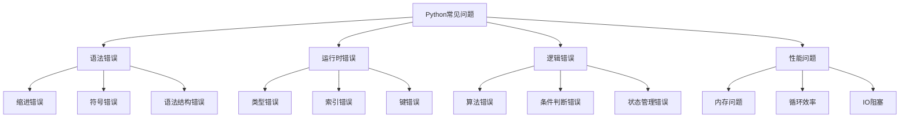

# 常见问题排查

> 🎯 **学习目标**：学会识别、诊断和解决Python编程中的常见问题，提升调试能力和问题解决技巧。

## 📚 问题分类

### 问题类型结构


## 🔍 语法错误

### 缩进错误

#### IndentationError
```python
# ❌ 错误示例1：缩进不一致
def my_function():
print("Hello")  # 错误：缺少缩进

# ❌ 错误示例2：混合使用制表符和空格
def my_function():
    print("Hello")  # 使用空格
	print("World")   # 使用制表符，会报错

# ✅ 正确做法：使用4个空格作为缩进
def my_function():
    print("Hello")
    print("World")

# ❌ 错误示例3：意外的缩进
x = 10
    y = 20  # 错误：意外缩进

# ✅ 正确做法：不要在不需要的地方缩进
x = 10
y = 20
```

#### 解决方案
```python
# 1. 使用编辑器自动格式化
# VS Code: Ctrl + Shift + I
# PyCharm: Ctrl + Alt + L

# 2. 配置编辑器将Tab转换为空格
# 大多数IDE都有此选项

# 3. 使用flake8检查代码
# pip install flake8
# flake8 your_file.py

# 4. 检查Python版本要求
# Python 3不允许混合使用tab和space
```

### 符号错误

#### 缺少引号、括号等
```python
# ❌ 缺少引号
message = Hello World  # NameError: name 'Hello' is not defined

# ✅ 正确：添加引号
message = "Hello World"

# ❌ 缺少括号
print "Hello"  # Python 2语法，Python 3会报错

# ✅ 正确：添加括号
print("Hello")

# ❌ 括号不匹配
print("Hello"  # SyntaxError: unexpected EOF while parsing

# ✅ 正确：闭合括号
print("Hello")

# ❌ 冒号缺失
if x > 0  # 缺少冒号
    print("Positive")

# ✅ 正确：添加冒号
if x > 0:
    print("Positive")
```

### 语法结构错误

#### 错误的语法使用
```python
# ❌ 使用未定义的变量
print(undefined_variable)  # NameError

# ✅ 正确：先定义变量
undefined_variable = "defined"
print(undefined_variable)

# ❌ 字符串中使用了未转义的特殊字符
path = "C:\new\file.txt"  # \n 被解释为换行符

# ✅ 正确：使用原始字符串或转义
path = r"C:\new\file.txt"
# 或
path = "C:\\new\\file.txt"

# ❌ 关键字作为变量名
class = "Python"  # SyntaxError: invalid syntax

# ✅ 正确：避免使用关键字
course = "Python"
```

## ⚠️ 运行时错误

### 类型错误

#### TypeError常见场景
```python
# ❌ 字符串与数字直接相加
result = "10" + 5  # TypeError: can only concatenate str (not "int") to str

# ✅ 解决方法1：类型转换
result = int("10") + 5

# ✅ 解决方法2：格式化字符串
result = f"10{5}"

# ❌ 列表和元组操作混淆
my_list = [1, 2, 3]
my_list[0] = 5  # ✅ 正确

my_tuple = (1, 2, 3)
my_tuple[0] = 5  # ❌ TypeError: 'tuple' object does not support item assignment

# ✅ 正确：创建新的元组
my_tuple = (5,) + my_tuple[1:]

# ❌ 函数参数类型错误
def add(a, b):
    return a + b

add("Hello", 5)  # TypeError

# ✅ 正确：传递正确的类型
add(5, 3)  # 8
add("Hello", "World")  # "HelloWorld"
```

#### 类型错误诊断
```python
# 使用类型提示
from typing import Union

def safe_add(a: Union[int, float, str], b: Union[int, float, str]) -> Union[int, float, str]:
    """安全的加法函数"""
    try:
        return a + b
    except TypeError:
        print(f"类型错误: 无法相加 {type(a)} 和 {type(b)}")
        return None

# 使用isinstance检查类型
def process_data(data):
    if isinstance(data, list):
        return "这是一个列表"
    elif isinstance(data, dict):
        return "这是一个字典"
    else:
        return f"未知的类型: {type(data)}"
```

### 索引错误

#### IndexError常见场景
```python
# ❌ 超出列表范围
numbers = [1, 2, 3]
print(numbers[3])  # IndexError: list index out of range

# ✅ 解决方法1：检查长度
if len(numbers) > 3:
    print(numbers[3])

# ✅ 解决方法2：使用负索引
print(numbers[-1])  # 3

# ✅ 解决方法3：使用try-except
try:
    print(numbers[3])
except IndexError:
    print("索引超出范围")

# ❌ 字符串索引错误
text = "Hello"
print(text[10])  # IndexError: string index out of range

# ✅ 正确：检查长度
if len(text) > 10:
    print(text[10])
```

### 键错误

#### KeyError常见场景
```python
# ❌ 访问不存在的键
user = {"name": "Alice", "age": 25}
print(user["email"])  # KeyError: 'email'

# ✅ 解决方法1：使用get方法
email = user.get("email", "未知邮箱")
print(email)  # "未知邮箱"

# ✅ 解决方法2：检查键是否存在
if "email" in user:
    print(user["email"])

# ✅ 解决方法3：使用try-except
try:
    print(user["email"])
except KeyError:
    print("邮箱不存在")

# ✅ 解决方法4：使用setdefault
email = user.setdefault("email", "unknown@example.com")
print(email)
```

### 属性错误

#### AttributeError常见场景
```python
# ❌ 调用不存在的属性
text = "Hello"
text.append("!")  # AttributeError: 'str' object has no attribute 'append'

# ✅ 正确：字符串没有append方法
text = text + "!"

# ❌ 大小写错误
my_list = [1, 2, 3]
print(my_list.LENGTH)  # AttributeError: 'list' object has no attribute 'LENGTH'

# ✅ 正确：使用正确的大小写
print(len(my_list))

# ❌ 导入错误的使用
import math
print(math.sqrt(-1))  # 复数会报错
# AttributeError (在某些实现中) 或 ValueError

# ✅ 正确：处理可能的错误
try:
    result = math.sqrt(-1)
except ValueError:
    print("无法计算负数的平方根")
```

## 🧠 逻辑错误

### 算法错误

#### 常见逻辑问题
```python
# ❌ 死循环
while True:
    print("无限循环")  # 永远不会退出

# ✅ 正确：添加退出条件
count = 0
while count < 10:
    print("循环中")
    count += 1

# ❌ 除以零
def divide(a, b):
    return a / b

result = divide(10, 0)  # ZeroDivisionError

# ✅ 正确：检查除数
def safe_divide(a, b):
    if b == 0:
        return None
    return a / b

# ❌ 错误的递归基线
def factorial(n):
    return n * factorial(n - 1)  # 无限递归

result = factorial(5)  # RecursionError

# ✅ 正确：添加基线条件
def factorial(n):
    if n <= 1:
        return 1
    return n * factorial(n - 1)
```

### 条件判断错误

#### 逻辑运算错误
```python
# ❌ 错误的逻辑运算
x = 10
if x > 5 or x < 8:  # 总是为True
    print("条件总是满足")

# ✅ 正确：使用and
if x > 5 and x < 8:
    print("条件正确")

# ❌ 错误的赋值与比较
x = 5
if x = 5:  # 语法错误，应该是 ==
    print("x等于5")

# ✅ 正确：使用==
if x == 5:
    print("x等于5")

# ❌ 链式比较错误
x = 10
if x > 5 and x > 15:  # 逻辑矛盾
    print("这不会执行")

# ✅ 正确：使用正确的比较
if x > 5 and x < 15:
    print("这会执行")

# ❌ 混淆is和==
a = [1, 2, 3]
b = [1, 2, 3]

if a == b:  # ✅ 内容相同
    print("内容相同")

if a is b:  # ❌ 不是同一个对象
    print("同一个对象")  # 不会执行

# ✅ 正确：明确使用is和==
if a is not b:
    print("不是同一个对象")
```

## 🚀 性能问题

### 内存问题

#### 内存泄漏和效率低下
```python
# ❌ 低效的列表操作（在循环中修改列表）
numbers = [1, 2, 3, 4, 5]
for i in range(len(numbers)):
    numbers.pop()  # 修改正在迭代的列表

# ✅ 正确：使用副本或迭代器
numbers = [1, 2, 3, 4, 5]
for i in range(len(numbers)):
    print(numbers[i])  # 不修改原列表

# 或
numbers = [1, 2, 3, 4, 5]
for number in numbers[:]:  # 创建副本
    print(number)

# ❌ 内存泄漏：持有大量对象引用
large_data = []
for i in range(1000000):
    large_data.append({"data": i * 2})  # 占用大量内存

# ✅ 正确：使用生成器
def generate_data(n):
    for i in range(n):
        yield {"data": i * 2}  # 逐个生成，不占用大量内存

# 或及时释放内存
large_data = []
# 使用large_data...
large_data = []  # 清空引用
```

### 循环效率

#### 低效的循环操作
```python
# ❌ 在循环中重复计算
def inefficient_function():
    result = []
    for i in range(1000):
        x = sum(range(100))  # 每次都重新计算
        result.append(i * x)
    return result

# ✅ 正确：预计算
def efficient_function():
    result = []
    x = sum(range(100))  # 只计算一次
    for i in range(1000):
        result.append(i * x)
    return result

# ❌ 多次调用len()
data = list(range(1000))
for i in range(len(data)):
    print(data[i])

# ✅ 正确：直接迭代
for item in data:
    print(item)

# ❌ 列表推导式中的重复计算
result = [x * expensive_calculation(x) for x in range(100)]

# ✅ 正确：使用生成器表达式
result = (x * expensive_calculation(x) for x in range(100))
result = list(result)  # 如果需要列表
```

## 🔧 调试技巧

### 使用print调试

#### 基本调试方法
```python
# ✅ 在关键位置添加print语句
def calculate_average(numbers):
    print(f"输入的数字: {numbers}")  # 调试信息
    if not numbers:
        print("列表为空")  # 调试信息
        return None
    
    total = sum(numbers)
    print(f"总和: {total}")  # 调试信息
    average = total / len(numbers)
    print(f"平均值: {average}")  # 调试信息
    
    return average

# ✅ 使用格式化字符串输出详细信息
def process_data(data):
    print(f"开始处理数据，数据长度: {len(data)}")
    
    for i, item in enumerate(data):
        print(f"处理第{i}个元素: {item}, 类型: {type(item)}")
        # 处理逻辑
    
    print("数据处理完成")
```

### 使用调试器

#### pdb调试器使用
```python
# 在代码中设置断点
import pdb

def complex_function(x, y):
    result = x * y
    pdb.set_trace()  # 设置断点，程序会在这里暂停
    # 可以使用以下命令：
    # n: 执行下一行
    # s: 进入函数
    # c: 继续执行
    # p variable: 打印变量值
    # l: 显示代码
    # q: 退出调试
    
    result = result + 10
    return result

# 更现代的方法：使用breakpoint()
def modern_debugging():
    x = 10
    y = 20
    breakpoint()  # Python 3.7+ 的断点设置方法
    result = x + y
    return result
```

### 异常处理

#### 全面的异常处理
```python
# ✅ 处理多种异常
def safe_operation(value):
    try:
        result = int(value)
        return result * 2
    except ValueError as e:
        print(f"值错误: {e}")
        return None
    except TypeError as e:
        print(f"类型错误: {e}")
        return None
    except Exception as e:
        print(f"未知错误: {e}")
        return None

# ✅ 提供有用的错误信息
def divide_numbers(a, b):
    try:
        return a / b
    except ZeroDivisionError:
        print(f"错误：尝试将 {a} 除以 {b}，除数不能为零")
        return None
    except TypeError:
        print(f"错误：参数类型不正确，{type(a)} 和 {type(b)}")
        return None

# ✅ 使用finally清理资源
def process_file(filename):
    file = None
    try:
        file = open(filename, 'r')
        content = file.read()
        return content
    except FileNotFoundError:
        print(f"文件 {filename} 不存在")
        return None
    finally:
        if file:
            file.close()
            print("文件已关闭")
```

### 单元测试

#### 编写测试用例
```python
import unittest

class TestMathFunctions(unittest.TestCase):
    
    def test_add(self):
        self.assertEqual(2 + 2, 4)
        self.assertEqual(0 + 0, 0)
    
    def test_divide(self):
        self.assertEqual(10 / 2, 5)
        with self.assertRaises(ZeroDivisionError):
            1 / 0
    
    def test_string_operations(self):
        self.assertEqual("Hello".upper(), "HELLO")
        self.assertEqual("World".lower(), "world")

# 运行测试
if __name__ == '__main__':
    unittest.main()
```

## 🛠️ 常用调试工具

### IDE调试功能

#### PyCharm/VS Code调试
```python
# 设置断点：在行号左侧点击
# 启动调试：F5 或 Debug按钮
# 单步执行：F10 (Step Over)
# 进入函数：F11 (Step Into)
# 跳出函数：Shift+F11 (Step Out)
# 查看变量：Variables窗口
# 查看调用栈：Call Stack窗口
# 表达式求值：在Evaluate Expression中输入表达式

# 示例：需要调试的代码
def process_user_data(users):
    processed_users = []
    
    for user in users:
        # 在这里设置断点
        user_id = user.get('id')
        user_name = user.get('name')
        
        if user_id and user_name:
            processed_user = {
                'id': user_id,
                'name': user_name.upper(),
                'processed': True
            }
            processed_users.append(processed_user)
    
    return processed_users
```

### 日志记录

#### 使用logging模块
```python
import logging

# 配置日志
logging.basicConfig(
    level=logging.DEBUG,
    format='%(asctime)s - %(levelname)s - %(message)s',
    filename='app.log'
)

def process_data(data):
    logging.info("开始处理数据")
    
    try:
        for item in data:
            logging.debug(f"处理项目: {item}")
            # 处理逻辑
            
        logging.info("数据处理完成")
        return True
    
    except Exception as e:
        logging.error(f"处理数据时出错: {e}")
        return False

# 使用不同级别的日志
def divide(a, b):
    logging.debug(f"尝试 {a} / {b}")
    
    if b == 0:
        logging.warning("除数为零")
        return None
    
    result = a / b
    logging.info(f"计算结果: {result}")
    return result
```

## 💡 预防性编程

### 代码审查清单

#### 编码最佳实践
```python
# ✅ 1. 使用有意义的变量名
# ❌ 糟糕的命名
x = 10
y = 20

# ✅ 好的命名
base_price = 10
tax_rate = 20

# ✅ 2. 添加类型提示
from typing import List, Dict, Optional

def process_users(users: List[Dict[str, any]]) -> Optional[List[Dict]]:
    """处理用户数据
    
    Args:
        users: 用户列表，每个用户是字典
    
    Returns:
        处理后的用户列表，如果输入无效则返回None
    """
    if not users:
        return None
    
    processed = []
    for user in users:
        processed_user = {**user, 'processed': True}
        processed.append(processed_user)
    
    return processed

# ✅ 3. 遵循PEP 8规范
# - 使用4个空格缩进
# - 行长度不超过79字符
# - 函数和类名使用描述性名称
# - 在函数之间空两行

# ✅ 4. 防御性编程
def get_value(dictionary, key, default=None):
    """安全地获取字典值"""
    if not isinstance(dictionary, dict):
        logging.warning(f"参数不是字典: {type(dictionary)}")
        return default
    
    return dictionary.get(key, default)

# ✅ 5. 输入验证
def calculate_discount(price, discount_rate):
    """计算折扣价格"""
    if not isinstance(price, (int, float)):
        raise TypeError("价格必须是数字")
    
    if not isinstance(discount_rate, (int, float)):
        raise TypeError("折扣率必须是数字")
    
    if price < 0:
        raise ValueError("价格不能为负数")
    
    if not 0 <= discount_rate <= 1:
        raise ValueError("折扣率必须在0到1之间")
    
    return price * (1 - discount_rate)
```

## 🔗 相关资源

- [[基础语法与数据类型]] - 基础知识回顾
- [[控制流与函数]] - 流程控制
- [[函数高级特性]] - 装饰器和异常
- [[文件操作与异常处理]] - 错误处理机制

### 在线资源

- **Python官方调试指南**: https://docs.python.org/3/library/pdb.html
- **PEP 8编码规范**: https://www.python.org/dev/peps/pep-0008/
- **Stack Overflow Python标签**: https://stackoverflow.com/questions/tagged/python

---
*创建时间: 2026-02-01*  
*分类: 3 Resources*
