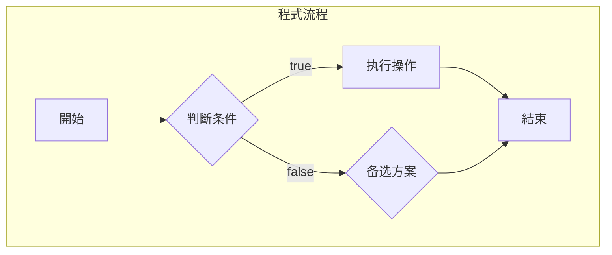

# 控制流与函数

> 🎯 **學習目標**：掌握Python的程式控制逻辑和函数定义，能夠編寫结构化、可維護的代碼。

## 📚 控制流概述

### 流程控制类型


## 🔤 条件语句

### if-elif-else结构

#### 基本语法
```python
# 简单条件判斷
age = 18

if age >= 18:
    print("成年人")
else:
    print("未成年人")

# 多条件判斷
score = 85

if score >= 90:
    grade = "A"
elif score >= 80:
    grade = "B"
elif score >= 70:
    grade = "C"
else:
    grade = "D"

print(f"等级: {grade}")  # 等级: A
```

#### 条件表达式
```python
# 布用条件表达式

# 三元運算符
x = 10
message = "偶数" if x % 2 == 0 else "奇数"
print(message)  # 偶数

# 嵌套条件
status = "completed"
priority = 3

if status == "completed":
    if priority >= 3:
        print("高優先級已完成任務")
    else:
        print("普通優先級已完成任務")
```

#### 条件判斷最佳實踐
```python
# ✅ 良好的做法：提前檢查条件
def process_data(data):
    if not data:
        return []
    
    processed = []
    for item in data:
        if isinstance(item, str) and item.strip():
            processed.append(item.strip())
    
    return processed

# ❌ 避免的写法：复杂嵌套
def bad_process_data(data):
    processed = []
    for item in data:
        if isinstance(item, str):
            if item.strip():
                processed.append(item.strip())
            else:
                pass
        else:
            if isinstance(item, int):
                processed.append(str(item))
            else:
                pass
    return processed
```

### 逻辑運算符

#### 基本逻辑運算
```python
# and 運算符：所有条件都为True时返回True
username = "admin"
password = "admin123"

if username == "admin" and password == "admin123":
    print("登入成功")
else:
    print("使用者名或密碼错误")

# or 運算符：任一条件为True时返回True
is_weekend = date.weekday() in [5, 6]  # 5=Saturday, 6=Sunday
is_holiday = date in holidays

if is_weekend or is_holiday:
    print("非工作時間")
```

#### 短路運算符
```python
# not 運算符：取反
user_active = False

if not user_active:
    print("使用者未登入")

# 组合逻辑運算
has_permission = True
is_valid_user = True
is_content_safe = False

if has_permission and is_valid_user and is_content_safe:
    print("允许操作")
else:
    print("拒絕操作：权限不足")
```

#### 短路表达式求值
```python
# 短路運算符的求值顺序
a = True
b = False
c = True

# 求值顺序：not > and > or
result = not a and b or c
print(result)  # True

# 使用括号明确優先級
result2 = (not a and b) or c
print(result2)  # True
```

#### 比较運算符
```python
# 数值比较
x = 10
y = 20

print(x == y)    # False
print(x != y)    # True
print(x < y)      # True
print(x <= y)     # True
print(x > y)      # False
print(x >= y)     # False

# 字符串比较（按字典序）
print("apple" < "banana")  # True
print("Z" < "a")         # False

# 类型相容性檢查
if isinstance(x, (int, float)) and isinstance(y, (int, float)):
    print(f"{x} + {y} = {x + y}")
```

#### 同一性運算符
```python
# 链式比较
a = [1, 2, 3]
b = [1, 2, 3]

print(a == b)    # True  # 內容相同
print(a is b)    # True  # 同一对象
```

## 🔄 循环结构

### for循环

#### 基礎for循环
```python
# 遍历列表
fruits = ['apple', 'banana', 'cherry']

for fruit in fruits:
    print(f"当前水果: {fruit}")

# 遍历字符串
text = "Python"

for char in text:
    print(char, ord(char))
```

#### 使用range()函数
```python
# range(start, stop, step) - start:stop:step
for i in range(5):           # 0, 1, 2, 3, 4
    print(i)

for i in range(2, 10, 2):       # 2, 4, 6, 8
    print(i)

# 遍历索引和元素
for index, item in enumerate(fruits):
    print(f"索引{index}: {item}")
```

#### 列表推导式（进阶）
```python
# 基本推导式
squares = [x**2 for x in range(10)]
print(suares)  # [0, 1, 4, 9, 16, 25, 36, 49, 64, 81]

# 带条件的推导式
even_numbers = [x for x in range(10) if x % 2 == 0]
print(even_numbers)  # [0, 2, 4, 6, 8]

# 嵌套推导式
matrix = [[i*j for j in range(3)] for i in range(3)]
print(matrix)  # [[0, 0, 0], [0, 1, 0], [0, 2, 0], [0, 0, 1], [0, 1, 1], [0, 1, 2], [0, 2, 1], [0, 2, 2]]
```

#### 字典推导式
```python
# 基本字典推导式
squares = {x: x**2 for x in range(10)}
print(squares)  # {0: 0, 1: 1, 2: 4, ...}

# 带条件的字典推导式
positive_numbers = {x: x**2 for x in range(10) if x > 5}
print(positive_numbers)  # {6: 36, 7: 49, 8: 64, 9: 81}

# 交换字典的键值
ages = {"Alice": 25, "Bob": 30, "Charlie": 35}
reversed_ages = {age: name for name, age in ages.items()}
print(reversed_ages)  # {25: 'Alice', 30: 'Bob', 35: 'Charlie'}
```

### while循环

#### 基礎while循环
```python
# 计数器示例
count = 0

while count < 5:
    print(f"计数: {count}")
    count += 1

# 密碼輸入驗證
correct_password = "secret123"
user_input = ""

while user_input != correct_password:
    user_input = input("请輸入密碼: ")
    if user_input.lower() == "quit":
        print("退出程式")
        break
    
print("密碼正确")
```

#### 循环控制语句
```python
# break语句 - 退出循环
for i in range(10):
    if i == 5:
        break
    print(i)  # 只輸出 0, 1, 2, 3, 4

# continue语句 - 跳过当前迭代
for i in range(5):
    if i % 2 == 0:
        continue
    print(f"奇数: {i}")  # 只輸出 1, 3

# else子句 - 循环正常完成後执行
for i in range(3):
    print(i)
else:
    print("循环正常完成")  # 循环結束后执行

# break影响else子句
for i in range(3):
    if i == 1:
        break
    print(i)
else:
    print("不会执行")  # 被跳过
```

#### 循环優化技巧
```python
# ❌ 低效的循环：每次都計算长度
items = [1, 2, 3, 4, 5]

for i in range(len(items)):
    print(items[i])  # 每次都計算len(items)

# ✅ 高效的循环：直接遍历
for item in items:
    print(item)

# 修改
items = [1, 2, 3, 4, 5]
for i in range(len(items)):
# 修改
    print(items[i])  # IndexError

# 修改
items = [1, 2, 3, 4, 5]
items_copy = items[:]  # 創建副本
for item in items_copy:
    print(item)
```

## 🔤 函数定义

### 函数基礎语法

#### 函数定义和調用
```python
# 简单函数定义
def greet(name):
    """向使用者问好"""
    return f"Hello, {name}!"

# 函数調用
result = greet("Python")
print(result)  # Hello, Python!
```

#### 函数参数

#### 位置参数
```python
def calculate_sum(a, b):
    """計算两个数的和"""
    return a + b

result = calculate_sum(10, 20)
print(result)  # 30
```

#### 關鍵字参数
```python
def create_user(username, email, active=True, role="user"):
    """創建使用者"""
    return {
        'username': username,
        'email': email,
        'active': active,
        'role': role
    }

# 使用關鍵字参数
user1 = create_user("alice", "alice@example.com")
user2 = create_user("bob", "bob@example.com", role="admin")
user3 = create_user("charlie", active=False)
```

#### 默认参数
```python
def process_data(data, timeout=30, max_retries=3):
    """處理數據，使用默认参数"""
    print(f"超时: {timeout}秒")
    print(f"最大重试次数: {max_retries}")
    return data

# 調用方式
process_data(data="test", timeout=10)
process_data("test", max_retries=5)
```

#### 可变参数
```python
# *args - 收集位置参数
def sum_all(*numbers):
    """彙總所有数字"""
    return sum(numbers)

print(sum_all(1, 2, 3, 4, 5))  # 15

# **kwargs - 收集關鍵字参数
def create_profile(**profile_info):
    """創建使用者资料"""
    print("使用者资料：")
    for key, value in profile_info.items():
        print(f"  {key}: {value}")

create_profile(name="Alice", age=25, email="alice@example.com")
```

#### 参数组合使用
```python
def advanced_function(pos_param, *args, **kwargs):
    """高级函数示例"""
    print(f"位置参数: {pos_param}")
    print(f"额外位置参数: {args}")
    print(f"關鍵字参数: {kwargs}")
    return True

advanced_function("主要", "额外1", "额外2", debug=True)
```

#### 参数类型提示
```python
from typing import List, Dict, Optional

def process_items(
    items: List[str],
    timeout: int = 30,
    include_inactive: bool = False
) -> Dict[str, any]:
    """處理專案列表"""
    return {
        'processed_count': len(items),
        'timeout': timeout,
        'include_inactive': include_inactive
    }
```

## 🔍 作用域规则

### 变量作用域
```python
# 全局变量
global_var = "全局变量"

def test_scope():
    # 局部变量
    local_var = "局部变量"
    
    # 访问全局变量
    print(global_var)
    
# 修改
    global global_var
# 修改
    
    # 局部变量遮蔽
    global_var = "函数内的局部变量"
    print(global_var)  # 函数内的局部变量

test_scope()
# 修改
```

### LEGB规则
```python
# L (Local): 函数内部的作用域
def outer_function():
    local_var = "L层"
    
    def inner_function():
        # E (Enclosing): 嵌套函数的外部作用域
        print(local_var)  # 可以访问outer_function的局部变量
        
        # G (Global): 模块级别的作用域
        global global_var
        print(global_var)
    
    inner_function()

outer_function()
```

### 闭包（Closure）
```python
def create_multiplier(factor):
    """創建乘法函数"""
    
    def multiply(number):
        return number * factor
    
    return multiplier

double = create_multiplier(2)
triple = create_multiplier(3)

print(double(10))   # 20
print(triple(10))  # 30
```

## 🎯 实战练习

### 练习1：成绩等级分類器
```python
def grade_calculator(score):
    """根据分数返回等级"""
    if score >= 90:
        return "A", "優秀"
    elif score >= 80:
        return "B", "良好"
    elif score >= 60:
        return "C", "及格"
    else:
        return "D", "不及格"

# 測試函数
scores = [95, 85, 75, 65, 55]
for score in scores:
    grade, description = grade_calculator(score)
    print(f"分数: {score}, 等级: {grade}, 評價: {description}")
```

### 练习2：简单計算器
```python
def calculator(operation, a, b):
    """简单計算器"""
    if operation == "add":
        return a + b
    elif operation == "subtract":
        return a - b
    elif operation == "multiply":
        return a * b
    elif operation == "divide":
        if b == 0:
            return "错误：除数不能为0"
        return a / b
    else:
        return "错误：不支持的操作"

# 測試計算器
print(calculator("add", 5, 3))       # 8
print(calculator("divide", 10, 2))    # 5.0
```

### 练习3：批量數據處理
```python
def process_student_data(students):
    """批量處理学生數據"""
    processed = []
    
    for student in students:
        # 數據清洗
        name = student.get('name', '').strip()
        score = student.get('score', 0)
        
        # 數據驗證
        if not name:
            continue
        if not isinstance(score, (int, float)):
            continue
        
        # 數據转换
        processed.append({
            'name': name,
            'grade': grade_calculator(score)[0],
            'status': 'processed'
        })
    
    return processed

# 測試數據處理
test_students = [
    {"name": "  Alice ", "score": 85},
    {"name": "Bob", "score": "invalid"},
    {"name": "Charlie", "score": 92}
]

result = process_student_data(test_students)
for item in result:
    print(f"学生: {item['name']}, 等级: {item['grade']}")
```

### 练习4：密碼强度檢查器
```python
def check_password_strength(password):
    """檢查密碼强度"""
    strength = 0
    feedback = []
    
    # 长度檢查
    if len(password) >= 8:
        strength += 1
        feedback.append("密碼长度符合要求")
    else:
        feedback.append("建議密碼至少8位")
    
    # 复杂度檢查
    if any(char.isupper() for char in password):
        strength += 1
    else:
        feedback.append("建議新增大写字母")
    
    if any(char.isdigit() for char in password):
        strength += 1
    else:
        feedback.append("建議新增数字")
    
    if any(char in "!@#$%^&*" for char in password):
        strength += 1
    else:
        feedback.append("建議新增特殊字符")
    
    # 返回評估結果
    if strength >= 4:
        return "强", feedback
    elif strength >= 2:
        return "中", feedback
    else:
        return "弱", feedback

# 測試密碼檢查
passwords = ["abc123", "MyP@ssw0rd!", "Simple1", "C0mplex!23"]

for pwd in passwords:
    strength, feedback = check_password_strength(pwd)
    print(f"密碼: {pwd}, 强度: {strength}")
    for item in feedback:
        print(f"  - {item}")
```

## 💡 高级技巧

### 生成器表达式
```python
# 简单生成器
def simple_generator(n):
    """生成0到n-1的数字"""
    for i in range(n):
        yield i

gen = simple_generator(5)
for num in gen:
    print(num)  # 0, 1, 2, 3, 4
```

### 递归函数
```python
def factorial(n):
    """計算阶乘"""
    if n <= 1:
        return 1
    return n * factorial(n - 1)

print(factorial(5))  # 120

def fibonacci(n):
    """斐波那契数列"""
    if n <= 1:
        return n
    return fibonacci(n - 1) + fibonacci(n - 2)

print(fibonacci(10))  # 55
```

### 装饰器基礎
```python
# 函数计时装饰器
import time

def timer_decorator(func):
    """計算函数执行時間"""
    def wrapper(*args, **kwargs):
        start_time = time.time()
        result = func(*args, **kwargs)
        end_time = time.time()
        execution_time = end_time - start_time
        print(f"函数 {func.__name__} 执行時間: {execution_time:.4f}秒")
        return result
    return wrapper

@timer_decorator
def heavy_computation():
    """計算密集型任務"""
    total = 0
    for i in range(1000000):
        total += i ** 2
    return total

result = heavy_computation()
```

## 🔗 相關資源

# 配置
# 知識
# 管理
- [[檔案操作与异常處理]] - 错误處理學習

---
*創建時間: 2026-02-01*  
*分類: 3 Resources*