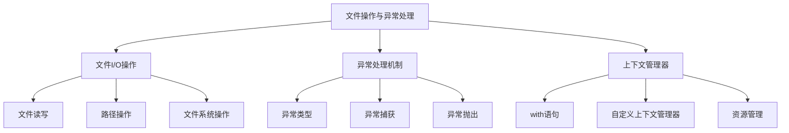

# 文件操作与异常处理

> 🎯 **学习目标**：掌握Python的文件I/O操作和异常处理机制，能够安全地读写文件、处理错误情况。

## 📚 基础概念

### 文件操作与异常处理关系


## 📁 文件操作

### 文件读写基础

#### 文件打开与关闭
```python
# 基本文件操作
file = open('example.txt', 'r', encoding='utf-8')
content = file.read()
file.close()

# 查看文件对象属性
file = open('example.txt', 'r')
print(file.name)      # 文件名
print(file.mode)      # 打开模式
print(file.closed)    # 是否关闭
file.close()
```

#### with语句（推荐）
```python
# 使用with语句自动处理文件关闭
with open('example.txt', 'r', encoding='utf-8') as file:
    content = file.read()
    # 文件会自动关闭，即使发生异常

# 一次性读取整个文件
with open('example.txt', 'r', encoding='utf-8') as file:
    content = file.read()
    print(content)

# 逐行读取
with open('example.txt', 'r', encoding='utf-8') as file:
    for line in file:
        print(line.strip())  # 去除行尾换行符
```

#### 文件打开模式
```python
# 文件打开模式列表
modes = {
    'r': '只读模式（默认）',
    'w': '写入模式（会覆盖原文件）',
    'a': '追加模式',
    'r+': '读写模式',
    'w+': '读写模式（会覆盖原文件）',
    'a+': '读写追加模式',
    'b': '二进制模式',
    't': '文本模式（默认）'
}

# 二进制模式读写
with open('image.jpg', 'rb') as file:
    binary_data = file.read()

with open('copy.jpg', 'wb') as file:
    file.write(binary_data)

# 文本模式读写
with open('data.txt', 'w', encoding='utf-8') as file:
    file.write('Hello, Python!')
```

### 文件读写方法

#### 基本读写方法
```python
# 写入文件
with open('output.txt', 'w', encoding='utf-8') as file:
    file.write('Hello, World!\n')
    file.write('Python编程\n')

# 读取文件的不同方式
with open('output.txt', 'r', encoding='utf-8') as file:
    # read() - 读取整个文件
    content = file.read()
    print("read():", repr(content))
    
with open('output.txt', 'r', encoding='utf-8') as file:
    # readline() - 读取一行
    first_line = file.readline()
    print("readline():", first_line)
    
with open('output.txt', 'r', encoding='utf-8') as file:
    # readlines() - 读取所有行到列表
    lines = file.readlines()
    print("readlines():", lines)
    
with open('output.txt', 'r', encoding='utf-8') as file:
    # 逐行读取（推荐）
    for line in file:
        print(line.strip())
```

#### 大文件处理
```python
# 分块读取大文件
def read_large_file(file_path, chunk_size=1024):
    """分块读取大文件"""
    with open(file_path, 'r', encoding='utf-8') as file:
        while True:
            chunk = file.read(chunk_size)
            if not chunk:
                break
            yield chunk

# 使用示例
for chunk in read_large_file('large_file.txt'):
    print(len(chunk))  # 处理每个数据块

# 使用生成器逐行处理
def process_lines(file_path):
    """逐行处理文件"""
    with open(file_path, 'r', encoding='utf-8') as file:
        for line_num, line in enumerate(file, 1):
            yield line_num, line.strip()

# 处理CSV文件
def read_csv(file_path):
    """读取CSV文件"""
    with open(file_path, 'r', encoding='utf-8') as file:
        for line in file:
            # 简单的CSV分割
            fields = line.strip().split(',')
            yield fields

for fields in read_csv('data.csv'):
    print(fields)
```

### 文件指针操作

#### 文件指针基础
```python
with open('example.txt', 'r', encoding='utf-8') as file:
    # tell() - 获取当前指针位置
    print(f"当前位置: {file.tell()}")
    
    # read(5) - 读取5个字符
    print(file.read(5))
    print(f"当前位置: {file.tell()}")
    
    # seek(offset, whence) - 移动文件指针
    file.seek(0)  # 回到文件开头
    print(f"当前位置: {file.tell()}")
    
    file.seek(10)  # 跳转到第10个字符
    print(file.read(5))
    
    # whence参数: 0=文件开头, 1=当前位置, 2=文件末尾
    file.seek(-5, 2)  # 跳转到文件末尾前5个字符
    print(file.read())
```

### 文件编码

#### 编码处理
```python
# 不同编码写入文件
text = "Hello, 世界！"

# UTF-8编码
with open('utf8.txt', 'w', encoding='utf-8') as file:
    file.write(text)

# GBK编码
with open('gbk.txt', 'w', encoding='gbk') as file:
    file.write(text)

# 读取不同编码的文件
with open('utf8.txt', 'r', encoding='utf-8') as file:
    print(file.read())  # 正确读取

# 错误的编码会导致异常
try:
    with open('utf8.txt', 'r', encoding='gbk') as file:
        print(file.read())  # 可能出错
except UnicodeDecodeError as e:
    print(f"编码错误: {e}")
```

### 路径操作

#### os.path模块
```python
import os

# 路径拼接
file_path = os.path.join('folder', 'subfolder', 'file.txt')
print(file_path)  # folder/subfolder/file.txt

# 路径分割
print(os.path.split(file_path))  # ('folder/subfolder', 'file.txt')

# 文件扩展名
print(os.path.splitext('file.txt'))  # ('file', '.txt')

# 绝对路径
print(os.path.abspath('file.txt'))

# 路径信息
print(os.path.exists('file.txt'))   # 文件是否存在
print(os.path.isfile('file.txt'))   # 是否为文件
print(os.path.isdir('folder'))      # 是否为目录
print(os.path.getsize('file.txt'))  # 文件大小

# 当前工作目录
print(os.getcwd())  # 当前目录

# 创建目录
os.makedirs('new_folder/subfolder', exist_ok=True)
```

#### pathlib模块（推荐）
```python
from pathlib import Path

# 路径操作
path = Path('folder/subfolder/file.txt')
print(path.name)      # 文件名
print(path.stem)      # 文件名（无扩展名）
print(path.suffix)    # 扩展名
print(path.parent)    # 父目录

# 路径拼接
new_path = path.parent / 'new_file.txt'

# 路径检查
print(path.exists())
print(path.is_file())
print(path.is_dir())

# 创建目录
Path('new_folder').mkdir(exist_ok=True)

# 读写文件
content = path.read_text(encoding='utf-8')
path.write_text('Hello', encoding='utf-8')

# 遍历目录
for file in Path('folder').iterdir():
    print(file.name)
```

### 文件系统操作

#### 目录操作
```python
import os
import shutil

# 创建目录
os.mkdir('new_folder')  # 创建单层目录
os.makedirs('a/b/c', exist_ok=True)  # 创建多层目录

# 删除目录
os.rmdir('empty_folder')  # 删除空目录
shutil.rmtree('folder')  # 删除整个目录树

# 重命名文件
os.rename('old_name.txt', 'new_name.txt')

# 移动文件
shutil.move('file.txt', 'new_location/file.txt')

# 复制文件
shutil.copy2('source.txt', 'dest.txt')  # 保留元数据
shutil.copyfile('source.txt', 'dest.txt')  # 只复制内容
```

#### 文件搜索
```python
import glob

# 使用glob查找文件
txt_files = glob.glob('*.txt')
print(txt_files)  # ['file1.txt', 'file2.txt', ...]

# 递归搜索
all_py_files = glob.glob('**/*.py', recursive=True)
print(all_py_files)

# 使用pathlib递归查找
from pathlib import Path
for file in Path('.').rglob('*.py'):
    print(file)
```

## ⚠️ 异常处理

### 异常基础

#### 异常类型
```python
# 常见异常类型
common_exceptions = {
    'Exception': '所有异常的基类',
    'ValueError': '值不合适',
    'TypeError': '类型不匹配',
    'IndexError': '索引超出范围',
    'KeyError': '字典键不存在',
    'FileNotFoundError': '文件未找到',
    'PermissionError': '权限不足',
    'ZeroDivisionError': '除数为零',
    'AttributeError': '属性不存在',
    'ImportError': '模块导入失败'
}

# 异常示例
try:
    x = int("abc")  # ValueError
except ValueError as e:
    print(f"值错误: {e}")

try:
    numbers = [1, 2, 3]
    print(numbers[10])  # IndexError
except IndexError as e:
    print(f"索引错误: {e}")

try:
    data = {'name': 'Alice'}
    print(data['age'])  # KeyError
except KeyError as e:
    print(f"键错误: {e}")
```

#### 异常捕获
```python
# 基本异常捕获
try:
    result = 10 / 0
except ZeroDivisionError:
    print("除数不能为零")

# 捕获多个异常
try:
    file = open('nonexistent.txt', 'r')
except FileNotFoundError:
    print("文件未找到")
except PermissionError:
    print("权限不足")
except Exception as e:
    print(f"其他错误: {e}")

# 捕获所有异常（不推荐）
try:
    x = int("abc")
except Exception as e:
    print(f"发生错误: {e}")
```

#### 异常处理结构
```python
# 完整的异常处理结构
try:
    # 可能发生异常的代码
    result = 10 / int(input("请输入除数: "))
except ZeroDivisionError:
    # 处理特定异常
    print("除数不能为零")
except ValueError:
    # 处理另一个异常
    print("请输入有效的数字")
else:
    # 没有异常时执行
    print(f"结果: {result}")
finally:
    # 无论是否有异常都会执行
    print("程序执行完毕")

# 实际示例
def read_file_safely(file_path):
    """安全读取文件"""
    try:
        with open(file_path, 'r', encoding='utf-8') as file:
            content = file.read()
        return content
    except FileNotFoundError:
        print(f"错误: 文件 {file_path} 未找到")
        return None
    except PermissionError:
        print(f"错误: 没有权限读取文件 {file_path}")
        return None
    except Exception as e:
        print(f"未知错误: {e}")
        return None
    finally:
        print("文件读取操作完成")
```

### 自定义异常

#### 定义异常类
```python
# 自定义异常类
class CustomError(Exception):
    """自定义异常"""
    def __init__(self, message):
        self.message = message
        super().__init__(self.message)

class ValueTooSmallError(Exception):
    """值太小异常"""
    def __init__(self, value, minimum):
        self.value = value
        self.minimum = minimum
        super().__init__(f"值 {value} 小于最小值 {minimum}")

# 使用自定义异常
def validate_value(value, minimum):
    """验证值"""
    if value < minimum:
        raise ValueTooSmallError(value, minimum)
    return value

# 测试自定义异常
try:
    validate_value(5, 10)
except ValueTooSmallError as e:
    print(f"验证失败: {e}")
```

#### 异常链
```python
# 异常链：保持原始异常信息
def process_data(data):
    """处理数据"""
    try:
        result = int(data)
        return result * 2
    except ValueError as e:
        # 使用raise from保留原始异常
        raise ValueError(f"数据处理失败: {data}") from e

def main():
    """主函数"""
    try:
        result = process_data("abc")
    except ValueError as e:
        print(f"发生错误: {e}")
        print(f"原始异常: {e.__cause__}")

main()
```

### 异常处理最佳实践

#### 具体异常捕获
```python
# ❌ 不好的做法：捕获过于宽泛
def bad_function():
    try:
        result = int(input("请输入数字: "))
        return result * 2
    except Exception:  # 太宽泛
        print("发生错误")
        return None

# ✅ 好的做法：捕获具体异常
def good_function():
    try:
        result = int(input("请输入数字: "))
        return result * 2
    except ValueError:
        print("请输入有效的数字")
        return None
    except KeyboardInterrupt:
        print("用户中断")
        return None
```

#### 适当的异常处理
```python
# ❌ 不好的做法：忽略异常
def bad_read_file(filename):
    try:
        with open(filename) as f:
            return f.read()
    except:
        pass  # 忽略所有异常

# ✅ 好的做法：适当的异常处理
def good_read_file(filename):
    try:
        with open(filename, 'r', encoding='utf-8') as f:
            return f.read()
    except FileNotFoundError:
        print(f"文件 {filename} 不存在")
        return ""
    except PermissionError:
        print(f"没有权限读取文件 {filename}")
        return ""
    except Exception as e:
        print(f"读取文件时发生错误: {e}")
        return ""
```

## 🔄 上下文管理器

### with语句

#### 基本with语句
```python
# 文件操作使用with语句
with open('example.txt', 'r', encoding='utf-8') as file:
    content = file.read()
# 文件自动关闭

# 多个文件
with open('file1.txt', 'r') as f1, open('file2.txt', 'w') as f2:
    content = f1.read()
    f2.write(content)

# 自定义上下文管理器
class Timer:
    """计时器上下文管理器"""
    def __enter__(self):
        self.start = time.time()
        return self
    
    def __exit__(self, exc_type, exc_val, exc_tb):
        self.end = time.time()
        self.elapsed = self.end - self.start
        print(f"执行时间: {self.elapsed:.4f}秒")
        return False  # False表示不处理异常

import time
with Timer():
    time.sleep(1)
    print("执行中...")
```

#### 自定义上下文管理器
```python
from contextlib import contextmanager

# 使用装饰器创建上下文管理器
@contextmanager
def file_writer(filename):
    """文件写入上下文管理器"""
    file = open(filename, 'w')
    try:
        yield file
    finally:
        file.close()

# 使用自定义上下文管理器
with file_writer('output.txt') as f:
    f.write('Hello, World!')
# 文件自动关闭

# 资源管理上下文管理器
class Resource:
    """资源类"""
    def __init__(self, name):
        self.name = name
        print(f"创建资源: {name}")
    
    def __enter__(self):
        print(f"获取资源: {self.name}")
        return self
    
    def __exit__(self, exc_type, exc_val, exc_tb):
        print(f"释放资源: {self.name}")
        if exc_type:
            print(f"发生异常: {exc_val}")
        return False

# 使用资源管理器
with Resource("Database Connection"):
    print("使用资源...")
    # 即使发生异常，资源也会被正确释放
```

## 🎯 实战练习

### 练习1：文件备份工具
```python
import os
import shutil
from datetime import datetime

def backup_files(source_dir, backup_dir):
    """备份文件"""
    try:
        # 创建备份目录
        timestamp = datetime.now().strftime('%Y%m%d_%H%M%S')
        backup_path = os.path.join(backup_dir, f'backup_{timestamp}')
        os.makedirs(backup_path, exist_ok=True)
        
        # 复制文件
        for filename in os.listdir(source_dir):
            source_file = os.path.join(source_dir, filename)
            dest_file = os.path.join(backup_path, filename)
            
            if os.path.isfile(source_file):
                shutil.copy2(source_file, dest_file)
                print(f"备份: {filename}")
        
        print(f"备份完成: {backup_path}")
        return True
        
    except Exception as e:
        print(f"备份失败: {e}")
        return False

# 使用示例
backup_files('data', 'backups')
```

### 练习2：日志分析器
```python
import re
from pathlib import Path

def analyze_log_file(log_path):
    """分析日志文件"""
    try:
        # 日志统计
        error_count = 0
        warning_count = 0
        error_messages = []
        
        # 正则表达式匹配
        error_pattern = re.compile(r'ERROR: (.*)')
        warning_pattern = re.compile(r'WARNING: (.*)')
        
        # 读取日志文件
        with open(log_path, 'r', encoding='utf-8') as file:
            for line in file:
                # 匹配错误
                error_match = error_pattern.search(line)
                if error_match:
                    error_count += 1
                    error_messages.append(error_match.group(1))
                
                # 匹配警告
                warning_match = warning_pattern.search(line)
                if warning_match:
                    warning_count += 1
        
        # 返回分析结果
        return {
            'errors': error_count,
            'warnings': warning_count,
            'error_messages': error_messages[:10]  # 只返回前10个错误
        }
        
    except FileNotFoundError:
        print(f"日志文件不存在: {log_path}")
        return None
    except Exception as e:
        print(f"分析日志时发生错误: {e}")
        return None

# 使用示例
result = analyze_log_file('app.log')
if result:
    print(f"错误数: {result['errors']}")
    print(f"警告数: {result['warnings']}")
    print("最近错误:")
    for msg in result['error_messages']:
        print(f"  - {msg}")
```

### 练习3：配置文件读取器
```python
import configparser
from pathlib import Path

def read_config_file(config_path):
    """读取配置文件"""
    try:
        config = configparser.ConfigParser()
        
        # 检查文件是否存在
        if not Path(config_path).exists():
            raise FileNotFoundError(f"配置文件不存在: {config_path}")
        
        # 读取配置文件
        config.read(config_path, encoding='utf-8')
        
        # 解析配置
        parsed_config = {}
        for section in config.sections():
            parsed_config[section] = dict(config[section])
        
        return parsed_config
        
    except FileNotFoundError as e:
        print(e)
        return None
    except configparser.Error as e:
        print(f"配置文件格式错误: {e}")
        return None
    except Exception as e:
        print(f"读取配置文件时发生错误: {e}")
        return None

def write_config_file(config_path, config_dict):
    """写入配置文件"""
    try:
        config = configparser.ConfigParser()
        
        # 添加配置
        for section, options in config_dict.items():
            config[section] = options
        
        # 写入文件
        with open(config_path, 'w', encoding='utf-8') as file:
            config.write(file)
        
        print(f"配置文件已保存: {config_path}")
        return True
        
    except Exception as e:
        print(f"写入配置文件时发生错误: {e}")
        return False

# 使用示例
config = {
    'database': {
        'host': 'localhost',
        'port': '5432',
        'name': 'mydb'
    },
    'logging': {
        'level': 'INFO',
        'file': 'app.log'
    }
}

write_config_file('config.ini', config)
parsed = read_config_file('config.ini')
print(parsed)
```

## 💡 最佳实践

### 文件操作建议
- ✅ **使用with语句**：自动处理文件关闭
- ✅ **指定编码**：明确指定文件编码（utf-8）
- ✅ **处理大文件**：使用生成器逐行或分块处理
- ❌ **忘记关闭文件**：避免资源泄漏

### 异常处理建议
- ✅ **捕获具体异常**：不要捕获过于宽泛的异常
- ✅ **适当的异常处理**：有意义的错误消息和恢复策略
- ✅ **使用finally**：确保资源释放
- ❌ **忽略异常**：不要空except块

### 性能优化
- ✅ **批量操作**：减少I/O操作次数
- ✅ **缓冲区设置**：适当调整读写缓冲区
- ✅ **使用生成器**：处理大文件时节省内存

## 🔗 相关资源

- [[基础语法与数据类型]] - 基础数据结构
- [[控制流与函数]] - 流程控制
- [[函数高级特性]] - 上下文管理器
- [[模块与包管理]] - 标准库使用

---
*创建时间: 2026-02-01*  
*分类: 3 Resources*
