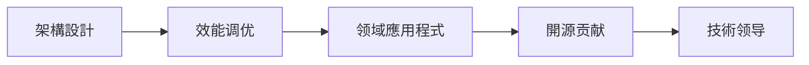

---
# Python知識庫導航
status: active
priority: high
tags: [resource/tech/programming/python, python, navigation]
# 指南
created: 2026-02-01
updated: 2026-02-01
---

# Python知識庫導航

# 知識

## 🎯 學習目標

- **初学者**：从零開始掌握Python編程基礎
- **開發者**：提升Python應用程式能力和最佳實踐  
- **工程师**：掌握Python在特定领域的深度應用程式

# 知識庫

### 🔰 01 基礎入门
# 配置
[[基礎语法与數據类型]] - Python核心语法和數據结构
[[控制流与函数]] - 条件判斷、循环和函数定义
# 管理
# 效率

### 🔨 02 进阶編程
[[面向对象編程]] - 类、对象、继承与多态
[[函数式編程特性]] - 高阶函数、lambda和闭包
[[装饰器与元类]] - Python高级編程特性
[[迭代器与生成器]] - 節省記憶體的迭代模式
[[异步編程]] - async/await与并发編程

### 🌿 03 生態系統
# 分析
[[NumPy基礎]] - 数值計算基礎库
# 分析
[[Matplotlib可视化]] - 數據可视化工具

#### Web開發
[[Flask轻量级開發]] - 简洁的Web框架
[[Django企业级開發]] - 全功能Web框架
[[FastAPI高效能API]] - 现代化API框架

#### AI机器學習
[[TensorFlow深度學習]] - 谷歌AI框架
[[PyTorch動態框架]] - Facebook AI框架
[[Scikit-learn机器學習]] - 经典机器學習工具

#### 自動化腳本
[[Requests網路请求]] - HTTP客户端库
[[Selenium網頁自動化]] - 瀏覽器自動化控制
[[BeautifulSoup網頁解析]] - HTML/XML數據提取

### 🚀 04 实战應用程式
# 分析
[[Web開發實踐]] - 从零構建Web應用程式
[[AI專案实战]] - 机器學習專案開發
[[自動化腳本開發]] - 实用自動化工具
[[API整合專案]] - 第三方服务整合

### 💡 05 高级主題
[[效能優化]] - 代碼效能提升技巧
[[除錯与測試]] - 代碼品質保证
[[專案架構設計]] - 大型專案组织架構
[[安全編程實踐]] - 代碼安全与防护
# 部署

### 🛠️ 06 資源与工具
[[推荐书籍与课程]] - 优质學習資源
[[線上資源与社區]] - 求助和交流平台
[[開發工具大全]] - 開發工具和外掛
[[學習路徑規劃]] - 个性化學習計劃

## 🗺️ 學習路徑图

### 🟢 初学者路徑 (0-3个月)
```mermaid
graph LR
# 配置
    B --> C[數據结构]
    C --> D[控制流]
    D --> E[函数]
    E --> F[实战專案1]
```

### 🟡 进阶路徑 (3-6个月)


### 🔴 专家路徑 (6-12个月)


# 知識

# 知識
|---------|----------|----------|
| 基礎语法 | 無 | 所有Python應用程式 |
# 分析
# 分析
| Web開發 | 面向对象 | API開發、全棧應用程式 |
| 异步編程 | 基礎语法 | 高并发應用程式 |

## 💻 快速開始

### 🎯 10分钟快速入门
```python
# 你的第一个Python程式
print("Hello, Python!")

# 基礎數據类型
name = "Python"        # 字符串
version = 3.9          # 浮点数  
is_awesome = True     # 布尔值

# 简单函数
def greet(language):
    return f"Hello, {language}!"

print(greet("Python"))  # 輸出: Hello, Python!
```

### 🛠️ 环架選擇建議

| 應用程式場景 | 推荐工具 | 适用人群 |
|---------|----------|----------|
# 分析
| Web開發 | PyCharm Professional | Web開發者 |
| 自動化 | VS Code + plugins | 运维、DevOps |
| 初学入门 | VS Code 或 Thonny | 編程新手 |

## 📊 學習进度追踪

### 🏆 成就系統
- 🥉 新手村：完成基礎语法學習
- 🥈 进阶者：掌握面向对象和常用库
- 🥇 熟练工：完成一个完整專案
- 👑 大神：参与開源專案贡献

### 📈 技能評估
- **语法掌握**：95%以上准确率
- **库的使用**：熟练使用3-5个核心库
- **專案實踐**：独立完成中等难度專案
- **問題解決**：能夠独立除錯和優化

## 🤝 社區資源

### 📚 优质學習資源
- **官方文檔**：[Python.org](https://docs.python.org/3/)
# 教程
- **交互式學習**：[Codecademy Python Course](https://www.codecademy.com/learn/python-3)

### 💬 交流社區
- **Stack Overflow**：技術問題解答
# 分享
- **GitHub**：開源專案和代碼學習

## 🚀 開始你的學習之旅

### 🎓 推荐學習流程
1. **評估起点** - 根据你的編程背景選擇合适起点
2. **制定計劃** - 使用我们的[[學習路徑規劃]]工具
3. **动手實踐** - 每个概念都要用代碼练习
# 知識
# 更新

### 👀 快速导航
# 配置
- 🔵 **有基礎** → [[面向对象編程]]  
- 🟢 **想應用程式** → [[实战應用程式案例]]
- 🟡 **需優化** → [[效能優化]]

---
> 💡 **學習提示**：學習編程最重要的是持續實踐。建議每天写代碼，即使只是小程式。遇到問題时，善用搜尋和社區資源。记住：編程是一门手艺，需要不断练习才能精通。

**🌟 開始你的Python之旅吧！**

---
# 更新
*分類: 3 Resources*