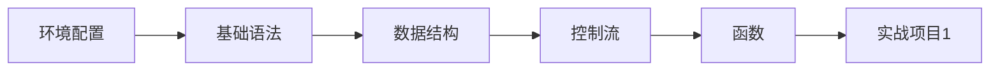
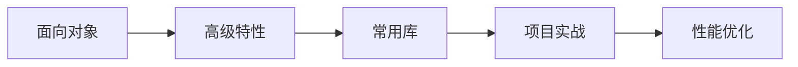
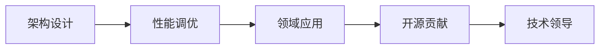

# 🐍 Python知识库导航

> 欢迎来到Python完整教程库！这里涵盖了从零基础到企业级应用的全方位Python知识体系。

## 🎯 学习目标

- **初学者**：从零开始掌握Python编程基础
- **开发者**：提升Python应用能力和最佳实践  
- **工程师**：掌握Python在特定领域的深度应用

## 📚 知识库结构

### 🔰 01 基础入门
[[Python安装与环境配置]] - 从零开始搭建Python开发环境
[[基础语法与数据类型]] - Python核心语法和数据结构
[[控制流与函数]] - 条件判断、循环和函数定义
[[模块与包管理]] - Python代码组织和包管理工具
[[开发工具与IDE配置]] - 提升开发效率的工具配置

### 🔨 02 进阶编程
[[面向对象编程]] - 类、对象、继承与多态
[[函数式编程特性]] - 高阶函数、lambda和闭包
[[装饰器与元类]] - Python高级编程特性
[[迭代器与生成器]] - 节省内存的迭代模式
[[异步编程]] - async/await与并发编程

### 🌿 03 生态系统
#### 数据分析
[[NumPy基础]] - 数值计算基础库
[[Pandas数据处理]] - 数据分析利器
[[Matplotlib可视化]] - 数据可视化工具

#### Web开发
[[Flask轻量级开发]] - 简洁的Web框架
[[Django企业级开发]] - 全功能Web框架
[[FastAPI高性能API]] - 现代化API框架

#### AI机器学习
[[TensorFlow深度学习]] - 谷歌AI框架
[[PyTorch动态框架]] - Facebook AI框架
[[Scikit-learn机器学习]] - 经典机器学习工具

#### 自动化脚本
[[Requests网络请求]] - HTTP客户端库
[[Selenium网页自动化]] - 浏览器自动化控制
[[BeautifulSoup网页解析]] - HTML/XML数据提取

### 🚀 04 实战应用
[[数据分析案例]] - 完整的数据分析项目
[[Web开发实践]] - 从零构建Web应用
[[AI项目实战]] - 机器学习项目开发
[[自动化脚本开发]] - 实用自动化工具
[[API集成项目]] - 第三方服务集成

### 💡 05 高级主题
[[性能优化]] - 代码性能提升技巧
[[调试与测试]] - 代码质量保证
[[项目架构设计]] - 大型项目组织架构
[[安全编程实践]] - 代码安全与防护
[[部署与运维]] - 应用部署最佳实践

### 🛠️ 06 资源与工具
[[推荐书籍与课程]] - 优质学习资源
[[在线资源与社区]] - 求助和交流平台
[[开发工具大全]] - 开发工具和插件
[[学习路径规划]] - 个性化学习计划

## 🗺️ 学习路径图

### 🟢 初学者路径 (0-3个月)


### 🟡 进阶路径 (3-6个月)


### 🔴 专家路径 (6-12个月)


## 🔗 知识关联网络

| 知识领域 | 前置知识 | 后置应用 |
|---------|----------|----------|
| 基础语法 | 无 | 所有Python应用 |
| 面向对象 | 基础语法 | Web开发、数据分析 |
| 数据分析 | NumPy基础 | 机器学习应用 |
| Web开发 | 面向对象 | API开发、全栈应用 |
| 异步编程 | 基础语法 | 高并发应用 |

## 💻 快速开始

### 🎯 10分钟快速入门
```python
# 你的第一个Python程序
print("Hello, Python!")

# 基础数据类型
name = "Python"        # 字符串
version = 3.9          # 浮点数  
is_awesome = True     # 布尔值

# 简单函数
def greet(language):
    return f"Hello, {language}!"

print(greet("Python"))  # 输出: Hello, Python!
```

### 🛠️ 环架选择建议

| 应用场景 | 推荐工具 | 适用人群 |
|---------|----------|----------|
| 数据科学 | Jupyter + Anaconda | 分析师、研究者 |
| Web开发 | PyCharm Professional | Web开发者 |
| 自动化 | VS Code + plugins | 运维、DevOps |
| 初学入门 | VS Code 或 Thonny | 编程新手 |

## 📊 学习进度追踪

### 🏆 成就系统
- 🥉 新手村：完成基础语法学习
- 🥈 进阶者：掌握面向对象和常用库
- 🥇 熟练工：完成一个完整项目
- 👑 大神：参与开源项目贡献

### 📈 技能评估
- **语法掌握**：95%以上准确率
- **库的使用**：熟练使用3-5个核心库
- **项目实践**：独立完成中等难度项目
- **问题解决**：能够独立调试和优化

## 🤝 社区资源

### 📚 优质学习资源
- **官方文档**：[Python.org](https://docs.python.org/3/)
- **中文教程**：[Python中文教程](https://www.runoob.com/python3)
- **交互式学习**：[Codecademy Python Course](https://www.codecademy.com/learn/python-3)

### 💬 交流社区
- **Stack Overflow**：技术问题解答
- **Reddit r/Python**：讨论和分享
- **GitHub**：开源项目和代码学习

## 🚀 开始你的学习之旅

### 🎓 推荐学习流程
1. **评估起点** - 根据你的编程背景选择合适起点
2. **制定计划** - 使用我们的[[学习路径规划]]工具
3. **动手实践** - 每个概念都要用代码练习
4. **项目驱动** - 通过项目巩固知识
5. **持续更新** - 关注Python新特性发展

### 👀 快速导航
- 💚 **零基础** → [[Python安装与环境配置]]
- 🔵 **有基础** → [[面向对象编程]]  
- 🟢 **想应用** → [[实战应用案例]]
- 🟡 **需优化** → [[性能优化]]

---
> 💡 **学习提示**：学习编程最重要的是持续实践。建议每天写代码，即使只是小程序。遇到问题时，善用搜索和社区资源。记住：编程是一门手艺，需要不断练习才能精通。

**🌟 开始你的Python之旅吧！**

---
*最后更新: 2026-02-01*  
*分类: 3 Resources*