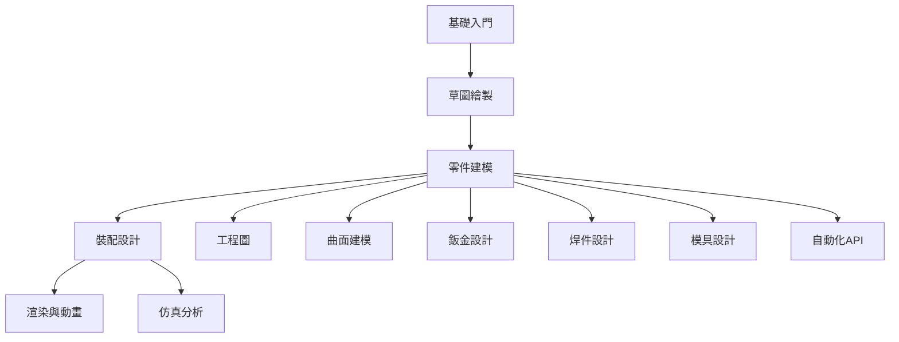

# SolidWorks 知識庫

> [!info] 知識庫概述
> 本知識庫涵蓋 SolidWorks 三維建模軟件的完整學習體系，從基礎操作到高級應用，系統化組織學習資源。

---

## 🎯 知識體系架構

```
┌─────────────────────────────────────────────────────────────┐
│                                                       │
│  ┌──────────────┐    ┌──────────────┐    ┌──────────────┐    │
│  │  基礎操作層   │───→│  核心功能層   │───→│  專業應用層   │    │
│  │ ───────────  │    │ ───────────  │    │ ───────────  │    │
│  │ • 界面操作   │    │ • 零件建模   │    │ • 鈑金設計   │    │
│  │ • 草圖繪製   │    │ • 裝配設計   │    │ • 焊件設計   │    │
│  │ • 視圖管理   │    │ • 工程圖     │    │ • 模具設計   │    │
│  └──────────────┘    └──────────────┘    └──────────────┘    │
│         ↓                  ↓                  ↓              │
│  ┌─────────────────────────────────────────────────────┐     │
│  │              高級功能與實踐層                        │     │
│  │ ───────────────────────────────────────────────   │     │
│  │ • 渲染與動畫 • 仿真分析 • API自動化 • 實踐項目     │     │
│  └─────────────────────────────────────────────────────┘     │
│                                                       │
└─────────────────────────────────────────────────────────────┘
```

---

## 📚 模塊導航

### 入門階段

```
📖 基礎入門
├── [[01-基礎入門/界面與工作區|界面與工作區]]
├── [[01-基礎入門/文件管理|文件管理]]
├── [[01-基礎入門/視圖操作|視圖操作]]
├── [[01-基礎入門/基本設置|基本設置]]
└── [[01-基礎入門/快捷鍵大全|快捷鍵大全]]

✏️ 草圖繪製
├── [[02-草圖繪製/草圖基礎|草圖基礎]]
├── [[02-草圖繪製/草圖實體|草圖實體]]
├── [[02-草圖繪製/草圖約束|草圖約束]]
├── [[02-草圖繪製/草圖工具|草圖工具]]
└── [[02-草圖繪製/草圖技巧|草圖技巧與最佳實踐]]
```

### 核心階段

```
🔧 零件建模
├── 基礎特徵
│   ├── [[03-零件建模/基礎特徵/拉伸特徵|拉伸特徵]]
│   ├── [[03-零件建模/基礎特徵/旋轉特徵|旋轉特徵]]
│   ├── [[03-零件建模/基礎特徵/掃描特徵|掃描特徵]]
│   └── [[03-零件建模/基礎特徵/放樣特徵|放樣特徵]]
├── 細節特徵
│   ├── [[03-零件建模/細節特徵/圓角與倒角|圓角與倒角]]
│   ├── [[03-零件建模/細節特徵/拔模特徵|拔模特徵]]
│   └── [[03-零件建模/細節特徵/抽殼特徵|抽殼特徵]]
└── 參數化設計
    ├── [[03-零件建模/參數化設計/方程式|方程式]]
    └── [[03-零件建模/參數化設計/配置|配置]]

🔩 裝配設計
├── [[04-裝配設計/裝配基礎|裝配基礎]]
├── 配合關係
│   ├── [[04-裝配設計/配合關係/標準配合|標準配合]]
│   ├── [[04-裝配設計/配合關係/高級配合|高級配合]]
│   └── [[04-裝配設計/配合關係/機械配合|機械配合]]
└── 裝配工具
    ├── [[04-裝配設計/裝配工具/爆炸視圖|爆炸視圖]]
    └── [[04-裝配設計/裝配工具/干涉檢查|干涉檢查]]

📐 工程圖
├── [[05-工程圖/工程圖基礎|工程圖基礎]]
├── 視圖創建
│   ├── [[05-工程圖/視圖創建/標準視圖|標準視圖]]
│   └── [[05-工程圖/視圖創建/剖視圖|剖視圖]]
└── 尺寸標註
    └── [[05-工程圖/尺寸標註/尺寸類型|尺寸類型]]
```

### 專業應用

```
🥫 鈑金設計
├── [[07-鈑金設計/鈑金基礎|鈑金基礎]]
├── [[07-鈑金設計/基體法蘭|基體法蘭]]
└── [[07-鈑金設計/折彎與展開|折彎與展開]]

🔥 焊件設計
├── [[08-焊件設計/焊件基礎|焊件基礎]]
└── [[08-焊件設計/結構構件|結構構件]]

🎁 模具設計
├── [[09-模具設計/模具基礎|模具基礎]]
└── [[09-模具設計/分型面|分型面]]

🌊 曲面建模
├── [[06-曲面建模/曲面基礎|曲面基礎]]
├── 曲面創建
│   ├── [[06-曲面建模/曲面創建/拉伸曲面|拉伸曲面]]
│   └── [[06-曲面建模/曲面創建/掃描曲面|掃描曲面]]
└── 曲面編輯
    ├── [[06-曲面建模/曲面編輯/剪裁曲面|剪裁曲面]]
    └── [[06-曲面建模/曲面編輯/縫合曲面|縫合曲面]]
```

### 高級功能

```
🎨 渲染與動畫
├── [[10-渲染與動畫/PhotoView渲染|PhotoView渲染]]
└── [[10-渲染與動畫/運動算例|運動算例]]

📊 Simulation仿真
├── [[11-Simulation仿真/靜應力分析|靜應力分析]]
└── [[11-Simulation仿真/頻率分析|頻率分析]]

⚙️ 自動化與API
├── [[12-自動化與API/宏錄製|宏錄製]]
├── [[12-自動化與API/VBA編程|VBA編程]]
└── [[12-自動化與API/API入門|API入門]]
```

---

## 🔗 模塊關聯圖



---

## 📋 學習檢查清單

### 入門階段
- [ ] 熟悉 SolidWorks 界面佈局
- [ ] 掌握文件管理（新建、打開、保存）
- [ ] 熟練使用視圖操作（旋轉、縮放、平移）
- [ ] 理解草圖繪製的基本流程
- [ ] 掌握草圖約束

### 進階階段
- [ ] 熟練使用基礎特徵（拉伸、旋轉、掃描、放樣）
- [ ] 掌握裝配配合關係
- [ ] 能獨立創建標準工程圖
- [ ] 理解參數化設計概念

### 高級階段
- [ ] 掌握曲面建模技術
- [ ] 熟悉鈑金和焊件設計
- [ ] 能進行渲染和動畫製作
- [ ] 了解仿真分析基礎

---

## 🎯 快速導航

- 📖 [[MOC-學習路徑|推薦學習路徑]]
- 🛠️ [[../15-問題解決|常見問題解決]]
- 📚 [[../99-資源收集|學習資源推薦]]
- 🔙 [[../SolidWorks|返回模塊索引]]

---

## 📊 Dataview 查詢

### 最近更新
```dataview
Table without id file.link as "文件", file.mtime as "更新時間"
WHERE contains(file.path, this.file.folder) AND file.name != this.file.name
SORT file.mtime DESC
LIMIT 10
```

### 按狀態統計
```dataview
Table without id status as "狀態", length(rows.file.link) as "數量"
WHERE contains(file.path, "SolidWorks") AND status
GROUP BY status
```

---

> [!tip] 使用說明
> - 使用 `Ctrl/Cmd + K` 快速搜尋
> - 建議按 [[MOC-學習路徑]] 順序學習
> - 每個模塊都有對應的實踐建議
> - 遇到問題查看 [[../15-問題解決|問題解決]]

---

**文檔資訊**
- 創建時間：2026-05-21
- UDC 分類：621.7:681.3
- 語言：繁體中文為主，術語使用英文
