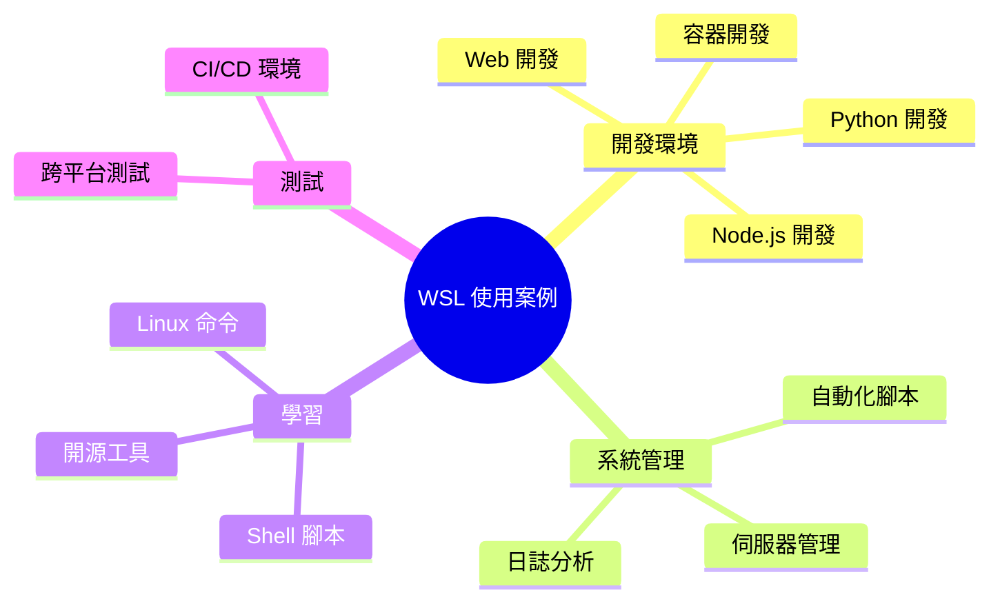
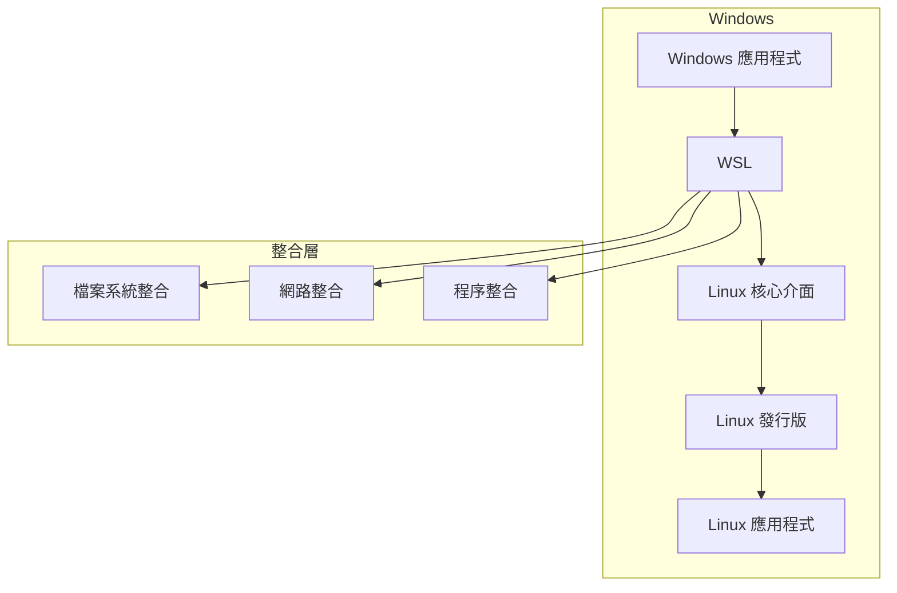

# 什麼是 WSL？

> [!info] 定義
> 適用於 Linux 的 Windows 子系統 (Windows Subsystem for Linux, WSL) 是 Windows 的功能，可讓您直接在 Windows 上執行 Linux 環境，而不需要傳統虛擬機器或雙重開機設定。

## 核心功能

WSL 讓開發人員、系統管理員和愛好者能夠：

- **執行 Linux 命令列工具** - 直接在 Windows 上使用 Bash、grep、sed 等
- **執行 Linux 應用程式** - 包括 GUI 應用程式 (WSL 2)
- **混合使用 Windows 和 Linux** - 從 Linux 呼叫 Windows 應用程式，反之亦然
- **開發環境整合** - 使用 VS Code 遠端開發功能

## 為什麼選擇 WSL？

### 優勢

| 特點 | 說明 |
|------|------|
| 🚀 **效能** | 比 VM 輕量，啟動快速 |
| 💾 **資源效率** | 不需要分配固定記憶體 |
| 🔗 **整合性** | Windows 與 Linux 無縫整合 |
| 🛠️ **開發友善** | 支援多種開發工具鏈 |
| 📦 **易於安裝** | 一行命令即可安裝 |

### 使用案例



## WSL 架構



## 版本演進

### WSL 1
- 翻譯層架構
- 將 Linux 系統呼叫轉譯為 Windows NT 核心呼叫
- 適合跨檔案系統操作

### WSL 2
- 真正的 Linux 核心
- 使用輕量級虛擬機器
- 完整的系統呼叫相容性
- 效能顯著提升

> [!tip] 推薦
> 除非有特定需求，建議使用 WSL 2 以獲得最佳效能和相容性。

## 支援的 Linux 發行版

WSL 支援多種 Linux 發行版：

- Ubuntu (18.04, 20.04, 22.04, 24.04)
- Debian
- Kali Linux
- openSUSE
- SUSE Linux Enterprise Server
- Fedora
- Alpine Linux
- Oracle Linux
- 更多...

使用以下命令查看完整清單：

```bash
wsl --list --online
```

## 快速開始

```bash
# 安裝 WSL (需系統管理員權限)
wsl --install

# 安裝後重新啟動電腦
# 預設會安裝 Ubuntu
```

## 相關主題

- [[比較WSL版本]] - 深入了解 WSL 1 與 WSL 2 的差異
- [[安裝WSL]] - 詳細安裝指南
- [[基本WSL命令]] - 常用命令參考

---
> 📚 返回 [[../00-MOCs/MOC-總覽|WSL 知識庫總覽]]
