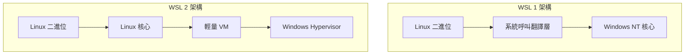
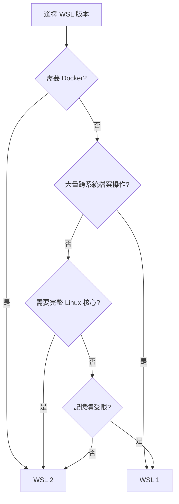

# 比較 WSL 版本

> [!info] 概述
> WSL 有兩個主要版本：WSL 1 和 WSL 2。WSL 2 是較新版本，提供更好的效能和完整的核心相容性。

## 版本比較總覽

| 特性 | WSL 1 | WSL 2 |
|------|-------|-------|
| **架構** | 翻譯層 | 輕量 VM + 真實 Linux 核心 |
| **Linux 核心相容性** | 部分 | 完整 |
| **檔案系統效能** | 跨系統較快 | Linux 內部極快 |
| **系統呼叫支援** | 有限 | 完整 |
| **Docker 支援** | 需要 Docker Desktop | 原生支援 |
| **記憶體使用** | 較低 | 動態分配 |
| **啟動時間** | 極快 | 快 |
| **Linux GPU 支援** | 無 | 有 |

## 架構差異



## WSL 1 詳細說明

### 運作原理

WSL 1 使用翻譯層，將 Linux 系統呼叫轉換為 Windows NT 核心呼叫：

```
Linux 應用程式 → Linux 系統呼叫 → 翻譯層 → Windows NT 呼叫 → Windows 核心
```

### 適用場景

- ✅ 需要頻繁跨 Windows/Linux 檔案系統操作
- ✅ 對記憶體資源要求嚴格
- ✅ 使用不支援 Hypervisor 的舊硬體

### 限制

- ❌ 不支援所有 Linux 系統呼叫
- ❌ 無法執行需要真實 Linux 核心的應用
- ❌ Docker 容器支援有限

## WSL 2 詳細說明

### 運作原理

WSL 2 在輕量級虛擬機器中執行真正的 Linux 核心：

```
Linux 應用程式 → Linux 系統呼叫 → Linux 核心 → 輕量 VM → Windows Hypervisor
```

### 核心優勢

1. **完整的核心相容性**
   - 支援所有 Linux 系統呼叫
   - 可執行 Docker、systemd 等
   - 支援 GPU 加速

2. **更好的檔案系統效能**
   - 在 Linux 檔案系統內操作極快
   - 適合大型專案編譯

3. **動態記憶體管理**
   - 記憶體按需分配
   - 閒置時自動釋放

### 適用場景

- ✅ Docker 容器開發
- ✅ 需要完整 Linux 核心功能
- ✅ 大型專案編譯
- ✅ GPU 加速運算

### 注意事項

> [!warning] 跨檔案系統效能
> WSL 2 從 Windows 存取 Linux 檔案或從 Linux 存取 Windows 檔案時，效能會比 WSL 1 慢。建議將專案檔案放在 Linux 檔案系統內以獲得最佳效能。

## 檔案系統效能比較

```mermaid
xychart-beta
    title "檔案操作效能比較"
    x-axis ["Linux 內解壓縮", "跨系統解壓縮", "Git clone", "npm install"]
    y-axis "相對速度" 0 --> 100
    bar [95, 60, 90, 85]
    bar [40, 80, 45, 50]
```



## 版本轉換

### 查看當前版本

```bash
wsl --list --verbose
```

輸出示例：
```
  NAME      STATE           VERSION
* Ubuntu    Running         2
  Debian    Stopped         1
```

### 轉換發行版版本

```bash
# WSL 1 → WSL 2
wsl --set-version Ubuntu 2

# WSL 2 → WSL 1
wsl --set-version Ubuntu 1
```

### 設定預設版本

```bash
# 設定新安裝的發行版預設使用 WSL 2
wsl --set-default-version 2
```

## 選擇建議



### 推薦選擇

| 使用情境 | 推薦版本 |
|----------|----------|
| 一般開發 | WSL 2 |
| Docker/容器 | WSL 2 |
| GPU 運算 | WSL 2 |
| 大量跨系統檔案操作 | WSL 1 |
| 記憶體受限環境 | WSL 1 |

## 相關主題

- [[什麼是WSL]] - WSL 基礎介紹
- [[安裝WSL]] - 安裝指南
- [[進階設定組態]] - 效能優化設定

---
> 📚 返回 [[../00-MOCs/MOC-總覽|WSL 知識庫總覽]]
