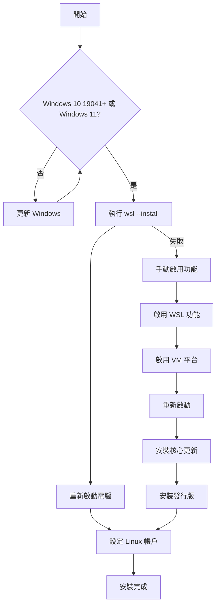

# 安裝 WSL

> [!info] 系統需求
> - Windows 10 版本 2004+ (組建 19041 和更新版本)
> - Windows 11

## 快速安裝

```bash
# 系統管理員模式執行 PowerShell 或 CMD
wsl --install
```

安裝完成後**重新啟動電腦**。

這個命令會：
1. 啟用必要的 Windows 功能
2. 下載並安裝 WSL 2 核心元件
3. 安裝 Ubuntu (預設發行版)

## 安裝步驟詳解

### 步驟 1：檢查系統需求

```bash
# 檢查 Windows 版本
winver

# 或使用命令列
systeminfo | findstr /B /C:"OS Name" /C:"OS Version"
```

### 步驟 2：執行安裝命令

```bash
# 基本安裝 (預設 Ubuntu)
wsl --install

# 安裝特定發行版
wsl --install -d Ubuntu-22.04

# 查看可用發行版
wsl --list --online
```

### 步驟 3：重新啟動

安裝完成後，重新啟動電腦以完成設定。

### 步驟 4：設定 Linux 帳戶

首次啟動時，需要設定：
- UNIX 使用者名稱
- 密碼

```
Enter new UNIX username: yourname
New password:
Retype new password:
```

## 手動安裝步驟

如果自動安裝失敗，可以手動啟用功能：

### 啟用 WSL 功能

```powershell
# 啟用 WSL
dism.exe /online /enable-feature /featurename:Microsoft-Windows-Subsystem-Linux /all /norestart

# 啟用虛擬機器平台
dism.exe /online /enable-feature /featurename:VirtualMachinePlatform /all /norestart

# 重新啟動電腦
```

### 下載並安裝 WSL 2 核心更新

```powershell
# 下載更新套件
# https://wslstorestorage.blob.core.windows.net/wslblob/wsl_update_x64.msi

# 安裝後設定 WSL 2 為預設
wsl --set-default-version 2
```

### 安裝 Linux 發行版

```bash
# 從 Microsoft Store 安裝
# 或使用命令列
wsl --install -d Ubuntu-22.04
```

## 安裝流程圖



## 安裝後設定

### 更新套件

```bash
# 更新 Ubuntu
sudo apt update && sudo apt upgrade -y

# 安裝常用工具
sudo apt install build-essential git curl wget -y
```

### 設定 Git

```bash
git config --global user.name "Your Name"
git config --global user.email "your@email.com"
```

### 安裝 Windows Terminal (推薦)

從 Microsoft Store 安裝 [Windows Terminal](https://aka.ms/terminal)，獲得更好的終端機體驗。

## 疑難排解

### 錯誤: WslRegisterDistribution failed with error 0x8007019e

WSL 功能未啟用，請執行：

```powershell
Enable-WindowsOptionalFeature -Online -FeatureName Microsoft-Windows-Subsystem-Linux
```

### 錯誤: WslRegisterDistribution failed with error 0x800701bc

WSL 2 核心未安裝，請下載並安裝 [WSL2 Linux 核心更新套件](https://aka.ms/wsl2kernel)。

### 錯誤: 0x80370102

虛擬化功能未啟用：

1. 進入 BIOS/UEFI 設定
2. 啟用虛擬化技術 (Intel VT-x / AMD-V)
3. 儲存並重新啟動

### 錯誤: 安裝失敗，發生錯誤 0x800f081f

Windows 更新服務問題：

```powershell
# 重設 Windows 更新元件
net stop wuauserv
net stop bits
net stop cryptsvc
ren C:\Windows\SoftwareDistribution SoftwareDistribution.old
ren C:\Windows\System32\catroot2 catroot2.old
net start wuauserv
net start bits
net start cryptsvc
```

## 安裝多個發行版

```bash
# 安裝多個發行版
wsl --install -d Ubuntu-22.04
wsl --install -d Debian
wsl --install -d kali-linux

# 查看已安裝的發行版
wsl --list --verbose

# 設定預設發行版
wsl --set-default Ubuntu-22.04
```

## 相關主題

- [[比較WSL版本]] - WSL 1 vs WSL 2
- [[舊版手動安裝步驟]] - 舊版 Windows 安裝方式
- [[在WindowsServer上安裝]] - Windows Server 安裝
- [[設定最佳實務做法]] - 安裝後設定建議

---
> 📚 返回 [[../00-MOCs/MOC-總覽|WSL 知識庫總覽]]
