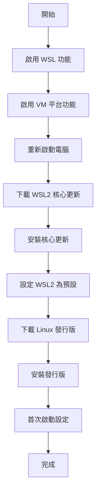

# 舊版手動安裝步驟

> [!warning] 適用對象
> 本頁適用於 Windows 10 組建 19041 以下的版本，或 `wsl --install` 命令無法正常運作時。

## 系統需求

### WSL 1 需求
- Windows 10 版本 1607+
- Windows Server 2019+

### WSL 2 需求
- Windows 10 版本 1903+ (組建 18362)
- Windows 10 版本 2004+ (組建 19041) - 建議
- Windows Server 2022+

## 手動安裝步驟

### 步驟 1：啟用「適用於 Linux 的 Windows 子系統」

```powershell
# 以系統管理員身分執行 PowerShell
dism.exe /online /enable-feature /featurename:Microsoft-Windows-Subsystem-Linux /all /norestart
```

或使用 PowerShell：

```powershell
Enable-WindowsOptionalFeature -Online -FeatureName Microsoft-Windows-Subsystem-Linux -NoRestart
```

### 步驟 2：啟用「虛擬機器平台」(WSL 2 必要)

```powershell
dism.exe /online /enable-feature /featurename:VirtualMachinePlatform /all /norestart
```

### 步驟 3：重新啟動電腦

```
重新啟動電腦以完成功能啟用
```

### 步驟 4：下載 WSL 2 Linux 核心更新套件

```powershell
# 下載並安裝
# https://wslstorestorage.blob.core.windows.net/wslblob/wsl_update_x64.msi

# 或使用 PowerShell 下載
Invoke-WebRequest -Uri "https://wslstorestorage.blob.core.windows.net/wslblob/wsl_update_x64.msi" -OutFile "wsl_update_x64.msi"
Start-Process msiexec.exe -ArgumentList "/i wsl_update_x64.msi /quiet" -Wait
```

### 步驟 5：設定 WSL 2 為預設版本

```powershell
wsl --set-default-version 2
```

### 步驟 6：安裝 Linux 發行版

#### 方法 A：從 Microsoft Store 安裝

1. 開啟 Microsoft Store
2. 搜尋 "Ubuntu" 或其他 Linux 發行版
3. 點選「取得」或「安裝」

#### 方法 B：使用命令列下載

```powershell
# 下載 Ubuntu 22.04
Invoke-WebRequest -Uri https://aka.ms/wslubuntu2204 -OutFile Ubuntu.appx -UseBasicParsing

# 安裝
Add-AppxPackage .\Ubuntu.appx
```

#### 方法 C：使用 curl 下載 (Windows 10 17063+)

```bash
curl.exe -L -o ubuntu.appx https://aka.ms/wslubuntu2204
```

## 發行版下載連結

| 發行版 | 下載連結 |
|--------|----------|
| Ubuntu 24.04 | https://aka.ms/wslubuntu2404 |
| Ubuntu 22.04 | https://aka.ms/wslubuntu2204 |
| Ubuntu 20.04 | https://aka.ms/wslubuntu2004 |
| Debian | https://aka.ms/wsl-debian-gnulinux |
| Kali Linux | https://aka.ms/wsl-kali-linux |
| Alpine | https://aka.ms/wsl-alpine |

## 安裝流程圖



## 離線安裝

適用於無法連接網際網路的環境：

### 1. 在有網路的電腦下載

```powershell
# 下載發行版
Invoke-WebRequest -Uri https://aka.ms/wslubuntu2204 -OutFile Ubuntu.appx

# 下載 WSL 核心更新
Invoke-WebRequest -Uri https://wslstorestorage.blob.core.windows.net/wslblob/wsl_update_x64.msi -OutFile wsl_update_x64.msi
```

### 2. 複製到目標電腦

將檔案複製到 USB 磁碟機或網路共用。

### 3. 在目標電腦安裝

```powershell
# 啟用功能 (需要系統管理員)
dism.exe /online /enable-feature /featurename:Microsoft-Windows-Subsystem-Linux /all /norestart
dism.exe /online /enable-feature /featurename:VirtualMachinePlatform /all /norestart

# 重新啟動後
# 安裝 WSL 核心
msiexec /i wsl_update_x64.msi

# 安裝發行版
Add-AppxPackage Ubuntu.appx
```

## 驗證安裝

```powershell
# 檢查 WSL 版本
wsl --version

# 檢查發行版
wsl --list --verbose

# 啟動
wsl
```

## 常見問題

### 啟用功能失敗

```powershell
# 檢查功能狀態
Get-WindowsOptionalFeature -Online -FeatureName Microsoft-Windows-Subsystem-Linux

# 如果顯示 Disabled，再次啟用
Enable-WindowsOptionalFeature -Online -FeatureName Microsoft-Windows-Subsystem-Linux -NoRestart
```

### 安裝 .appx 失敗

```powershell
# 確保開發者模式已啟用
# 設定 → 更新與安全性 → 開發人員專用 → 開發人員模式

# 或使用 PowerShell 啟用
Set-ExecutionPolicy -ExecutionPolicy RemoteSigned -Scope CurrentUser
```

## 相關主題

- [[安裝WSL]] - 推薦的安裝方式
- [[在WindowsServer上安裝]] - Windows Server 安裝
- [[故障排除]] - 常見問題解決

---
> 📚 返回 [[../00-MOCs/MOC-總覽|WSL 知識庫總覽]]
