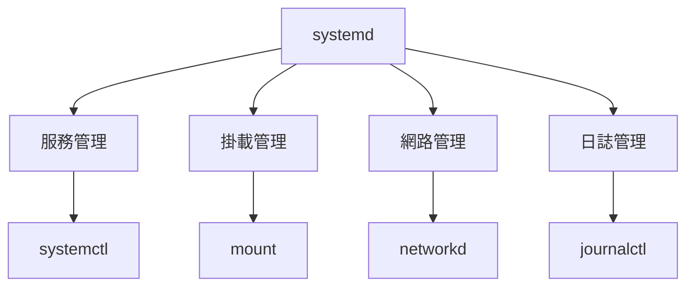

# 使用 systemd 來管理服務

> [!info] 說明
> 在 WSL 2 中啟用和使用 systemd 管理服務。

## systemd 簡介



## 啟用 systemd

### 系統需求

- WSL 版本 0.67.6+
- 已安裝 systemd 支援的發行版

### 設定步驟

```ini
# /etc/wsl.conf
[boot]
systemd=true
```

### 重新啟動 WSL

```powershell
# 在 Windows PowerShell 中
wsl --shutdown
wsl
```

### 驗證 systemd

```bash
# 檢查 systemd 是否執行
systemctl status

# 檢查 PID 1
ps -p 1 -o comm=
# 應該輸出: systemd
```

## systemctl 基本操作

### 服務管理

```bash
# 啟動服務
sudo systemctl start nginx

# 停止服務
sudo systemctl stop nginx

# 重新啟動
sudo systemctl restart nginx

# 重新載入設定
sudo systemctl reload nginx

# 查看狀態
sudo systemctl status nginx
```

### 開機自動啟動

```bash
# 啟用服務
sudo systemctl enable nginx

# 停用服務
sudo systemctl disable nginx

# 啟用並立即啟動
sudo systemctl enable --now nginx

# 停用並立即停止
sudo systemctl disable --now nginx
```

### 查看服務

```bash
# 列出所有服務
systemctl list-units --type=service

# 列出執行中的服務
systemctl list-units --type=service --state=running

# 列出已啟用的服務
systemctl list-unit-files --type=service --state=enabled

# 搜尋服務
systemctl list-units --type=service | grep docker
```

## 常用服務設定

### Docker

```bash
# 啟用 Docker
sudo systemctl enable docker
sudo systemctl start docker

# 查看狀態
sudo systemctl status docker
```

### PostgreSQL

```bash
# 啟用 PostgreSQL
sudo systemctl enable postgresql
sudo systemctl start postgresql
```

### Nginx

```bash
# 啟用 Nginx
sudo systemctl enable nginx
sudo systemctl start nginx
```

### SSH

```bash
# 啟用 SSH
sudo systemctl enable ssh
sudo systemctl start ssh
```

## 建立自訂服務

### 服務檔案範例

```ini
# /etc/systemd/system/myapp.service
[Unit]
Description=My Application
After=network.target

[Service]
Type=simple
User=username
WorkingDirectory=/home/username/myapp
ExecStart=/home/username/myapp/start.sh
Restart=on-failure
RestartSec=5

[Install]
WantedBy=multi-user.target
```

### 啟用自訂服務

```bash
# 重新載入 systemd
sudo systemctl daemon-reload

# 啟用服務
sudo systemctl enable myapp

# 啟動服務
sudo systemctl start myapp

# 查看狀態
sudo systemctl status myapp
```

## 日誌管理

### journalctl 基本使用

```bash
# 查看所有日誌
journalctl

# 查看特定服務日誌
journalctl -u nginx

# 即時追蹤日誌
journalctl -f

# 查看最近的日誌
journalctl -n 100

# 查看特定時間範圍
journalctl --since "2024-01-01" --until "2024-01-02"

# 查看開機日誌
journalctl -b
```

### 日誌過濾

```bash
# 按優先級過濾
journalctl -p err      # 錯誤及以上
journalctl -p warning  # 警告及以上

# 按程序過濾
journalctl _PID=1234

# 搜尋關鍵字
journalctl -u docker --since "1 hour ago" | grep -i error
```

## Timer (定時任務)

### 建立 Timer

```ini
# /etc/systemd/system/backup.timer
[Unit]
Description=Daily Backup Timer

[Timer]
OnCalendar=daily
Persistent=true

[Install]
WantedBy=timers.target
```

```ini
# /etc/systemd/system/backup.service
[Unit]
Description=Daily Backup Service

[Service]
Type=oneshot
ExecStart=/home/user/scripts/backup.sh
```

### 啟用 Timer

```bash
# 重新載入
sudo systemctl daemon-reload

# 啟用 Timer
sudo systemctl enable backup.timer
sudo systemctl start backup.timer

# 查看所有 Timer
systemctl list-timers
```

## 資源管理

### 服務資源限制

```ini
# /etc/systemd/system/myapp.service
[Service]
# 記憶體限制
MemoryMax=512M
MemoryHigh=400M

# CPU 限制
CPUQuota=50%

# 程序數量限制
TasksMax=100
```

### 查看資源使用

```bash
# 查看服務資源使用
systemctl show myapp --property=MemoryCurrent

# 查看所有服務狀態
systemd-analyze
systemd-analyze blame
```

## 故障排除

### systemd 未啟動

```bash
# 檢查 /etc/wsl.conf
cat /etc/wsl.conf

# 確認設定正確
# [boot]
# systemd=true

# 重新啟動 WSL
# 在 Windows PowerShell:
wsl --shutdown
wsl
```

### 服務啟動失敗

```bash
# 查看詳細錯誤
sudo systemctl status myapp

# 查看日誌
journalctl -xeu myapp

# 檢查服務檔案語法
systemd-analyze verify /etc/systemd/system/myapp.service
```

### 服務依賴問題

```bash
# 查看依賴關係
systemctl list-dependencies myapp

# 檢查啟動順序
systemd-analyze critical-chain myapp
```

## 常用命令速查

| 命令 | 說明 |
|------|------|
| `systemctl start SERVICE` | 啟動服務 |
| `systemctl stop SERVICE` | 停止服務 |
| `systemctl restart SERVICE` | 重新啟動 |
| `systemctl status SERVICE` | 查看狀態 |
| `systemctl enable SERVICE` | 啟用開機自啟 |
| `systemctl disable SERVICE` | 停用開機自啟 |
| `systemctl list-units` | 列出所有單元 |
| `systemctl daemon-reload` | 重新載入設定 |
| `journalctl -u SERVICE` | 查看服務日誌 |
| `journalctl -f` | 即時日誌 |

## 相關主題

- [[進階設定組態]] - WSL 設定選項
- [[開始使用資料庫]] - 資料庫服務設定
- [[故障排除]] - 常見問題

---
> 📚 返回 [[../00-MOCs/MOC-總覽|WSL 知識庫總覽]]
