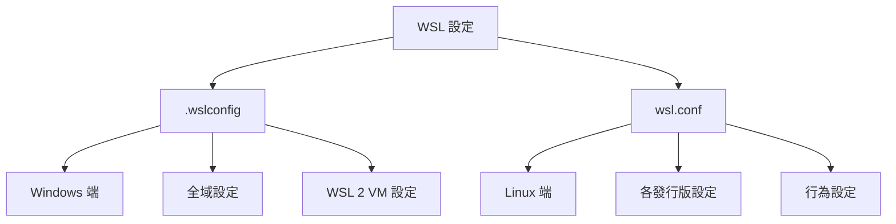

# 進階設定組態

> [!info] 說明
> WSL 的進階設定選項，包括 .wslconfig 和 wsl.conf 設定檔。

## 設定檔總覽



## .wslconfig 設定檔

### 檔案位置

```
%UserProfile%\.wslconfig
```

### 完整設定範例

```ini
[wsl2]
# 記憶體限制
memory=8GB

# 處理器數量
processors=4

# 置換空間大小
swap=2GB

# 置換檔案路徑
# swapfile=C:\\temp\\wsl-swap.vhdx

# 本地主機轉送
localhostForwarding=true

# 核心命令列參數
kernelCommandLine = vsyscall=emulate

# 啟用巢狀虛擬化
nestedVirtualization=true

# 啟用自動記憶體回收
autoMemoryReclaim=gradual

# 啟用 GUI 應用程式
guiApplications=true

[experimental]
# 自動磁碟清理
autoMemoryReclaim=gradual

# 主機位址 localhost
hostAddressLoopback=true

# 網路模式
networkingMode=nat

# 防火牆設定
firewall=true

# DNS 設定
bestEffortDnsParsing=true
```

### 主要設定選項

#### [wsl2] 區段

| 選項 | 說明 | 預設值 |
|------|------|--------|
| `memory` | WSL 2 VM 最大記憶體 | 主機記憶體的 50% |
| `processors` | WSL 2 VM 處理器數量 | 主機處理器數量 |
| `swap` | 置換空間大小 | 記憶體的 25% |
| `localhostForwarding` | 允許從主機連線到 WSL | true |
| `nestedVirtualization` | 巢狀虛擬化支援 | true |
| `guiApplications` | GUI 應用程式支援 | true |
| `kernelCommandLine` | 核心啟動參數 | - |

#### [experimental] 區段

| 選項 | 說明 |
|------|------|
| `autoMemoryReclaim` | 自動釋放未使用記憶體 |
| `hostAddressLoopback` | 允許 WSL 連線到主機 |
| `networkingMode` | 網路模式 (nat/mirrored) |
| `firewall` | 啟用 Windows 防火牆規則 |

## wsl.conf 設定檔

### 檔案位置

```
/etc/wsl.conf
```

### 完整設定範例

```ini
[boot]
# 啟用 systemd
systemd=true

# 開機時執行的命令
command="service ssh start"

[automount]
# 是否自動掛載 Windows 磁碟
enabled=true

# 掛載根目錄
mountFsTab=true

# 掛載選項
options = "metadata,umask=22,fmask=11"

# 啟動時掛載
mountfstab=true

[network]
# 主機名稱
hostname=WSL

# 產生 /etc/hosts
generateHosts=true

# 產生 /etc/resolv.conf
generateResolvConf=true

[interop]
# 啟用 Windows 程序執行
enabled=true

# 加入 Windows PATH
appendWindowsPath=true

[user]
# 預設使用者
default=username

[filesystem]
# UTF-8 編碼
umountOnExit=false
```

### 主要設定選項

#### [boot] 區段

```ini
[boot]
# 啟用 systemd (需要 WSL 2)
systemd=true

# 開機執行命令
command="service docker start && service postgresql start"
```

#### [automount] 區段

```ini
[automount]
# 掛載選項
# metadata: 啟用 Linux 權限支援
# umask: 權限遮罩
# fmask: 檔案權限遮罩
options = "metadata,umask=22,fmask=11"

# 大小寫設定
# case=off: 不區分大小寫
# case=dir: 目錄區分大小寫
options = "metadata,umask=22,fmask=11,case=off"
```

#### [network] 區段

```ini
[network]
# 自訂主機名稱
hostname=mywsl

# DNS 設定
generateResolvConf=false
```

#### [interop] 區段

```ini
[interop]
# 允許從 Linux 執行 Windows 程式
enabled=true

# 將 Windows PATH 加入 Linux PATH
appendWindowsPath=true
```

## systemd 支援

### 啟用 systemd

```ini
# /etc/wsl.conf
[boot]
systemd=true
```

### 重啟 WSL

```powershell
# 在 Windows PowerShell 中
wsl --shutdown
wsl
```

### 驗證 systemd

```bash
# 檢查 systemd
systemctl status

# 查看服務
systemctl list-units --type=service
```

### 使用 systemd 管理服務

```bash
# 啟用服務
sudo systemctl enable docker
sudo systemctl enable postgresql

# 啟動服務
sudo systemctl start docker

# 查看狀態
sudo systemctl status docker
```

## 效能調整

### 記憶體設定

```ini
# .wslconfig
[wsl2]
# 限制記憶體使用
memory=4GB

# 啟用自動記憶體回收
[experimental]
autoMemoryReclaim=gradual
```

### 處理器設定

```ini
# .wslconfig
[wsl2]
# 限制處理器核心
processors=2
```

### 磁碟效能

```ini
# .wslconfig
[wsl2]
# 置換設定
swap=1GB
```

## 網路設定

### 橋接網路模式

```ini
# .wslconfig
[wsl2]
networkingMode=mirrored

[experimental]
hostAddressLoopback=true
firewall=true
```

### DNS 設定

```bash
# 自訂 DNS (停用自動產生)
# /etc/wsl.conf
[network]
generateResolvConf=false

# 編輯 /etc/resolv.conf
sudo nano /etc/resolv.conf
# nameserver 8.8.8.8
```

## 套用設定

### 套用 .wslconfig

```powershell
# 關閉 WSL 後重新啟動
wsl --shutdown
wsl
```

### 套用 wsl.conf

```bash
# 在 WSL 中
# 需要重新啟動 WSL
exit

# 在 Windows PowerShell 中
wsl --shutdown
wsl
```

## 疑難排解

### 設定不生效

```bash
# 確認設定檔路徑正確
# .wslconfig: %UserProfile%\.wslconfig
# wsl.conf: /etc/wsl.conf

# 檢查語法
cat /etc/wsl.conf

# 重新啟動
wsl --shutdown
```

### systemd 問題

```bash
# 檢查 systemd 狀態
systemctl --status

# 查看日誌
journalctl -xe
```

## 相關主題

- [[網路相關考量]] - 網路設定詳解
- [[使用systemd來管理服務]] - systemd 使用指南
- [[故障排除]] - 常見問題

---
> 📚 返回 [[../00-MOCs/MOC-總覽|WSL 知識庫總覽]]
