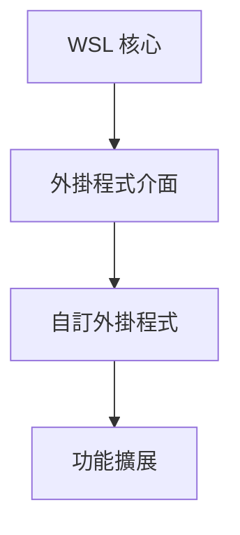

# 建立 WSL 外掛程式

> [!info] 說明
> 建立 WSL 外掛程式來擴展 WSL 功能。

## WSL 外掛程式架構



## 外掛程式類型

| 類型 | 說明 |
|------|------|
| 命令擴展 | 新增自訂 WSL 命令 |
| 整合擴展 | 與其他工具整合 |
| 自動化擴展 | 自動執行特定任務 |

## 開發環境設定

### 系統需求

- Windows 10/11
- WSL 2
- .NET SDK 或 Rust

### 專案結構

```
WSLPlugin/
├── src/
│   ├── Plugin.cs
│   └── Commands.cs
├── manifest.json
└── build.ps1
```

## 建立基本外掛程式

### 定義外掛程式清單

```json
// manifest.json
{
    "name": "MyWSLPlugin",
    "version": "1.0.0",
    "description": "Custom WSL plugin",
    "author": "Developer",
    "commands": [
        {
            "name": "mycommand",
            "description": "Execute custom command",
            "usage": "wsl mycommand [options]"
        }
    ]
}
```

### C# 外掛程式實作

```csharp
// Plugin.cs
using Microsoft.WSL;

public class MyWSLPlugin : IWSLPlugin
{
    public string Name => "MyWSLPlugin";
    public string Version => "1.0.0";

    public void Initialize(WSLPluginContext context)
    {
        context.RegisterCommand("mycommand", new MyCustomCommand());
    }

    public void Shutdown()
    {
        // 清理資源
    }
}

// Commands.cs
public class MyCustomCommand : IWSLCommand
{
    public string Name => "mycommand";
    public string Description => "Execute custom command";

    public int Execute(string[] args)
    {
        Console.WriteLine("Executing custom command...");

        // 實作自訂邏輯
        if (args.Contains("--help"))
        {
            ShowHelp();
            return 0;
        }

        // 執行主要功能
        DoWork();

        return 0;
    }

    private void ShowHelp()
    {
        Console.WriteLine("Usage: wsl mycommand [options]");
        Console.WriteLine("Options:");
        Console.WriteLine("  --help    Show this help");
    }

    private void DoWork()
    {
        // 自訂功能實作
    }
}
```

### Rust 外掛程式實作

```rust
// src/lib.rs
use wsl_plugin::{Plugin, Command, Context};

struct MyPlugin;

impl Plugin for MyPlugin {
    fn name(&self) -> &str {
        "MyWSLPlugin"
    }

    fn version(&self) -> &str {
        "1.0.0"
    }

    fn initialize(&mut self, ctx: &mut Context) {
        ctx.register_command("mycommand", MyCommand);
    }
}

struct MyCommand;

impl Command for MyCommand {
    fn name(&self) -> &str {
        "mycommand"
    }

    fn execute(&self, args: &[String]) -> i32 {
        println!("Executing custom command...");

        if args.contains(&"--help".to_string()) {
            self.show_help();
            return 0;
        }

        self.do_work();
        0
    }
}

impl MyCommand {
    fn show_help(&self) {
        println!("Usage: wsl mycommand [options]");
    }

    fn do_work(&self) {
        // 自訂功能
    }
}

wsl_plugin::register!(MyPlugin);
```

## 安裝外掛程式

### 安裝位置

```
%UserProfile%\.wsl\plugins\
```

### 安裝步驟

```powershell
# 建立外掛程式目錄
mkdir "$env:USERPROFILE\.wsl\plugins\MyPlugin" -Force

# 複製外掛程式檔案
Copy-Item ".\build\MyPlugin.dll" "$env:USERPROFILE\.wsl\plugins\MyPlugin\"
Copy-Item ".\manifest.json" "$env:USERPROFILE\.wsl\plugins\MyPlugin\"

# 重新啟動 WSL
wsl --shutdown
wsl
```

## 外掛程式範例

### 自動備份外掛程式

```csharp
public class AutoBackupCommand : IWSLCommand
{
    public string Name => "backup";

    public int Execute(string[] args)
    {
        var distro = args.FirstOrDefault() ?? "Ubuntu";
        var backupPath = $@"D:\backups\{distro}-{DateTime.Now:yyyyMMdd}.tar";

        Console.WriteLine($"Backing up {distro} to {backupPath}...");

        var process = new Process
        {
            StartInfo = new ProcessStartInfo
            {
                FileName = "wsl",
                Arguments = $"--export {distro} {backupPath}",
                RedirectStandardOutput = true,
                UseShellExecute = false
            }
        };

        process.Start();
        process.WaitForExit();

        Console.WriteLine("Backup completed!");
        return process.ExitCode;
    }
}
```

### 環境同步外掛程式

```csharp
public class SyncEnvCommand : IWSLCommand
{
    public string Name => "sync-env";

    public int Execute(string[] args)
    {
        // 同步 Windows 環境變數到 WSL
        var envVars = new Dictionary<string, string>
        {
            { "HTTP_PROXY", Environment.GetEnvironmentVariable("HTTP_PROXY") },
            { "HTTPS_PROXY", Environment.GetEnvironmentVariable("HTTPS_PROXY") },
            { "NO_PROXY", Environment.GetEnvironmentVariable("NO_PROXY") }
        };

        foreach (var (key, value) in envVars)
        {
            if (!string.IsNullOrEmpty(value))
            {
                Console.WriteLine($"Setting {key}={value}");
                // 設定 WSL 環境變數
            }
        }

        return 0;
    }
}
```

## 除錯外掛程式

### 啟用除錯日誌

```powershell
# 設定環境變數
$env:WSL_PLUGIN_DEBUG = "1"
wsl
```

### 查看日誌

```powershell
# 查看外掛程式日誌
Get-Content "$env:TEMP\wsl-plugin.log" -Tail 50
```

## 發佈外掛程式

### 建立發佈套件

```powershell
# build.ps1
$pluginName = "MyWSLPlugin"
$version = "1.0.0"
$outputDir = ".\release\$pluginName-$version"

# 建立輸出目錄
New-Item -ItemType Directory -Force -Path $outputDir

# 編譯
dotnet build -c Release

# 複製檔案
Copy-Item ".\bin\Release\net6.0\*.dll" $outputDir
Copy-Item ".\manifest.json" $outputDir

# 建立 ZIP
Compress-Archive -Path $outputDir -DestinationPath ".\release\$pluginName-$version.zip"
```

## 最佳實務

### 效能考量

- 避免在 `Initialize` 中執行耗時操作
- 使用非同步操作處理長時間任務
- 快取重複使用的資料

### 錯誤處理

```csharp
public int Execute(string[] args)
{
    try
    {
        // 主要邏輯
        return 0;
    }
    catch (Exception ex)
    {
        Console.Error.WriteLine($"Error: {ex.Message}");
        return 1;
    }
}
```

### 安全性

- 驗證所有輸入參數
- 避免注入攻擊
- 使用最小權限原則

## 相關主題

- [[進階設定組態]] - WSL 設定
- [[故障排除]] - 常見問題
- [[WSL開放原始碼]] - 開源貢獻

---
> 📚 返回 [[../00-MOCs/MOC-總覽|WSL 知識庫總覽]]
