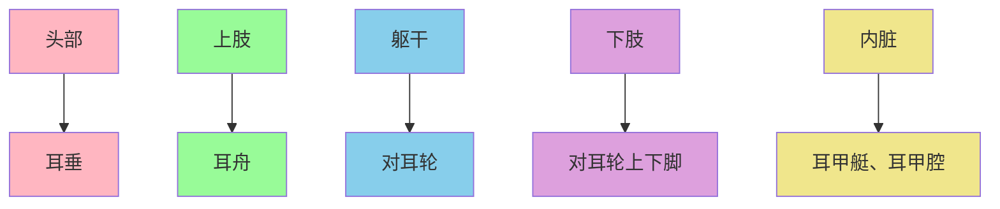

# 中医 - 耳诊

> [!quote] 耳诊理论
> 耳者，宗脉之所聚也，十二经脉皆上通于耳。耳廓虽小，其形倒置，如胎儿在母腹中，全身脏腑经络皆反映于耳。
> 
> —— 《灵枢·口问》

## 🏗️ 耳诊理论基础

### 耳与全身的关联

#### 理论依据
- **经络联系**: 十二经脉、三百六十五络，其血气皆上于面而走空窍，其精阳气上走于目而为睛，其别气走于耳而为听
- **胚胎投影**: 耳廓形态如倒置胎儿，全身各部位在耳部有相应投影区
- **神经支配**: 耳部有丰富的神经分布，与全身各系统联系
- **全息理论**: 局部包含整体信息，耳部是全身的全息缩影

#### 耳诊历史
```dataview
TABLE 
  "历史时期" as "时期",
  "发展特点" as "特点",
  "主要贡献" as "贡献"
FROM ""
WHERE contains(tags, "耳诊历史") OR contains(tags, "中医历史")
```

**发展历程:**
- **古代起源**: 《黄帝内经》记载耳与全身联系
- **近代发展**: 20世纪50年代法国诺吉尔提出耳穴地图
- **现代应用**: 结合现代医学，形成系统耳诊体系
- **国际传播**: 世界卫生组织认可耳穴疗法

## 👂 耳部解剖结构

### 耳廓分区

#### 耳廓基本结构
| 部位 | 形态特点 | 主要反射区 | 临床意义 |
|------|----------|------------|----------|
| **耳垂** | 柔软下垂 | 面部、牙齿、眼 | 面瘫、牙痛、眼疾 |
| **耳轮** | 耳廓边缘 | 肢体、脊柱 | 肢体疼痛、脊柱疾病 |
| **对耳轮** | 内侧边缘 | 躯干、内脏 | 内脏疾病、躯干疼痛 |
| **耳舟** | 耳轮与对耳轮之间 | 上肢 | 上肢疾病、肩颈痛 |
| **三角窝** | 对耳轮上下脚之间 | 盆腔、生殖器 | 妇科疾病、生殖系统 |
| **耳甲艇** | 耳轮脚上方凹陷 | 腹腔脏器 | 消化系统疾病 |
| **耳甲腔** | 耳轮脚下方凹陷 | 胸腔脏器 | 心肺疾病 |

#### 耳背结构
| 部位 | 主要反射区 | 临床意义 |
|------|------------|----------|
| **耳背沟** | 降压沟、脊椎 | 高血压、脊椎病 |
| **耳背心** | 心脏、血管 | 心血管疾病 |
| **耳背脾** | 脾胃、消化 | 消化系统疾病 |

## 🗺️ 耳穴分布规律

### 耳穴定位原则

#### 整体投影规律


#### 主要耳穴定位
| 系统分类 | 耳穴位置 | 定位标志 | 主治范围 |
|----------|----------|----------|----------|
| **神经系统** | 耳垂内侧 | 屏间切迹 | 神经衰弱、失眠、头痛 |
| **心血管系统** | 耳甲腔中心 | 心穴 | 心悸、胸闷、高血压 |
| **呼吸系统** | 耳甲腔上部 | 肺穴、气管 | 咳嗽、哮喘、支气管炎 |
| **消化系统** | 耳甲艇 | 胃穴、肠穴、肝穴 | 胃痛、腹泻、消化不良 |
| **泌尿生殖** | 三角窝 | 肾穴、膀胱穴、子宫 | 泌尿感染、月经不调 |
| **内分泌系统** | 耳甲腔后部 | 内分泌穴 | 内分泌失调、糖尿病 |
| **运动系统** | 耳轮、对耳轮 | 颈、肩、腰、膝等 | 关节疼痛、肌肉损伤 |

### 常用耳穴详解

#### 重要耳穴
```dataview
TABLE 
  "耳穴名称" as "耳穴",
  "精确定位" as "定位",
  "主要功能" as "功能",
  "主治疾病" as "主治"
FROM ""
WHERE contains(tags, "耳穴") OR contains(tags, "反射区")
```

**心穴(Heart Point):**
- **定位**: 耳甲腔中央，三角窝后下方
- **功能**: 宁心安神，调节心律
- **主治**: 心悸、胸闷、失眠、多梦、健忘
- **应用**: 心血管疾病，神经衰弱

**肾穴(Kidney Point):**
- **定位**: 对耳轮下脚下方，三角窝后壁
- **功能**: 补肾益精，强壮腰膝
- **主治**: 腰痛、耳鸣、遗精、阳痿、肾炎
- **应用**: 泌尿生殖系统疾病，老年保健

**肝穴(Liver Point):**
- **定位**: 耳甲艇后部，胃穴后上方
- **功能**: 疏肝理气，明目
- **主治**: 肝炎、眼疾、高血压、月经不调
- **应用**: 肝胆疾病，情志病

**脾穴(Spleen Point):**
- **定位**: 耳甲腔后下方，腰椎穴前下方
- **功能**: 健脾益气，统血
- **主治**: 消化不良、腹泻、贫血、出血
- **应用**: 消化系统疾病，血液病

## 🔍 耳诊诊断方法

### 观察诊断法

#### 望耳形态
| 观察内容 | 正常表现 | 异常表现 | 临床意义 |
|----------|----------|----------|----------|
| **耳廓颜色** | 淡红润泽 | 苍白、暗红、发黄 | 气血、脏腑功能 |
| **耳廓形态** | 饱满有神 | 萎缩、变形、缺损 | 先天发育、脏腑状况 |
| **耳廓光泽** | 光泽有神 | 晦暗无光、枯槁 | 气血盛衰 |
| **耳廓弹性** | 弹性良好 | 硬化、松弛、疼痛 | 组织健康状况 |

#### 异常体征识别
**颜色异常:**
- **苍白**: 气血两虚，寒证
- **鲜红**: 实热证，血热
- **暗红**: 瘀血证，血行不畅
- **发黄**: 湿热证，脾虚湿盛
- **青紫**: 气滞血瘀，寒凝

**形态异常:**
- **凹陷**: 虚证，气血不足
- **隆起**: 实证，气滞血瘀
- **脱屑**: 风热，血燥
- **增厚**: 湿热，痰浊
- **血管充盈**: 热证，血热

### 触摸诊断法

#### 触诊技术
| 触诊方法 | 操作要点 | 适应症 | 注意事项 |
|----------|----------|--------|----------|
| **按压法** | 用探棒或指甲轻压 | 疼痛点识别 | 力度适中 |
| **滑动法** | 顺纹理滑动检查 | 结节、条索识别 | 顺滑进行 |
| **捏提法** | 捏提耳廓检查 | 弹性、张力检查 | 避免疼痛 |
| **温度法** | 用手背感受温度 | 寒热证辨别 | 环境温度影响 |

#### 压痛点诊断
**反应点特征:**
- **压痛明显**: 轻压即痛，病理反应强
- **压痛轻微**: 重压才痛，病理反应弱
- **无压痛**: 重压无痛，基本正常
- **压痛放射**: 按压时疼痛向其他部位传导

**临床意义:**
- **急性病**: 压痛剧烈，界限清晰
- **慢性病**: 压痛较轻，界限模糊
- **陈旧病**: 压痛不明显，有条索结节
- **功能性疾病**: 压痛时有时无

## 💆 耳穴治疗方法

### 耳穴按压法

#### 指压按摩
```dataview
TABLE 
  "按摩手法" as "手法",
  "操作要点" as "要点",
  "适用病症" as "适用",
  "注意事项" as "注意"
FROM ""
WHERE contains(tags, "耳穴按摩") OR contains(tags, "按摩")
```

**基本按摩手法:**
- **揉法**: 用指腹揉按耳穴，顺时针方向
- **点按法**: 用指甲或探棒点压耳穴
- **捏搓法**: 捏住耳廓轻轻搓动
- **拉扯法**: 轻轻拉扯耳垂、耳轮

**操作要点:**
- **力度适中**: 以感觉酸胀为宜
- **时间适宜**: 每穴1-3分钟
- **频率规律**: 每日1-2次
- **持续坚持**: 7-15天为一疗程

### 耳穴贴压法

#### 王不留行贴压
**材料准备:**
- **王不留行籽**: 常用贴压材料
- **胶布**: 医用胶布，固定药籽
- **镊子**: 用于夹取和定位药籽
- **消毒棉**: 清洁耳部皮肤

**操作步骤:**
1. **清洁耳部**: 用75%酒精消毒耳廓
2. **定位穴位**: 准确确定需要贴压的穴位
3. **粘贴药籽**: 用胶布将药籽固定在穴位上
4. **按压刺激**: 每日按压3-5次，每次1-2分钟
5. **更换时间**: 一般3-5天更换一次

**注意事项:**
- **皮肤检查**: 如有破损、炎症暂缓贴压
- **过敏反应**: 如出现过敏立即停止使用
- **孕妇禁忌**: 某些穴位孕妇慎用
- **按压强度**: 以感觉酸胀不痛为度

### 耳穴针刺法

#### 针刺技术
**针刺方法:**
| 针刺类型 | 针具选择 | 深度 | 留针时间 | 适应症 |
|----------|----------|------|----------|--------|
| **毫针** | 0.5寸毫针 | 0.1-0.2cm | 15-30分钟 | 急性病症 |
| **埋针** | 皮内针 | 0.1cm | 3-7天 | 慢性病症 |
| **三棱针** | 三棱针 | 点刺 | 出血即止 | 实热证 |
| **电针** | 毫针+电针仪 | 0.1-0.2cm | 15-20分钟 | 疼痛病症 |

## 🎯 临床应用

### 常见疾病应用

#### 内科疾病
```dataview
TABLE 
  "疾病名称" as "疾病",
  "主选耳穴" as "主穴",
  "配穴选择" as "配穴",
  "治疗方法" as "方法"
FROM ""
WHERE contains(tags, "耳穴应用") OR contains(tags, "临床应用")
```

**高血压:**
- **主穴**: 降压沟、心穴、肾穴
- **配穴**: 肝穴、皮质下、神门
- **方法**: 每日按压3-5次，每次3分钟

**失眠:**
- **主穴**: 神门、皮质下、心穴
- **配穴**: 肾穴、肝穴、脾穴
- **方法**: 睡前按压，效果更佳

**糖尿病:**
- **主穴**: 内分泌、胰穴、肾穴
- **配穴**: 脾穴、胃穴、三焦
- **方法**: 长期坚持，配合饮食控制

#### 外科疾病
**颈椎病:**
- **主穴**: 颈椎、肩、神门
- **配穴**: 肾穴、肝穴、皮质下
- **方法**: 配合颈部运动，效果更佳

**腰痛:**
- **主穴**: 腰椎、肾穴、神门
- **配穴**: 膀胱、肝穴、皮质下
- **方法**: 避免劳累，注意休息

#### 妇科疾病
**月经不调:**
- **主穴**: 子宫、内分泌、卵巢
- **配穴**: 肾穴、肝穴、脾穴
- **方法**: 月经前一周开始治疗

**更年期综合征:**
- **主穴**: 内分泌、卵巢、神门
- **配穴**: 肾穴、心穴、肝穴
- **方法**: 配合情志调理

## 🔬 现代研究

### 科学依据

#### 神经生理学基础
- **神经分布**: 耳部有丰富的迷走神经、三叉神经、面神经分布
- **反射机制**: 刺激耳穴通过神经反射调节内脏功能
- **神经-内分泌-免疫网络**: 通过神经调节影响内分泌和免疫功能

#### 临床研究证据
| 研究领域 | 研究结果 | 临床意义 |
|----------|----------|----------|
| **镇痛作用** | 刺激耳穴可释放内啡肽 | 证明耳穴镇痛机制 |
| **心血管调节** | 调节血压、心率 | 心血管疾病防治 |
| **内分泌调节** | 影响激素分泌 | 内分泌疾病治疗 |
| **免疫功能** | 增强免疫力 | 提高抗病能力 |

### 现代应用

#### 综合治疗
- **中西医结合**: 耳穴配合药物治疗
- **多学科协作**: 与康复、营养、心理等结合
- **个体化方案**: 根据体质和病情制定方案
- **疗效评估**: 建立科学的疗效评价体系

#### 技术创新
- **电耳针**: 结合现代电子技术
- **激光耳穴**: 使用激光刺激耳穴
- **超声耳穴**: 超声波耳穴治疗
- **磁疗耳穴**: 磁场作用于耳穴

## 💡 实用指导

### 自我保健

#### 日常耳穴按摩
**基本方法:**
1. **全耳按摩**: 双手搓热，揉搓整个耳廓
2. **重点按摩**: 根据需要重点按摩相关耳穴
3. **时间安排**: 早晚各一次，每次5-10分钟
4. **持之以恒**: 长期坚持，效果更佳

**注意事项:**
- **清洁卫生**: 按摩前清洁双手和耳部
- **力度适中**: 以感觉酸胀不痛为度
- **循序渐进**: 开始时时间短，逐渐延长
- **及时就医**: 严重疾病应配合医疗

#### 常见病症自我调理
**失眠:**
- **按摩时间**: 睡前30分钟
- **重点穴位**: 神门、皮质下、心穴
- **按摩方法**: 轻柔按压，每次2-3分钟

**头痛:**
- **按摩时机**: 头痛发作时或预防性按摩
- **重点穴位**: 神门、皮质下、额、枕
- **按摩方法**: 中等力度按压

**消化不良:**
- **按摩时间**: 饭后30分钟
- **重点穴位**: 胃、肠、脾、内分泌
- **按摩方法**: 顺时针揉按

## 🔗 相关理论

### 其他反射区疗法
- **足底反射**: 足部反射区治疗
- **手部反射**: 手部反射区治疗
- **鼻部反射**: 鼻部反射区治疗
- **面部反射**: 面部反射区治疗

### 相关中医理论
- **经络学说**: 十二经脉循行
- **脏腑理论**: 脏腑功能与联系
- **气血理论**: 气血运行与调节
- **全息理论**: 局部反映整体信息

## 📚 拆解笔记

本笔记已拆解为以下原子化笔记：

### 理论基础
- [[耳诊-基础理论]] - 耳诊的理论依据、历史发展

### 解剖与定位
- [[耳诊-耳部解剖结构]] - 耳廓分区、反射区详解
- [[耳诊-耳穴分布规律]] - 耳穴定位原则、系统分类
- [[耳诊-重要耳穴详解]] - 重要耳穴的定位、功能、主治

### 诊断与治疗
- [[耳诊-耳诊诊断方法]] - 观察法、触摸法诊断
- [[耳诊-耳穴治疗方法]] - 按压法、贴压法、针刺法

### 应用与研究
- [[耳诊-临床应用]] - 内科、外科、妇科疾病应用
- [[耳诊-现代研究]] - 科学依据、现代应用
- [[耳诊-实用指导]] - 自我保健、日常按摩

---

> [!tldr] 快速概要
> 耳诊基于耳与全身经络联系，通过观察耳部形态和刺激耳穴来诊断和治疗疾病，是中医特色诊断和治疗方法，操作简便，疗效显著。

## 🏷️ 标签
#耳诊 #耳穴 #反射区 #中医诊断 #自我保健

## 🔗 关联笔记
- [[中医养生-基础理论]]
- [[中医-体质辨识]]
- [[健康-评估标准]]

---
*创建时间：2026-01-19*
*更新时间：2026-01-20*
*分类：中医诊断方法*