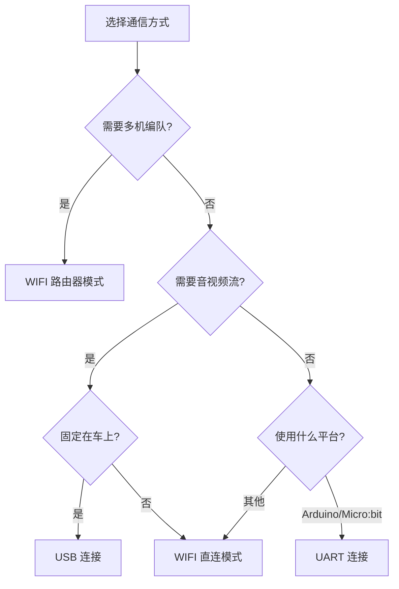

# 3. 第三方平台通信

> [!info] 本章概述
> 介绍第三方平台与 RoboMaster EP 建立连接的多种方式，包括 WiFi、USB 和 UART 三种通信方式。

---

## 3.1 介绍

用户使用第三方平台跟 RoboMaster EP 建立连接后，通过**明文 SDK** 和 EP 机器人进行通信，可以：

- 控制各个内置模块和拓展模块
- 获取 EP 机器人的视频流、音频流
- 极大地丰富 EP 的扩展性
- 解锁更多玩法

---

## 3.2 第三方平台类型

用户使用的第三方平台需具备：

| 要求 | 说明 |
|------|------|
| **自主计算能力** | 可运行用户程序 |
| **接口支持** | WIFI / USB / UART 至少一种 |
| **通信协议** | 支持明文 SDK 协议 |

### 支持的第三方平台

| 平台 | 特点 | 适用场景 |
|------|------|----------|
| **DJI 妙算** | 官方推荐，兼容性好 | 高性能计算、视觉处理 |
| **Jetson Nano** | GPU 加速，AI 能力强 | 深度学习、图像识别 |
| **树莓派** | 社区活跃，成本低 | 通用开发、教育学习 |
| **Arduino** | 简单易用，实时性好 | 传感器控制、简单任务 |
| **Micro:bit** | 教育友好，图形编程 | 青少年编程入门 |
| **PC** | 开发调试方便 | SDK 开发、测试 |

---

## 3.3 通信方式

第三方平台和 RoboMaster EP 的通信方式包括三种：

| 方式 | 特点 | 适用场景 |
|------|------|----------|
| **WIFI** | 无线连接，灵活方便 | 远程控制、视频传输 |
| **USB** | 有线连接，稳定可靠 | 嵌入式开发、固定安装 |
| **UART** | 串口通信，实时性好 | 单片机、简单控制 |

---

### 3.3.1 WIFI 连接

WIFI 连接包括两种模式：

#### 3.3.1.1 直连模式

| 项目 | 说明 |
|------|------|
| **条件** | 第三方平台具有 WIFI 连接功能 |
| **用途** | 第三方平台使用 WIFI 连接到 EP 后，通过明文 SDK 和 EP 进行通信 |

**连接步骤：**

1. 启动 EP，切换智能中控的连接模式开关至 **直连模式**
2. 打开第三方平台的无线网络，扫描 EP 的热点，进行连接
3. 通过明文 SDK 和 EP 进行通信

> [!info] 详细步骤
> 参考 [[../07-明文SDK/接入方式#WIFI 直连模式|WIFI 直连模式]]

**应用举例：**
- DJI 妙算、Jetson Nano 或 PC 使用 WIFI 连接到 EP
- 通过明文 SDK 和 EP 进行通信
- 获取 EP 的视频流、音频流

**DJI 妙算、Jetson Nano 或 PC 通过 WIFI 直连模式连接到 EP**

---

#### 3.3.1.2 路由器模式

| 项目 | 说明 |
|------|------|
| **条件** | 第三方平台具有 WIFI 或有线网络连接功能 |
| **用途** | 第三方平台和 EP 连接到同一个局域网中，通过明文 SDK 和 EP 进行通信 |

**连接步骤：**

1. 启动 EP，切换智能中控的连接模式开关至 **路由器模式**
2. 通过官方 App 的扫码连接方式将 EP 连接到路由器
3. 第三方平台通过 WIFI 或有线网络连接到同一路由器
4. 通过官方 App 的设置页面或编写脚本获取 EP 的 IP 地址
5. 通过明文 SDK 和 EP 进行通信

> [!info] 详细步骤
> 参考 [[../07-明文SDK/接入方式#WIFI 路由器模式|WIFI 路由器模式]]

**应用举例：**
- DJI 妙算、Jetson Nano 或 PC 和 EP 连接到同一个局域网
- 通过明文 SDK 和 EP 进行通信
- 获取 EP 的视频流、音频流
- **适合多机编队控制**

**DJI 妙算、Jetson Nano 或 PC 通过 WIFI 路由器模式连接到 EP**

---

### 3.3.2 USB 连接

| 项目 | 说明 |
|------|------|
| **条件** | 第三方平台具有 TypeA USB 接口，并支持 RNDIS 功能 |
| **用途** | 第三方平台通过 USB 线连接到 EP 智能中控的 Micro USB 端口，使用明文 SDK 和 EP 进行通信 |

**连接步骤：**

1. 启动 EP，**无需关心**智能中控的连接模式开关位置
2. 第三方平台通过 USB 线连接到 EP 的智能中控
3. 通过明文 SDK 和 EP 进行通信

> [!info] 详细步骤
> 参考 [[../07-明文SDK/接入方式#USB 连接|USB 连接]]

**应用举例：**
- 树莓派或 Jetson Nano 固定在 EP 小车上
- 由 EP 的电源转接模块供电
- 通过 USB 连接到 EP
- 使用明文 SDK 和 EP 进行通信
- 获取 EP 的视频流、音频流

**树莓派连接示意图：**

**Jetson Nano 连接示意图：**

---

### 3.3.3 UART 连接

| 项目 | 说明 |
|------|------|
| **条件** | 第三方平台具有 UART 接口或有串口转 USB 功能 |
| **用途** | 第三方平台通过 UART 连接到 EP 运动控制器的 UART 接口，使用明文 SDK 和 EP 进行通信 |

**连接步骤：**

1. 启动 EP，**无需关心**智能中控的连接模式开关位置
2. 第三方平台 UART 的 TX/RX 和 GND 分别连接到 EP 运动控制器 UART 的 RX/TX 和 GND
3. 通过明文 SDK 和 EP 进行通信

> [!tip] 引脚说明
> 参考 [[../06-拓展模块/UART接口#引脚说明|UART 引脚说明]]

> [!info] 详细步骤
> 参考 [[../07-明文SDK/接入方式#UART 连接|UART 连接]]

**接线说明：**

| 第三方平台 | EP 运动控制器 |
|------------|---------------|
| TX | RX |
| RX | TX |
| GND | GND |

**应用举例：**
- Arduino 或 Micro:bit 固定在 EP 小车上
- 由 EP 的电源转接模块供电
- 通过 UART 连接到 EP 运动控制器
- 使用明文 SDK 和 EP 进行通信

**Arduino 连接示意图：**

**Micro:bit 连接示意图：**

---

## 通信方式对比

| 方式 | 优点 | 缺点 | 适用平台 |
|------|------|------|----------|
| **WIFI 直连** | 简单快捷，无需路由器 | 只能单机连接 | PC、Jetson Nano、妙算 |
| **WIFI 路由器** | 支持多机编队，范围广 | 需要路由器设备 | 多机控制场景 |
| **USB** | 稳定可靠，可获取音视频 | 有线连接，距离受限 | 树莓派、Jetson Nano |
| **UART** | 简单直接，实时性好 | 功能有限，无音视频 | Arduino、Micro:bit |

---

## 快速选择指南

---

## 导航

| 上一章 | 当前章 | 下一章 |
|--------|--------|--------|
| [[2. 编程环境安装]] | **3. 第三方平台通信** | [[../02-SDK基础/SDK安装]] |

---

## 相关链接

- [[RoboMaster开发指南]] - 知识库主页
- [[../07-明文SDK/介绍|明文 SDK 介绍]] - 协议概述
- [[../07-明文SDK/接入方式|明文 SDK 接入方式]] - 详细连接步骤
- [[../06-拓展模块/UART接口|UART 接口]] - 引脚说明
- [官方文档](https://robomaster-dev.readthedocs.io/zh-cn/latest/third_part_comm.html)
