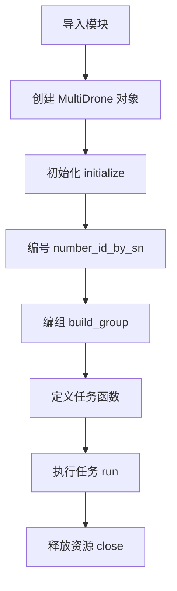

# 12. RoboMaster SDK 多机编队TT

> [!info] 本章概述
> 介绍如何使用 RoboMaster SDK 控制 Tello Talent/Tello EDU 教育无人机进行多机编队飞行，包括初始化、编组、飞行控制和完整示例。

---

## 12.1 初始化无人机

在进行与无人机相关的操作之前，需要根据指定的配置初始化无人机对象。

### 步骤 1：导入模块

```python
from multi_robomaster import multi_robot
```

### 步骤 2：创建多机对象

```python
multi_drone = multi_robot.MultiDrone()
```

### 步骤 3：初始化

```python
# 传入想要控制的飞机数量
multi_drone.initialize(drone_num)
```

> [!important] 注意
> 教育系列无人机的初始化需要传入想要控制的飞机数量。

---

## 12.2 对无人机进行编号编组

### 编号操作

由于 SN 码是唯一识别一架飞机的信息，所以在多机编队时需要根据 SN 码来对飞机进行编队。

**编号方法：**

```python
multi_drone.number_id_by_sn([id1, "SN1"], [id2, "SN2"], ...)
```

**示例：**

```python
# 将 SN 为 "0TQZH79ED00H56" 的飞机编号为 1
# 将 SN 为 "0TQZH79ED00H89" 的飞机编号为 2
multi_drone.number_id_by_sn(
    [1, "0TQZH79ED00H56"], 
    [2, "0TQZH79ED00H89"]
)
```

> [!note] 规则
> - 用户对飞机同一 SN 进行多个 id 的映射是被允许的
> - 但是一个 id 只允许映射一个 SN

### 编组操作

```python
# 编组
multi_drone_group1 = multi_drone.build_group([1, 2])

# 对同一架飞机进行多次编组
multi_drone_group1 = multi_drone.build_group([1])
multi_drone_group2 = multi_drone.build_group([1, 2])
```

### 自动编号

若用户不期望对飞机进行编号，可使用自动编号 API：

```python
# 隐式对飞机进行 0~drone_num 的随机编号
multi_drone.number_id_to_all_drone()
```

---

## 12.3 控制无人机执行命令

### 单组任务执行

```python
multi_drone.run([multi_drone_group1, base_action_1])
```

**参数说明：**
- `multi_drone_group1`：编组后的 `multi_group` 对象
- `base_action_1`：用户自定义的命令函数

### 多组并行任务执行

```python
# 两个 group 同时执行不同任务
multi_drone.run(
    [multi_drone_group1, base_action_1],
    [multi_drone_group2, base_action_2]
)
```

### 任务函数格式

```python
def base_action_1(robot_group):
    robot_group.get_sn()
    robot_group.get_battery()
```

> [!important] 格式要求
> 任务函数只有一个参数 `robot_group`，为执行函数内动作的组对象。

---

## 12.4 释放无人机资源

```python
multi_drone.close()
```

> [!warning] 重要
> 为了避免一些意外错误，记得在程序的最后调用 `close()` 方法！

---

## 12.5 查询类接口的使用

### 12.5.1 示例一：查询机器人 SN 信息和电量

```python
from multi_robomaster import multi_robot

def basic_task(robot_group):
    robot_group.get_sn()
    robot_group.get_battery()

if __name__ == '__main__':
    # 获取无人机 SN（通过扫描示例程序获取）
    robot_sn_list = ["0TQZH79ED00H56", "0TQZH79ED00H89"]
    
    drone_num = 2
    multi_drone = multi_robot.MultiDrone()
    multi_drone.initialize(robot_num=2)
    
    # 编号
    multi_drone.number_id_by_sn(
        [0, robot_sn_list[0]], 
        [1, robot_sn_list[1]]
    )
    
    # 编组
    tello_group = multi_drone.build_group([0, 1])
    
    # 执行任务
    multi_drone.run([tello_group, basic_task])
    
    multi_drone.close()
```

**输出格式：**
```
DRONE id: 0, reply: 0TQZH79ED00H56
DRONE id: 1, reply: 0TQZH79ED00H89
DRONE id: 0, reply: 85
DRONE id: 1, reply: 92
```

> [!info] 示例文件
> `/examples/15_multi_robot/multi_drone/02_basic.py`

---

## 12.6 设置类接口的使用

> [!warning] 注意
> 设置扩展 LED 灯目前只有 **Tello Talent** 机器支持！

### 12.6.1 示例一：设置无人机扩展 LED 模块

```python
import time
from multi_robomaster import multi_robot

def base_action_1(robot_group):
    # 所有飞机亮白灯
    robot_group.set_led(255, 255, 255)
    time.sleep(2)
    
    # 不同飞机亮不同颜色的灯
    robot_group.set_led(command_dict={1: [255, 0, 0], 2: [255, 255, 0]})

if __name__ == '__main__':
    robot_sn_list = ["0TQZH79ED00H56", "0TQZH79ED00H89"]
    
    multi_drone = multi_robot.MultiDrone()
    multi_drone.initialize(robot_num=2)
    multi_drone.number_id_by_sn([1, robot_sn_list[0]], [2, robot_sn_list[1]])
    
    multi_drone_group1 = multi_drone.build_group([1, 2])
    multi_drone.run([multi_drone_group1, base_action_1])
    
    multi_drone.close()
```

**command_dict 参数说明：**

```python
# 设置不同飞机显示不同颜色
robot_group.set_led(command_dict={
    1: [255, 0, 0],      # 1号飞机：红色
    2: [255, 255, 0]     # 2号飞机：黄色
})
```

> [!important] 注意事项
> - 使用 `command_dict` 时，其他参数将被自动忽略
> - 字典中的飞机数必须等于当前 group 中的飞机数
> - 不支持默认设置

> [!info] 示例文件
> `/examples/15_multi_robot/multi_drone/06_led.py`

---

## 12.7 动作类接口的使用

> [!warning] 固件要求
> 飞机固件版本 **v2.5.1.4** 和 WiFi 模块版本 **v1.0.0.33** 以下的用户，请升级后再使用动作类接口，否则会导致执行飞行动作异常。

### 12.7.1 示例一：控制飞机起飞并前后飞行

**场景：** 控制两组共两架飞机，一架向前飞 100cm，一架向后飞 100cm。

```python
from multi_robomaster import multi_robot

def takeoff_land_task1(robot_group):
    """1号飞机任务：起飞 -> 前飞 -> 降落"""
    robot_group.takeoff().wait_for_completed()
    robot_group.forward(100).wait_for_completed()
    robot_group.land().wait_for_completed()

def takeoff_land_task2(robot_group):
    """2号飞机任务：起飞 -> 后飞 -> 降落"""
    robot_group.takeoff().wait_for_completed()
    robot_group.backward(100).wait_for_completed()
    robot_group.land().wait_for_completed()

if __name__ == '__main__':
    robot_sn_list = ["0TQZH79ED00H56", "0TQZH79ED00H89"]
    
    multi_drone = multi_robot.MultiDrone()
    multi_drone.initialize(robot_num=2)
    multi_drone.number_id_by_sn([0, robot_sn_list[0]], [1, robot_sn_list[1]])
    
    # 分别编组
    multi_drone_group1 = multi_drone.build_group([0])
    multi_drone_group2 = multi_drone.build_group([1])
    
    # 同时执行不同任务
    multi_drone.run(
        [multi_drone_group1, takeoff_land_task1],
        [multi_drone_group2, takeoff_land_task2]
    )
    
    multi_drone.close()
```

> [!warning] 重要提示
> 不同于单机，多机执行飞行动作时，**`wait_for_completed()` 接口为必写项**！
> 
> 如忘记书写则可能导致当前动作的下一动作无法运行，在等待一段时间后会执行当前动作之后的第二个动作。

---

### 12.7.2 示例二：控制飞机移动到目标坐标点

**场景：** 控制两架飞机起飞，以大地毯中点为圆心，以 50cm 为边长，在 100cm 高度上以 100cm/s 的速度按正方形轨迹运动。

```python
from multi_robomaster import multi_robot

def base_action_1(robot_group):
    # 开启挑战卡检测
    robot_group.mission_pad_on()
    
    # 起飞
    robot_group.takeoff().wait_for_completed()
    
    # 正方形轨迹飞行（对角运动）
    # 第一个点
    robot_group.go({
        1: [-50, -50, 100, 100, "m12"], 
        2: [50, 50, 100, 100, "m12"]
    }).wait_for_completed()
    
    robot_group.set_mled_char("r", "heart")
    
    # 第二个点
    robot_group.go({
        1: [-50, 50, 100, 100, "m12"], 
        2: [50, -50, 100, 100, "m12"]
    }).wait_for_completed()
    
    robot_group.set_mled_char("p", "heart")
    
    # 第三个点
    robot_group.go({
        1: [50, 50, 100, 100, "m12"], 
        2: [-50, -50, 100, 100, "m12"]
    }).wait_for_completed()
    
    # 第四个点
    robot_group.go({
        1: [50, -50, 100, 100, "m12"], 
        2: [-50, 50, 100, 100, "m12"]
    }).wait_for_completed()
    
    # 降落
    robot_group.land().wait_for_completed()
    
    # 关闭挑战卡检测
    robot_group.mission_pad_off()

if __name__ == '__main__':
    robot_sn_list = ["0TQZH79ED00H56", "0TQZH79ED00H89"]
    
    multi_drone = multi_robot.MultiDrone()
    multi_drone.initialize(robot_num=2)
    multi_drone.number_id_by_sn([1, robot_sn_list[0]], [2, robot_sn_list[1]])
    
    multi_drone_group1 = multi_drone.build_group([1, 2])
    multi_drone.run([multi_drone_group1, base_action_1])
    
    multi_drone.close()
```

**go 指令参数说明：**

```python
robot_group.go({
    robot_id: [x, y, z, speed, mid],
    ...
})
```

| 参数 | 说明 |
|------|------|
| `robot_id` | 飞机编号 |
| `x, y, z` | 目标坐标 (cm) |
| `speed` | 移动速度 (cm/s) |
| `mid` | 挑战卡编号 |

> [!important] go 指令注意事项
> - 多机编队的 `go` 指令**强制使用地毯坐标**进行运动
> - 为了编程安全，不支持飞机自身坐标系移动
> - 字典中的飞机数必须等于当前 group 中的飞机数
> - 不支持默认设置

> [!info] 示例文件
> `/examples/15_multi_robot/multi_drone/05_go.py`

---

## 完整工作流程



---

## 多机编队安全提示

> [!warning] 安全须知
> 1. **起飞前检查**：确保所有无人机周围无障碍物
> 2. **电池电量**：确保所有无人机电池电量充足
> 3. **编号确认**：确保 SN 号与飞机编号对应正确
> 4. **挑战卡放置**：确保挑战卡放置位置正确
> 5. **紧急停止**：了解紧急停止方法
> 6. **固件版本**：确保固件版本满足要求

---

## 常见问题

### 1. 扫描不到无人机

**解决方案：**
- 确认所有无人机在同一局域网
- 确认组网模式设置正确
- 运行扫描示例程序获取 SN

### 2. 编号失败

**解决方案：**
- 确认 SN 号输入正确
- 确认无人机数量与 `initialize` 参数一致

### 3. 飞行动作执行异常

**解决方案：**
- 确认固件版本满足要求
- 确认 `wait_for_completed()` 已调用
- 检查挑战卡检测是否开启

---

## 导航

| 上一章 | 当前章 | 下一章 |
|--------|--------|--------|
| [[11. 多机API汇总]] | **12. 多机编队 TT** | [[13. 多机编队EP]] |

---

## 相关链接

- [[RoboMaster开发指南]] - 知识库主页
- [[7. 新手入门-多机控制篇]] - 多机控制入门
- [[11. 多机API汇总]] - 多机 API 列表
- [[13. 多机编队EP]] - EP 编队示例
- [GitHub 示例代码](https://github.com/dji-sdk/robomaster-sdk)
- [官方文档](https://robomaster-dev.readthedocs.io/zh-cn/latest/python_sdk/multi_robot_drone_example.html)
