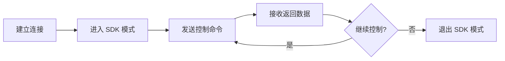

# 1. RoboMaster 明文 SDK 介绍

> [!info] 本章概述
> 介绍 RoboMaster 明文 SDK 的概念、特点和适用场景。

---

## 什么是明文 SDK

明文 SDK 是 RoboMaster 提供的一种开发方式：

- **纯文本协议通信**：使用可读的文本命令与机器人交互
- **语言无关**：不依赖特定编程语言
- **多种连接方式**：支持串口、WiFi、USB 等连接
- **底层控制**：提供更直接的设备控制能力

---

## 特点与优势

### 特点

| 特性 | 说明 |
|------|------|
| **语言无关** | 支持任意编程语言（Python、C++、C#、Java 等） |
| **协议简单** | 文本格式，易于理解和调试 |
| **连接灵活** | WiFi、USB、UART 多种连接方式 |
| **跨平台** | Windows、Linux、macOS 均可使用 |

### 优势

1. **低学习成本**：协议简单直观
2. **调试方便**：可使用串口调试助手测试
3. **兼容性好**：不依赖特定 SDK 版本
4. **嵌入式友好**：适合单片机等资源受限环境

---

## 适用场景

### 1. 多语言开发

- C/C++ 原生开发
- C# 桌面应用
- Java Android 开发
- 其他任意语言

### 2. 嵌入式系统

- STM32 单片机控制
- Arduino 开发
- 树莓派项目
- 其他嵌入式平台

### 3. 系统集成

- 集成到现有系统
- 与其他设备协同
- 自定义协议封装

### 4. 快速原型

- 串口调试测试
- 快速验证功能
- 原型开发

---

## 明文 SDK vs Python SDK

| 对比项 | 明文 SDK | Python SDK |
|--------|----------|------------|
| **语言依赖** | 无 | Python 3.x |
| **学习成本** | 低 | 中 |
| **开发效率** | 中 | 高 |
| **调试方式** | 串口助手 | Python 调试 |
| **适用平台** | 全平台 | Python 环境 |
| **功能完整性** | 完整 | 完整 |

---

## 开发流程



### 基本步骤

1. **建立连接**：通过 WiFi/USB/UART 连接机器人
2. **进入 SDK 模式**：发送 `command;` 命令
3. **控制机器人**：发送各种控制命令
4. **接收数据**：获取机器人状态、传感器数据等
5. **退出 SDK 模式**：发送 `quit;` 命令

---

## 快速开始

### 进入 SDK 模式

```text
发送: command;
返回: ok
```

### 查询电量

```text
发送: robot battery?;
返回: robot battery 85;
```

### 控制底盘

```text
发送: chassis speed 0.5 0 0;
返回: ok
```

### 退出 SDK 模式

```text
发送: quit;
返回: ok
```

---

## 命令格式概览

### 控制命令

```
<obj> <command> <params> [seq <seq_value>];
```

| 部分 | 说明 |
|------|------|
| `obj` | 控制对象（chassis、gimbal、blaster 等） |
| `command` | 控制命令（speed、move、fire 等） |
| `params` | 命令参数 |
| `seq` | 命令序号（可选） |
| `;` | 结束符 |

### 查询命令

```
<obj> <attr>?;
```

返回值包含查询结果。

---

## 常用命令速查

### 机器人控制

| 命令 | 说明 | 示例 |
|------|------|------|
| `command` | 进入 SDK 模式 | `command;` |
| `quit` | 退出 SDK 模式 | `quit;` |
| `robot mode` | 设置运动模式 | `robot mode chassis;` |
| `robot battery?` | 查询电量 | `robot battery?;` |

### 底盘控制

| 命令 | 说明 | 示例 |
|------|------|------|
| `chassis speed` | 设置速度 | `chassis speed 0.5 0 0;` |
| `chassis move` | 移动距离 | `chassis move 1 0 0;` |
| `chassis wheel` | 麦轮速度 | `chassis wheel 100 100 100 100;` |

### 云台控制

| 命令 | 说明 | 示例 |
|------|------|------|
| `gimbal speed` | 设置速度 | `gimbal speed 10 10;` |
| `gimbal moveto` | 绝对位置 | `gimbal moveto 0 0;` |
| `gimbal move` | 相对位置 | `gimbal move 10 0;` |

### 发射器控制

| 命令 | 说明 | 示例 |
|------|------|------|
| `blaster fire` | 发射 | `blaster fire;` |
| `blaster led` | 设置 LED | `blaster led 255;` |

---

## 导航

| 上一章 | 当前章 | 下一章 |
|--------|--------|--------|
| [[../06-拓展模块/5. UART接口]] | **1. 明文 SDK 介绍** | [[2. 接入方式]] |

---

## 相关链接

- [[../RoboMaster开发指南]] - 知识库主页
- [[2. 接入方式]] - 连接方式详解
- [[3. 明文协议]] - 协议格式说明
- [GitHub 示例代码](https://github.com/dji-sdk/RoboMaster-SDK)
- [官方文档](https://robomaster-dev.readthedocs.io/zh-cn/latest/text_sdk/apis.html)
