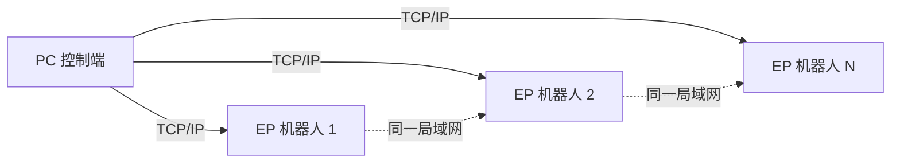
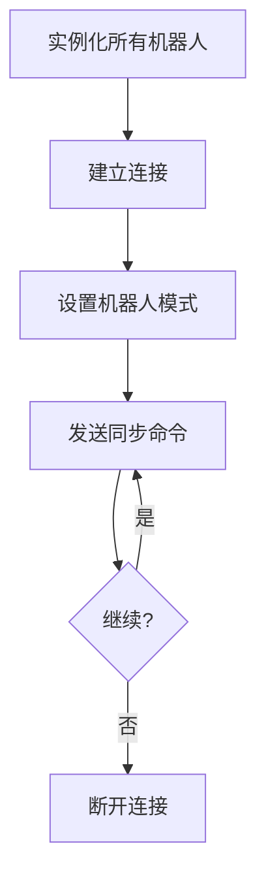

# 4. RoboMaster 明文 SDK 编队控制

> [!info] 本章概述
> 介绍如何使用明文 SDK 实现多机器人编队控制，包括环境配置、连接建立和示例程序。

---

## 4.1 介绍

编队控制功能是通过明文 SDK 对连接在同一个局域网内的多个机器人进行动作编排，实现整体控制的功能。用户可以使用该功能进行更复杂的动作控制，实现编队舞蹈，具有很强的观赏性。

### 工作原理

1. 多台机器人通过 **WiFi 路由器模式** 在同一个局域网内建立连接
2. 用户在 PC 上通过 Python 脚本与多台机器人通信
3. 同时向多台机器人下发明文 SDK 指令
4. 实现编队控制的功能



---

## 4.2 示例环境

### 硬件设备

| 设备 | 数量 | 说明 |
|------|------|------|
| 路由器 | 1 台 | 组建局域网 |
| EP 机器人 | 2+ 台 | 参与编队的机器人 |
| PC 电脑 | 1 台 | 运行控制脚本 |

### 软件环境

| 软件 | 版本 |
|------|------|
| Python | 3.6+ |

---

## 4.3 建立多机连接

### 步骤 1：设置路由器模式

将 EP 机器人设置为 **WiFi 路由器模式**。

### 步骤 2：机器人入网

使用 RoboMaster App 将参与编队控制的 EP 依次接入同一个路由器中。

### 步骤 3：记录 IP 地址

连接成功后打开 App 设置中的连接页面，记录每台 EP 的 IP 地址。

> [!tip] 提示
> 详细步骤请参考 [[2. 接入方式#WiFi 路由器模式]]。

---

## 4.4 运行示例程序

### 示例代码

将 IP 地址依次填入 `IP_LIST` 列表中，保存为 `ep.py`：

```python
#!/usr/bin/env python3
# coding=utf-8

import sys
import time
import threading
import socket

# 机器人 IP 列表
IP_LIST = ['192.168.1.103', '192.168.1.117']
EP_DICT = {}

class EP:
    """EP 机器人控制类"""
    
    def __init__(self, ip):
        self._IP = ip
        self.__socket_ctrl = socket.socket(socket.AF_INET, socket.SOCK_STREAM)
        self.__socket_isRelease = True
        self.__socket_isConnect = False
        self.__thread_ctrl_recv = threading.Thread(target=self.__ctrl_recv)
        self.__seq = 0
        self.__ack_list = []
        self.__ack_buf = 'ok'

    def __ctrl_recv(self):
        """接收线程"""
        while self.__socket_isConnect and not self.__socket_isRelease:
            try:
                buf = self.__socket_ctrl.recv(1024).decode('utf-8')
                print('%s:%s' % (self._IP, buf))
                buf_list = buf.split(' ')
                if 'seq' in buf_list:
                    self.__ack_list.append(int(buf_list[buf_list.index('seq') + 1]))
                self.__ack_buf = buf
            except socket.error as msg:
                print('ctrl %s: %s' % (self._IP, msg))

    def start(self):
        """启动连接"""
        try:
            self.__socket_ctrl.connect((self._IP, 40923))
            self.__socket_isConnect = True
            self.__socket_isRelease = False
            self.__thread_ctrl_recv.start()
            self.command('command')
            self.command('robot mode free')
        except socket.error as msg:
            print('%s: %s' % (self._IP, msg))

    def exit(self):
        """退出连接"""
        if self.__socket_isConnect and not self.__socket_isRelease:
            self.command('quit')
        self.__socket_isRelease = True
        try:
            self.__socket_ctrl.shutdown(socket.SHUT_RDWR)
            self.__socket_ctrl.close()
            self.__thread_ctrl_recv.join()
        except socket.error as msg:
            print('%s: %s' % (self._IP, msg))

    def command(self, cmd):
        """发送命令"""
        self.__seq += 1
        cmd = cmd + ' seq %d;' % self.__seq
        print('%s:%s' % (self._IP, cmd))
        self.__socket_ctrl.send(cmd.encode('utf-8'))
        timeout = 2
        while self.__seq not in self.__ack_list and timeout > 0:
            time.sleep(0.01)
            timeout -= 0.01
        if self.__seq in self.__ack_list:
            self.__ack_list.remove(self.__seq)
        return self.__ack_buf

if __name__ == "__main__":
    # 实例化机器人
    for ip in IP_LIST:
        print('%s connecting...' % ip)
        EP_DICT[ip] = EP(ip)
        EP_DICT[ip].start()

    # 云台回中
    for ip in IP_LIST:
        EP_DICT[ip].command('gimbal moveto p 0 y 0 vp 90 vy 90 wait_for_complete false')
    time.sleep(3)

    # 编队动作循环
    while True:
        # 云台向右转 45°
        for ip in IP_LIST:
            EP_DICT[ip].command('gimbal moveto p 0 y 45 vp 90 vy 90 wait_for_complete false')
        time.sleep(3)
        
        # 云台向左转 45°
        for ip in IP_LIST:
            EP_DICT[ip].command('gimbal moveto p 0 y -45 vp 90 vy 90 wait_for_complete false')
        time.sleep(3)

    # 退出（实际运行时需要 Ctrl+C 中断）
    for ip in IP_LIST:
        EP_DICT[ip].exit()
```

### 运行方式

| 系统 | 命令 |
|------|------|
| **Windows** | 双击 `ep.py` 或在命令行运行 `python ep.py` |
| **Linux/macOS** | 终端运行 `python ep.py` |

### 运行效果

编队控制的多台机器人云台步调一致地在 YAW 轴方向往复运动。
  


### 运行结果

命令行输出多台机器人与主机之间的明文通讯数据：

```text
192.168.1.103 connecting...
192.168.1.103:command seq 1
192.168.1.103:ok seq 1
192.168.1.103:robot mode free seq 2
192.168.1.103:ok seq 2
192.168.1.117 connecting...
192.168.1.117:command seq 1
192.168.1.117:ok seq 1
192.168.1.117:robot mode free seq 2
192.168.1.117:ok seq 2
192.168.1.103:gimbal moveto p 0 y 0 vp 90 vy 90 wait_for_complete false seq 3
192.168.1.103:ok seq 3
192.168.1.117:gimbal moveto p 0 y 0 vp 90 vy 90 wait_for_complete false seq 3
192.168.1.117:ok seq 3
```

---

## 4.5 代码解析

### EP 类结构

```python
class EP:
    def __init__(self, ip)    # 初始化
    def start(self)           # 建立连接
    def exit(self)            # 断开连接
    def command(self, cmd)    # 发送命令
```

### 核心方法说明

#### `start()` - 建立连接

```python
def start(self):
    # 连接到机器人的 40923 端口
    self.__socket_ctrl.connect((self._IP, 40923))
    # 启动接收线程
    self.__thread_ctrl_recv.start()
    # 进入 SDK 模式
    self.command('command')
    # 设置自由模式
    self.command('robot mode free')
```

#### `command()` - 发送命令

```python
def command(self, cmd):
    # 添加序号
    cmd = cmd + ' seq %d;' % self.__seq
    # 发送命令
    self.__socket_ctrl.send(cmd.encode('utf-8'))
    # 等待响应
    while self.__seq not in self.__ack_list and timeout > 0:
        time.sleep(0.01)
        timeout -= 0.01
```

### 编队控制流程



---

## 4.6 扩展示例

### 底盘编队移动

```python
# 所有机器人前进 1 米
for ip in IP_LIST:
    EP_DICT[ip].command('chassis move 1 0 0 xy_speed 0.7')
time.sleep(3)

# 所有机器人左转 90°
for ip in IP_LIST:
    EP_DICT[ip].command('chassis move 0 0 90 z_speed 45')
time.sleep(3)
```

### LED 编队灯效

```python
from robomaster import led

# 所有机器人设置红色
for ip in IP_LIST:
    EP_DICT[ip].command('led control comp=all r=255 g=0 b=0 effect=on')
time.sleep(1)

# 所有机器人设置蓝色呼吸
for ip in IP_LIST:
    EP_DICT[ip].command('led control comp=all r=0 g=0 b=255 effect=breath')
```

### 不同动作分配

```python
# 不同机器人执行不同动作
EP_DICT[IP_LIST[0]].command('chassis move 1 0 0')    # 1 号前进
EP_DICT[IP_LIST[1]].command('chassis move -1 0 0')   # 2 号后退
time.sleep(3)
```

---

## 4.7 编队设计模式

### 模式一：同步执行

所有机器人执行相同动作：

```python
# 同步前进
for ip in IP_LIST:
    EP_DICT[ip].command('chassis move 1 0 0')
```

### 模式二：顺序执行

机器人依次执行动作：

```python
# 依次前进
for ip in IP_LIST:
    EP_DICT[ip].command('chassis move 1 0 0')
    time.sleep(1)  # 等待上一台完成
```

### 模式三：分组执行

不同组执行不同动作：

```python
# 分组控制
group_a = IP_LIST[:len(IP_LIST)//2]
group_b = IP_LIST[len(IP_LIST)//2:]

for ip in group_a:
    EP_DICT[ip].command('chassis move 1 0 0')

for ip in group_b:
    EP_DICT[ip].command('chassis move -1 0 0')
```

---

## 常见问题

### 1. 连接超时

**解决方案：**
- 确认所有机器人在同一局域网
- 检查 IP 地址是否正确
- 验证端口 40923 是否开放

### 2. 动作不同步

**解决方案：**
- 使用序号机制确认命令响应
- 适当增加命令间隔时间
- 检查网络延迟

### 3. 部分机器人无响应

**解决方案：**
- 检查对应机器人的网络连接
- 确认机器人已进入 SDK 模式
- 重启对应机器人的连接

---

## 导航

| 上一章 | 当前章 | 下一章 |
|--------|--------|--------|
| [[3. 明文协议]] | **4. 编队控制** | [[../RoboMaster开发指南]] |

---

## 相关链接

- [[../RoboMaster开发指南]] - 知识库主页
- [[1. 明文SDK介绍]] - 明文 SDK 概述
- [[2. 接入方式]] - 连接方式详解
- [[3. 明文协议]] - 协议格式说明
- [[../02-SDK基础/7. 新手入门-多机控制篇]] - Python SDK 多机控制
- [GitHub 示例代码](https://github.com/dji-sdk/RoboMaster-SDK)
- [官方文档](https://robomaster-dev.readthedocs.io/zh-cn/latest/text_sdk/multi_ctrl.html)
