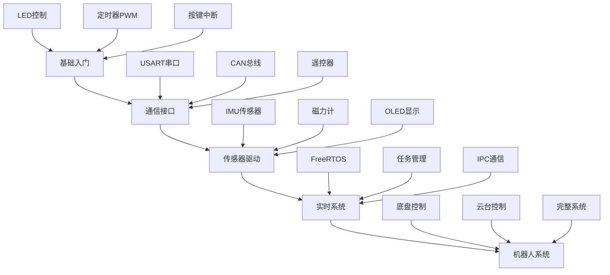

# RoboMaster 开发板 C 型示例概览

> [!info] 概述
> RoboMaster 开发板 C 型嵌入式软件教程，包含从基础 LED 控制到完整机器人系统的 20+ 示例程序，附带官方教程文档 PDF。

---

## 产品文档

| 文档 | 说明 |
|------|------|
| [[ROBOMASTER开发板C型]] | 开发板 C 型产品介绍、技术参数、接口定义 |

---

## 仓库信息

| 项目 | 说明 |
|------|------|
| **仓库名称** | Development-Board-C-Examples |
| **GitHub** | https://github.com/RoboMaster/Development-Board-C-Examples |
| **Stars** | 574+ |
| **开发语言** | C |
| **目标平台** | STM32 (RoboMaster 开发板 C 型) |
| **开发环境** | Keil MDK-ARM, STM32CubeMX |
| **创建时间** | 2020-01-09 |
| **最后更新** | 2022-09-03 |

---

## 官方教程文档

| 文档 | 说明 |
|------|------|
| **嵌入式软件教程文档** | `RoboMaster开发板C型嵌入式软件教程文档.pdf` |
| **竞赛机器人用户手册** | `RoboMaster 竞赛机器人 2020自组装版 A型-用户手册.pdf` |
| **硬件框图** | `RoboMaster 竞赛机器人 2020自组装版 A型-硬件框图.pdf` |

---

## 示例代码索引

### 基础入门示例

| 序号 | 示例 | 说明 | 难度 |
|------|------|------|------|
| 1 | `1.light_led` | LED 点亮 | ⭐ 入门 |
| 2 | `2.flash_light` | LED 闪烁 | ⭐ 入门 |
| 3 | `3.tim_light` | 定时器控制 LED | ⭐⭐ 基础 |
| 4 | `4.PWM_light` | PWM 控制 LED 亮度 | ⭐⭐ 基础 |
| 5 | `5.buzzer` | 蜂鸣器控制 | ⭐⭐ 基础 |

### 电机与控制示例

| 序号 | 示例 | 说明 | 难度 |
|------|------|------|------|
| 6 | `5.servo_motor` | 舵机控制 | ⭐⭐ 基础 |
| 7 | `4.homework_flow_led` | 流水灯作业 | ⭐⭐ 基础 |
| 8 | `14.PWM_SNAIL` | 蜗牛电机 PWM 控制 | ⭐⭐⭐ 进阶 |

### 通信接口示例

| 序号 | 示例 | 说明 | 难度 |
|------|------|------|------|
| 9 | `8.USART_receive_and_send` | USART 收发 | ⭐⭐ 基础 |
| 10 | `9.remote_control_printf_pc` | 遥控器数据打印 | ⭐⭐ 基础 |
| 11 | `9.remote_control_dma` | 遥控器 DMA 接收 | ⭐⭐⭐ 进阶 |
| 12 | `14.CAN` | CAN 总线通信 | ⭐⭐⭐ 进阶 |

### 传感器与显示示例

| 序号 | 示例 | 说明 | 难度 |
|------|------|------|------|
| 13 | `6.key_exit` | 按键外部中断 | ⭐⭐ 基础 |
| 14 | `7.ADC_24V_power` | ADC 24V 电源检测 | ⭐⭐ 基础 |
| 15 | `10.flash_read_and_write` | Flash 读写 | ⭐⭐⭐ 进阶 |
| 16 | `11.ist8310` | IST8310 磁力计 | ⭐⭐⭐ 进阶 |
| 17 | `12.oled` | OLED 显示 | ⭐⭐⭐ 进阶 |
| 18 | `13.spi_bmi088` | SPI BMI088 IMU | ⭐⭐⭐ 进阶 |

### 系统与应用示例

| 序号 | 示例 | 说明 | 难度 |
|------|------|------|------|
| 19 | `15.freeRTOS_LED` | FreeRTOS LED 任务 | ⭐⭐⭐ 进阶 |
| 20 | `16.imu_temperature_control_task` | IMU 温度控制 | ⭐⭐⭐⭐ 高级 |
| 21 | `17.chassis_task` | 底盘控制任务 | ⭐⭐⭐⭐ 高级 |
| 22 | `18.ins_task` | 惯导系统任务 | ⭐⭐⭐⭐ 高级 |
| 23 | `19.gimbal_task` | 云台控制任务 | ⭐⭐⭐⭐ 高级 |
| 24 | `20.standard_robot` | 标准机器人完整系统 | ⭐⭐⭐⭐⭐ 专家 |

### 其他

| 目录 | 说明 |
|------|------|
| `0.new_cubemx_program` | STM32CubeMX 新建工程模板 |
| `Other` | 其他辅助文件 |

---

## 示例详解

### 1. LED 点亮 (`1.light_led`)

**学习目标：** GPIO 基本操作

```c
// 点亮 LED
HAL_GPIO_WritePin(LED_GPIO_Port, LED_Pin, GPIO_PIN_SET);

// 熄灭 LED
HAL_GPIO_WritePin(LED_GPIO_Port, LED_Pin, GPIO_PIN_RESET);
```

---

### 2. LED 闪烁 (`2.flash_light`)

**学习目标：** 延时函数使用

```c
while (1) {
    HAL_GPIO_TogglePin(LED_GPIO_Port, LED_Pin);
    HAL_Delay(500);  // 500ms 延时
}
```

---

### 3. 定时器控制 LED (`3.tim_light`)

**学习目标：** 定时器中断

```c
// 定时器中断回调
void HAL_TIM_PeriodElapsedCallback(TIM_HandleTypeDef *htim) {
    if (htim == &htim6) {
        HAL_GPIO_TogglePin(LED_GPIO_Port, LED_Pin);
    }
}
```

---

### 4. PWM 控制 LED (`4.PWM_light`)

**学习目标：** PWM 输出控制

```c
// 启动 PWM
HAL_TIM_PWM_Start(&htim3, TIM_CHANNEL_1);

// 设置占空比
__HAL_TIM_SET_COMPARE(&htim3, TIM_CHANNEL_1, duty_cycle);
```

---

### 5. 蜂鸣器控制 (`5.buzzer`)

**学习目标：** PWM 驱动蜂鸣器

```c
// 设置蜂鸣器频率
void buzzer_set_frequency(uint32_t freq) {
    // 修改 PWM 频率
}
```

---

### 6. 舵机控制 (`5.servo_motor`)

**学习目标：** PWM 控制舵机角度

```c
// 舵机角度控制 (0-180度)
void servo_set_angle(uint8_t angle) {
    uint32_t pulse = 500 + (angle * 2000 / 180);  // 500-2500us
    __HAL_TIM_SET_COMPARE(&htim, TIM_CHANNEL, pulse);
}
```

---

### 7. 按键外部中断 (`6.key_exit`)

**学习目标：** 外部中断处理

```c
void HAL_GPIO_EXTI_Callback(uint16_t GPIO_Pin) {
    if (GPIO_Pin == KEY_Pin) {
        // 按键按下处理
    }
}
```

---

### 8. ADC 电源检测 (`7.ADC_24V_power`)

**学习目标：** ADC 模数转换

```c
// 读取 ADC 值
uint16_t adc_value = HAL_ADC_GetValue(&hadc1);

// 转换为电压
float voltage = adc_value * 3.3f / 4096.0f;
```

---

### 9. USART 收发 (`8.USART_receive_and_send`)

**学习目标：** 串口通信

```c
// 发送数据
HAL_UART_Transmit(&huart, data, len, timeout);

// 接收数据
HAL_UART_Receive(&huart, data, len, timeout);
```

---

### 10. 遥控器控制 (`9.remote_control_*`)

**学习目标：** DBUS 协议解析

```c
// 遥控器数据结构
typedef struct {
    int16_t ch0;   // 左摇杆 X
    int16_t ch1;   // 左摇杆 Y
    int16_t ch2;   // 右摇杆 X
    int16_t ch3;   // 右摇杆 Y
    uint8_t s1;    // 左开关
    uint8_t s2;    // 右开关
    int16_t wheel; // 滚轮
} RC_ctrl_t;
```

---

### 11. Flash 读写 (`10.flash_read_and_write`)

**学习目标：** 内部 Flash 操作

```c
// 解锁 Flash
HAL_FLASH_Unlock();

// 擦除扇区
HAL_FLASHEx_Erase(&erase_init, &error);

// 写入数据
HAL_FLASH_Program(FLASH_TYPEPROGRAM_WORD, address, data);

// 锁定 Flash
HAL_FLASH_Lock();
```

---

### 12. IST8310 磁力计 (`11.ist8310`)

**学习目标：** I2C 传感器驱动

```c
// 初始化 IST8310
uint8_t IST8310_Init(void);

// 读取磁力计数据
void IST8310_ReadData(int16_t *mag_x, int16_t *mag_y, int16_t *mag_z);
```

---

### 13. OLED 显示 (`12.oled`)

**学习目标：** OLED 屏幕驱动

```c
// 初始化 OLED
OLED_Init();

// 显示字符串
OLED_ShowString(0, 0, "RoboMaster", 16);

// 显示数字
OLED_ShowNum(0, 2, value, 5, 16);
```

---

### 14. SPI BMI088 (`13.spi_bmi088`)

**学习目标：** SPI IMU 传感器

```c
// 初始化 BMI088
uint8_t BMI088_Init(void);

// 读取加速度
void BMI088_ReadAccel(int16_t *accel_x, int16_t *accel_y, int16_t *accel_z);

// 读取角速度
void BMI088_ReadGyro(int16_t *gyro_x, int16_t *gyro_y, int16_t *gyro_z);
```

---

### 15. CAN 通信 (`14.CAN`)

**学习目标：** CAN 总线通信

```c
// CAN 发送
void CAN_SendMessage(CAN_HandleTypeDef *hcan, uint32_t id, uint8_t *data, uint8_t len);

// CAN 接收回调
void HAL_CAN_RxFifo0MsgPendingCallback(CAN_HandleTypeDef *hcan) {
    CAN_RxHeaderTypeDef header;
    uint8_t data[8];
    HAL_CAN_GetRxMessage(hcan, CAN_RX_FIFO0, &header, data);
}
```

---

### 16. FreeRTOS LED (`15.freeRTOS_LED`)

**学习目标：** FreeRTOS 实时操作系统

```c
// 创建任务
osThreadDef(ledTask, LED_Task, osPriorityNormal, 0, 128);
ledTaskHandle = osThreadCreate(osThread(ledTask), NULL);

// 任务函数
void LED_Task(void const *argument) {
    for (;;) {
        HAL_GPIO_TogglePin(LED_GPIO_Port, LED_Pin);
        osDelay(500);
    }
}
```

---

### 17. IMU 温度控制 (`16.imu_temperature_control_task`)

**学习目标：** PID 温度控制

```c
// 温度控制任务
void IMU_TemperatureControl_Task(void const *argument) {
    float target_temp = 45.0f;
    float current_temp;
    float pid_output;
    
    for (;;) {
        current_temp = BMI088_GetTemperature();
        pid_output = PID_Calculate(&temp_pid, target_temp - current_temp);
        // 控制加热功率...
        osDelay(10);
    }
}
```

---

### 18. 底盘控制任务 (`17.chassis_task`)

**学习目标：** 底盘运动控制

```c
// 底盘控制结构
typedef struct {
    float vx;       // X 方向速度
    float vy;       // Y 方向速度
    float vw;       // 旋转角速度
    int16_t motor_speed[4];  // 四个电机速度
} Chassis_t;

// 底盘任务
void Chassis_Task(void const *argument) {
    for (;;) {
        // 运动学解算
        // 电机控制
        osDelay(2);
    }
}
```

---

### 19. 惯导系统任务 (`18.ins_task`)

**学习目标：** 惯性导航系统

```c
// INS 数据结构
typedef struct {
    float pitch, roll, yaw;     // 欧拉角
    float qx, qy, qz, qw;       // 四元数
    float vx, vy, vz;           // 速度
    float ax, ay, az;           // 加速度
} INS_t;

// INS 更新任务
void INS_Task(void const *argument) {
    for (;;) {
        INS_Update();
        osDelay(1);
    }
}
```

---

### 20. 云台控制任务 (`19.gimbal_task`)

**学习目标：** 云台 PID 控制

```c
// 云台控制结构
typedef struct {
    float yaw_angle;     // 偏航角
    float pitch_angle;   // 俯仰角
    PID_t yaw_pid;       // 偏航 PID
    PID_t pitch_pid;     // 俯仰 PID
} Gimbal_t;

// 云台任务
void Gimbal_Task(void const *argument) {
    for (;;) {
        Gimbal_Update();
        osDelay(2);
    }
}
```

---

### 21. 标准机器人系统 (`20.standard_robot`)

**学习目标：** 完整机器人系统

```
standard_robot/
├── application/          # 应用层
│   ├── chassis_task.c   # 底盘任务
│   ├── gimbal_task.c    # 云台任务
│   ├── ins_task.c       # 惯导任务
│   └── shoot_task.c     # 发射任务
├── bsp/                  # 板级支持包
│   ├── bsp_can.c        # CAN 驱动
│   ├── bsp_usart.c      # 串口驱动
│   └── bsp_spi.c        # SPI 驱动
├── components/           # 组件
│   ├── bmi088.c         # IMU 驱动
│   ├── ist8310.c        # 磁力计驱动
│   └── oled.c           # OLED 驱动
├── Middlewares/          # 中间件
│   └── FreeRTOS/        # 实时操作系统
└── Drivers/              # STM32 驱动库
```

---

## 目录结构

```
Development-Board-C-Examples/
├── 0.new_cubemx_program/        # CubeMX 新建工程
├── 1.light_led/                  # LED 点亮
├── 2.flash_light/                 # LED 闪烁
├── 3.tim_light/                    # 定时器 LED
├── 4.PWM_light/                    # PWM LED
├── 4.homework_flow_led/            # 流水灯作业
├── 5.buzzer/                       # 蜂鸣器
├── 5.servo_motor/                  # 舵机控制
├── 6.key_exit/                      # 按键中断
├── 7.ADC_24V_power/                 # ADC 检测
├── 8.USART_receive_and_send/        # USART 收发
├── 9.remote_control_printf_pc/      # 遥控器打印
├── 9.remote_control_dma/            # 遥控器 DMA
├── 10.flash_read_and_write/          # Flash 读写
├── 11.ist8310/                       # IST8310 磁力计
├── 12.oled/                           # OLED 显示
├── 13.spi_bmi088/                     # BMI088 IMU
├── 14.CAN/                            # CAN 通信
├── 14.PWM_SNAIL/                      # 蜗牛电机
├── 15.freeRTOS_LED/                   # FreeRTOS LED
├── 16.imu_temperature_control_task/   # IMU 温控
├── 17.chassis_task/                   # 底盘任务
├── 18.ins_task/                       # 惯导任务
├── 19.gimbal_task/                    # 云台任务
├── 20.standard_robot/                 # 标准机器人
├── doc/                               # 文档
│   ├── RoboMaster 竞赛机器人 2020自组装版 A型-用户手册.pdf
│   └── RoboMaster 竞赛机器人 2020自组装版 A型-硬件框图.pdf
├── Other/                             # 其他文件
└── RoboMaster开发板C型嵌入式软件教程文档.pdf
```

---

## 开发环境

### 软件要求

| 软件 | 版本 | 说明 |
|------|------|------|
| **Keil MDK-ARM** | 5.x | 主开发环境 |
| **STM32CubeMX** | 最新版 | 图形化配置工具 |
| **ST-Link** | 最新版 | 调试器驱动 |

### 硬件要求

| 硬件 | 说明 |
|------|------|
| **开发板** | RoboMaster 开发板 C 型 |
| **调试器** | ST-Link V2 / J-Link |
| **遥控器** | RoboMaster 遥控器（可选） |

---

## 快速开始

### 下载示例

```bash
# 克隆仓库
git clone https://github.com/RoboMaster/Development-Board-C-Examples.git

# 进入示例目录
cd Development-Board-C-Examples/1.light_led
```

### 编译下载

1. 使用 Keil MDK-ARM 打开 `MDK-ARM/Project.uvprojx`
2. 编译工程 (Build → Build Target)
3. 连接 ST-Link 调试器
4. 下载程序 (Flash → Download)

---

## 学习路径



---

## 导航

| 上一章 | 当前章 | 下一章 |
|--------|--------|--------|
| [[开发板示例概览]] | **开发板 C 型示例概览** | [[RoboMaster开发指南]] |

---

## 相关链接

- [[RoboMaster开发指南]] - 知识库主页
- [[开发板示例概览]] - 旧版开发板示例
- [[C-RTOS 简化模板概览]] - 简化版 FreeRTOS 模板
- [GitHub 仓库](https://github.com/RoboMaster/Development-Board-C-Examples)
- [C-RTOS 简化模板](https://github.com/LinmingZhou234/C-RTOS)
- [RoboMaster 官网](https://www.robomaster.com/)
