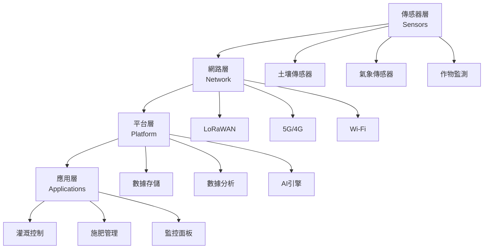
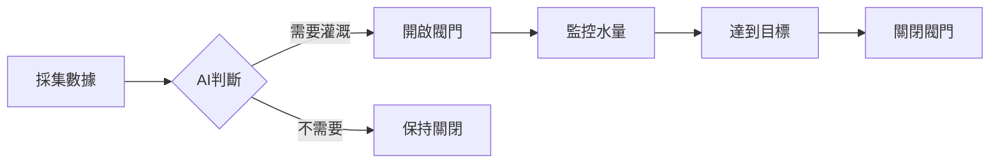
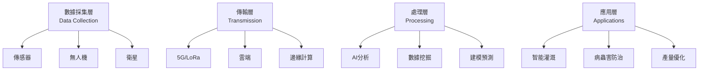

# 智慧農業應用學科
# Smart Agriculture Application Discipline

> [!summary] 概述 | Overview
> 智慧農業整合了人工智慧、物聯網技術與現代農業，形成了一個高效、可持續、精準的農業生產體系。
>
> Smart agriculture integrates Artificial Intelligence, Internet of Things, and modern farming techniques to create an efficient, sustainable, and precision-based agricultural production system.

---

## 📋 目錄 | Table of Contents

1. [[#智慧農業概述-|-Smart-Agriculture-Overview|智慧農業概述 | Smart Agriculture Overview]]
2. [[#模塊一-人工智慧在農業中的應用-|-Artificial-Intelligence-in-Agriculture|模塊一：人工智慧在農業中的應用 | Module 1: AI in Agriculture]]
3. [[#模塊二-物聯網在農業中的應用-|-Internet-of-Things-in-Agriculture|模塊二：物聯網在農業中的應用 | Module 2: IoT in Agriculture]]
4. [[#模塊三-現代農業技術-|-Modern-Agriculture-Techniques|模塊三：現代農業技術 | Module 3: Modern Agriculture]]
5. [[#技術整合與應用案例-|-Technology-Integration-and-Cases|技術整合與應用案例 | Integration and Applications]]
6. [[#未來展望-|-Future-Outlook|未來展望 | Future Outlook]]

---

## 智慧農業概述 | Smart Agriculture Overview

### 🎯 定義 | Definition

智慧農業（Smart Agriculture）是利用先進技術提升農業生產效率和可持續性的現代農業模式。它將數字技術、自動化系統和數據分析融入農業生產的全過程。

Smart agriculture is a modern farming model that utilizes advanced technologies to enhance agricultural production efficiency and sustainability. It integrates digital technologies, automation systems, and data analytics into every stage of agricultural production.

> [!info] 核心技術 | Core Technologies
> - **人工智慧** | **Artificial Intelligence (AI)**: 機器學習、電腦視覺、數據分析
> - **物聯網** | **Internet of Things (IoT)**: 傳感器網路、實時監控、數據傳輸
> - **現代農業** | **Modern Agriculture**: 精準農業、可持續農業、自動化設備

### 🌱 發展背景 | Development Background

1. **人口增長** | **Population Growth**
   - 全球人口預計2050年達到98億
   - 糧食需求增長60%以上

2. **氣候變遷** | **Climate Change**
   - 極端天氣事件頻發
   - 農業生產面臨嚴峻挑戰

3. **技術進步** | **Technological Advancements**
   - AI和IoT技術成熟
   - 5G網路普及
   - 衛星遙測技術發展

4. **可持續發展** | **Sustainable Development**
   - 環境保護需求
   - 資源利用效率提升
   - 減少農藥化肥使用

### 📊 關鍵指標 | Key Metrics

| 指標 | 傳統農業 | 智慧農業 |
|---|---|---|
| 生產效率 | 基準 | **+30-50%** |
| 資源利用率 | 基準 | **+20-40%** |
| 人工成本 | 基準 | **-40-60%** |
| 農藥使用量 | 基準 | **-20-30%** |
| 產量波動 | 高 | **低且可預測** |

---

## 模塊一：人工智慧在農業中的應用 | Module 1: Artificial Intelligence in Agriculture

### 🤖 應用領域 | Application Areas

#### 1. 作物預測與產量優化 | Crop Prediction and Yield Optimization

> [!abstract] 核心技術 | Core Technology
> - **機器學習** | **Machine Learning**: 預測模型、回歸分析、時間序列
> - **深度學習** | **Deep Learning**: 神經網路、卷積神經網路（CNN）
> - **數據挖掘** | **Data Mining**: 模式識別、異常檢測

**應用案例 | Applications:**

- [x] 產量預測 | Yield Prediction
  - 基於歷史數據、天氣、土壤信息預測作物產量
  - 幫助農民制定種植和收穫計劃

- [x] 種植規劃 | Planting Planning
  - AI算法優化作物輪作
  - 確定最佳種植時間和品種

- [x] 風險評估 | Risk Assessment
  - 預測病蟲害爆發風險
  - 評估市場價格波動

#### 2. 病蟲害檢測 | Pest and Disease Detection

> [!tip] 電腦視覺技術 | Computer Vision Technology
> - **影像識別** | **Image Recognition**: 葉片病斑識別、蟲害檢測
> - **無人機航拍** | **Drone Imaging**: 大面積監測、精準定位
> - **光譜分析** | **Spectral Analysis**: 早期病蟲害檢測

**檢測流程 | Detection Process:**


**技術優勢 | Technical Advantages:**
- 高準確率（90%以上）
- 實時檢測
- 大面積覆蓋
- 減少人工檢查成本

#### 3. 自動化農業設備 | Autonomous Farming Equipment

**應用場景 | Applications:**

- [x] 自動拖拉機 | Autonomous Tractors
  - GPS導航
  - 自動耕作、播種、施肥
  - 24小時作業能力

- [x] 智能收割機 | Smart Harvesters
  - 成熟度檢測
  - 自動分級
  - 減少損耗

- [x] 農業機器人 | Agricultural Robots
  - 自動除草
  - 精準噴藥
  - 水果採摘

> [!warning] 挑戰 | Challenges
> - 設備成本較高
> - 技術維護需求
> - 農民培訓門檻
> - 法規政策限制

#### 4. 數據分析與決策支持 | Data Analytics and Decision Support

**分析內容 | Analytics Content:**

- 土壤數據分析 | Soil Data Analysis
- 天氣模式分析 | Weather Pattern Analysis
- 市場趨勢預測 | Market Trend Prediction
- 投入成本優化 | Input Cost Optimization

**決策支持系統 | Decision Support System:**

```
數據輸入
    ↓
AI分析引擎
    ↓
方案生成
    ↓
決策建議
    ↓
執行監控
```

### 📈 技術指標 | Technical Metrics

| 技術類型 | 準確率 | 響應時間 | 應用成熟度 |
|---|---|---|---|
| 作物產量預測 | 85-95% | 小時級 | 成熟 |
| 病蟲害檢測 | 90-98% | 實時 | 成熟 |
| 自動駕駛 | 95%+ | 毫秒級 | 發展中 |
| 價格預測 | 70-85% | 日級 | 初級 |

---

## 模塊二：物聯網在農業中的應用 | Module 2: Internet of Things in Agriculture

### 📡 IoT架構 | IoT Architecture



### 🔍 核心傳感器技術 | Core Sensor Technologies

#### 1. 土壤監測系統 | Soil Monitoring System

> [!note] 監測參數 | Monitoring Parameters
> - **土壤濕度** | **Soil Moisture**: 決定灌溉需求
> - **土壤溫度** | **Soil Temperature**: 影響種子發芽和根系生長
> - **pH值** | **pH Level**: 影響養分吸收
> - **電導率** | **Electrical Conductivity**: 土壤鹽分評估
> - **養分含量** | **Nutrient Content**: N、P、K等元素

**部署方案 | Deployment:**
- 地下傳感器：深度10-100cm
- 無線傳輸：LoRa、Zigbee
- 太陽能供電
- 實時數據上傳

#### 2. 智能灌溉系統 | Smart Irrigation System

**系統組成 | System Components:**

1. **土壤濕度傳感器** | Soil Moisture Sensors
2. **氣象站數據** | Weather Station Data
3. **控制閥門** | Control Valves
4. **中央控制器** | Central Controller
5. **移動應用** | Mobile App

**工作流程 | Workflow:**



**節水效益 | Water Saving:**
- 節水率：20-40%
- 減少過度灌溉
- 提高水肥利用率
- 降低水費成本

#### 3. 氣象監測網絡 | Weather Monitoring Network

**監測設備 | Monitoring Equipment:**

- [x] 微型氣象站 | Micro Weather Stations
  - 溫度、濕度
  - 風速、風向
  - 降水量
  - 太陽輻射

- [x] 衛星數據 | Satellite Data
  - 大面積天氣預報
  - 雲層監測
  - 極端天氣預警

- [x] 雷達監測 | Radar Monitoring
  - 降雨範圍和強度
  - 冰雹預警
  - 風暴追蹤

#### 4. 作物生長監測 | Crop Growth Monitoring

**監測技術 | Monitoring Technologies:**

- [x] 光譜成像 | Spectral Imaging
  - 葉綠素含量
  - 水分狀況
  - 養分水平

- [x] 熱成像 | Thermal Imaging
  - 水分壓力檢測
  - 病害早期發現
  - 灌溉效果評估

- [x] 多光譜相機 | Multispectral Cameras
  - 作物健康指數
  - 生長階段識別
  - 產量估算

### 📊 數據管理平台 | Data Management Platform

**平台功能 | Platform Functions:**

1. **數據採集** | Data Collection
   - 多源數據融合
   - 實時傳輸
   - 數據清洗

2. **數據存儲** | Data Storage
   - 雲端數據庫
   - 時序數據庫
   - 備份與恢復

3. **數據分析** | Data Analytics
   - 趨勢分析
   - 異常檢測
   - 預測建模

4. **可視化** | Visualization
   - 實時儀表板
   - 歷史曲線
   - 地理信息圖

5. **報告生成** | Report Generation
   - 自動化報告
   - 警告通知
   - 專家建議

### 🔧 技術標準與協議 | Technical Standards and Protocols

| 標準 | 應用場景 | 優勢 |
|---|---|---|
| **LoRaWAN** | 大面積農田 | 長距離、低功耗 |
| **Zigbee** | 局部區域網絡 | 低成本、自組網 |
| **NB-IoT** | 連續監測 | 廣覆蓋、高可靠性 |
| **5G** | 實時控制 | 高速率、低延遲 |

---

## 模塊三：現代農業技術 | Module 3: Modern Agriculture Techniques

### 🌾 精準農業 | Precision Agriculture

> [!abstract] 定義 | Definition
> 精準農業是基於變異管理原理，利用技術手段對農業生產進行精細化管理的現代農業模式。
>
> Precision agriculture is a modern farming approach based on the principle of variability management, utilizing technical means for refined management of agricultural production.

#### 1. 變異管理 | Variability Management

**土壤變異 | Soil Variability:**
- 土壤類型差異 | Soil Type Differences
- 養分分布不均 | Uneven Nutrient Distribution
- 地形起伏 | Topographic Variation

**作物變異 | Crop Variability:**
- 生長差異 | Growth Differences
- 產量波動 | Yield Fluctuations
- 品質變化 | Quality Variation

**管理策略 | Management Strategies:**
- 精準施肥 | Precision Fertilization
- 變量噴灑 | Variable Rate Spraying
- 分區管理 | Zoned Management

#### 2. GPS與GNSS技術 | GPS and GNSS Technology

**應用場景 | Applications:**

- [x] 精準導航 | Precision Navigation
  - 自動駕駛拖拉機
  - 航線規劃
  - 重疊率控制

- [x] 產量監測 | Yield Monitoring
  - 實時產量記錄
  - 產量分布圖
  - 差異分析

- [x] 地形測繪 | Topographic Mapping
  - 高程數據採集
  - 排水系統規劃
  - 田塊邊界測量

#### 3. 遙感技術 | Remote Sensing

**衛星遙感 | Satellite Remote Sensing:**
- 大面積監測
- 多光譜成像
- 時序分析

**無人機遙感 | Drone Remote Sensing:**
- 高分辨率影像
- 靈活部署
- 實時傳輸

**地面遙感 | Ground Remote Sensing:**
- 近距離監測
- 高精度數據
- 連續採集

### ♻️ 可持續農業 | Sustainable Agriculture

#### 1. 保護性耕作 | Conservation Agriculture

**三大原則 | Three Principles:**

1. **最小土壤擾動** | Minimal Soil Disturbance
   - 免耕或少耕
   - 減少土壤侵蝕
   - 保護土壤結構

2. **永久土壤覆蓋** | Permanent Soil Cover
   - 作物殘留物覆蓋
   - 綠肥種植
   - 減少水分蒸發

3. **作物輪作** | Crop Rotation
   - 多樣化種植
   - 病蟲害防治
   - 養分循環

#### 2. 有機農業 | Organic Farming

**核心原則 | Core Principles:**
- 不使用合成農藥 | No Synthetic Pesticides
- 不使用化學肥料 | No Chemical Fertilizers
- 使用有機物 | Use Organic Materials
- 生物多樣性 | Biodiversity

**挑戰與機遇 | Challenges and Opportunities:**
- [ ] 挑戰 | Challenges
  - 產量較低
  - 勞動密集
  - 認證成本高

- [ ] 機遇 | Opportunities
  - 市場溢價
  - 環境效益
  - 可持續發展

#### 3. 節水農業 | Water-Saving Agriculture

**節水技術 | Water-Saving Technologies:**

- 滴灌 | Drip Irrigation
- 噴灌 | Sprinkler Irrigation
- 地下滴灌 | Subsurface Drip Irrigation
- 水分保持劑 | Water Retention Agents

**效益 | Benefits:**
- 節水30-60%
- 提高產量10-20%
- 減少養分流失
- 降低生產成本

### 🏭 農場管理系統 | Farm Management Systems

#### 1. 農場管理信息系統 | Farm Management Information System (FMIS)

**系統功能 | System Functions:**

- 田塊管理 | Field Management
- 作物規劃 | Crop Planning
- 資源調配 | Resource Allocation
- 財務管理 | Financial Management
- 勞動管理 | Labor Management

#### 2. 供應鏈追溯 | Supply Chain Traceability

**追溯技術 | Traceability Technologies:**

- 區塊鏈 | Blockchain
- RFID標籤 | RFID Tags
- QR碼 | QR Codes
- 大數據分析 | Big Data Analytics

**追溯範圍 | Traceability Scope:**

```
生產 → 加工 → 物流 → 零售 → 消費者
Production → Processing → Logistics → Retail → Consumer
```

#### 3. 決策支持系統 | Decision Support Systems

**決策類型 | Decision Types:**

- 戰略決策 | Strategic Decisions
  - 種植計劃
  - 投資決策
  - 風險管理

- 戰術決策 | Tactical Decisions
  - 資源配置
  - 作物選擇
  - 市場進入

- 操作決策 | Operational Decisions
  - 日常管理
  - 應急處理
  - 效率優化

---

## 技術整合與應用案例 | Technology Integration and Applications

### 🔄 整合框架 | Integration Framework



### 📚 應用案例 | Application Cases

#### 案例1：智能溫室 | Smart Greenhouse

**技術組合 | Technology Stack:**
- IoT傳感器：溫度、濕度、CO₂、光照
- AI控制系統：自動調節環境參數
- 水培系統：精準營養液管理
- 無人機巡檢：作物健康監測

**效益 | Benefits:**
- 產量提升：+50-100%
- 水資源利用：+90%
- 能源效率：+40%
- 勞動成本：-60%

#### 案例2：大田精準農業 | Field Precision Agriculture

**技術組合 | Technology Stack:**
- GPS導航：自動拖拉機
- 變量噴灑：精準施肥、施藥
- 遙感監測：作物生長狀態
- AI決策：種植和收穫時機

**效益 | Benefits:**
- 肥料減少：-30%
- 農藥減少：-20%
- 產量提升：+15%
- 成本降低：-25%

#### 案例3：果園智能管理 | Orchard Smart Management

**技術組合 | Technology Stack:**
- 電腦視覺：果實成熟度檢測
- 無人機：病蟲害監測
- 物聯網：土壤和環境監測
- 機器人：自動採收

**效益 | Benefits:**
- 採收效率：+200%
- 損耗率：-50%
- 產品質量：+30%
- 勞動力需求：-70%

### 🎯 實施路徑 | Implementation Pathway

#### 階段1：基礎設施建設 | Infrastructure Building
- 網絡覆蓋
- 傳感器部署
- 平台搭建

#### 階段2：數據積累 | Data Accumulation
- 數據採集
- 數據清洗
- 數據存儲

#### 階段3：應用開發 | Application Development
- AI模型訓練
- 應用系統開發
- 用戶界面優化

#### 階段4：優化升級 | Optimization and Upgrade
- 模型改進
- 功能擴展
- 系統整合

### ⚖️ 效益分析 | Benefit Analysis

**經濟效益 | Economic Benefits:**

| 項目 | 提升幅度 |
|---|---|
| 生產效率 | +30-50% |
| 資源利用率 | +20-40% |
| 成本降低 | -20-30% |
| 利潤率 | +25-40% |

**環境效益 | Environmental Benefits:**

- 水資源節約：20-40%
- 農藥減少：20-30%
- 化肥減少：25-35%
- 碳排放減少：15-25%

**社會效益 | Social Benefits:**

- 糧食安全提升
- 農民收入增加
- 農村就業機會
- 技術轉移與培訓

### 🚧 面臨的挑戰 | Challenges

1. **技術門檻** | Technical Barriers
   - 設備成本高
   - 技術複雜性
   - 維護需求大

2. **人才短缺** | Talent Shortage
   - 跨學科人才需求
   - 農民培訓不足
   - 技術支持缺位

3. **政策法規** | Policy and Regulations
   - 數據隱私
   - 設備標準
   - 互操作性要求

4. **市場接受度** | Market Acceptance
   - 投資回報周期
   - 風險承擔能力
   - 傳統觀念

---

## 未來展望 | Future Outlook

### 🔮 發展趨勢 | Development Trends

#### 1. 技術融合 | Technology Fusion

**5G + AI + IoT:**
- 超低延遲控制
- 大規模設備連接
- 實時智能決策

**邊緣計算:**
- 本地數據處理
- 減少雲端依賴
- 提高響應速度

**數字孿生:**
- 農場虛擬建模
- 模擬試驗
- 優化決策

#### 2. 新興技術應用 | Emerging Technologies

**區塊鏈技術:**
- 產品追溯
- 智能合約
- 供應鏈金融

**增強現實 (AR):**
- 實時農場信息疊加
- 設備維護指導
- 培訓模擬

**生物技術:**
- 基因編輯作物
- 生物肥料
- 生物農藥

#### 3. 垂直整合 | Vertical Integration

**從田間到餐桌:**
- 全鏈條可視化
- 智能物流
- 精準營銷

**農業服務平台:**
- 一站式服務
- 共享經濟模式
- 精準匹配

### 📊 市場預測 | Market Forecast

**全球智慧農業市場規模:**

| 年份 | 市場規模（億美元） | 年增長率 |
|---|---|---|
| 2023 | 150 | - |
| 2025 | 220 | +15% |
| 2030 | 500 | +18% |
| 2035 | 1000+ | +15% |

**關鍵驅動因素:**
- 人口增長與糧食需求
- 氣候變遷壓力
- 技術進步與成本下降
- 政府政策支持

### 🌍 區域發展 | Regional Development

#### 亞洲 | Asia
- 快速增長期
- 政府大力支持
- 巨大市場潛力

#### 歐洲 | Europe
- 技術成熟
- 可持續發展重點
- 嚴格法規標準

#### 北美 | North America
- 大規模農場為主
- 技術採用率高
- 資本投入充足

#### 新興市場 | Emerging Markets
- 起步階段
- 跨國合作增加
- 本土化創新

### 🎯 發展建議 | Development Recommendations

#### 對政府 | For Governments

1. 制定技術標準和規範
2. 提供財政支持和補貼
3. 加强人才培養和教育
4. 推動示範項目建設

#### 對企業 | For Enterprises

1. 降低技術成本
2. 提供一站式解決方案
3. 加强技術培訓和服務
4. 探索創新商業模式

#### 對農民 | For Farmers

1. 持續學習新技術
2. 小步快跑，逐步升級
3. 加入合作社或聯盟
4. 積極參與試驗示範

#### 對研究機構 | For Research Institutions

1. 加强基礎研究
2. 促進技術轉化
3. 開展跨學科合作
4. 培養複合型人才

---

## 📚 參考資源 | References

### 📖 推薦閱讀 | Recommended Reading

- [FAO - 智慧農業](https://www.fao.org/smart-agriculture/zh/)
- [ITU - 物聯網農業](https://www.itu.int/en/ITU-T/focusgroups/iot/Pages/default.aspx)
- [IEEE - 農業技術期刊](https://www.ieee.org/)

### 🔗 相關筆記 | Related Notes

- [[人工智慧基礎]]
- [[物聯網技術]]
- [[可持續發展]]

### 📅 更新日誌 | Change Log

- **2026-02-18**: 創建初始版本 | Initial version created

---

> [!quote] 總結 | Summary
> 智慧農業是農業發展的必然趨勢，通過人工智慧、物聯網和現代農業技術的深度整合，將實現農業生產的智能化、精準化和可持續化，為解決全球糧食安全和可持續發展問題提供強有力支持。
>
> Smart agriculture is the inevitable trend of agricultural development. Through the deep integration of artificial intelligence, the Internet of Things, and modern agricultural technologies, it will realize the intelligent, precise, and sustainable development of agricultural production, providing strong support for solving global food security and sustainable development issues.
