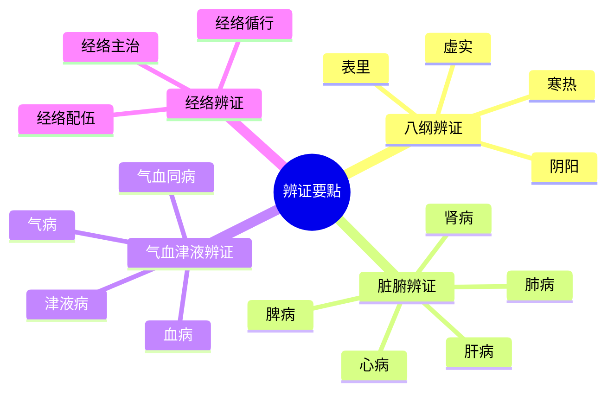
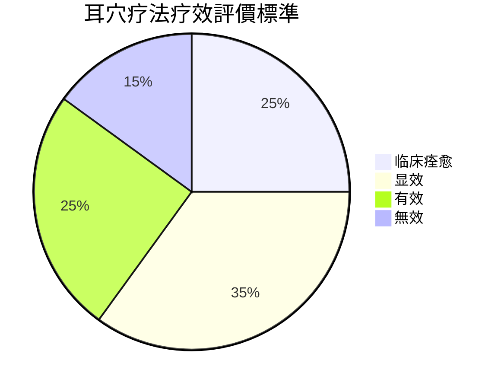
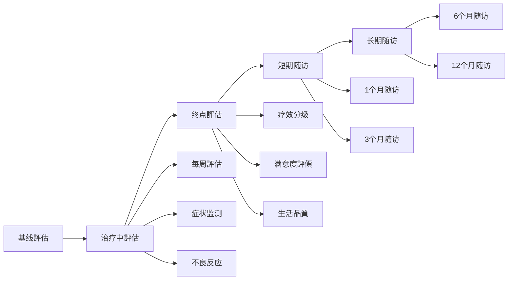

# 🗺️ MOC-临床應用程式

# 更新

## 🧭 临床應用程式导航

```mermaid
graph TD
    A[MOC-临床應用程式] --> B[疾病治疗方案]
    A --> C[辨证论治]
    A --> D[疗效評價]
    A --> E[特殊應用程式]
    A --> F[患者教育]
    
    B --> B1[神经系統疾病]
    B --> B2[心血管系統]
    B --> B3[呼吸系統]
    B --> B4[消化系統]
    B --> B5[妇科疾病]
    
    C --> C1[辨证要點]
    C --> C2[选穴原則]
    C --> C3[配伍规律]
    
    D --> D1[評價標準]
    D --> D2[評價工具]
# 管理
    
    E --> E1[儿童應用程式]
    E --> E2[老年應用程式]
    E --> E3[孕妇應用程式]
    
    F --> F1[健康教育]
# 管理
    F --> F3[生活方式]
```

## 📚 核心治疗方案

### 🧠 神经系統疾病
| 疾病 | 核心穴位 | 疗效 | 等级 |
|------|----------|------|------|
| [[3 Resources/01-Tech/医学/耳穴疗法知識庫/04-临床應用程式/失眠症耳穴治疗方案]] | 神门、心、肾、皮质下 | 85-95% | ⭐⭐⭐⭐⭐ |
| [[抑郁症耳穴治疗方案]] | 神门、心、肝、皮质下 | 75-85% | ⭐⭐⭐⭐ |
| [[焦虑症耳穴治疗方案]] | 神门、心、肾、肝 | 80-90% | ⭐⭐⭐⭐ |
| [[头痛耳穴治疗方案]] | 颞、额、枕、神门 | 75-85% | ⭐⭐⭐⭐ |
| [[癫痫耳穴治疗方案]] | 神门、心、肝、皮质下 | 60-70% | ⭐⭐⭐ |

### ❤️ 心血管系統疾病
| 疾病 | 核心穴位 | 疗效 | 等级 |
|------|----------|------|------|
| [[高血压耳穴治疗方案]] | 降压沟、心、肝、交感 | 70-80% | ⭐⭐⭐⭐ |
| [[冠心病耳穴治疗方案]] | 心、交感、皮质下 | 65-75% | ⭐⭐⭐ |
| [[心律失常耳穴治疗方案]] | 心、交感、神门 | 60-70% | ⭐⭐⭐ |
| [[低血压耳穴治疗方案]] | 升压点、心、肾上腺 | 70-80% | ⭐⭐⭐ |

### 🫁 呼吸系統疾病
| 疾病 | 核心穴位 | 疗效 | 等级 |
|------|----------|------|------|
| [[支气管哮喘耳穴治疗方案]] | 平喘、肺、肾、交感 | 75-85% | ⭐⭐⭐⭐ |
| [[慢性支气管炎耳穴治疗方案]] | 肺、气管、脾、肾 | 75-85% | ⭐⭐⭐⭐ |
| [[过敏性鼻炎耳穴治疗方案]] | 内鼻、外鼻、肺、肾上腺 | 80-90% | ⭐⭐⭐⭐ |
| [[咽炎耳穴治疗方案]] | 咽喉、肺、三焦、神门 | 75-85% | ⭐⭐⭐ |

### 🍽️ 消化系統疾病
| 疾病 | 核心穴位 | 疗效 | 等级 |
|------|----------|------|------|
| [[慢性胃炎耳穴治疗方案]] | 胃、脾、交感、神门 | 80-90% | ⭐⭐⭐⭐ |
| [[消化性溃疡耳穴治疗方案]] | 胃、十二指肠、交感、神门 | 75-85% | ⭐⭐⭐⭐ |
| [[便秘耳穴治疗方案]] | 大肠、直肠、交感、脾 | 80-90% | ⭐⭐⭐⭐ |
| [[腹泻耳穴治疗方案]] | 大肠、小肠、脾、肾 | 75-85% | ⭐⭐⭐ |

### 🤰 妇科疾病
| 疾病 | 核心穴位 | 疗效 | 等级 |
|------|----------|------|------|
| [[痛经耳穴治疗方案]] | 内生殖器、交感、肾、肝 | 90-95% | ⭐⭐⭐⭐⭐ |
| [[月经不调耳穴治疗方案]] | 内分泌、内生殖器、肾、肝 | 75-85% | ⭐⭐⭐⭐ |
| [[更年期综合征耳穴治疗方案]] | 内分泌、肾、心、神门 | 80-90% | ⭐⭐⭐⭐ |
| [[不孕症耳穴治疗方案]] | 内生殖器、肾、肝、内分泌 | 60-70% | ⭐⭐⭐ |

## 🎯 辨证论治体系

### 📋 辨证要點总览


### 🎨 选穴原則
1. **局部选穴** - 根据病变部位選擇相应耳穴
2. **远端选穴** - 根据经络循行選擇远端耳穴
3. **經驗选穴** - 根据临床經驗選擇特效耳穴
4. **辨证选穴** - 根据辨证結果選擇相应耳穴

### 🔄 配伍规律
- **主次配伍** - 主穴治疗核心症状，配穴改善伴随症状
- **表里配伍** - 表里经穴配合使用
- **脏腑配伍** - 根据脏腑生克关系配穴
- **阴阳配伍** - 平衡阴阳，调和机体

## 📊 疗效評價体系

### 📈 評價標準分级


### 📋 核心評價工具

#### 😴 睡眠相關評價
- **PSQI评分** - 匹兹堡睡眠品質指数
- **AIS评分** - 阿森斯失眠量表
- **ESS评分** - Epworth嗜睡量表

#### 💊 心理相關評價
- **HAMD评分** - 汉密尔顿抑郁量表
- **HAMA评分** - 汉密尔顿焦虑量表
- **SCL-90评分** - 症状自评量表

#### 🩸 疼痛相關評價
- **VAS评分** - 视觉模拟评分
- **McGill评分** - 麦吉尔疼痛问卷
- **NRS评分** - 数字等级评分

# 管理


## 👥 特殊人群應用程式

# 指南
| 年龄特點 | 治疗特點 | 注意事項 |
|----------|----------|----------|
| **婴幼儿(0-3岁)** | 原則上不使用 | 皮膚娇嫩，难以配合 |
| **学龄前(3-6岁)** | 谨慎使用 | 必须时专业医师操作 |
| **学龄期(6-12岁)** | 可以使用 | 调整剂量，家长配合 |
| **青少年(12-18岁)** | 接近成人 | 接近成人剂量 |

**儿童常用治疗方案**：
- [[小儿遗尿耳穴治疗方案]]
- [[小儿厌食耳穴治疗方案]]
- [[小儿多动症耳穴治疗方案]]

# 指南
| 生理特點 | 治疗调整 | 安全考虑 |
|----------|----------|----------|
| **皮膚脆弱** | 减少刺激强度 | 防止皮膚损伤 |
| **感觉减退** | 增强刺激强度 | 避免过度刺激 |
| **心血管功能下降** | 加强生命体征监测 | 防止心血管反应 |
| **代谢缓慢** | 延长治疗间隔 | 防止蓄积反应 |

**老年常用治疗方案**：
- [[老年失眠耳穴治疗方案]]
- [[老年高血压耳穴治疗方案]]
- [[老年骨关节病耳穴治疗方案]]

# 指南
| 孕期特點 | 穴位選擇 | 安全要求 |
|----------|----------|----------|
| **孕早期** | 避免腹部穴位 | 防止流产 |
| **孕中期** | 相对安全 | 适度治疗 |
| **孕晚期** | 避免腰骶穴位 | 防止早产 |

**孕妇常用治疗方案**：
- [[孕吐耳穴治疗方案]]
- [[孕期失眠耳穴治疗方案]]
- [[孕期焦虑耳穴治疗方案]]

## 🎖️ 特色技術专题

### 🌟 重点疾病深度解析
# 分析
2. [[抑郁症耳穴治疗機制]] - 機制研究与临床應用程式
# 管理
4. [[疼痛综合症耳穴治疗]] - 多模式镇痛方案

### 🔬 前沿應用程式探索
# 管理
- [[耳穴减肥治疗]] - 代谢调节應用程式
- [[耳穴免疫调节]] - 免疫系統疾病治疗
- [[耳穴美容應用程式]] - 美容保健應用程式

# 方法
- [[耳穴电针新技術]] - 电参数優化研究
- [[耳穴激光治疗]] - 激光参数標準
- [[耳穴磁疗應用程式]] - 磁场强度研究
- [[耳穴超声治疗]] - 超声治疗探索

## 📚 學習資源

### 📖 必读文獻
# 指南
# 指南
   - [[国家耳穴治疗規範]]
   - [[耳穴临床應用程式专家共识]]

2. **核心专著**
   - 《耳穴临床應用程式学》
   - 《耳穴治疗学》
   - 《实用耳穴疗法》

3. **重要期刊**
   - 《中国针灸》
   - 《中医杂志》
   - 《中华中医药杂志》

# 教程
- [[耳穴治疗操作演示]]
- [[常见疾病治疗方案演示]]
- [[特殊人群治疗注意事項]]
- [[疗效評估標準讲解]]

### 🧪 實踐工具
- [[治疗方案制定模板]]
- [[疗效評估記錄表]]
# 管理
- [[患者教育材料]]

## 🎯 临床路徑

### 📋 標準化流程
```mermaid
flowchart TD
    A[患者就诊] --> B[病史采集]
    B --> C[辨证分型]
    C --> D[制定方案]
    D --> E[实施治疗]
    E --> F[疗效評估]
    F --> G{疗效满意?}
    G -->|是| H[巩固治疗]
    G -->|否| I[调整方案]
    I --> E
# 管理
```

### 🎨 个体化策略
- **根据体质调整** - 体质辨识，个体化选穴
- **根据病程调整** - 急性期、缓解期不同策略
- **根据年龄调整** - 年龄分层，剂量调整
- **根据合并症调整** - 综合考虑，安全第一

---

## 💡 临床實踐要點

### 🎯 治疗原則
- **辨证准确** - 准确辨证是疗效基礎
- **选穴精当** - 精当选穴，避免穴位过多
# 方法
- **疗程合理** - 科學安排治疗疗程

### ⚠️ 注意事項
- **安全第一** - 严格遵守禁忌症和注意事項
- **患者教育** - 充分的患者教育提高依从性
- **疗效評價** - 客观評價疗效，及时调整方案
# 管理

---

> 📌 **推荐路徑**：从 [[3 Resources/01-Tech/医学/耳穴疗法知識庫/04-临床應用程式/失眠症耳穴治疗方案]] 開始學習基礎治疗模式，然后根据专业方向深入學習相關疾病治疗方案

# 知識庫